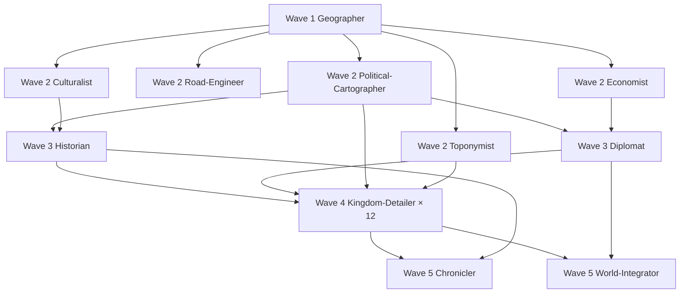

# Worldbuilding Shared Briefing v1.0 — 서쪽 대륙 Elucia

> 모든 월드빌딩 에이전트 (Geographer, Political-Cartographer, Toponymist, Road-Engineer, Economist, Culturalist, Historian, Diplomat, Kingdom-Detailer × 12, Chronicler, World-Integrator) 공통 briefing. 각자 도메인 briefing 과 병용.

---

## ⚠️ STEP 0 — 필독 (우회 금지 · 위반 시 산출물 자동 반려)

아래 7 파일을 **Read tool 로 전부 읽은 후에만** 작업 시작한다.

| # | 경로 | 줄 | 역할 |
|---|------|-----|------|
| 1 | `wiki/design/brainstorm_2026-04-21_worldview_expansion.md` | 3,146 | 50 발언 원전 · 세계관 근본 |
| 2 | `wiki/design/brainstorm_2026-04-21.md` | 903 | Rev.3 기준 브레인스토밍 |
| 3 | `wiki/design/game_setting_complete_2026-04-21.md` | 630 | 통합 스냅샷 |
| 4 | `wiki/design/political_divisions.md` | 150 | 26 정치단위 확정 |
| 5 | `wiki/design/story_full_narrative.md` | 1,026 | Rev.3 서사 |
| 6 | `CLAUDE.md` | 84 | 정체성·금기 9·필수 8 |
| 7 | `.claude/failures/FAILURES.md` | 175 | FAIL-001~006 교훈 |

### 읽기 완료 증명 (필수)

산출물 **최상단** 에 `## 원전 인용 증명` 섹션을 두고, 7 파일 각각에서 네 작업 영역과 관련된 구간 **3 줄 이상 원문 인용 + 파일명:줄번호** 를 박제한다. 인용 없는 산출물은 자동 반려 (World-Integrator 가 검증).

예시:
```
## 원전 인용 증명

### [필독 1] brainstorm_2026-04-21_worldview_expansion.md:176-178
> "이게 내가 그린맵, 내가 보는방향에서 좌측이 서구중세문명, 우측이 이슬람과비슷한 문명 하늘색이 강인데, 보시다시피 좌측은 강이 많고 풍요로움..."

(7 파일 전체 반복)
```

---

## 🔐 설정 불가침 조항

### Q-CORE 확정 사실 (2026-04-22 세션 #4) — 월드 산출물 반영 의무

**Q-CORE 1: 마왕 ↔ 할배 · 시간축**
- 마왕 ≠ 할배 (완전 별개 존재)
- 마왕 = 태초의 마족 (= 최초의 마족 단독 존재 · 마족 집단 형성 전)
- 첫 번째 신 = 할배 = 영감 (3 중 호칭) · 수호자가 마족 절멸 중 1명을 승격시킨 존재
- 시간축: 태초 마왕 → 마족 증식 → 마족 시대(황금기) → 마족 붕괴·수호자 개입 → 신 시대(할배) → 인간 시대(Rev.3 본편)

**Q-CORE 2: 할배 동기 = 속죄**
- 할배는 자신의 **수많은 판단 미스로 많은 생명 앗은 것** 을 속죄
- 현재 **인간의 삶** (정체 완전 숨김)
- **생활 마법 개발·무료 배포** (가난한 서민 수혜)
- **자기 은닉 원칙 절대**: 신이었던 과거·마족이었던 과거 절대 발설 없음
- 인간 사회의 인식: "마법 좀 아는 착한 할배" 로만 봄. 신격·정체 전혀 모름
- "첫 번째 신" 교리와 할배(실체)의 동일성은 Rev.3 Ch.23B 까지 비공개

**Q-CORE 3: 수정 2 · 수정 1**
- **수정 2** = 태초 마왕이 마족 증식 위해 제작. 당시 불안정한 마력 붕괴를 여러 곳에서 수집해 수정에 담아 완성 · 봉인 추정
- **수정 1** = 균형 수호자가 **수정 2 를 모방** 해 제작 · 목적 = 마족 발전 제한·감시 · 현재 마족이 자기 장치인 줄 알고 사용 중
- 수호자의 이중 관리 구조: 할배(인간 쪽) + 수정 1(마족 쪽)
- 마족은 수정 1 이 수호자 함정임을 모름

### 월드 산출물 반영 방식

- 수정 1·2, 마왕, 첫 번째 신, 황금기, 할배 등은 **기록된 역사·전설 층위에서 모호**하게 등장
- 구조적 진실 (마왕≠할배·수정 1=함정 등) 직접 서술 금지
- 엘프·용족 구전, 양심파 교회 필사본 등에 **파편 단서** 만 허용
- 공식 신학·제국 역사서는 **왜곡된 버전** 유지 (악의 시초·타락한 악마 등)

### 26 정치단위 (변경 금지)

- 서쪽 Elucia = 11 왕국 + 교황청 제국
- 동쪽 Karzor = 수도 + 14 직할 자치구
- 북쪽 Veilglass = 얼음섬 · 중간 섬 Nomen · Azim Pass
- 추가·병합·삭제 금지. 신규 확장은 **왕국 내부** 공작령·백작령·남작령·도시·마을만 가능

### 네이밍 세트 B 확정 (계승 의무)

- 서쪽 대륙명: **Elucia**
- 동쪽 대륙명: **Karzor**
- 북쪽 얼음섬: **Veilglass**
- 중간 섬: **Nomen**
- 남부 통행로: **Azim Pass**
- 기존 지명: Silvan (서해안 숲), Orenwald (동부 숲), Norvend (북부 산맥), Solaris (제국 추정), Zarahim (동쪽 수도) 등
- 신규 지명은 이 계열 어감 계승 (라틴·게르만·켈트 혼합)

### 세계관 철학 3조 (침범 금지)

1. 불완전성 — 모든 것은 불완전하다 · 신조차
2. 한결같음 — 나이트는 한결같은 인격체
3. 영혼 평등 — 모든 종족의 영혼은 평등

### 50 발언 원전 인용 시 (FAIL-006 준수)

- 축약·요약·의역 금지
- 대표님 원문 그대로 인용 + 발언 번호·줄번호

### 대표님 미확정 요소 (모호 보존 · 침범 금지)

- 북쪽 얼음섬 내용물 — 빈 공간 유지
- 수인족 외형·종류 — 미정 표기
- 초고대문명 정체 — 미정 표기
- 용족·엘프·드워프·수인족·마족 외형 상세 — 발언된 범위만
- 주인공 마을 위치·이름 — Toponymist 가 **후보 10~20개** 만 생성, 확정은 대표님 몫

---

## 🎯 스케일 목표 (중세 유럽 수준)

- 대륙 총면적 ~2.8M km² (서유럽 ~3.7M 근사)
- 제국 ~600K km² (신성로마 규모)
- 대왕국 200~300K km² (프랑스 근사)
- 중왕국 100~150K km² (잉글랜드·포르투갈 근사)
- 소왕국 50~80K km² (스코틀랜드·아일랜드 근사)
- 왕국당 지방도시 5~8 · 중소도시 10~15 · 마을 15~25
- 총 지명 280~370 개 목표

---

## 📚 Skill 능동 호출 의무 (FAIL-004 교훈)

- `worldbuilding` skill 반드시 능동 호출
- 밀도 요구 시 보조: `chapter-writing` / `prose-writing` / `wiki-docs`
- World-Integrator: `knowledge-graph` skill 추가 호출

---

## 📝 공통 출력 스펙

### 프론트매터 (파일 서두)

```yaml
---
agent: <role>
wave: <N>
output: <file path>
inputs: [의존 산출물 나열]
generated: 2026-04-22
qcore_version: v1.0  # Q-CORE 1·2·3 확정 반영 버전
---
```

### 구조 순서

1. `## 원전 인용 증명` (STEP 0 필수 · 7 파일 인용 박제)
2. `## 요약` (3~8 줄 · 이 문서가 다루는 범위)
3. 본문 (표·mermaid·subsection 적극 활용)
4. `## 대표님 미확정 사항 / 질문 큐` (에이전트가 필요 확인 사항 기록)
5. `## 다음 Wave 의존 포인트` (후속 에이전트가 이 산출을 어떻게 참조할지)

### 본문 스타일

- 마크다운 표 적극 활용
- mermaid 다이어그램 권장 (관계도·계층도·연대표)
- 각 항목 3~8 줄 밀도
- 발언 원전 인용은 원문 그대로 + `:줄번호`
- 추정 표기: `(추정)` / `(대표님 미확정 · 작업 가설)` 명시 의무

---

## 🚫 금지 사항 (FAIL 계열 교훈)

- **FAIL-002**: 대표님 원문 과해석 금지. 원문에 없는 서술은 `(추정)` 표기
- **FAIL-004**: skill 능동 호출 의무
- **FAIL-005**: Bash `cd` 사용 금지 (절대경로만)
- **FAIL-006**: 50 발언 원전 축약·의역 금지
- **신설 FAIL 방지**: Q-CORE 3건 구조 직접 서술 금지 (간접 단서만)

---

## 📦 산출물 저장 경로 (v2 · 2026-04-22 대표님 원칙 반영)

### 핵심 원칙 (엄수)
1. **한 주제 = 한 파일** (멀티 토픽 금지, overview·index 예외)
2. **왕국별 폴더 독립** · 왕국 고유 내용은 그 왕국 폴더 안에만
3. **직관적 위치·네이밍** · 경로·파일명만 봐도 내용 파악 가능
4. **날짜 표기** · `<topic>_YYYY-MM-DD.md` · 최초 생성일 고정 · 오늘 = `2026-04-22`
5. 폴더는 날짜 없음, 파일만 날짜 포함

### 전체 구조

```
wiki/design/worldbuilding/elucia/
├── MASTER_index.md                       (네비게이션 전용, 날짜 없음)
│
├── geography/                            (대륙 지리 기반)
│   ├── 00_overview.md                    (인덱스 · 날짜 없음)
│   ├── coastlines_2026-04-22.md
│   ├── mountain_ranges_2026-04-22.md
│   ├── rivers_major_2026-04-22.md
│   ├── rivers_tributaries_2026-04-22.md
│   ├── forests_2026-04-22.md
│   ├── plains_and_grasslands_2026-04-22.md
│   ├── wetlands_and_swamps_2026-04-22.md
│   ├── climate_zones_2026-04-22.md
│   └── elevation_profile_2026-04-22.md
│
├── roads/                                (대륙 도로망)
│   ├── 00_overview.md
│   ├── highway_via_imperialis_2026-04-22.md
│   ├── highway_kings_road_2026-04-22.md
│   ├── regional_roads_west_2026-04-22.md
│   ├── regional_roads_east_2026-04-22.md
│   └── village_paths_conventions_2026-04-22.md
│
├── ports/                                (해안 항구)
│   ├── 00_overview.md
│   └── port_<name>_2026-04-22.md         (항구당 1 파일)
│
├── culture/                              (공통 문화 프레임만 · 왕국 고유는 왕국 폴더)
│   ├── 00_common_frame.md
│   ├── shared_religion_structure_2026-04-22.md
│   ├── common_language_base_2026-04-22.md
│   └── medieval_fantasy_conventions_2026-04-22.md
│
├── economy/                              (대륙 경제 프레임)
│   ├── 00_overview.md
│   ├── trade_networks_2026-04-22.md
│   ├── slave_economy_2026-04-22.md
│   ├── hal_bae_free_magic_network_2026-04-22.md
│   └── guild_system_2026-04-22.md
│
├── toponymy/                             (대륙 네이밍 시스템만 · 개별 지명은 왕국 폴더)
│   ├── naming_conventions_2026-04-22.md
│   ├── etymology_roots_2026-04-22.md
│   └── phoneme_patterns_2026-04-22.md
│
├── history/                              (대륙 거시 역사)
│   ├── 00_timeline.md
│   ├── era_primordial_2026-04-22.md
│   ├── era_mazok_age_2026-04-22.md
│   ├── event_collapse_and_guardian_intervention_2026-04-22.md
│   ├── era_divine_age_2026-04-22.md
│   └── era_human_age_early_2026-04-22.md
│
├── relations/                            (국가 간 관계)
│   ├── 00_overview.md
│   ├── alliances_2026-04-22.md
│   ├── conflicts_active_2026-04-22.md
│   ├── conflicts_historical_2026-04-22.md
│   ├── marriage_ties_2026-04-22.md
│   ├── trade_treaties_2026-04-22.md
│   └── religious_division_2026-04-22.md
│
├── kingdoms/                             (왕국별 독립 폴더)
│   ├── empire_papal/
│   │   ├── 00_overview.md
│   │   ├── territories_2026-04-22.md
│   │   ├── capital_map_2026-04-22.md
│   │   ├── cities/
│   │   │   ├── city_<name>_2026-04-22.md
│   │   │   └── ...
│   │   ├── villages/
│   │   │   └── village_<name>_2026-04-22.md
│   │   ├── ports/
│   │   │   └── port_<name>_2026-04-22.md
│   │   ├── roads/
│   │   │   └── road_<from>_to_<to>_2026-04-22.md
│   │   ├── royals/
│   │   │   ├── pope_<name>_2026-04-22.md
│   │   │   ├── cardinal_<name>_2026-04-22.md
│   │   │   └── ...
│   │   ├── nobles/
│   │   │   ├── duke_<domain>_<family>_2026-04-22.md
│   │   │   └── count_<domain>_<family>_2026-04-22.md
│   │   ├── houses/
│   │   │   └── house_<name>_2026-04-22.md
│   │   ├── orders/
│   │   │   └── order_<name>_2026-04-22.md
│   │   ├── history/
│   │   │   ├── founding_2026-04-22.md
│   │   │   ├── dynasty_<name>_2026-04-22.md
│   │   │   ├── event_<name>_2026-04-22.md
│   │   │   └── ...
│   │   ├── military_2026-04-22.md
│   │   ├── heraldry_2026-04-22.md
│   │   ├── clothing_2026-04-22.md
│   │   ├── festivals/
│   │   │   └── festival_<name>_2026-04-22.md
│   │   ├── cuisine_2026-04-22.md
│   │   ├── architecture_2026-04-22.md
│   │   └── dialect_2026-04-22.md
│   │
│   ├── kingdom_silvan/                   (동일 내부 구조)
│   │   └── ...
│   │
│   └── ... (11 왕국 × 동일 구조)
│
├── historical_texts/                     (인-월드 문헌)
│   ├── annals_of_elucia_book_i_2026-04-22.md
│   ├── annals_of_elucia_book_ii_2026-04-22.md
│   ├── chronicles_of_silvan_2026-04-22.md
│   └── heretics_account_2026-04-22.md
│
├── maps/
│   └── annotations_2026-04-22.md
│
└── graphs/
    └── relationship_graph_2026-04-22.md
```

### 네이밍 패턴 규칙 (엄수)

| 주제 | 패턴 |
|------|------|
| 왕족 | `king_<name>_<date>.md` · `queen_<name>_<date>.md` · `prince_<name>_<date>.md` |
| 귀족 | `duke_<domain>_<family>_<date>.md` · `count_<domain>_<family>_<date>.md` |
| 도시·마을 | `city_<name>_<date>.md` · `village_<name>_<date>.md` |
| 항구 | `port_<name>_<date>.md` |
| 가문 | `house_<name>_<date>.md` |
| 기사단 | `order_<name>_<date>.md` |
| 지리 feature | `<type>_<specific>_<date>.md` (`mountain_<name>_<date>.md`) |
| 도로 | `road_<from>_to_<to>_<date>.md` · `highway_<name>_<date>.md` |
| 역사 사건 | `event_<name>_<date>.md` |
| 축제 | `festival_<name>_<date>.md` |

### 파일 frontmatter 필수 필드

```yaml
---
title: <사람이 읽는 제목>
type: <geography|royal|noble|city|village|...>
kingdom: <소속 왕국 slug · 해당 시>
created: 2026-04-22
updated: 2026-04-22
agent: <생성 에이전트 이름>
wave: <1~5>
---
```

### 예외 (날짜 없음)

- `00_overview.md` · `MASTER_index.md` · `README.md` (인덱스 성격)
- `00_timeline.md` (불변 시간 참조)
- `00_common_frame.md` (불변 프레임)

---

## 🔗 에이전트 간 의존 관계



---

*공통 briefing 종료 · 도메인별 briefing 참조 후 작업 시작*
