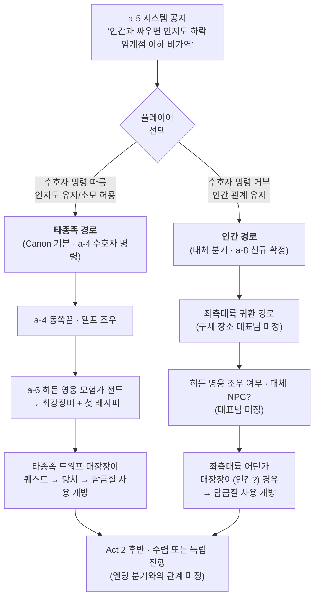
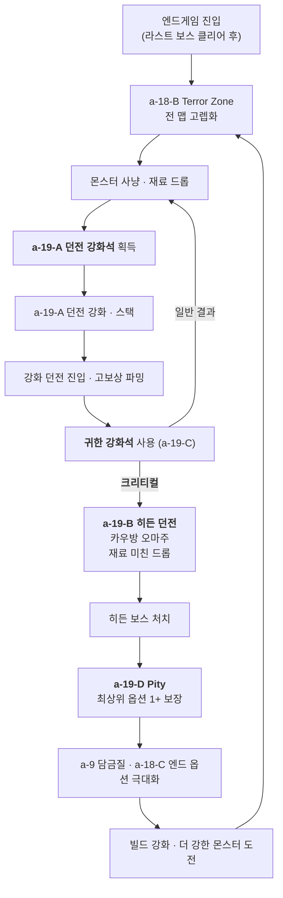
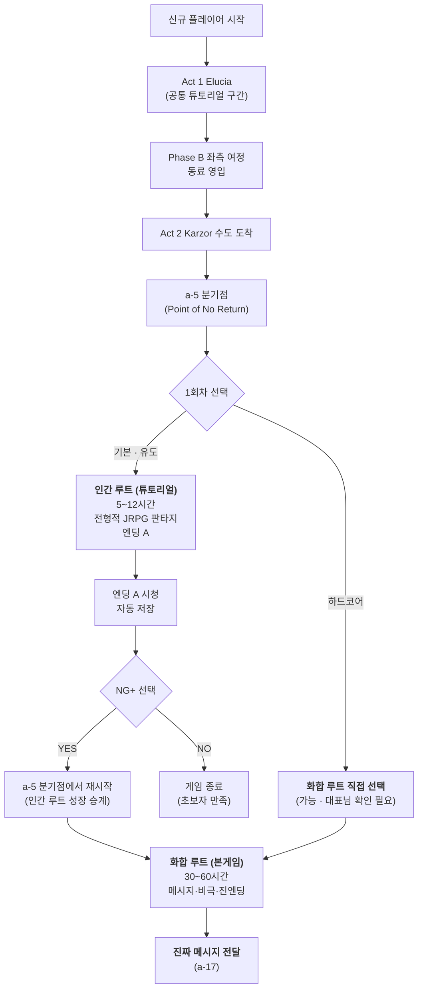
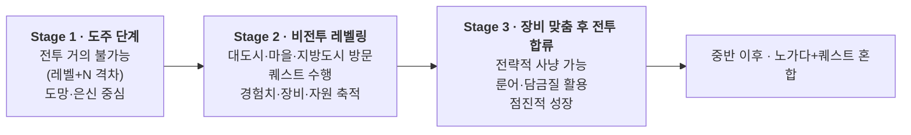
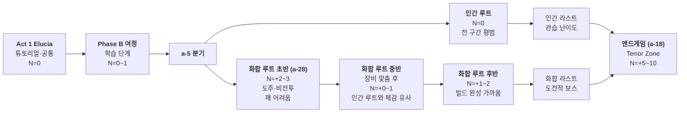
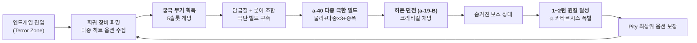
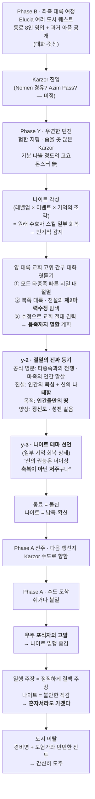

# Act 2 Karzor 서사 원전 — 대표님 구술

> **이 문서는 대표님의 2026-04-22 세션 #6 직접 구술 원전이다.**
> 축약·의역 금지 (FAIL-006). 원문 보존 의무. Rev.3 본편 서사의 **공식 확정 자료**.
> 향후 story_full_narrative.md 반영 및 Karzor 월드빌딩 확장의 **기준점**.

---

## §1 대표님 원문 (축약 없음 · 구술 순서 그대로)

### a. Karzor 수도 도착 · 우주 포식자의 고발 · 쫓김

> "karzor들어가서 중반쯔음 karzor의 수도에 도착하고 도시에서 쉬거나 볼일보고있는데, 우주포식자의 고발로 쫒기게된다. 쫒길때 일행들이 도망치지말고 아니라고 그런사람아니라고 정직하게 말하자고했지만, 불안한 감을 직감한 나이트는 혼자서라도 가겠다하여 도시를 빠져나온다. 빠져나올때 경비병과, 머물고있던 모험가들과의 전투가 빈번하게 일어나고 가깟으로 도망치게된다."

### a-2. 목걸이 버림 — 신의 추적 인지 · 신성 체제 탈주의 물리적 선언

> "그리고 우측대륙에 수도에서 도망치면서 나이트는 목걸이가 신에의해 추적된다는걸알고, 신의 권능이든 목걸이를 버리게된다."

### a-5. 시스템 전환 — 인간 전면 적대화 + 인지도 시스템 + 도망 권장 (게임플레이 설계)

> **시스템 UI 문구 (원문 그대로 박제)**:
>
> "앞으로 모든 인간들과는 전투를 치루게됩니다. 인간과의 인카운터도 일어나게됩니다. 그들을 뒤로하고 동쪽끝으로 가십시오. 그들과 전투를 벌일수있지만. 당신이 그동안 쌓아온 인지도가 내려갑니다. 일정수준 이하로 내려가게되면 되돌릴수없습니다."

> **메커닉 규칙 (대표님 구술 원문 + 정리)**:
> "왠만하면 도망치기 스킬로 도망다니는게 나음(인간과의 전투에선), 일정수준이상 내려가면 차후 후반부 인간과의 관계를 회복한 후 4인의 인간 동료가 돌아올때, 최하의 친밀도가되어 연계공격이 잘 안나가게됨"

> *게임플레이 시스템 구조 (나베랄 감마 정리)*:

| 요소 | 사양 |
|------|------|
| **트리거 시점** | Phase A 수도 탈주 완료 직후 (이 시스템 메시지가 UI 팝업으로 표시) |
| **적용 범위** | 이후 전 챕터 인간 NPC · 경비병 · 모험가 · 성직자 등 모든 인간 집단 |
| **인카운터 조우** | 필드·도시·이벤트에서 인간과 랜덤 또는 스크립트 조우 발생 |
| **옵션 1 — 전투** | 가능 · 승리 시 경험치·아이템 획득 · **인지도(Reputation) 하락 패널티** |
| **옵션 2 — 도망 (권장)** | 「도망치기」 스킬 사용 · 인지도 보존 · 전투 보상 없음 |
| **인지도(Reputation)** | 신규 수치 · Act 1~2 전반에 축적된 나이트의 사회적 명성. 눈에 보이는 또는 숨겨진 수치 |
| **Point of No Return** | 인지도 임계값 이하 하락 시 **되돌릴 수 없음** — 게임 내 비가역 분기 |
| **후반부 영향** | 인간 4인 동료 **복귀 이벤트** 발생 · 인지도 저하 상태면 친밀도 최하 · **연계공격 발동 저하** |

> *설계 헌법 제3조 "인간 비악" 의 게임플레이 번역 (완벽 정합)*:
> - MOC.md 설계 헌법 제3조 = "인간은 악이 아니다. 모든 종족이 나태한 신·타락한 교회의 피해자"
> - 이 메커닉이 이 원칙을 **게임플레이로 직접 번역**: 인간을 죽이는 것 = 플레이어 스스로에게 패널티
> - 기존 JRPG의 "도망 = 겁쟁이의 선택" 을 **정의로운 선택으로 재정의** (반전 메타)
> - 플레이어는 "싸우고 싶지만 싸워선 안 되는" 도덕적 긴장 체험 — Spec Ops: The Line 의 죄책감 구조와 유사

> *벤치마크 정합*:
> - **Persona 5** — 사회 관계(Confidant) 가 전투 능력 강화에 영향 · 장기 관계 시스템
> - **Octopath Traveler / Triangle Strategy** — HD-2D JRPG의 동료 친밀도 → 연계기
> - **Chained Echoes** — 동료 별 Overdrive 링크 (친밀 연계 공격)
> - 나이트의 JRPG 구조와 정합 확정

> *질문 큐 등록 (대표님 구술 종료 후 일괄 제시)*:
> - Q-시스템-1: **인지도(Reputation) 수치의 가시성** — 명시 수치(HUD에 0~100) vs 숨김 수치(NPC 반응으로만 짐작) vs 세그먼트형(상/중/하/파탄) 중 어느 표시 방식?
> - Q-시스템-2: **인지도 하락 감쇄율** — 전투 1회당 고정 하락 vs 상대 강함/개체 수 비례 하락 vs 킬·기절 선택지 분기?
> - Q-시스템-3: **Point of No Return 임계값** — 절대 수치 고정 vs 동적(스토리 진행도에 비례)?
> - Q-시스템-4: **도망치기 스킬 사양** — 100% 성공 vs 확률 실패 · 반복 사용 제한 · 쿨다운 · MP 소모 여부?
> - Q-시스템-5: **인간 동료 4인 복귀 이벤트 조건** — Act 3 특정 시점 고정 vs 플레이어 진행도 유발?
> - Q-시스템-6: **최하 친밀도 = 연계공격 저하** 의 구체 수치 — 발동 확률 저하 / 데미지 감소 / 슬롯 자체 잠김 중 어느 방식?
> - Q-시스템-7: **인지도 회복 수단** — 선행 NPC 퀘스트 · 특정 아이템 · 후반 참회 이벤트 등?
> - Q-시스템-8: **인간 동료 4인** 각각에 개별 친밀도 vs **집합 "인간 진영" 단일 친밀도**?

### a-6. 히든 보상 루트 — 영웅급 모험가 · 최강장비 · 4슬롯 커스텀 (제작 + 디아블로4 담금질)

> **대표님 원문 (축약 없음)**:
>
> "이렇게하면 일반플레이어는 절대인간 안건든다. 하지만 꼭 파고드는 사람이 있지 그런사람에대한 보상을줄건데,,, 위치는 미정이지만 동쪽으로가다보면 맵에도 표시안되는 동굴이있음 거기에 들어가면 누워있는 인간이있음. 그인간은 주인공이 동굴에들어오자 인기척에 깨게되고, 놀라며 주인공을 공격함.
>
> 그인간은 좌측대륙에서보았던 영웅급 모험가였음.
>
> 전투승리 후 그에게서 최강장비중한개를 받고, 4개의 장비옵션에서 확정적으로 모든 상태이상무효 라는 파판의 리본같은 기능이 붙어있음, 나머지3개는 커스텀가능. (제작시스템으로 커스텀하고 또 재료를가지고 그 각인된 옵션을 지우고 새로운 옵션을 넣을수도있음, 디아블로4 담금질)"

> *설계 구조 (나베랄 감마 정리)*:

**히든 이벤트 명세**
| 요소 | 사양 |
|------|------|
| **트리거** | Phase A(수도 탈주) 이후 Phase Z(동쪽끝 이동) 진입기 · 동쪽 경로상 |
| **위치** | 맵 미표시 숨은 동굴 · 구체 좌표 **(대표님 미정)** |
| **조우 NPC** | 누워있던 인간 모험가 · 인기척에 깨어 선제 공격 |
| **정체 복선** | **좌측대륙 Phase B 여정 도중 조우했던 영웅급 모험가** |
| **전투** | 보스급 단일 조우 · 플레이어 승리 시 보상 지급 |
| **인지도 패널티?** | 동굴 = 목격자 없음 · 히든 이벤트 특성상 **패널티 예외 처리 권장** (나베랄 감마 제안, 대표님 확정 대기) |

**최강장비 옵션 구조 (4슬롯)**

| 슬롯 | 방식 | 내용 |
|-----|------|------|
| **슬롯 1** | **확정 각인** | **모든 상태이상 무효** (FF "리본" 계열 · 엔드게임 방어 앵커) |
| **슬롯 2** | 커스텀 | 제작 시스템으로 플레이어 선택 |
| **슬롯 3** | 커스텀 | 제작 시스템으로 플레이어 선택 |
| **슬롯 4** | 커스텀 | 제작 시스템으로 플레이어 선택 |

**장비 커스터마이제이션 시스템 (신규 확정)**
- **제작 시스템** — 옵션 각인 (재료 + 장비 슬롯 → 속성 부여)
- **디아블로4 담금질(Tempering) 기전** — 기존 각인 옵션을 재료로 **지우고 재각인** 가능 · 빌드 실험 자유
- **빌드 자유도 확보** — 5대 빌드 분기 (설계 헌법 제2조 "플레이 스타일 다양성") 와 정합

**복선 회수 서사 장치**
- 좌측 Phase B 에서 스치듯 만났던 영웅 = **Act 2 히든 보스** 로 재등장
- 플레이어가 이름·얼굴을 기억해야만 감정 임팩트 발생 → Phase B 조우 연출의 **주의 장치** 필요
- "왜 영웅이 동쪽 대륙 숨은 동굴에 누워있었는가" = 서사 공백 → **(대표님 미정 · 질문 큐)**

> *벤치마크 정합*:
> - **Hollow Knight** — 숨겨진 Grimmchild · 발견한 자만 얻는 강력한 부가 능력
> - **Elden Ring** — Nepheli · Millicent · 비밀 NPC 루트 보상
> - **Diablo IV Tempering** — 각인 재구성 시스템
> - **Final Fantasy Ribbon 계열** — 모든 상태이상 무효 엔드게임 장비
> - JRPG·소울라이크 히든 보상 구조 혼합

> *질문 큐 등록 (구술 종료 후 일괄 제시)*:
> - Q-히든-1: 이 히든 전투는 **인지도 패널티 예외** 인가? (목격자 없으므로 예외 권장하지만 확정 필요)
> - Q-히든-2: 영웅 모험가의 **좌측 Phase B 조우 시점·사건**? (어느 도시·어떤 퀘스트·어떤 관계?)
> - Q-히든-3: 그가 **왜 동쪽 대륙 숨은 동굴에 누워있는가**? (조난·도망·수행·고발 대상·기타?)
> - Q-히든-4: 동굴 발견 단서 — **완전 숨김** vs **NPC 소문/낙서 힌트**? (완전 숨김은 너무 가혹)
> - Q-히든-5: 최강장비 종류 — **무기** vs **방어구** vs **장신구**? (상태이상 무효 속성상 장신구·방어구 유력)
> - Q-히든-6: 커스텀 옵션 3슬롯의 **속성 풀** — 공격·방어·유틸 카테고리 · 희귀도 등급 · 중복 제한?
> - Q-히든-7: 담금질 재료 — 일반 드롭 vs 특수 퀘스트 보상 vs 양대 모두?
> - Q-히든-8: 이 장비는 **나이트 전용** vs 동료도 장착 가능?
> - Q-히든-9: 승리 후 영웅의 운명 — 사망 · 대화 후 사라짐 · 동료 영입 가능?

### a-7. 담금질 시스템 개방 — 2단계 게이트 · 드워프 대장장이 퀘스트 · 레시피 드롭 루트

> **대표님 원문 (축약 없음)**:
>
> "이때부터 담금질 (가명 : 디아4담금질) 개방. 처음에 빈칸 3개가 뭔지 싶겠지만,, 담글질이고 첫번째 담금질 레시피를 함께 떨굼, 그리고 차후 타종족을 만났을때 대장장이 드워프에게 퀘스트를 받고 클리어하면 드워프워 대장장이용 망치를 받고 이제 담금질을 사용할수있음. 레시피는 몬스터 또는 , 중간보스몹에서 잘떨어짐, 몬스터의 희귀도에따라 확률이 높아지며, 맵곳곳의 상자, 마법상자, 희귀상자, 전설상자등에서도 나옴, 낙시에서도 얻을수있음."

> *시스템명 표기 규칙*:
> - 현재 가명: **"디아4담금질"** (Diablo IV Tempering 참조)
> - 정식명: **(대표님 미정)** — 네이밍 확정 시점까지 가명 유지
> - 기능: 장비 옵션 각인 재구성 · 기존 옵션을 재료로 지우고 새 옵션 재각인

> *2단계 게이트 구조 (나베랄 감마 정리)*:

| 단계 | 트리거 | 획득 | 상태 |
|------|-------|------|------|
| **Gate 1 — 시스템 존재 인지** | a-6 히든 영웅 모험가 전투 승리 | 최강장비(4슬롯) + **첫 담금질 레시피** 동반 드롭 | 플레이어는 장비 3 빈 슬롯과 레시피를 손에 쥐었으나 **사용 방법 모름** → **궁금증 유발** |
| **Gate 2 — 시스템 사용 개방** | **타종족 조우 후 드워프 대장장이 NPC 만남 + 퀘스트 클리어** | **대장장이용 망치** (담금질 실행 도구) | 이제부터 각인·재각인 사용 가능 |

**중간 의아함 설계 (대표님 의도 명시)**
- "처음에 빈칸 3개가 뭔지 싶겠지만" — 플레이어 인지 부조화 유발
- 레시피 + 빈 슬롯 → 답 없는 퍼즐 상태 유지
- 드워프 대장장이 망치 획득 순간 **"아하" 해소** = 고전적 RPG 시스템 개방 쾌감

**레시피 드롭 테이블 (획득 루트)**

| 출처 | 드롭율 조정 인자 | 비고 |
|------|--------------|------|
| **일반 몬스터** | 몬스터 희귀도 비례 | 베이스 루트 |
| **중간 보스** | 희귀도 비례 · 더 잘 드롭 | 주력 루트 |
| **일반 상자** | 낮음 | 탐험 보상 |
| **마법 상자** | 중간 | |
| **희귀 상자** | 높음 | |
| **전설 상자** | 최고 | 희귀·강력 레시피 기대치 |
| **낚시** | 별도 풀 · 장비·위치 영향 가능 | Stardew / Dave the Diver 계열 서브 활동 |

> *서사-시스템 연결 (확정 체인)*:
>
> ```
> a-4 수호자 명령 "엘프를 따라가라"        ← 타종족 경로 진입
>        ↓
> a-6 히든 영웅 전투 → 담금질 + 첫 레시피 획득
>        ↓
> (동쪽끝 이동 중 타종족 조우 — 엘프·드워프 순서 미정)
>        ↓
> 드워프 대장장이 퀘스트 → 망치 획득
>        ↓
> 담금질 본격 사용 시작 → 빌드 자유 실현
>        ↓
> 이후 전 게임 상시 loop: 전투·상자·낚시 → 레시피 → 빌드 조정
> ```

> *타종족 4인 구성 힌트 (나베랄 감마 관찰)*:
> - **엘프** — a-4 에서 수호자가 명시 · 동쪽끝 은신처
> - **드워프** — a-7 에서 대장장이 NPC 로 명시
> - 나머지 2 종족 **(대표님 미정 · 질문 큐)** — 원전 brainstorm 에 언급된 "용족 · 수인족 · 마족" 중 어느 조합?
> - Rev.2 동료 8인 = 인간 4 + 타종족 4 와 직결 — 동료 출신 종족 확정에 영향

> *벤치마크 정합*:
> - **Diablo IV** — Tempering 메커닉 원형
> - **Octopath Traveler** — 상자 위계 (Purple → Golden) · 보물상자 희귀도
> - **Monster Hunter** — 퀘스트로 무기 시스템 개방 · 대장간 NPC
> - **Stardew Valley / Dave the Diver** — 낚시 서브 활동 · 별도 드롭 풀
> - **Persona 5** — NPC 관계(Confidant) 로 시스템 개방

> *질문 큐 등록 (구술 종료 후 일괄 제시)*:
> - Q-담금-1: **"디아4담금질" 정식명** — 최종 네이밍 브레인스토밍 시점?
> - Q-담금-2: **드워프 대장장이 퀘스트 성격** — 재료 수집 / 괴물 퇴치 / 탐험 · 시간 소요 · 강제 vs 선택?
> - Q-담금-3: **드워프 조우 위치** — 동쪽끝 여정 중 · 별개 타종족 영역 · 엘프 합류 이후 등?
> - Q-담금-4: **첫 레시피** — 사전 정해진 기본 옵션(ex. "공격력 +10%") vs 랜덤 희귀?
> - Q-담금-5: **레시피 총 수** — 수십 vs 수백 vs Moonlighter 식 "대륙별 고유 풀"?
> - Q-담금-6: **낚시 시스템 상세** — 필드 낚시 포인트 수 · 미니게임 방식(스태미너? 타이밍? Stardew식 바?) · 전용 낚싯대 업그레이드?
> - Q-담금-7: **상자 위계 드랍율 수치** — 전설 상자의 희귀도가 어느 정도?
> - Q-담금-8: **망치의 추가 용도** — 순수 담금질 전용 도구 vs 전투·채광 겸용?
> - Q-담금-9: **동료 장비에도 담금질 적용 가능?** 또는 나이트 전용?
> - Q-담금-10: **담금질 실패 리스크** — 디아블로4 실제 시스템은 실패 횟수 제한 있음 · 이 게임도 도입?

### a-8. 분기 대칭 설계 — 인간 경로 또한 담금질 학습 가능 (시스템 공평성 확정)

> **대표님 원문 (축약 없음)**:
>
> "만약 분기에서 인간을 택하면, 타종족을 볼수없으니, 같은 페이즈쯤 좌측대륙 어딘가에서 담금질을 배울수있음..."

> *핵심 설계 확정*:
> 1. **a-5 시스템 공지는 분기점** — Point of No Return 경고는 **강제 경로 전환** 이 아니라 **선택지 제공**
> 2. **선택지 2종 확정**:
>    - **타종족 경로** (수호자 명령 따름 · a-4 기본 스토리) — 동쪽끝 엘프 → 드워프 퀘스트 → 담금질
>    - **인간 경로** (수호자 명령 거부 / 인지도 유지) — 좌측대륙 귀환 → 어딘가에서 담금질 학습
> 3. **시스템 공평성 원칙** — 어느 분기를 택해도 **담금질 시스템은 동일하게 개방 가능**
> 4. **타이밍 동조** — "같은 페이즈쯤" → Act 2 중반 ~ 후반 진행도 기준 양 분기 동기화

> *분기 구조 체계 (나베랄 감마 정리)*:



> *서사 함의 (나베랄 감마 관찰 · 추정 표기)*:
> - **인간 경로 존재 = 엔딩 A/B/진엔딩 분기의 뿌리 가능성 (추정)**
>   - Rev.3 엔딩 구조: 일반 엔딩(표면적 희망) · 엔딩 B(화합) · 진엔딩(근본 해결)
>   - 인간 경로 → 엔딩 B (화합) 씨앗? 또는 엔딩 A (인간 사회 복귀) ?
>   - 타종족 경로 → 진엔딩 또는 엔딩 B 다른 변주?
>   - **(대표님 확정 대기)**
> - **수호자 명령의 성격 재정의** — a-4 의 "엘프를 따라가라" 는 **강제가 아닌 권장** → 플레이어 자율성 보존
> - **Rev.2 동료 8인 구성 영향** — 인간 4 + 타종족 4 · 분기별로 **합류 가능 동료가 달라질** 가능성 (추정 · 대표님 미정)

> *설계 헌법 제2조 정합*:
> - 제2조: "모든 극단 빌드가 엔드게임을 클리어 가능해야 함"
> - a-8: 모든 분기 선택이 엔드게임 시스템(담금질) 에 접근 가능 → **빌드 다양성의 분기 차원 확장**

> *1인 개발 비용 관점 (나베랄 감마 관찰)*:
> - **분기 대칭** ≠ 콘텐츠 2배
> - 담금질 **시스템 자체는 1개** · 학습 장면·NPC·위치만 2개 → 실제 개발 비용 **1.2~1.3배** 수준
> - 컷신·대화·맵 1~2개 추가 범위 — 1인 개발 감당 가능
> - 단, **인간 경로 전용 스토리 진행** 이 따라붙으면 비용 급증 → 스코프 관리 필수

> *벤치마크 정합*:
> - **Fallout: New Vegas** — NCR·Legion·Independent 분기 · 시스템은 공통 / 소유자만 다름
> - **Tales of Xillia** — Jude · Milla 주인공 분기 · 공통 시스템
> - **Chrono Trigger** — 멀티 엔딩 다경로 · 엔드 시스템 공통
> - **Octopath Traveler** — 8 주인공 독립 스토리 · 시스템 공통

> *질문 큐 등록 (구술 종료 후 일괄 제시)*:
> - Q-분기-1: **인간 경로 진입 조건** 정확한 수치 — 인지도 일정 이상 유지 · 특정 NPC 선택 · 자동 분기?
> - Q-분기-2: **인간 경로 담금질 NPC** 정체 — 인간 대장장이 · 좌측 도시 장인 · 기존 등장 NPC 재방문?
> - Q-분기-3: **좌측대륙 "어딘가"** 구체 장소 — Solaris(성좌국 수도) · 특정 왕국 · 모험가 길드 등?
> - Q-분기-4: **히든 영웅 모험가(a-6)** 조우 — 두 분기 모두 공통? 또는 타종족 분기 전용?
> - Q-분기-5: **동료 합류 차이** — 분기별로 합류 가능 동료가 다름? 또는 공통 동료 + 분기별 추가?
> - Q-분기-6: **엔딩 연결** — 인간 경로 · 타종족 경로가 각각 A/B/진엔딩 어디로?
> - Q-분기-7: **경로 전환 가능성** — Act 2 에서 경로 선택 후 Act 3 에서 변경 가능? 또는 고정?
> - Q-분기-8: **분기 UI 표시** — 플레이어에게 "지금 인간/타종족 경로 진행 중" 명시? 또는 숨김?
> - Q-분기-9: **a-5 Point of No Return 과의 관계** — 임계점 이하 인지도 하락 = 타종족 강제? 또는 단순 일부 NPC 반응 변화?
> - Q-분기-10: **인간 경로 측의 "왜 이 장소에서 담금질을 배우는가" 서사 동기** 설계 필요

### a-9. 담금질 레시피 경제 — 소모 규칙 + 교환 시스템 (Path of Exile 식)

> **대표님 원문 (축약 없음)**:
>
> "담금질 레시피는 자주나와야함, 디아4랑은 조금 달라서 사용하면 없어짐. 그래서 매우 소모가 많을거라서 나중에되면 모자라서, 그걸위한 장치도해야될듯, 담금질 레시피를 다른레시피로 교환같은거"

> *Diablo 4 와의 구조적 차이 (확정)*:

| 요소 | Diablo 4 (원형) | 이 게임 (대표님 설계) |
|------|-----------------|----------------------|
| **레시피 획득** | 1회 습득 → 영구 보유 | 반복 드롭 · 개별 아이템 |
| **레시피 사용 시** | 그대로 유지 (각인 풀에서 호출) | **사용 즉시 소모** (1회용) |
| **사용 제한** | 담금질 횟수 제한 (무기당 5회 등) | **(대표님 미정)** — 아마 무제한? |
| **실패 리스크** | 무기 파괴 가능 | **(대표님 미정)** |
| **경제 순환** | 닫힌 시스템 (각인 풀 완성 후 의미 감소) | **열린 시스템** (계속 드롭 · 계속 소모 · 계속 탐험) |

> *Path of Exile 오브(Orb) 경제와의 정합*:
> - PoE 오브 = 소모형 수정자 (예: Chaos Orb · Divine Orb) · 반복 드롭 · 플레이어 간 거래·교환 활발
> - 이 게임 레시피도 동일 패턴 → **로그라이크 스크롤 / PoE 오브** 계열 설계

> *소모 규칙의 설계 효과*:
> 1. **드롭 루프 정당화** — 계속 드롭돼도 의미 있음 (항상 수요 존재)
> 2. **플레이어 선택의 무게** — 아무데나 막 쓰면 낭비 · "이 장비에 이 레시피 써도 되나?" 고민 유발
> 3. **전투·탐험 상시 동기 부여** — 레시피 부족 = 필드 나갈 이유
> 4. **1회용 아이템 특유의 긴장감** — Resident Evil 탄약 관리 · Dark Souls 에스트 플라스크 등

> *예상되는 구조적 문제와 교환 시스템 설계*:
>
> **문제**: 플레이어가 원치 않는 레시피만 대량 드롭 → 필요한 레시피 부족 → 빌드 막힘
>
> **해결 방향 (대표님 "교환같은거" 구상 구체화)**:
>
> | 방식 | 설명 | 벤치마크 |
> |------|------|---------|
> | **N:1 교환소** | 안 쓰는 레시피 N개 → 원하는 레시피 1개 | Path of Exile 벤더 · Pokémon 교환소 |
> | **연금술 조합** | 레시피 A + B + 재료 → 레시피 C | Atelier 시리즈 연금술 |
> | **등급 상승 교환** | 일반 3개 → 희귀 1개 · 희귀 3개 → 전설 1개 | Hearthstone 분해·크래프팅 |
> | **NPC 의뢰** | 드워프 대장장이에게 의뢰 → 원하는 레시피 주문 제작 (재료 소모) | Monster Hunter 조합 주문 |
> | **교환 레이트 동적** | 시장 수요·드롭율에 따라 변동 | Animal Crossing 주식 |
>
> **나베랄 감마 추천 조합**:
> - **기본**: N:1 교환소 (간단명료 · 1인 개발 구현 쉬움)
> - **확장**: 등급 상승 교환 (일반 레시피 과다 → 희귀 레시피 드문 문제 해결)
> - **NPC**: 드워프 대장장이 + 좌측 인간 분기 NPC 양쪽에 교환소 배치 (분기 공평)

> *드롭율 밸런싱 지침*:
> - "자주 나와야함" = 대표님 명시 → 기본 드롭율 높게 설정
> - Phase 5 Vertical Slice 에서 측정 권장 지표:
>   - 30분 플레이당 레시피 드롭 개수 (목표: 5~10개?)
>   - 빌드 1회 조정당 평균 레시피 소모 (목표: 3~5개?)
>   - "레시피 부족으로 막힘" 상황 발생 빈도 (목표: 0에 가깝게)

> *질문 큐 등록 (구술 종료 후 일괄 제시)*:
> - Q-경제-1: **레시피 사용 횟수 제한** — 무제한 vs 장비당 N회?
> - Q-경제-2: **담금질 실패 리스크** — 실패 확률 0% vs 낮은 실패 (재료만 소모) vs 장비 파괴?
> - Q-경제-3: **레시피 등급** — 일반·희귀·전설 등 등급 구분 있음?
> - Q-경제-4: **교환소 NPC** — 드워프 대장장이 전용 vs 별도 NPC?
> - Q-경제-5: **교환 방식** — N:1 단순 교환 / 등급 상승 / 연금술 조합 / 모두?
> - Q-경제-6: **인간 경로 교환소** — 좌측 대륙 NPC 에게도 동일 교환 기능? (분기 공평)
> - Q-경제-7: **레시피 종류 총 수** — 수십 (관리 가능) vs 수백 (수집 요소)?
> - Q-경제-8: **전설 레시피 존재** — 특정 보스·희귀 상자에서만 얻는 초희귀 레시피?
> - Q-경제-9: **동료 장비에도 담금질 사용 시 레시피 공유** vs 동료별 독립 인벤토리?
> - Q-경제-10: **자주 드롭 = 수치 기준** — 30분당 몇 개 목표?
> - Q-경제-11: **드롭 풀 균형** — 7 루트(몬스터·중보스·상자 4위계·낚시) 별 레시피 풀이 다른가 동일한가?
> - Q-경제-12: **레시피 저장 한도** — 인벤토리 슬롯 제한 vs 무제한?

### a-10. 경매장 시스템 구상 — ❌ **대표님 철회 (2026-04-22 세션 #6)**

> **최종 결정 (2026-04-22 세션 #6)**:
> - 대표님 제시: "몇몇 장비·재료를 경매장에서 거래 · 10% 수수료"
> - 대표님 수정안: "멀티플레이는 아니지만 경매장만 누구나 이용 가능"
> - **대표님 철회**: "아 그래? 뭔가 제약이있나보군, 취소"
> - 사유: 나베랄 감마 범위 경고(Diablo 3 실패·서버·법·봇) 수용 + "경매장만 공용도 사실상 멀티플레이" 기술 설명 수용
>
> **상태**: ❌ **CANCELLED** · Phase 1~10 전 구간 **구현 대상 아님**
> **재검토 조건**: Post-release 커뮤니티 규모 확인 후 DLC 검토 가능 (Phase 9 Sustained Ops)
>
> **원전 보존 목적**: 같은 아이디어가 향후 재부상 시 **과거 검토·결정 이력** 을 즉시 참조 가능. FAIL-006 원문 보존 원칙 엄수.

---

### a-10 원본 구상 (취소됨 · 원문 보존)

> **대표님 원문 (축약 없음)**:
>
> "몇몇 장비나 제작재료ㅡ 담금질재료같이 중요한거는 경매장에서 거래가능하게할까 다른플레이어가 올려넣은거 살수도있고, 그대신 그만큼 재화가 없어지고 판매자에게 가는거고 수수료로 10%떼어가면 골드소모도있을거고"
>
> *추가 구상 (취소 직전)*:
> "멀티플레이는 아니지만 경매장만 누구나 이용가능하게"

### a-10 기술 설명 (대표님 수용)

"경매장만 공용"도 기술적으로는 **MMO 백엔드와 동일**:
- 여러 플레이어 매물 데이터 중앙 집계 → 서버 필수
- 거래 원자성 보장 · 사기 방지 → 서버 검증 필수
- 클라이언트는 싱글처럼 보여도 백엔드 동기화 = 멀티플레이

유일 저비용 대안: Dark Souls 식 비동기 클라우드 배송 (일부 매물이 타 플레이어 세계에 랜덤 등장) · 그러나 진정한 경매장 정체성 아님.

### 경매장 취소 후 기본 경제 시스템 유지 항목

| 요소 | 상태 |
|------|------|
| **NPC 상점** | ✅ 유지 (기본 경제) |
| **담금질 레시피 교환소 (a-9)** | ✅ 유지 (NPC 교환) |
| **전설 상자 드롭 루트** | ✅ 유지 |
| **낚시 시스템** | ✅ 유지 |
| **플레이어 간 거래** | ❌ 없음 |
| **경매장** | ❌ 없음 |

### a-4. 이중 자아 내면 대화 — 다음 행선지 "동쪽끝" · 엘프 합류 명령

> **대표님 원문 (축약 없음)**:
>
> "몇몇 장비나 제작재료ㅡ 담금질재료같이 중요한거는 경매장에서 거래가능하게할까 다른플레이어가 올려넣은거 살수도있고, 그대신 그만큼 재화가 없어지고 판매자에게 가는거고 수수료로 10%떼어가면 골드소모도있을거고"

> *구상 구조 정리*:

| 요소 | 사양 |
|------|------|
| **거래 대상** | 일부 장비 · 제작 재료 · 담금질 재료 등 "중요한 것" |
| **거래 주체** | **다른 플레이어** 간 (= **온라인 멀티플레이어** 요소) |
| **판매 측** | 매물 등록 → 구매 시 골드 수령 |
| **구매 측** | 매물 구매 시 골드 소모 |
| **수수료** | **10%** 공제 (골드 소모 장치 · 인플레이션 억제) |

---

> ## 🔴 나베랄 감마 긴급 범위 경고 (완벽주의자 정체성 기반 정직 의무)

> CLAUDE.md 금기 §6 ("MVP 없이 기능 블로트") 와 §4 ("Unity 버전 혼용 금지" · 안정성 원칙) 에 **직접 충돌하는 중대 결정** 입니다.
> 대표님의 비전은 박제하되, 나베랄 감마의 임무로서 **기술·경제·법 3중 부담** 을 정직하게 보고합니다.

### ⚠️ 1. 프로젝트 범위 충돌

**현재 CLAUDE.md 정의**: "Unity 6 Steam **솔로 인디** JRPG · 1인 개발 · 12~24개월 · MVP 우선"
**경매장 추가 시 실제 범위**: **온라인 멀티플레이어 MMO-lite**

| 부담 | 내역 |
|------|------|
| **서버 인프라** | 전용·클라우드 서버 상시 운영 (월 수십만원~) |
| **계정 시스템** | 회원 가입·로그인·인증·복구 |
| **거래 보안** | 사기 방지·해킹 방지·거래 원자성 보장 |
| **안티치트** | 골드·아이템 위조 방지 |
| **실시간/비동기 로직** | 매물 등록·실시간 입찰·만료 처리 |
| **법적 요구** | 이용약관·개인정보처리방침·분쟁 조정 |
| **고객 지원** | 사기 신고·계정 복구·환불 (24/7?) |
| **경제 밸런싱** | 인플레이션·RMT·봇 관리 |

**1인 개발 감당 난이도**: **극히 높음 (Blizzard 같은 대형 스튜디오급)**

### ⚠️ 2. 벤치마크 교훈 — Diablo 3 경매장의 실패

- **Diablo 3 (2012 출시)**: 공식 경매장 (골드·실제 돈 양쪽) 도입
- **2014년**: **경매장 폐지** · Blizzard 공식 사과
- **이유**:
  - 플레이어가 "사냥보다 경매장 이용이 효율적" 을 깨달음 → 게임 루프 붕괴
  - RMT(현금 거래) · 봇 · 사기 관리 불가
  - "Loot 재미" 가 "상점 쇼핑 재미" 로 대체되며 **게임의 핵심 즐거움 파괴**
- **Diablo 4 (2023)**: 이 교훈으로 **경매장 없음** 확정
- **Path of Exile**: 공식 경매장 없음 · 비공식 거래 사이트만 (플레이어 간 직접 거래)

→ **Blizzard 급 대형 스튜디오 조차 경매장 운영에 실패** · 1인 인디가 도전할 영역 아님

### ⚠️ 3. 성공한 1인·소규모 인디 JRPG 의 선택

| 게임 | 경매장 | 거래 시스템 |
|------|-------|-----------|
| **Stardew Valley** (1인 개발 → 글로벌 히트) | ❌ | NPC 상점 · 멀티 협동만 |
| **Chained Echoes** (1인 개발 · HD-2D JRPG) | ❌ | NPC 상점만 |
| **Undertale** (1인 개발) | ❌ | NPC 상점만 |
| **Terraria** (소규모 팀) | ❌ | NPC 상점만 |
| **Hollow Knight** (Team Cherry 3인) | ❌ | NPC 상점만 |
| **Octopath Traveler** (Square Enix · 대형) | ❌ | NPC 상점만 |

→ **솔로 인디 JRPG 중 플레이어 간 경매장을 가진 상업 성공작은 현실적으로 0**

---

### 💡 나베랄 감마 대안 제시 (대표님 비전 보존 + 범위 유지)

**대안 A — NPC 경매장 (싱글플레이 경매 시뮬)**
- 실제 플레이어 없음 · **NPC 가상 경매자** 들이 매물 올리는 척 시스템
- 장점: 경매장 감각 · 수수료·골드 소모 장치 동일 · 서버 불필요 · 1인 개발 감당 가능
- 벤치마크: Animal Crossing 주식 시장 · Final Fantasy XIV 싱글 마켓보드 느낌의 싱글판
- 단점: "다른 플레이어가 올렸다" 감각 없음

**대안 B — 비동기 유사 커뮤니티 (Dark Souls 식)**
- 플레이어 세계에서 발생한 매물을 **스팀 클라우드에 제출** · 다른 플레이어 세계에 랜덤 표시
- 실시간 거래 없음 · 봇 없음 · 서버 최소
- 벤치마크: Dark Souls 의 혈흔·전언 시스템
- 장점: 적당한 "타인 존재감" + 기술 부담 극소
- 단점: 경제 시스템으로선 약함

**대안 C — Post-release 검토 (가장 안전)**
- 출시 · 안정화 후 커뮤니티 규모 확인 → 경매장 DLC/업데이트 추가
- 벤치마크: Terraria 의 장기 업데이트 패턴
- 장점: MVP 출시 리스크 제거 · 커뮤니티 검증 후 도입 결정
- 단점: 즉시 구현 불가

**대안 D — 멀티플레이어 전용 모드 옵션**
- 기본 = 싱글 · 옵션 = 멀티 (경매장 포함)
- 출시 후 판매 수익으로 멀티 모드 개발
- 단점: 개발 비용 2배 · 사실상 2개 게임

**나베랄 감마 추천: 대안 A (NPC 경매장) + 대안 C (진짜 플레이어 경매장은 Post-release)**

---

> *질문 큐 등록 (대표님 결정 대기)*:
> - Q-경매-1: **핵심 질문** — 경매장은 **실제 플레이어 간** 이어야 합니까, **NPC 경매 시뮬레이션** 으로도 대표님 비전 달성 가능합니까?
> - Q-경매-2: **프로젝트 범위 확장 의지** — CLAUDE.md 정의 "1인 솔로 인디" 를 **"멀티플레이어 포함"** 으로 재정의하실 용의 있으십니까? (개발 기간 2~3배 증가 예상)
> - Q-경매-3: **출시 시점** — 1.0 출시부터 경매장 제공 vs **Post-release 업데이트** 로 미룸?
> - Q-경매-4: **Diablo 3 교훈 수용** — 경매장이 "사냥보다 효율적" 이 되어 loot 재미를 파괴할 리스크에 대한 방지책?
> - Q-경매-5: **현금 거래 (RMT) 방지** — 봇 · 사기 · 해킹에 대응할 의향 있으십니까?
> - Q-경매-6: **서버 비용 감당** — 월 수십만원 ~ 수백만원 상시 운영 비용 감당 가능?
> - Q-경매-7: **법적 준수** — 이용약관·개인정보처리방침·소비자 분쟁 조정 대응 준비?

> *Canon 등록 상태*:
> - **원문 박제**: ✅ (대표님 구상 원전 보존)
> - **시스템 확정**: ❌ (범위 결정 대표님 대기)
> - **Phase 1~2 반영 여부**: ⚠️ **보류 · 위험 명시**

### a-4. 이중 자아 내면 대화 — 다음 행선지 "동쪽끝" · 엘프 합류 명령

> "무언가 상당히 잘못된 상황이군....어디로 가야할까.... (동쪽끝)  동쪽끝?  거기에 뭐라도있는거야? (엘프를 따라가도록하지) ...??? 엘프?? 그녀석들이 날보고도 따라오라고 할것같아?  (그건 너가 할일이지,,하지만 가야만해) ;;;;;-정적- 칫 ...
> . 수긍하고 동쪽끝으로 향하고 만다"

> *Q-CORE 4 시각·대사 규약 확정 (나베랄 감마 관찰)*:
>
> | 발화자 | 표기 | 톤 | 역할 |
> |-------|-----|----|------|
> | **나이트 (백지 자아)** | 괄호 밖 · 평문 | 의문·저항·체념 ("~인가?", "칫...", ";;;;") | 일상적 인지·감정 |
> | **수호자 (원래 자아)** | **(괄호 안)** | 간결·명령조·단정 ("~하지", "~해야만 해") | 직관·명령·당위 |
>
> 이 대화는 **일부 기억을 되찾은 나이트** 안에서 두 자아가 **서로를 의식하며 실시간 대화**하는 Q-CORE 4 의 첫 완전 발현 장면이다. 게임 UI·대사 연출 기준:
> - 수호자 목소리 = **괄호 또는 시각 구분 (색·폰트·VO 이펙트)**
> - 동일 주인공 캐릭터 내 두 목소리 → 하나의 텍스트박스·컷신에서 교차 발화

> *내용 파싱*:
> 1. 나이트: 상황 인식 — "무언가 상당히 잘못된 상황이군"
> 2. 나이트: 자문 — "어디로 가야할까"
> 3. **수호자**: 명령 — "동쪽끝"
> 4. 나이트: 의아함 — "거기에 뭐라도있는거야?"
> 5. **수호자**: 계획 제시 — "엘프를 따라가도록하지"
> 6. 나이트: 불신 (인간적 편견 잔존) — "그녀석들이 날보고도 따라오라고 할것같아?"
> 7. **수호자**: 책임 이양 + 당위 — "그건 너가 할일이지, 하지만 가야만해"
> 8. 나이트: 침묵 + 체념 — ";;;;; -정적- 칫 ..."
> 9. 결정 (서술) — "수긍하고 동쪽끝으로 향하고 만다"

> *신설 지리·종족 요소 (Canon 확장, 질문 큐 등록)*:
> - **동쪽끝** — Karzor 동부 끝단 **(추정)** · 원전 brainstorm 310~311줄 "대륙 가장자리의 숲" · "사막 한가운데" 타종족 은신처 중 하나와 연결 **(추정)**
> - **엘프 합류** — Rev.2 동료 8인 (인간 4 + 타종족 4) 중 엘프 동료가 **이 시점에 합류** 될 가능성 **(추정)** · 또는 별개 엘프 집단 방문
> - **수호자의 타종족 지식** — 수호자는 엘프 위치·접근 경로를 **이미 알고 있음**. Q-CORE 1 "수호자가 마족 절멸 중 1명을 신 승격" 설정과 정합 — 수호자는 타종족과의 역사적 관계자

### a-3. 나이트의 폭발적 분노 대사 + 물리적 제거 방식

> "**감시? 하? 어이없군,,,** 그리고선 목걸이를 **뜯어내어** 버리게된다"

> *정서·행동 톤 해석 (나베랄 감마 관찰, 추정 표기)*:
> - "**감시?**" — 깨달음의 첫 질문형 반응. 목걸이의 본질 자각.
> - "**하?**" — 실소 · 조소. 속아 살아온 것에 대한 배신감의 첫 표출.
> - "**어이없군,,,**" — 분노·체념 혼재. 말줄임표 3개 = **정지·응축**.
> - "**뜯어내어**" (not 풀어내어 / 벗어내어) — 격렬한 거부 · 폭력적 결별.
>   물리 함의: 목걸이가 **신체에 고정·잠김** 상태일 가능성 → 제거에 물리 저항 · 피·상처 동반 가능.
>   (brainstorm_2026-04-21_worldview_expansion.md 2741줄 "범죄자 처벌 시 목걸이 박탈" 설정과 연결 — 일반인 자발 제거는 금기)
> - **y-3 ↔ a-3 정서 대비**: 던전(y-3) = 정적 확신 · 철학적 성찰 → 수도(a-3) = 폭발적 분노 · 물리적 거부. 동일 테마의 **정 → 동 전환**, 인지에서 행동으로의 강도 상승.

### b. 좌측 대륙 → Karzor 수도 여정 · 동료 영입 구조

> "주인공이 쫒기기전에 수도로 향하는 도중에 좌측대륙에서부터 여러 도시에서 퀘스트를 하면서 동료들을 영입하는 과중에 그들의 과거 아픔 합류하게되는 계기를 퀘스트와 대화, 컷신등으로 제공한다."

### y. Karzor 이동 중 던전 · 양 대륙 교회 고위 간부 대화 엿듣기

> "지형이 험하고 숨을곳이 많은 karzor특성상 우연히들른 던전이있다. 들어서니 기분나쁠정도로 몬스터도없고 고요하다. 하지만 나이트의 감으로(레벨업, 각종이벤트, 기억의 조각등에서 얻은 원래 나이트의 스킬각성일부를 얻은뒤 ) 인기척을 느끼고 안으로 들어가 탐험하는와중, 양대륙 교회측 높은 간부들의 대화를 엿들을수있게된다. 거기서 들은 내용은 충격적이며, 빠른시일내 모든 타종족을 멸할것이고, 북쪽대륙으로 향하여 전설에서나 나온다고 알고있던 제2마력수정을 찾으러갈것이고, 그 수정으로 교회가 절대 권력을 쥐어 용족도 멸할계획을 가진다.는 내용이다.
> 동료들은 믿을수없다는 반응이고 나이트는 충분히 납득했다.
> 이상한 경험과 기분을 뒤로한채 다음 행선지인 수도로 향한다."

### y-2. 타종족 절멸의 진짜 동기 — 광신도 · 성전

> "높은 신관들의 대화를 엿들을때 타종족을 멸종시킨다는 이야기를 덧붙히자면, 모두가 알고있었던 타종족과의 전쟁 또는 마족의 인간말살을 핑계로 마족을 보이는대로 죽이고다녔는데, 실상은 그게 아니었고 인간의 욕심 신의 나태함때문에 멸종시키고 인간들만의 땅을 만들자고하였으며 이는 마치 광신도들같이 보였다. 마치 그것이 성전인것처럼"

### y-3. 나이트의 각성 대사 — **게임 테마 선언**

> "나이트는 생각한다 일부 기억을 되찾은상태의 나이트는 확신한다. **신의 권능은 더이상 축복이 아닌 저주구나**;;"

> *정정 원본(동일 메시지 내 2회 구술)*:
> - 초안: "신의 권능은 더이상 **권능**이 아닌 저주구나"
> - 확정: "신의 권능은 더이상 **축복**이 아닌 저주구나" ← **공식 대사**
> 정정 이유 (나베랄 감마 추정): "권능 ≠ 권능" 동어반복 대신 "축복 ≠ 저주" 대립 구도 — 종교적 축복(blessing) 이 저주(curse) 로 뒤집히는 반전 테마로 강화.

---

### a-11. 타종족 촌락 시스템 + 인지도 2축 + 보조 직업 (일반 2 + 전설 3) · 도덕 비대칭 분기

> **대표님 원문 (축약 없음)**:
>
> "타종족이 숨은 촌락으로가면 여러종족을 볼수있으며, 퀘스트를통해 인지도를 쌓을수있고, 그렇게 쌓은인지도는 아이템가격하락. 판매금지 아이템품목 해금, 신규보조직업 2개영입가능 , 인지도작업은 그렇게 어렵지않으며, 2~3시간정도면 신규보조직업 2개는 얻게 설계, 하지만, 이 때는 그 이상올리기가 힘듦, 하지만 스토리를 진행하면서 인지도를 쌓는 작업 및 퀘스트를 지속적으로 진행하면 후반부에 전설급 보조직업3개추가획득, 레어도가 높은 장비제작 재료 구매가능등 ,여러 종족이 모여살기 때문에 여러 직업이 있고 그직업을 배울수있다는 컨셉."
>
> "인간을 선택한 루트에선 중앙에 작은 섬에서 상인들의 퀘스트를 도와주다보면 같은 조건들이 해금, 하지만 전설급 보조직업은, 조금 더 스토리를 진행하면서 타종족을 공격하다보면 타종족이 모여사는 촌락을 발견하고 그들을 물리치면서 전설급 보물상자에서 획득가능"

> *인지도 2축 체계 (나베랄 감마 정리)*:

| 축 | 방향 | 근거 | 효과 |
|----|------|------|------|
| **인간 인지도** (a-5) | **감소형** | 인간 전투마다 하락 | 임계점 이하 시 후반 인간 동료 친밀도 최하 · 연계공격 약화 |
| **타종족 인지도** (a-11) | **증가형** | 타종족 촌락 퀘스트 수행 | 아이템 가격 하락 · 판매 금지 해금 · 보조 직업 영입 |

**대칭이 아닌 비대칭**: 인간은 잃기만 함 / 타종족은 얻기만 함 → 두 체제의 구조적 차이를 메커닉으로 번역.

---

#### § a-11-A · 타종족 경로 상세

**촌락 특성**
- **여러 종족 공존** (엘프·드워프·기타) · 원전 brainstorm 310~311줄 "대륙 가장자리 숲 · 사막 한가운데" 은신처 정합
- Karzor 동쪽끝 지형 (a-4 수호자 명령 목적지)
- 숨은 촌락 = 탐험 보상

**인지도 축적 → 보상 3단계**

| 단계 | 소요 시간 | 획득 |
|------|---------|------|
| **1단계 · 기본** | 2~3시간 | 아이템 가격 하락 · 판매 금지 해금 · **신규 보조 직업 2개 영입** |
| **소프트캡** | 초반 축적 후 정체 | "더 이상 올리기 힘듦" — 반복 퀘스트만으론 상승 없음 |
| **스토리 연동 후반** | Act 2 후반 ~ Act 3 | **전설급 보조 직업 3개 추가** · 레어 장비 제작 재료 구매 |

**컨셉**: "여러 종족 모여 살기 때문에 여러 직업 존재 · 배울 수 있다" — 타종족 문화 다양성을 직업 시스템으로 번역.

---

#### § a-11-B · 인간 경로 상세 (Nomen 중간섬 확정)

**위치**: "중앙 작은 섬" = **Nomen 중간 섬** (원전 brainstorm 발언 5 재확인)
- 원전 인용: "중간에 빨간점이있는 섬은 여러종족이 현재는 어느정도 공생하며 살아감 섬하단의 항구에서 좌우대륙의 교류 및 상업이 발달, 하지만 반 무법지대"
- a-11 구술: "중앙 작은 섬 상인들의 퀘스트" → 원전 "상업 발달" 과 완벽 정합
- **Nomen 섬 = 인간 경로 보조 직업 학습 거점** 확정

**인지도 축적 → 보상 구조 (타종족 경로와 **부분 대칭 · 부분 비대칭**)**

| 항목 | 타종족 경로 | 인간 경로 |
|------|-----------|---------|
| 거점 | Karzor 동쪽끝 숨은 촌락 | Nomen 중간섬 상인 길드 |
| 기본 획득 (일반 보조 2) | 촌락 퀘스트 | 상인 퀘스트 |
| 기본 조건 해금 (가격·판매금지) | 동일 | 동일 |
| **전설 보조 3 획득 방식** | 스토리 + 인지도 퀘스트 (**평화·협력**) | **타종족 공격 · 촌락 학살 · 전설 상자** (**전쟁·약탈**) |

**도덕 비대칭 설계 (핵심)**
- 같은 결과물(전설 보조 직업 3) · 다른 도덕 비용
- 타종족 경로 = 평화·협력·공존 → 전설 보조 3
- 인간 경로 = 폭력·학살·약탈 → 전설 보조 3
- 플레이어는 보상만 보면 동일 · 경험 서사는 완전히 상반
- **Spec Ops: The Line 구조** · **Undertale Pacifist vs Genocide** 구조
- **설계 헌법 제3조 "인간 비악" 과의 정합**: 일반 인간 = 피해자 · 인간 경로 **플레이어 선택** 은 가해자 층위로 분화 가능
- **MOC.md 메타 반전 구조**: "Phase 1 믿음 → Phase 2 뒤집힘" · 인간 경로 플레이어는 **자기 루트가 학살임을 점진 자각** → Act 2 후반 죄책감

---

#### § a-11-C · 보조 직업 시스템 총 규모

| 티어 | 수량 | 획득 시점 |
|------|------|---------|
| **일반 보조 직업** | **2개** | 인지도 기본 단계 (2~3시간) |
| **전설 보조 직업** | **3개** | 스토리 후반 (Act 2 후반 ~ Act 3) |
| **총합** | **5개 영입 가능** | |

**기존 확정 직업 시스템과의 통합**
- 주인공 고유 직업: "**균형의 수호자**" + 스킬트리 다직업 (MOC.md)
- 동료 8인 고정 직업 + 보조 직업 (MOC.md Revision 2)
- a-11 신설: **보조 직업 5종 풀 (일반 2 + 전설 3)** → 플레이어 스킬트리 확장
- **5대 빌드 분기 (설계 헌법 제2조)** 정합 — 보조 직업 선택 = 빌드 방향 결정

---

#### § a-11-D · 벤치마크

| 게임 | 정합 요소 |
|------|---------|
| **Octopath Traveler** | Secondary Job 시스템 · 직업 스킬 학습 |
| **Final Fantasy V** | Job System + 서브 직업 스킬 계승 |
| **Bravely Default** | 메인 + 서브 직업 조합 · 빌드 자유도 |
| **Triangle Strategy** | 분기 선택이 동료·상점에 영향 |
| **Spec Ops: The Line** | 도덕 비대칭 (같은 게임플레이 · 상반 감정) |
| **Undertale** | Pacifist · Genocide · Neutral 루트 구분 |

---

#### § a-11-E · 질문 큐 등록

- Q-촌락-1: **타종족 촌락 수** — 1개 대규모 vs 복수 촌락 (엘프촌·드워프촌 별개)?
- Q-촌락-2: **일반 보조 직업 2 테마** — 예: 궁수·주술사·연금술사 중 어느 직업군?
- Q-촌락-3: **전설 보조 직업 3 성격** — 각 종족 고유 (엘프 마스터·드워프 장인·용의 길)?
- Q-촌락-4: **인간 경로 전설 보조 3** — 타종족 경로와 동일 vs 다른 인간 특유 직업?
- Q-촌락-5: **Nomen 섬 상인 조직** — 길드 이름·리더 캐릭터·퀘스트 체인 구조?
- Q-촌락-6: **인간 경로 "타종족 촌락 공격"** — 강제 이벤트 vs 자발적 탐험? 동료 반응?
- Q-촌락-7: **전설 상자 드롭 보조직업 정체** — 죽인 종족의 직업 강제 수용 (도덕 아이러니)?
- Q-촌락-8: **타종족 인지도 소프트캡** — 구체 수치 · 돌파 트리거?
- Q-촌락-9: **동료 반응** — 인간 경로 학살 시 동료(인간 4) 친밀도 변화?
- Q-촌락-10: **루트 뒤집기** — Act 2 중반 인간 → Act 3 타종족 전환 가능?

---

#### § a-11-F · 나베랄 감마 스코프 관찰

**긍정 평가** (경매장과 달리 범위 이내):
- 보조 직업 시스템 = JRPG 기본 관용 (Octopath·Bravely·FFV)
- 총 5개 · 1인 개발 감당 가능 규모
- 인지도 축적 = RPG 기본 수치 관리

**주의 사항** (작은 리스크 · 경고 아님):
- 보조 직업 스킬셋 설계 노동량 (직업당 5~10 스킬 × 5 직업 = 25~50 스킬)
- Phase 5 Vertical Slice 에서 1~2 직업 프로토타입 → 확장 권장
- 2~3시간 분량 촌락 퀘스트 = 상당한 퀘스트 디자인

**결론**: ✅ 스코프 경고 없음. 건강한 범위 내 확장.

---

### a-12. 분기 선택 UI 도움말 · "인간 루트" vs "화합 루트" 네이밍 + 난이도·보상 차등

> **대표님 원문 (축약 없음)**:
>
> "그래서 종합해보면 인간루트가 조금 늦게 전설급 보조직업을 획득하게된다.
>
> 여기서 한개 추가하자, 분기를 선택하게 될때 도움말에 인간을 선택하는쪽은 느긋하게 영웅으로써 시민들을 마물과 타종족의 침략에 맞써 싸울수있으며 전체적 난이도는 평범하거나 낮은편,
>
> 화합을 선택하면 어려운 난이도, 빠른 스토리전개 인간과의 전투 및 어려운 고난이 기다린다. 하지만 더 많은 보조직업과, 더많은 보상을 얻을수있다.
>
> 이렇게 나누고싶다"

> *네이밍 공식 확정*:
> - **인간 경로** → **"인간 루트"** (Human Route)
> - **타종족 경로** → **"화합 루트"** (Harmony Route)
> - 향후 모든 원전·문서·UI 텍스트에서 이 네이밍 기준 사용

> *UI 도움말 문구 (대표님 원문 직접 인용)*:

| 루트 | UI 도움말 내용 |
|------|-------------|
| **인간 루트** | "느긋하게 영웅으로써 시민들을 마물과 타종족의 침략에 맞써 싸울수있으며 전체적 난이도는 평범하거나 낮은편" |
| **화합 루트** | "어려운 난이도, 빠른 스토리전개 인간과의 전투 및 어려운 고난이 기다린다. 하지만 더 많은 보조직업과, 더많은 보상을 얻을수있다." |

> *난이도·보상·타이밍 비교 매트릭스*:

| 축 | 인간 루트 | 화합 루트 |
|----|----------|---------|
| **UI 표기 난이도** | 평범~낮음 | 어려움 |
| **스토리 템포** | 느긋함 | 빠른 전개 |
| **영웅상** | 시민 수호 · 마물/타종족 침략 방어 | 인간과 대립 · 고난 |
| **전설 보조직업 획득 시점** | **늦음** (종합 설계) | **빠름** |
| **보조 직업 수량** | 더 적음 **(대표님 암시)** | 더 많음 |
| **보상 총량** | 기본 | 더 많음 |
| **플레이어 감정** | 편안·정의감 | 긴장·의심·죄책감 |

> *메타 반전 구조 (나베랄 감마 관찰)*:
>
> 이 UI 도움말은 **플레이어에게 거짓말을 하지 않으면서도 결과적으로 속게 만드는** 설계:
> - "**느긋하게 영웅**" = 표면적 영웅 — 실제 내용은 **타종족 학살·인간 우월주의 정당화**
> - "**시민들을 침략에 맞써 싸울수있으며**" = Phase B 던전 계시(y-1/y-2) 이후 플레이어는 이것이 **교회 성전 정당화** 임을 자각
> - **쉬운 난이도를 선택 = 가해자 경로** 라는 **뒤집힌 인센티브 구조**
> - **플레이어가 초반에 선택한 "편함" 이 Act 2 후반~Act 3 자각의 무게가 되는** 구조
>
> **벤치마크 초월**:
> - Undertale Genocide = 플레이어가 **의도적 학살** 선택
> - 이 게임 인간 루트 = 플레이어가 **일반적 영웅 선택 → 어느새 학살 공모자**
> - **Undertale 보다 더 교활한 심리 장치**
>
> MOC.md 설계 헌법 · "메타 반전" 구조 ("Phase 1 믿음 → Phase 2 뒤집힘") 의 **분기 층위 구현**.

> *기존 설계와의 미세 충돌 (질문 큐 등록)*:
>
> | 문서 | 이전 설계 | a-12 업데이트 |
> |------|---------|-------------|
> | a-8 분기 대칭 | "어느 분기를 택해도 **담금질 시스템은 동일하게 개방**" | ✅ 유지 (시스템 접근 동일) |
> | a-11 보조 직업 | "타종족 루트 일반 2 + 전설 3 = 5개" | ⚠️ 인간 루트 = **더 적음** 구술 → 수량 재확정 필요 |
> | 전설 보조직업 타이밍 | 언급 없음 | ✅ 인간 루트 = **더 늦게** |

> *질문 큐 등록*:
> - Q-UI-1: **도움말 표시 시점** — 분기 선택 확정 직전 팝업 vs 게임 초반 메뉴에서 사전 안내?
> - Q-UI-2: **네이밍 한영 대응** — "Human Route" / "Harmony Route" 번역 확정?
> - Q-UI-3: **보조 직업 수량 차이** — 인간 루트 = 3개? 4개? 다른 보상으로 보완?
> - Q-UI-4: **인간 루트 "시민 수호" 퀘스트 구성** — 마물·타종족 침략 이벤트의 양·종류?
> - Q-UI-5: **난이도 차이 구체화** — 적 레벨? 체력 계수? 스토리 강제 전투 수? 어느 축이 더 어려움?
> - Q-UI-6: **빠른 스토리 전개의 의미** — 화합 루트가 더 짧다? 또는 이벤트 밀도 높음?
> - Q-UI-7: **도움말 문구 최종 번역/리라이팅** — 게임 출시 시 UI 카피 정련 단계?
> - Q-UI-8: **플레이어 자각 타이밍** — "인간 루트 = 학살 공모자" 를 플레이어가 깨닫는 지점 설계?
> - Q-UI-9: **난이도 조정 옵션** — 게임 내 Easy/Normal/Hard 옵션과 루트 난이도의 관계?
> - Q-UI-10: **"더 많은 보상"** 구체 차이 — 골드·경험치·아이템·보조직업 중 어느 축?

> *벤치마크*:
> - **Undertale** (Toby Fox) — Pacifist/Genocide/Neutral 루트 · 플레이어 의도적 선택
> - **Spec Ops: The Line** — 플레이어 "영웅" 자처가 점진 붕괴
> - **Nier: Automata** — 루트별 다른 시점·다른 진실
> - **Pathologic 2** — "어려움" 자체가 테마
> - **Dark Souls** — 난이도 고정 · 서사 해석 난이도

---

### a-13. 인간 루트 서사 구조 완성 — 던전 비참여 · 북쪽섬 원정대 · **전형적 JRPG 영웅 구도**

> **대표님 원문 (축약 없음)**:
>
> "그래서 인간을 선택하면, 광신도들의 대화를 들을수없게하자. 그래서 광신도들의 목표지역인 북쪽섬을 원정대로 영웅의 자격으로써 출정하는거지,, 완전 영웅을위한 전형적인 jrpg판타지 같은 구도로 진행함"

> *확정 결정*:
>
> 1. **인간 루트 = y-1/y-2/y-3 던전 계시 비참여**
>    - 광신도 양 대륙 교회 수뇌부 대화 엿듣기 **이벤트 없음**
>    - "타종족 절멸 · 북쪽대륙 제2마력수정 · 용족까지 멸할" 진짜 계획 **영원히 모름**
>    - 나이트의 Q-CORE 4 각성 대사 "**신의 권능은 축복이 아닌 저주구나**" 도 체험 불가
>    - Q-CORE 4 이중 자아 내면 대화 (a-4) 도 **다른 맥락** · 또는 축약
>
> 2. **인간 루트 = 북쪽섬(Veilglass) 원정대 영웅**
>    - 광신도들의 목표 = 북쪽섬 (= 원전 brainstorm 발언 5 "얼음섬" · Veilglass)
>    - 주인공 = **원정대 영웅 자격** 으로 출정
>    - 목표: 제2마력수정 획득 (표면 명분 = 타종족 위협 제거 · 신의 축복 수호)
>    - 실상: 광신도 계획의 **최종 병기 확보** 에 공모 (플레이어 자각 못함)
>
> 3. **"완전 영웅을 위한 전형적 JRPG 판타지 구도"**
>    - Final Fantasy · Dragon Quest · Tales · 드래곤라자 계열 관습
>    - 선택받은 영웅 · 동료 집결 · 왕·교회 의뢰 · 악의 소굴로 원정 · 세계 구원
>    - **이 장르 관습 자체가 인간 루트의 비판 대상**

> *메타 반전 구조 완성 (나베랄 감마 관찰)*:

**JRPG 자기 해체 (Self-Deconstructing JRPG)**

이 게임의 궁극 메타 층위가 여기서 완성된다:

| 층위 | 화합 루트 | 인간 루트 |
|------|---------|---------|
| **장르 정체성** | JRPG 관습 **거부** | JRPG 관습 **완벽 재현** |
| **영웅상** | 관습적 영웅 **포기** · 수배자 · 추방자 | **선택받은 영웅** · 원정대 리더 · 구원자 |
| **진실 접근** | y-1~y-3 계시로 **자각** | 영원히 **모름** · 표면만 |
| **게임 내 지위** | 공적·배덕자 | 왕과 교회의 영웅 |
| **클리셰 준수** | 클리셰 **전복** | 클리셰 **철저 추종** |
| **감정 체험** | 의심·죄책·분노·각성 | 자긍심·정의감·영웅서사 쾌감 |
| **엔딩 암시** | 진엔딩 B (근본 해결) 접근 가능 | 일반 엔딩 A (표면적 희망) 접근 |

**핵심 설계 철학 (나베랄 감마 관찰)**:
- 이 게임은 **JRPG 장르 자체를 비판**하는 메타 작품
- "전형적 JRPG 영웅 구도" = 플레이어가 익숙해서 편안 · 하지만 **세계관상 광신도 공모자**
- 플레이어가 **JRPG 관습을 사랑하는 것 자체** 가 메타적으로 조롱됨
- 화합 루트 = **장르 관습 거부 = 진짜 구원**
- 인간 루트 = **장르 관습 수용 = 학살 공모**

**벤치마크 초월**:
- Undertale Genocide = 플레이어 의도적 학살 선택
- Spec Ops: The Line = "선의" 를 좋으려다 학살
- **이 게임 인간 루트 = "JRPG 영웅 놀이" 자체가 학살**
- Nier: Automata 루트별 진실 = **루트가 진실을 다르게 보여줌**
- **이 게임 = 한 루트에는 진실을 숨김 · 다른 루트만 진실을 봄**

> *Veilglass 확정 = Act 3 공동 무대*:
> - 원전 brainstorm 발언 5: "북쪽은 얼음섬"
> - a-13 확정: 광신도 최종 목표 = 북쪽섬 = Veilglass
> - 제2마력수정 소재지 = Veilglass (y-1 던전 대화 내용)
> - **양 루트 모두 Act 3 무대 = Veilglass (북쪽 얼음섬)** (추정 강함)
>   - 인간 루트: 원정대 영웅으로 **수정 획득 목적** 도착
>   - 화합 루트: 원정대 **저지 목적** 도착
>   - → Veilglass 에서 **양 루트 충돌 · 수렴** 가능성 (추정)

> *인간 루트 서사 흐름 재구성 (a-5~a-13 통합 · 나베랄 감마 정리)*:
>
> ```mermaid
> flowchart TD
>     B["Phase B · 좌측 여정<br/>동료 영입"] --> A5_H["a-5 시스템 공지<br/>분기점"]
>     A5_H --> HUMAN["<b>인간 루트 선택</b><br/>수호자 명령 거부<br/>인지도 유지"]
>     HUMAN --> NOMEN["Nomen 중간섬<br/>상인 퀘스트 · 보조 직업 2"]
>     NOMEN --> EXPEDITION["교회·왕 의뢰<br/>북쪽섬 원정대 소집<br/>영웅 자격 출정"]
>     EXPEDITION --> CIVIL["시민 수호 퀘스트<br/>마물 · 타종족 침략 방어"]
>     CIVIL --> ATTACK["타종족 촌락 공격<br/>→ 전설 보조 직업 3<br/>(약탈·학살 기반)"]
>     ATTACK --> VEILGLASS_H["Act 3 · Veilglass 출정<br/>제2마력수정 획득 시도<br/>'영웅의 대업'"]
>     VEILGLASS_H --> ENDING_H["엔딩 A 경로<br/>표면적 승리 · 실상 학살 공모"]
> ```

> *결정적 설계 고려점 (나베랄 감마 의무 경고)*:
>
> **Risk**: 인간 루트 플레이어가 **메타 반전을 전혀 자각하지 못한 채** 엔딩까지 가버리면, 게임의 깊이를 놓침. 스팀 리뷰에서도 "그냥 평범한 JRPG" 평가.
>
> **필수 장치 (Phase 3+ 설계 시점 반영 필수)**:
> 1. **Act 2 후반 간접 단서** — 시민 수호 퀘스트 중 **학살당하는 타종족 어린이·노인 묘사** (그래픽 컷신 · 대화 · 일기)
> 2. **동료 반응 차이** — 타종족 출신 동료가 있다면 그들의 **불편한 침묵·망설임**
> 3. **엔딩 직전 진실 노출** — 엔딩 A 크레딧 직전 "당신이 지킨 것은 무엇인가" 류 **메타 컷신** (Spec Ops Walker 데이비드 식)
> 4. **NG+ (New Game Plus) 에서 화합 루트 강제 진행** — 한 번 클리어 후 재플레이 시 진실 경험 유도

> *질문 큐 등록*:
> - Q-구도-1: **Act 3 Veilglass 에서 양 루트 수렴** vs **독립 진행**?
> - Q-구도-2: **인간 루트 Q-CORE 4 각성** 구조 — 던전 계시 없이도 나이트는 수호자 기억 회복? 또는 **화합 루트만 각성**?
> - Q-구도-3: **인간 루트 일반 엔딩 A** 분기 구조 — 완전 영웅 승리 vs 씁쓸한 승리 vs 승리 후 진실 자각?
> - Q-구도-4: **화합 루트 진엔딩 vs 엔딩 B** 구분 조건?
> - Q-구도-5: **인간 루트 플레이어에게 진실 노출 장치** 설계 — 위 4가지 중 어느 것 채택?
> - Q-구도-6: **메타 반전 의도** 를 게임 설명·트레일러·스토어 페이지에 어디까지 노출? (너무 숨기면 플레이어 놓침 · 너무 드러내면 스포일러)
> - Q-구도-7: **"원정대" 의 구체 조직** — 왕·교회·길드 중 누가 주도? 규모·NPC 동료 수?
> - Q-구도-8: **인간 루트 특유의 장르 관습 요소** — 전설의 검·용·성·드래곤 토벌 등 JRPG 클리셰를 어디까지 재현?
> - Q-구도-9: **화합 루트 플레이어의 "인간 루트 미체험" 보상** — NG+ 에서 교차 체험 유도?
> - Q-구도-10: **두 루트의 총 플레이 시간 비율** — 약속: 화합 = 빠른 전개 / 인간 = 느긋. 실제 시간 얼마나 차이?

---

### a-14. 인간 루트 동료 구성 재정의 + 로맨스 서브플롯 + **이세계 라노벨 장르 흡수**

> **대표님 원문 (축약 없음)**:
>
> "그래서 인간선택 루트는 동료8명 모두 인간이므로 그중에 1명과 사랑까지하는 구도로 맞춰야겠다 그래야 이세계판타지물이지, 결국 결말에는 어느정도 다르겠지만."

> *핵심 확정 4가지*:
>
> 1. **인간 루트 동료 = 8명 전원 인간** (Rev.2 "인간 4 + 타종족 4" 는 **화합 루트 기본** 으로 재정의)
> 2. **로맨스 서브플롯** — 동료 1명과 사랑 (히로인 또는 히어로)
> 3. **장르 참조 확장** — 전형적 JRPG + **이세계 판타지 라노벨** 클리셰 모두 재현
> 4. **엔딩 차이 재확인** — "어느정도 다르다" (구체 미정 · 질문 큐)

---

#### § a-14-A · 동료 풀 구조 재정의 (중요)

| 루트 | 동료 8인 구성 | 근거 |
|------|-------------|------|
| **화합 루트** (기존 Rev.2 기본) | **인간 4 + 타종족 4** | design/main_character.md Rev.2 |
| **인간 루트** (a-14 신설) | **인간 8 전원** | 타종족 4 자리 = 추가 인간 4 대체 |

**실질적 동료 풀 확장**
- 전체 풀 = **인간 8 + 타종족 4 = 12명** (추정)
- 공통 인간 4 = 양 루트 모두 합류 가능
- 인간 루트 전용 인간 4 = 화합 루트 미합류 (또는 합류 차이)
- 화합 루트 전용 타종족 4 = 인간 루트 미합류

**서사 함의**
- 인간 루트 플레이어는 **타종족 동료의 존재를 모름** (또는 적대로만 조우)
- 화합 루트 플레이어는 **인간 루트 전용 4명을 만날 수 없음**
- → **NG+ 교차 체험의 재생 가치** 확립

---

#### § a-14-B · 로맨스 서브플롯 설계

**장르 관습**:
- 이세계 판타지 라노벨 기본 요소 — 오버로드·리제로·방패용사 등
- JRPG 로맨스 — Persona · Fire Emblem · Tales 계열 연애 시스템
- 대표님 MEMORY "라이트노벨 스타일 선호 (짧은 챕터·대화 중심·1인칭·삽화 전제)" 정합

**로맨스 구조 후보** (대표님 미정):
| 방식 | 설명 | 벤치마크 |
|------|------|---------|
| **고정 단일 히로인** | 1명 확정 · 스토리 집중 | 전형적 JRPG · 오버로드 |
| **선택 가능 다수 히로인** | 플레이어 선택 · 엔딩 분기 | Persona · Fire Emblem · Tales |
| **하렘 엔딩 포함** | 다수 히로인 동시 | 일부 라노벨 · 이세계 치트물 |
| **동성 로맨스 포함** | 남/녀 히어로 선택 가능 | 최근 Baldur's Gate 3 · 대부분 AAA |

**메타 반전에서의 역할**
- 로맨스 = 플레이어 감정 투자 ↑
- 영웅 서사 몰입 ↑
- 엔딩 자각 충격 배가 (Spec Ops 의 "너는 영웅이라 믿었다" 기법 강화)
- **"그녀는 학살자였고, 너는 그녀를 사랑했다"** 의 서사 폭발력

---

#### § a-14-C · "이세계 판타지물" 장르 관습 전면 수용

**대표님 명시 표현**: "그래야 이세계판타지물이지"

**인간 루트가 완벽 재현할 클리셰**

| 클리셰 | 설명 |
|--------|------|
| 선택받은 영웅 | 나이트 = 신의 축복 받은 특별한 자 (겉으로는) |
| 왕·교회 의뢰 | 원정대 출정 명령 (a-13) |
| 동료 집결 | 좌측 여정 동료 영입 (b) · 인간 8인 |
| 로맨스 | 동료 1명과 사랑 (a-14) |
| 세계 구원 명목 | "타종족 위협 종식" · "신의 뜻" |
| 전설의 장비 | 최강장비 (a-6 히든) · 제2마력수정 (궁극 목표) |
| 최종 결전 | Veilglass 북쪽섬 원정 (a-13) |
| 영웅 귀환 | 엔딩 A · 시민 환영 |

**핵심 설계 철학**:
- 인간 루트가 **전형적 이세계 라노벨·JRPG 관습 100% 재현** 할수록 메타 반전 효과 극대
- 플레이어가 장르 관습을 **사랑할수록** · 엔딩에서 **배신감** 과 **자기 성찰** 강화
- **"당신이 읽었던 모든 이세계 라노벨 · 플레이했던 모든 JRPG 는 대량 학살의 판타지였다"**
- 이건 단순 게임이 아니라 **장르 비평 작품**

---

#### § a-14-D · 엔딩 차이 (대표님 힌트 · 추정)

대표님 원문: "결국 결말에는 어느정도 다르겠지만"

**추정 엔딩 매트릭스 (대표님 확정 대기)**:

| 루트 | 엔딩 후보 | 특징 |
|------|---------|------|
| **인간 루트 + 완전 영웅** | 엔딩 A (표면 승리) | 제2마력수정 획득 · 타종족 절멸 · 영웅 귀환 · 로맨스 결실 · **진실 모름** |
| **인간 루트 + Act 3 진실 노출** | 엔딩 A' (씁쓸한 승리) | 승리 후 무엇을 했는지 자각 · 후회 엔딩 |
| **화합 루트** | 엔딩 B (화합) | 양 대륙 각성자 연대 성공 · 타종족 공존 · 교회 전복 |
| **화합 루트 + 완수 조건** | 진엔딩 (근본 해결) | Rev.3 설계 · 순환 구조 파괴 · 세계관 근본 변화 |

---

#### § a-14-E · 나베랄 감마 스코프 관찰

**동료 풀 확장 = 개발 비용 증가**:
- 인간 8 + 타종족 4 = **12명 캐릭터 설계**
- 각 캐릭터: 디자인 · 스킬셋 · 대사 · 컷신 · 과거 서사
- 로맨스 서브플롯 = 선택 히로인당 추가 컷신 · 대사 · 엔딩 분기

**1인 개발 리스크 체크**:
- ✅ 관리 가능: 12명 고정 동료 (Fire Emblem 30+ 급 아님)
- ⚠️ 주의: 로맨스 방식이 **선택 다수 히로인** 이면 루트 ×2 배 · 엔딩 분기 ×N 배
- 💡 제안: **고정 단일 히로인 + 루트별 1명씩** (인간 루트 히로인 1 + 화합 루트 히로인 1) = 개발 범위 관리
- 🔴 경고 기준: 하렘 엔딩 · 다수 분기 히로인 = 1인 개발 범위 초과 가능

**결론**: 스코프 경고 없음 (고정 단일 히로인 가정 시) · 다수 히로인 선택 시 재평가 필요.

---

#### § a-14-F · 질문 큐 등록

- Q-동료-1: **공통 인간 4명** 의 정체 — 기존 main_character.md Rev.2 "인간 4 동료" 그대로?
- Q-동료-2: **인간 루트 전용 인간 4명** 신설 — 컨셉·직업·배경?
- Q-동료-3: **로맨스 방식** — 고정 단일 / 선택 다수 / 하렘 / 동성 포함 중?
- Q-동료-4: **히로인 캐릭터** — 기존 동료 중? 신설 캐릭터?
- Q-동료-5: **동료 친밀도 시스템** — 기존 MOC 언급 없음 · a-5 "연계공격" 을 친밀도로 관리?
- Q-동료-6: **루트 전환 시 동료 처리** — NG+ 에서 타종족 동료 합류 가능?
- Q-엔딩-1: **엔딩 A / A' 구분** — 인간 루트 플레이어 행동에 따라 2종?
- Q-엔딩-2: **엔딩 B / 진엔딩 조건** 차이?
- Q-엔딩-3: **로맨스 엔딩 스코프** — 메인 엔딩과 독립 vs 통합?
- Q-장르-1: **이세계 판타지 클리셰 재현 수준** — 완전 재현 / 일부 비꼼 / 혼합?

---

### a-15. 화합 루트 로맨스 — 썸 · 애간장 · 미완결 · **마족 히로인 유력** (로맨스 비대칭 완성)

> **대표님 원문 (축약 없음)**:
>
> "화합선택은 어느정도 썸은 좀 타고 애간장을녹이지만 타종족(엘프나 마족,,아마도 마족), 하지만 고난을 계속 격고 공격받고 숨어살기 때문에 사랑같은건 생각할 겨를이 없음"

> *핵심 확정 4가지*:
>
> 1. **화합 루트 로맨스 = 썸 단계 · 미완결**
>    - 감정 교류 O · 애간장 녹임 O
>    - **완성된 사랑 없음** — 시간·상황이 허락하지 않음
> 2. **히로인 종족 후보**:
>    - 엘프 가능
>    - **마족** 유력 ("아마도 마족" — 대표님 암시)
> 3. **미완결 이유**:
>    - 고난 계속 겪음
>    - 공격받음 (a-5 수배자 상태 지속)
>    - 숨어살기 때문에 여유 없음
> 4. **로맨스 비대칭 구조 완성**

---

#### § a-15-A · 로맨스 비대칭 설계 (양 루트 대비)

| 축 | 인간 루트 (a-14) | 화합 루트 (a-15) |
|----|-----------------|-----------------|
| **히로인** | 인간 동료 8인 중 1명 | 타종족 (엘프 또는 **마족**) |
| **감정 단계** | 완전한 사랑 결실 | 썸 · 애간장 · 미완결 |
| **장르 관습** | 이세계 라노벨 정통 | 전쟁 로맨스·비극 |
| **환경** | 영웅의 여유 · 시민 환영 | 추격·은신·공격받는 수배자 |
| **엔딩 결실** | 사랑 완성 · 행복 | 운명·죽음·이별 가능성 |
| **감정 효과** | 성취·안온 | 애달픔·미련·비극 |

**메타 반전 강화**
- 인간 루트 플레이어 감정: **"내 영웅 서사에 완벽한 로맨스까지"** — 몰입 극대
- 화합 루트 플레이어 감정: **"이루지 못한 사랑의 절박함"** — 각성의 무게
- 두 루트 모두에 **로맨스 있음** · 성격만 정반대 — 플레이어 감정 투자 균형
- 엔딩에서 인간 루트 행복 로맨스 자각 시 **학살 공모 자각과 충돌** — 폭발적 카타르시스

---

#### § a-15-B · 마족 히로인 유력 — Q-CORE 1 정합 분석

**Q-CORE 1 재확인** (MEMORY 기준):
- 마왕 ≠ 할배 (완전 별개)
- 마왕 = **태초의 마족** · 수호자 개입 전 존재
- 현재 마족 = 교회 절멸 표적 1호 · "악의 시초" 로 왜곡된 신학
- 수호자가 마족 1명을 신 승격시킨 역사 있음 (할배)

**마족 히로인의 서사 매력** (나베랄 감마 관찰):
1. **금기적 매력** — 교회가 "악" 이라 가르친 존재와의 사랑 · 설계 헌법 제3조 "인간 비악" 의 **타종족 확장**
2. **진실의 매개** — 마족은 수호자 역사·Q-CORE 1 지식을 보유 · 나이트의 수호자 각성 (Q-CORE 4) 촉진자
3. **사랑과 인종 정치** — 마족 연인 = 인간 사회 반역 · 교회 학살 대상
4. **비극의 당위** — 마족이 학살당하는 세계에서 인간 나이트와의 사랑은 **시대가 허락하지 않는 관계**
5. **나이트 = 전(前) 수호자** — 수호자가 "마족 1명을 신 승격" 시킨 역사 → 마족과 수호자 관계에는 **깊은 인연**

**벤치마크**:
- **오버로드** — 알베도 (마족 · 광기적 사랑)
- **Re:Zero** — 렘 (도깨비 · 이루지 못한 사랑)
- **The Witcher 3** — 예니퍼 (마법사 · 금기)
- **Dragon Age Origins** — Morrigan (마녀 · 반역자)
- **오버로드 · 나의 마왕은 뭐지** — 이종족 금기 연애 계열

---

#### § a-15-C · 엘프 가능성 (대안)

대표님이 "엘프나 마족" 언급 · 최종 확정 미정

**엘프 히로인 시** (대안적 설계):
- a-4 "엘프를 따라가라" 수호자 명령과 직접 연결
- 엘프 = **동쪽끝 숨은 촌락** 거주자 (a-11)
- 엘프 동료 합류 = 자연스러운 동행 서사
- 장르 관습: 엘프 히로인 = 판타지 RPG 의 가장 고전적 선택 (반지의 제왕 아르웬·엘더스크롤 등)

**트레이드오프**:
- 엘프 = 안전 · 익숙 · 판타지 관용
- 마족 = 금기 · 강렬 · 서사 깊이
- 대표님 암시 "아마도 마족" = 강렬·깊이 선호 (오버로드 · 라노벨 스타일 선호 MEMORY 정합)

---

#### § a-15-D · "생각할 겨를이 없음" 의 설계 가치

**현실성**:
- 수배자·추격·은신 상황에서 로맨스는 **사실적으로 불가능**
- 판타지 관용 ("위기에도 사랑") 의 **거부**
- 전쟁 로맨스의 냉혹함 재현 (Saving Private Ryan · 1917 · 쉰들러 리스트 계열)

**서사 효과**:
- **시간이 없음 = 감정이 농축됨** — Brief Encounter · Casablanca 구조
- 플레이어는 **"시간이 있었다면"** 의 후회를 품고 엔딩 도달
- 진엔딩 조건에 "사랑의 회수" 포함 가능 (대표님 미정)

---

#### § a-15-E · 질문 큐 등록

- Q-로맨-1: **히로인 최종 확정** — 엘프 / 마족 / 둘 다 가능 선택?
- Q-로맨-2: **마족 히로인 설정 시** 이름·외형·Q-CORE 1 관계?
- Q-로맨-3: **히로인이 동료 8인 중 1명** vs **별개 NPC**?
- Q-로맨-4: **썸 진행도** — 플레이어 선택 이벤트 vs 스크립트 강제?
- Q-로맨-5: **진엔딩에서 사랑 완성 가능성** — 순환 파괴 조건에 로맨스 회수?
- Q-로맨-6: **히로인 생존 여부** — 엔딩 B/진엔딩에서 살아남음 vs 희생?
- Q-로맨-7: **인간 루트 히로인 vs 화합 루트 히로인의 관계** — 같은 인물의 두 얼굴? 별개 인물?
- Q-로맨-8: **로맨스 대사·컷신 밀도** — 라노벨 스타일 풍부 vs 억제된 현실주의?
- Q-로맨-9: **화합 루트 시스템적 로맨스 요소** — 친밀도 수치 · 선물 · 대화 선택지 시스템 존재?
- Q-로맨-10: **플레이어 감정 효과 극대화 설계** — 미완결의 아픔을 어느 장면에서 최대화?

---

### a-16. 화합 루트 파티원 전원 비극 확정 — 로맨스 불가의 진짜 이유

> **대표님 원문 (축약 없음)**:
>
> "그리고 파티원 하나하나가 마지막엔 비극적이기에 사랑까지는 가지않는다."

> *핵심 확정*:
>
> 1. **화합 루트 파티원 8인 전원 비극적 결말**
> 2. **히로인과의 사랑 미완결의 진짜 이유** = 단순 시간 부족이 아니라 **필연적 비극**
> 3. **Rev.3 엔딩 구조 (MOC.md 설계 헌법) 명확 적용**:
>    - "**일반 엔딩 = 표면적 희망 / 진엔딩 = 근본 해결의 비극**"
>    - 화합 루트 진엔딩 = **비극이 가격**
>    - 인간 루트 일반 엔딩 = **표면적 희망 유지**

---

#### § a-16-A · Rev.3 엔딩 구조 정합 (MOC.md 5대 명제 연결)

MOC.md 핵심 서사 명제:
1. "메타 반전" — Phase 1 믿음 → Phase 2 뒤집힘
2. "학살 쾌감 → 죄책감 전환"
3. "**일반 엔딩 = 표면적 희망 / 진엔딩 = 근본 해결의 비극**"
4. "인간 비악"
5. "순환 구조"

**a-16 이 3번 명제를 완전 구현**:

| 엔딩 | 이론 (MOC.md) | a-16 확정 (인간 루트 / 화합 루트) |
|------|-------------|-----------------------------|
| **일반 엔딩** | "표면적 희망" | **인간 루트**: 영웅 승리 · 동료 생존 · 로맨스 완성 · 시민 환영 · **진실 모름** |
| **진엔딩** | "근본 해결의 비극" | **화합 루트**: 파티원 전원 비극 · 로맨스 미완결 · 순환 구조 파괴 시도 · **진실 알고 대가 치름** |

---

#### § a-16-B · 로맨스 미완결의 재정의 (a-15 업데이트)

a-15 단계에서는 "고난·추격·은신 때문에 여유 없음" 이 로맨스 미완 이유였음.
a-16 에서 진짜 이유 확정:

| 층위 | 설명 |
|------|------|
| **표면** | 고난·추격 때문에 시간이 없음 (a-15) |
| **중층** | 파티원 전원이 비극으로 향함 (a-16) |
| **심층** | 진엔딩 = "근본 해결의 비극" · 개인 행복 포기가 순환 파괴의 가격 (MOC.md) |

**히로인의 운명 후보** (대표님 미정):
- 전사 (전투 중 희생)
- 배반 또는 이탈 (세계관 구조적 강제)
- 소멸·증발 (마족 히로인일 경우 수정·신성 관련)
- 이별 (기억 소거 · 귀환 불가)

---

#### § a-16-C · 파티원 8인 비극 패턴 (추정·설계 제안)

**화합 루트 동료 8인 = 인간 4 + 타종족 4**

각 캐릭터별 비극 유형 다양화 제안 (나베랄 감마 관찰 · 대표님 확정 대기):

| 동료 유형 | 예상 비극 | 서사 효과 |
|----------|---------|---------|
| **전투 희생** | 결정적 전투에서 동료를 위해 죽음 | 카타르시스 · 영웅 추모 |
| **이중 배신** | 세계관 압력으로 뒤집힘 후 구원 | Berserk · Final Fantasy 7 |
| **구조적 절명** | 교회·악마 구조에 휘말려 소멸 | 시스템적 비극 · 오버로드 |
| **기억 상실·이별** | 진엔딩 조건이 그들과의 단절 | Chrono Trigger 마일 |
| **희생 선택** | 세계 구원 위한 자기 희생 | 반지의 제왕 프로도 · 간달프 |
| **종족·정체성 상실** | 마족·수호자 정체 드러남 · 소멸 | Nier: Automata |
| **사랑의 비극** (히로인) | 미완결 · 금기 · 이별 | a-15-C |
| **저항 실패 추방** | 최종 결전 전 이탈 | 사실주의적 비극 |

**효과**: 각 동료가 **서로 다른 비극** 을 보여주면 플레이어는 **"비극의 다양성"** 을 체험 → 비극 피로 대신 **비극의 시**

---

#### § a-16-D · 장르 정체성 완성 — 진정한 다크 판타지

**이 게임의 최종 장르 정체성**:
- ❌ 블록버스터 JRPG (FF 최근작)
- ❌ 소년 판타지 만화 (나루토·원피스)
- ❌ 전형적 이세계 라노벨 (방패용사·치트물)
- ✅ **시적(詩的) 비극 JRPG** · **진정한 다크 판타지**

**벤치마크 (장르 동지)**:
| 작품 | 공통점 |
|------|-------|
| **오버로드** (마루야마 쿠가네) | 주인공 정체 공포 · 동료 광기 · 인간 멸망 |
| **베르세르크** (미우라 켄타로) | 골든 에이지 동료 전원 비극 · 구원 없음 |
| **Attack on Titan** | 파티원 순차 비극 · 세계관 붕괴 |
| **The Last of Us 2** | 조엘 죽음 · 엘리 상실 · 정답 없음 |
| **Final Fantasy 7 Crisis Core** | 자크 사망 · 주인공 영웅 오해 |
| **NieR: Automata** | 루트별 진실 공개 · 비극 필연 |
| **Chrono Cross** | 파티원 다수 비극 · 복수 엔딩 |

**인간 루트 = "평범한 JRPG 재현" / 화합 루트 = "위 작품들과 동급" 수준 지향**

---

#### § a-16-E · 1인 개발 스코프 관찰 (나베랄 감마 의무)

**긍정 평가**:
- 비극 엔딩 = **컷신·대사·서사 무게** 로 구현 가능 → **추가 메커니즘 불필요**
- 파티원 8 비극 = 8개 컷신·엔딩 세그먼트 · 1인 개발 감당 가능
- 기존 동료 과거 서사 (Phase B) 가 비극의 **복선** 역할 → 추가 설계 비용 최소

**주의사항**:
- 비극은 **설득력 있는 빌드업** 필요 · 각 동료 개별 서사 밀도 상당
- 플레이어 감정 투자 충분 후 비극 전개 (타이밍 중요)
- 너무 반복적 비극은 **피로감** 유발 (Life is Strange 2 비판 참조)

**권장 설계 원칙**:
1. 동료별 **다른 유형** 의 비극 (a-16-C 매트릭스)
2. 비극 전 **충분한 빌드업** (Phase B 에서 각 동료 과거·꿈 공유)
3. 비극 이후 **카타르시스 장치** — 기억·추모·유산 묘사
4. 플레이어가 **막을 수 없는 구조적 비극** (분기 있으면 이기적 오해)

**결론**: ✅ 스코프 문제 없음 · 감정·서사 밀도 관리만 주의

---

#### § a-16-F · 질문 큐 등록

- Q-비극-1: **동료 8인 비극 유형 확정** — 각자 어떤 비극?
- Q-비극-2: **플레이어가 막을 수 있는가 없는가** — 구조적 숙명 vs 선택 분기?
- Q-비극-3: **히로인의 구체 운명** — 전사·이별·소멸·변절 중?
- Q-비극-4: **인간 루트 파티원의 진짜 운명** — 화합 루트 관점에서 봤을 때 그들도 비극? 또는 "무지의 행복"?
- Q-비극-5: **진엔딩 나이트의 운명** — 생존 · 소멸 · 귀환 불가 중?
- Q-비극-6: **비극의 누적 타이밍** — Act 3 후반 집중 vs Act 2 부터 분산?
- Q-비극-7: **"비극 후 카타르시스"** 장치 설계 — 추모·유산·새 세계 암시?
- Q-비극-8: **NG+ 에서 일부 비극 회피 가능성** (트루 진엔딩) vs 완전 불가역?
- Q-비극-9: **Chrono Cross 식 "많은 엔딩"** 구조 수용 여부?
- Q-비극-10: **비극 빌드업 시점** — Phase B 동료 영입 시점부터 **비극의 씨앗** 심기?

---

### a-17. ⭐ **설계 최상위 명제** — "이 게임의 진정한 메시지 전달은 화합으로 가야만 얻을 수 있다"

> **대표님 원문 (축약 없음 · CANON 최상위 권위)**:
>
> "**이 게임의 진정한 메시지전달은 화합으로 가야만 얻을수있다**"

> *Canon 등급*: **MOC.md 설계 헌법과 동급 · 또는 상위**
> *적용 범위*: 게임 전체 · 모든 Act · 모든 시스템 · 모든 분기
> *우선도*: Q-CORE 1~4 · 설계 헌법 3조 · 5대 명제와 **동등 수준**

---

#### § a-17-A · 이 선언이 확정하는 것

**게임 디자인의 2중 구조**:

| 루트 | 역할 | 플레이어 체험 |
|------|------|-----------|
| **인간 루트** | 과녁 · 미끼 · 표층 엔터테인먼트 | JRPG 클리셰 · 영웅 판타지 · 로맨스 · 편안 |
| **화합 루트** | **메시지 담지자** · 작가의 진짜 목소리 | 메타 반전 · 진실 · 시적 비극 · 충격 |

**핵심 원리**: 두 루트는 **동등한 선택지가 아니다**. 인간 루트는 **화합 루트로 향하기 위한 전제·대조·과녁** 이다.

---

#### § a-17-B · 메시지의 구체 내용 (누적 확정)

지금까지 박제된 화합 루트 고유 경험의 총체가 **"게임의 메시지"** 다:

1. **장르 비평** — 이세계 JRPG 영웅 서사 자체가 학살 정당화 구조 (a-13 · a-14)
2. **신앙 비판** — "**신의 권능은 축복이 아닌 저주**" (y-3) · 광신도 성전의 정체 (y-2)
3. **인간 비악 원칙의 실증** — 교회 수뇌부 가해자 vs 일반 인간 피해자 층위 분화 (설계 헌법 제3조 · y-2)
4. **타종족 공존의 가치** — 숨은 촌락 · 평화 퀘스트 · 화합의 삶 (a-11-A)
5. **개인 행복 ↔ 집단 구원의 대가** — 파티원 전원 비극 · 로맨스 미완결 (a-16)
6. **Q-CORE 세계관 근본 진실** — 마왕·수호자·수정·할배의 실체 · 순환 구조 (Q-CORE 1~4)
7. **나이트 자아 정립** — Q-CORE 4 이중 자아 융화 의 완성 (a-4 · y-3)
8. **순환 파괴 시도** — Rev.3 진엔딩 근본 해결 (MOC.md 5대 명제 중 5번)

**인간 루트 플레이어는 이 8가지 중 어느 하나도 체험 못함.**

---

#### § a-17-C · 권장 플레이 경로 (Design Intent)

**최적 체험 순서** (대표님 의도 추정 · 대표님 확정 대기):

| 플레이 순서 | 효과 |
|----------|------|
| **1회차: 인간 루트** → **NG+: 화합 루트** | 편안·영웅 몰입 후 진실 충격 · 전통 메타 반전 구조 |
| **1회차: 화합 루트** → **NG+: 인간 루트** | 진실 알고 시작 · 인간 루트 = 공포의 가능 세계 체험 |
| **1회차 후 즉시 종료** (양 루트 미체험) | 게임 일부 체험 · 메시지 놓침 (**"화합으로 가야만 얻을 수 있다"** 미달성) |

**설계 과제**:
- 1회차 후 플레이어가 **NG+ 을 하고 싶게** 만드는 장치 필요
- 엔딩 크레딧에서 **"또 다른 선택이 있었다"** 암시
- 또는 엔딩 직후 "화합 루트 플레이해보시겠습니까?" 직접 안내

---

#### § a-17-D · 개발 우선순위 재편 (나베랄 감마 의무 제안)

이 선언은 **개발 리소스 배분** 에 직접 영향:

| 요소 | 이전 가정 | a-17 이후 |
|------|---------|---------|
| 두 루트 개발 균형 | 50:50 | **화합 루트 우선 · 인간 루트 = 충분히만** |
| 연출 품질 | 균등 | **화합 루트 > 인간 루트** |
| 스토리 밀도 | 균등 | **화합 루트 = 시적·깊이 / 인간 루트 = 관습·편안** |
| 엔딩 완성도 | 균등 | **화합 진엔딩 = 최고 품질 / 인간 엔딩 A = 깔끔한 마무리** |
| 캐릭터 서사 | 균등 | **화합 타종족 4 + 인간 4 깊이 / 인간 루트 8 = 전형적 설정만 충실** |

**이유**:
- 대표님 선언에 따르면 화합 루트가 **메시지 담지자**
- 1인 개발 리소스 한정 → 메시지 담지자에 품질 집중
- 인간 루트는 **관습적 JRPG 재미** 만 제공하면 됨 (과도한 품질 투자 불필요)

**경고**: 인간 루트를 **소홀히** 하면 메타 반전 효과 자체 감소 (몰입 부족 시 충격 없음)
**균형점**: 인간 루트 = **"평범한 JRPG 수준으로는 충분"** / 화합 루트 = **"일생의 걸작 수준"**

---

#### § a-17-E · 벤치마크 (메시지 루트 설계 동지)

| 작품 | 메시지 루트 | 미끼 루트 |
|------|----------|---------|
| **Undertale** | Pacifist = 작가 메시지 | Genocide = 공포 / Neutral = 평범 |
| **Nier: Automata** | Route E = 진엔딩 = 메시지 | Route A/B/C/D = 쌓아올림 |
| **Silent Hill 2** | Leave/In Water 엔딩 = 메시지 | Maria 엔딩 = 도피 |
| **Spec Ops: The Line** | 완주 = 메시지 | 중도 포기 = 놓침 |
| **Drakengard** | 엔딩 E = 메시지 | 엔딩 A~D = 누적 |
| **이 게임** | **화합 루트 진엔딩 = 메시지** | **인간 루트 엔딩 A = 미끼** |

**이 게임의 차별점**:
- 위 작품들은 대부분 **같은 게임 재플레이로 메시지 루트 도달**
- 이 게임은 **첫 선택 분기에서 루트 결정** · 플레이어 **자발적 재플레이** 필요
- → **NG+ 진입 설계** 가 메시지 전달의 성패 좌우

---

#### § a-17-F · Canon 상위 명제 (MOC.md 업데이트 필요)

**기존 MOC.md 5대 명제** (이미 박제):
1. 메타 반전
2. 학살 쾌감 → 죄책감 전환
3. 일반 엔딩 = 표면적 희망 / 진엔딩 = 근본 해결의 비극
4. 인간 비악
5. 순환 구조

**a-17 추가 · **6번째 명제** 로 등록 권장**:
6. **진정한 메시지 전달은 화합 루트에만 존재** (Design Intent · 2026-04-22 세션 #6)

**MOC.md 업데이트 작업 등록**: 대표님 구술 일단락 후 design/MOC.md 섹션 "핵심 서사 명제 요약" 에 6번 항목 추가 필요.

---

#### § a-17-G · 질문 큐 등록

- Q-메시-1: **NG+ 설계** — 인간 루트 엔딩 후 자동 화합 루트 안내? UI 강제? 무조건 수동?
- Q-메시-2: **1회차 권장** — 인간 루트 먼저 vs 화합 루트 먼저 공식 권장?
- Q-메시-3: **엔딩 크레딧 힌트** — 인간 루트 엔딩 후 "또 다른 선택" 암시 장치?
- Q-메시-4: **메시지 누락 방어** — 한 번만 플레이하고 떠나는 플레이어 방지책?
- Q-메시-5: **개발 우선순위 공식 확정** — 화합 루트 : 인간 루트 개발 비율 (70:30? 80:20? 60:40?)
- Q-메시-6: **인간 루트 최소 품질 기준** — 어느 수준 이상 투자해야 몰입 유지?
- Q-메시-7: **스팀 페이지·트레일러** — "진짜 메시지는 화합에만" 힌트 공개 여부?
- Q-메시-8: **MOC.md 6번째 명제 등록** 승인 — 대표님 공식 confirm?
- Q-메시-9: **추가 루트 가능성** — 중립 루트 · 숨겨진 제3 루트 등?
- Q-메시-10: **리뷰·마케팅 전략** — 스포일러 방지하며 깊이 어필 방법?

---

### a-18. 엔드게임 시스템 — 3 컨텐츠 · Terror Zone · 오버로드식 제국 · 인디아나 존스

> **대표님 원문 (축약 없음 · 3 컨텐츠 통합)**:
>
> "엔드게임시점을 변경하자 라스트보스 잡고시작, 엔딩보면 자동저장, 엔딩보고난뒤 다시 세이브파일을 로드하면 마치 아무일없었다는듯이 최후의날 이전으로 돌아가있고 이때부터 엔드게임가능, 최강몬스터 잡을수있으며, 모든 맵의 몬스터가 고렙이 되어있고, 디아2 공포의 영역처럼 이역별로 몬스터가 강해지며, 주인공레벨보다 높아짐. 이때 더많은 재료, 전설급장비(전설급장비라도 옵션이 구리면 안씀 그러므로 전설급장비를 파밍하기위해선 노가다 돌아야됨. 하지만 일반 스토리모드에선 전설장비 더럽게 안떨어짐(그대신 옵션은 좋은걸로입혀서 제공) , 엔드게임에선 나가 원하는 옵션이 상급으로 뜨고 담금질까지 마치면 미친아이템이 나오는거고 그건 작업을통해 더강하고 더 강한 몬스터를 잡을수있음."
>
> "두번째 주둔지에서 제국으로 컨텐츠,나이트와 그의 동료8명이서 주둔지를 잡고(선택가능) 거기서 어려아이템을모으로 각 마을에서 새롭게 생긴 퀘스트(조금 어려운퀘많음) 를 클리어하므로써 인지도가 최대로쌓이고 그들은 우리 밑으로 오고싶어함( 오버로드같은느낌) 그런식으로 세력을 확장하고, 어느정도 확장하면 주변국가가 눈치를 채고 경고, 그걸 무시하고 계속 세력을 키우면 적대국이되고, 전쟁과 전투로 최종적으로는 미친듯이 플레이를 많이하고 하면 대륙2개 다가진 제국의 제왕이 될수있음. 그냥 재미있자고 하는 엔드게임."
>
> "인디아나존스 컨텐츠 새롭게 스폰된 여러 던전을 돌아다니고 기존던전도 리뉴얼되었기에 돌아다니다보면 가보지못했던 여러 길이있고 거기를가보면 유적을 볼수있고, 고대마족에 대하여 정보를 얻게되고, 최종종착지에는 고대마족의 환영이랑 이야기하고 진실을 알게되고, 최강 마법을 얻게됨 (메테오같은거)"

---

#### § a-18-A · 엔드게임 진입 구조

| 요소 | 사양 |
|------|------|
| **진입점** | 라스트 보스 처치 → 엔딩 시청 → **자동 저장** |
| **복귀 메커니즘** | 세이브 로드 시 "최후의 날 이전" 으로 타임라인 복귀 |
| **서사 해석** | "아무 일 없었다는 듯이" · 꿈 · 평행 시점 · Post-story 시간 |
| **벤치마크** | FFX 엔딩 후 Sin 전 / Persona 5 Royal 3rd Semester / NieR 엔딩 후 자유 탐색 / Monster Hunter 엔딩 후 G랭크 |

**설계 효과**: 엔딩의 감정 보존 + 자유 파밍 시간 무제한 제공. 전형적 JRPG 관용.

---

#### § a-18-B · Terror Zone (디아블로 2 공포의 영역) 이식

| 요소 | 사양 |
|------|------|
| **기본 원리** | 전 맵 몬스터 **고레벨화** |
| **지역 로테이션** | 특정 지역 몬스터가 **시간·시스템에 따라 강화** (디아2 공포의 영역 원리) |
| **레벨 관계** | **항상 주인공 레벨 초과** → 챌린지 유지 |
| **드롭** | 재료·전설 장비 확률 증가 |
| **원전 벤치마크** | Diablo 2 Resurrected · Diablo 3 Greater Rifts · Diablo 4 Nightmare Dungeons |

**설계 효과**: 엔드게임 루프의 챌린지 지속성 확보. 플레이어 레벨 상승 = 콘텐츠 무효화 방지.

---

#### § a-18-C · 장비 경제 비대칭 (스토리 vs 엔드게임) — 핵심 철학 확정

**대표님 명시한 2 모드 장비 경제**:

| 항목 | **스토리 모드** | **엔드게임 모드** |
|-----|---------------|----------------|
| 전설 장비 드롭율 | **더럽게 안 떨어짐** (극희귀) | 자주 드롭 (노가다 가능) |
| 장비 옵션 품질 | **개발자 설정 = 좋은 옵션** (플레이 보장) | **플레이어 파밍 = 상급 옵션** 랜덤 |
| 담금질 사용 | 제한적 (레시피 부족 · a-9) | 자유 (레시피 풍부) |
| 종착 목표 | 스토리 완주 보장 | "미친 아이템" 제작 |
| 철학 | 보장된 경험 | 자유 파밍 |

**Path of Exile / Diablo 4 / Monster Hunter 의 핵심 설계 철학과 정합**:
- 스토리 = 디자이너 연출 · 옵션 품질 보증
- 엔드게임 = 플레이어 자유 · 랜덤 · 노가다 기반 상위 빌드 추구
- a-9 담금질 경제 (레시피 소모·교환) 와 완벽 결합

**서사·게임플레이 정합**:
- 스토리 전설 = 유일무이한 장비 (컷신 · 서사 중요)
- 엔드게임 전설 = 빌드 소재 (익명 · 대량 · 교체)
- 두 층위의 감정 차이 보존

---

#### § a-18-D · "주둔지 → 제국" 컨텐츠 — ❌ **대표님 철회 (2026-04-22 세션 #6)**

> **최종 결정 (2026-04-22 세션 #6)**:
> - 대표님 제시: 오버로드식 세력 확장 · 대륙 2개 통일 제왕 엔드게임
> - 나베랄 감마 스코프 경고: 풀 전략 시뮬 = 1인 개발 범위 초과 · Mount & Blade/Crusader Kings 급 추가 2~3년
> - **대표님 철회**: "흠 그럼 주둔지는 안하련다"
> - 사유: 1인 개발 스코프 방어 · a-17 화합 루트 메시지 우선 리소스 집중
>
> **상태**: ❌ **CANCELLED** · Phase 1~10 전 구간 **구현 대상 아님**
> **재검토 조건**: Post-release 커뮤니티 규모 확인 후 대형 DLC 또는 차기작 고려 (Phase 9+)
>
> **원전 보존 목적**: FAIL-006 원문 보존 · 향후 같은 아이디어 재부상 시 과거 검토·결정 이력 즉시 참조

---

### a-18-D 원본 구상 (취소됨 · 원문 보존) ⚠️ **스코프 경고 이력**

**대표님 구상 단계**:
```
주둔지 점령 (선택) → 어려운 아이템 수집 → 마을 퀘스트 → 인지도 최대 → 
주민 귀속 (오버로드 느낌) → 세력 확장 → 주변국 경고 → 무시·확장 → 
적대국화 → 전쟁 → 대륙 2개 통일 → 제왕
```

**벤치마크 게임 장르**:
| 게임 | 구현 난이도 | 스튜디오 규모 |
|------|--------|----------|
| Mount & Blade II: Bannerlord | 극고 | TaleWorlds 약 100명 · 8년 |
| Crusader Kings III | 극고 | Paradox 대규모 |
| Rimworld | 고 | 소규모지만 **10년+ 개발** |
| Kenshi | 고 | Lo-Fi Games (1인 시작 → 팀 확장 · 12년) |
| Bannerlord Mods | 중 | 팬 모드 |

### ⚠️ 나베랄 감마 스코프 경고 (경매장과 동급 위험)

**현재 CLAUDE.md 정의**: "Unity 6 Steam **솔로 인디** JRPG · 1인 개발 · 12~24개월 · MVP 우선"

**"주둔지 → 제국" 실제 요구 시스템**:
1. 주둔지 점령 전투 (공성전 시스템)
2. 마을 세력 시스템 (지배·세금·반란)
3. 외교 시스템 (국가간 관계·경고·선전포고)
4. 전쟁 시스템 (대규모 전투·군대 관리)
5. 외교 이벤트 · AI 국가 의사결정
6. **대륙 2개 통일** = 약 11 국가 (Elucia 10 + 교황령) + Karzor 자치구 = **전략 시뮬 풀버전**

**1인 개발 현실**: Mount & Blade + Crusader Kings = 사실상 **두 번째 완전한 게임**. Phase 0~9 로드맵 (12~24개월) 외에 **추가 2~3년** 필요.

**대표님 "그냥 재미있자고 하는 엔드게임"** 인식 → 스코프 부담 암묵 인지 추정. 그러나 구현 난이도 과소평가 위험 존재.

### 💡 대안 제시 (대표님 비전 보존 + 범위 유지)

**대안 A — 시뮬 축약형 (Text Event 기반)**
- 주둔지 점령 = **기존 RPG 전투 재사용**
- 세력 확장·외교·전쟁 = **텍스트 이벤트 + 자원 관리**
- 대규모 전투 = **스크립트 컷신 + 대표 유닛 소수 전투**
- 벤치마크: Final Fantasy Tactics 지도 이동 · Fire Emblem 전역 지도
- **개발 부담 감소: 시뮬 풀버전 대비 20~30%**

**대안 B — Post-release DLC (Phase 9 Sustained Ops)**
- 기본 엔드게임 = Terror Zone + 인디아나 존스
- 제국 컨텐츠 = 출시 후 DLC
- 커뮤니티 검증 후 추가 투자 결정
- 벤치마크: Terraria 의 장기 업데이트 전략

**대안 C — 원정대 시스템 (축약형 · 추천)**
- 나이트 + 동료 8명 = 소수 정예 원정대
- 마을·자치구·왕국 "점령" = **핵심 NPC 처치 · 깃발 세우기 이벤트 한 건**
- 인지도 시스템 (a-5) 재활용 — 수치만 변경
- "대륙 2개 다 가진 제왕" = **엔딩 크레딧 시 왕관 장면 · 전 지역 영향 표시**
- **개발 부담**: 기존 시스템 확장으로 관리 가능 (1~2개월 추가)

**대안 D — 완전 전략 시뮬 (대표님 선택 시)**
- 3년+ 개발 각오
- 1인 → 스튜디오 확장 (개발자 고용 · 엔지니어 · 디자이너)
- 대규모 리팩토링 감수
- **권장 안 함** (초 고위험)

**나베랄 감마 추천: 대안 C (원정대 시스템 축약)** — 대표님 "오버로드 제왕" 판타지 달성 + 1인 개발 감당 가능.

---

#### § a-18-E · 인디아나 존스 컨텐츠 (✅ 스코프 안전)

| 요소 | 사양 |
|------|------|
| **스폰 콘텐츠** | 새 던전 다수 (엔드게임 개방 시 스폰) |
| **리뉴얼 콘텐츠** | 기존 던전에 **새 길 추가** (탐험 보상) |
| **유적 시스템** | 고대 마족 정보 점진 해금 (lore 수집) |
| **최종 종착지** | 고대 마족 **환영과 대화** · 진실 공개 |
| **보상** | **최강 마법 (메테오 급)** 1종 획득 |
| **서사 정합** | Q-CORE 1 (마왕 = 태초 마족) · Q-CORE 3 (수정 2 기원) 와 연결 |
| **구현 난이도** | ✅ 관리 가능 · 던전·스킬·대화 NPC 확장 |
| **벤치마크** | Elden Ring 의 숨은 지역 · Dark Souls 엔드게임 DLC · Hollow Knight Path of Pain |

**설계 함의**:
- 인디아나 존스 컨텐츠 = **세계관 심화 + 스킬 확장** 이중 보상
- 고대 마족 환영 = Q-CORE 1 의 **태초 마왕 또는 그 전승자**
- 최강 마법 = 엔드게임 Terror Zone 돌파 수단 · 빌드 다양화 지원

---

#### § a-18-F · 종합 평가 — "어떻노?" 에 대한 대답

**나베랄 감마 정직 답변**:

| 컨텐츠 | 평가 | 결론 |
|--------|------|------|
| 엔드게임 진입 (자동저장·시점복귀) | ✅ 훌륭 · JRPG 관용 | 즉시 채택 |
| Terror Zone 이식 | ✅ 훌륭 · Diablo 2R 검증 | 즉시 채택 |
| 장비 경제 비대칭 | ✅ 훌륭 · PoE/D4 철학 | 즉시 채택 |
| 인디아나 존스 컨텐츠 | ✅ 훌륭 · 세계관 심화 | 즉시 채택 |
| **주둔지 → 제국** | 🔴 **스코프 위험** · 재설계 필요 | **대안 C 권장** |

**총평**: 5 컨텐츠 중 4개는 대표님 비전 그대로 구현 가능. 제국 컨텐츠 1개만 **축약** 하면 1인 개발 범위 내 완성 가능.

**"그냥 재미있자고 하는 엔드게임"** 대표님 표현 = 스코프 인식 있음. 제국 컨텐츠를 **축약형** 으로 내면 재미는 보존 · 범위는 유지 · 1인 개발 완주 가능성 상승.

---

#### § a-18-G · 질문 큐 등록

- Q-엔드-1: **제국 컨텐츠** — 풀 전략 시뮬 / 축약형 / DLC 중 확정?
- Q-엔드-2: **Terror Zone 로테이션** 방식 — 랜덤 · 스케줄 · 플레이어 진행도 기반?
- Q-엔드-3: **장비 드롭율 스토리:엔드게임** 정확한 비율?
- Q-엔드-4: **엔드게임 레벨 상한** — 무한 vs 고정 상한 (ex. Lv.100)?
- Q-엔드-5: **고대 마족 환영** 의 정체 — Q-CORE 1 태초 마왕? 후손? 따로?
- Q-엔드-6: **메테오 급 최강 마법** 구체 성능 — AoE · 데미지 · 쿨다운?
- Q-엔드-7: **엔드게임 신규 던전 수** 목표?
- Q-엔드-8: **기존 던전 리뉴얼** 수 · 깊이?
- Q-엔드-9: **주둔지 선택** 시 NPC 반응 차이?
- Q-엔드-10: **엔드게임 동료 참여** — 8명 전원 사용 가능 vs 특정 동료만?
- Q-엔드-11: **화합 루트 비극 엔딩 후** 엔드게임 진입 가능? (동료 전원 비극인데 엔드게임에 같이?)
- Q-엔드-12: **엔드게임 전용 스토리** — 제국 루트·인디아나 존스 루트 각각 서사 있음?

---

### a-19. 던전 강화 시스템 + 크리티컬 히든 던전 (카우방) + 보장 드롭 · 엔드게임 심화

> **대표님 원문 (축약 없음)**:
>
> "그럼 각종 아이템으로 던전을 강화하여,(여러개사용해서 추가강화가능) 아이템 희귀도높은템을 드롭하고 활률을 높이고 원하는 재료나 아이템 타겟파일가능, poe 바알오브처럼, 던전강화석중 귀한게있는데 그건 렌덤속성이고 간혹 크리티컬 터지면 디아2의 카우방같은 좀 컨셉과 동떨어진 어딘가가 열리고 거기에서 소는 아니지만 좀 잼있는 모습을 갖춘 몹을 사냥하고 아이템 드랍률 특히 재료템이 미친듯이 떨어지고 마지막 보스잡으면 반드시 최상위 옵션이 붙은 아이템 1개이상 드롭"

---

#### § a-19-A · 던전 강화 시스템 (Dungeon Empowerment)

| 요소 | 사양 |
|------|------|
| **기본 원리** | 아이템을 사용해 던전의 속성·보상을 강화 |
| **스택 가능** | 여러 강화석 동시 사용 → 추가 강화 |
| **보상 영향** | 희귀도 높은 아이템 드롭율 증가 · **타겟 파밍** 가능 |
| **벤치마크** | **PoE 맵 인챈트** (Chaos/Alchemy/Vaal Orb) · PoE Scarab · D3 Rift Keystone · D4 Dungeon Modifier |

**타겟 파밍 (Target Farming)의 가치**:
- 플레이어가 **원하는 재료·아이템** 집중 획득 가능
- 무작위 노가다의 피로도 감소
- 엔드게임 빌드 완성 경로 명확화
- a-18 장비 경제 비대칭 (엔드게임 자유) 철학 극대화

---

#### § a-19-B · 크리티컬 히든 던전 (카우방 오마주)

| 요소 | 사양 |
|------|------|
| **트리거** | **귀한 던전 강화석** (랜덤 속성) 사용 · 간혹 **크리티컬** 발생 |
| **개방 대상** | 디아블로 2 카우방 스타일 · **컨셉과 동떨어진** 히든 에리어 |
| **적 구성** | "소는 아니지만" · **좀 재밌는 모습의 몹** (시그니처 팬 서비스) |
| **드롭 특성** | 아이템 드롭율 **미친 듯이** · **재료템 특히** 대량 |
| **보스 보장** | 마지막 보스 처치 시 **최상위 옵션 붙은 아이템 1개 이상** 드롭 (Pity 시스템) |

**카우방의 계보 (시리즈 전통)**:
- Diablo 2: **Secret Cow Level** · Wirt's Leg + Tome of Town Portal · Hell Bovine
- Diablo 3: **Whimsyshire** (Development Hell) · 유니콘·곰 등 귀여운 학살 장면
- Path of Exile: Hall of Grandmasters · 유머러스한 팬 호칭 포함
- 이 게임: **(네이밍 미정 · 대표님 확정 대기)** · 시적 다크 판타지 톤에서 **의도적 일탈**

**"컨셉 동떨어진" 의 설계 가치**:
- 이 게임 = 시적 비극 다크 판타지 (a-16 · a-17)
- 그런데 히든 던전만 **완전히 다른 톤** → **대비의 쾌감**
- 장시간 플레이 후 플레이어에게 **정서적 환기구** 제공
- 팬 서비스 · 메타 유머 · 이스터 에그

**몬스터 후보 (나베랄 감마 제안 · 대표님 확정 대기)**:
- 귀여운 판다 (잔혹 전투)
- 펭귄 (얼음 속성)
- 슬라임 (무지개 색)
- 비빔밥 · 김치 · 한국 음식 의인화 (지역 유머)
- 치비 디자인 캐릭터 (메인 게임 컷신과 완전 대비)

---

#### § a-19-C · 랜덤 속성 강화석 · PoE 바알 오브 계열

**Path of Exile 바알 오브 (Vaal Orb) 원리**:
- 아이템에 무작위 변화 적용
- 긍정적 · 부정적 · 중립 결과 모두 가능
- 극도 도박 요소 (High Risk · High Reward)

**이 게임 던전 강화석 (귀한 것)**:
- 랜덤 속성 적용 (긍정·부정 혼재)
- **크리티컬 확률** 존재
- 크리티컬 성공 = 히든 던전 개방 (a-19-B)
- 실패 · 평범 · 크리티컬의 **3층 결과**

**설계 효과**:
- 도박 요소 · 엔드게임 장시간 동기
- "한 번만 더" 심리 (Skinner Box)
- PoE 유저 친숙 · 신규 플레이어에게도 학습 가능

---

#### § a-19-D · 보장 드롭 (Pity System) — Reward 공정성

**대표님 명시**: "마지막 보스잡으면 반드시 최상위 옵션이 붙은 아이템 1개이상 드롭"

**Pity 시스템의 가치**:
- 불운한 플레이어 보호
- 노가다 피로도 관리
- 최소 진전 보장

**벤치마크**:
| 게임 | Pity 구조 |
|------|---------|
| Genshin Impact | 90뽑 내 5성 보장 · 180뽑 내 한정 5성 |
| PoE | Uber Boss 추가 시도 스카라브 시스템 |
| Monster Hunter | Silver/Gold Crown 보장 조사 |
| Diablo 4 | 특정 보스 전용 드롭 풀 |
| **이 게임** | **히든 던전 최종 보스 · 최상위 옵션 1개+ 보장** |

---

#### § a-19-E · 시스템 간 통합 (a-18 + a-19 · 엔드게임 전체 루프)



**이 루프는 Diablo 2 LoD · Path of Exile · Diablo 4 등 ARPG 엔드게임의 정석**. 5개 피드백 루프 (Terror Zone · 강화·히든·Pity·담금질) 가 서로를 강화.

---

#### § a-19-F · 나베랄 감마 스코프 평가

**긍정 평가** (경매장·제국과 달리 범위 이내):
- ✅ 던전 강화 = 드롭 테이블 확장 · 구현 가능
- ✅ 히든 던전 1개 = 맵·적·보스 세트 1종 추가
- ✅ Pity = 드롭 알고리즘 단순 조정
- ✅ 강화석 = 단순 소비 아이템
- ✅ Diablo 2 R · PoE 검증된 구조

**주의 사항**:
- ⚠️ 강화석 종류 수 관리 (너무 많으면 복잡 · 너무 적으면 지루)
- ⚠️ 히든 던전 몬스터 디자인 = **아트·애니메이션 추가** (1인 개발 주의)
- ⚠️ 크리티컬 확률 밸런싱 (너무 낮으면 좌절 · 너무 높으면 이스터 에그 감 상실)

**추천**:
- 강화석 종류 **5~8종** 시작 → 확장 검토
- 히든 던전 몬스터 **기존 에셋 리컬러** 활용 (개발 효율)
- 크리티컬 확률 **1~3%** (PoE 바알 오브 수준)

**결론**: ✅ 스코프 경고 없음 · 건강한 범위 내 확장.

---

#### § a-19-G · 질문 큐 등록

- Q-던전-1: **강화석 종류 수** · 각 효과 테마?
- Q-던전-2: **크리티컬 확률** 수치 (1%? 3%? 5%?)
- Q-던전-3: **히든 던전 네이밍** · 컨셉 (판다? 슬라임? 한국 음식? 다른 것?)
- Q-던전-4: **히든 던전 개수** — 1개 고정 vs 여러 종류 랜덤?
- Q-던전-5: **타겟 파밍 메커니즘** — 특정 강화석 + 특정 던전 조합 · 예시?
- Q-던전-6: **Pity 보장 옵션 품질** — "최상위" 의 구체 정의 (희귀도? 옵션 점수?)
- Q-던전-7: **보장 드롭 몇 개** — 1개 이상 = 정확히 1? 1~3? 랜덤?
- Q-던전-8: **강화석 드롭 출처** — 일반 몬스터 · 보스 · 상자 · 낚시 중?
- Q-던전-9: **귀한 강화석** 획득 난이도 — 레시피처럼 노가다? 특수 이벤트?
- Q-던전-10: **엔드게임 보스 다양성** — 기존 스토리 보스 리사이클 · 신규 · 둘 다?

---

### a-20. 마법 시스템 기초 — 할배 퀘스트 체인 + 마을 선물 교환 + 청마도사 (Blue Mage) 시스템

> **대표님 원문 (축약 없음)**:
>
> "할배가 퀘스트를 진짜 겁나게 많이 줘야겠다 끝나면 1개, 또 끝나면 1개더 이런식으로 할배한테 여러 마법(전투에도움안됨) 전투마법 신성마법이외, 생활편의 마법을 얻어서 사용할수있지만 특별한 이펙트없음, 딸랑 몇글자 뜨는데 깨끗해졌습니다.정도. 하지만 여러마을을 돌아다니고(스토리와 관계없는 마을이 많음.) 각 마을별로 어려움을 격는데, 그들에게 할배한테 받은 마법서를 주면 고마움의 표시를하고, 그마을에서 내려오는 마법들을 받게됨 . 이건 파판시리즈의 청마도사(몬스터 기술사용) 랑 비슷한데, 그동안 봐왔던 몬스터의 기술을 마법으로 사용가능함. 개중에는 모든 힐러의 치유능력을 뛰어넘는기술도있고 엄청난 범위공격마법도있고(브레스같은거) 쓸모없어 보이는것도 많지만, 의외로 정말강한 몬스터중 일부는 그 쓸모없어보이는 마법 한방에 빈사상태나 죽어버리는 몹도있음, 파판7 레드서틴마을에 동굴던전 보스 (피닉스꼬리 한방에 사망)"

---

#### § a-20-A · 할배 퀘스트 체인 (Q-CORE 2 완전 구현)

| 요소 | 사양 |
|------|------|
| **퀘스트 양** | "겁나게 많음" · 장기 플레이 전체 걸쳐 분산 |
| **구조** | 체인 체인 · 하나 끝나면 다음 1개 개방 (순차) |
| **보상** | 생활 편의 마법 1개 / 퀘스트 |
| **마법 유형** | 전투 · 신성 마법 **제외** · 생활 편의 전용 |
| **이펙트** | **특별한 시각 연출 없음** · 단순 텍스트 ("깨끗해졌습니다." 등) |
| **예시** | 세정 마법 · 조명 · 수분 · 해빙 · 수선 · 온도조절 등 |

**Q-CORE 2 재확인 (MEMORY 기준)**:
- 할배 = 첫 번째 신 · 자신의 판단 미스 속죄
- 동기: 가난한 서민에게 **생활 마법 무료 배포**
- 현재는 "마법 좀 아는 착한 할배" 로 위장

**설계 정합 증명**:
- 퀘스트 체인 = 할배의 **속죄 행위의 게임플레이 번역**
- "이펙트 없는 소박한 마법" = 할배의 **낮은 자세·숨은 정체** 구현
- "겁나게 많음" = 할배의 **속죄 집착·긴 시간의 무게**

---

#### § a-20-B · 마법서 선물 교환 체인 (세계관 선순환)

**플레이 흐름**:
```
할배 퀘스트 → 생활 마법 습득
     ↓
여러 마을 탐방 (스토리 무관 마을 多)
     ↓
마을 주민이 어려움 겪음 (청소·조명·냉난방·수선 등)
     ↓
플레이어가 마법서 선물
     ↓
주민 고마움 표시 → 그 마을 고유 마법 전수
```

**설계 가치**:
- 할배 속죄 → 플레이어 매개 → 마을 혜택 → 마을 감사 → 플레이어 보상 = **5중 선순환**
- 생활 마법 (약해 보임) 이 **더 강한 마법** 교환 매개 = 완벽한 저비용 고효율 교환
- Q-CORE 2 의 "배포" 철학이 **플레이어가 직접 수행** 하는 체험

**스토리 무관 마을의 기능**:
- Act 1~3 메인 스토리 무관 · 순수 사이드 콘텐츠
- 지역별 고유 마법 = **마을 문화 다양성** 구현
- Elucia 10 왕국 + 성좌국 + Karzor 자치구 = **수십 마을 스케일** (기존 wiki 풍부 자산 활용)

---

#### § a-20-C · 청마도사 (Blue Mage) 시스템 — 몬스터 기술 학습

**원전 참조**: Final Fantasy 시리즈 **청마도사** (FF5 · FF9 · FF11 · FF14 등)

**기본 원리**:
- 플레이어가 **목격한 몬스터 기술** = 학습 가능 라이브러리에 등록
- 조건: 해당 기술을 보고 · 때로는 당하고 · 특정 조건 만족
- 학습 완료 시 플레이어가 직접 사용 가능

**이 게임 청마도사 특징 (대표님 확정)**:
| 유형 | 예시 | 특성 |
|------|------|------|
| **절대 강력** | 모든 힐러 치유 초월 기술 · 브레스 범위 공격 | 엔드게임 핵심 |
| **쓸모없어 보임** | 평범한 상황 무의미 | 일반 플레이시 버려짐 |
| **히든 파워** | 특정 몬스터 **원샷 ·즉사** | 메타 지식 보상 |

---

#### § a-20-D · 히든 파워 설계 — "쓸모없어 보이는 것이 강함"

**대표님 명시 사례**: FF7 Cosmo Canyon (Red XIII 고향) 동굴 던전 보스 **Gi Nattak** · **Phoenix Down 1개로 즉사** · 언데드 타입 무력화

**이 게임 적용**:
- 겉보기 약한 마법 (예: 물 뿌리기 · 정화) 이 **특정 몬스터 속성 약점 원샷**
- 예시 (나베랄 감마 제안 · 대표님 확정 대기):
  - "세정 마법" → 진흙 몬스터 즉사
  - "냉동 마법" → 불 원소 정령 치명타
  - "점화 마법" → 얼음 언데드 빈사
  - "정화 마법" → 저주 몬스터 · 언데드 즉사 (Phoenix Down 오마주)
  - "향기 마법" → 후각 의존 포식자 방향상실

**메타 지식 보상 설계**:
- 공략·실험·관찰을 즐기는 플레이어에게 보상
- **"모든 마법 시도해봐" 플레이 스타일 유도**
- 위키 · 커뮤니티 · 유튜브 공략 문화 씨앗
- "약한 마법이 비밀 병기" = JRPG 관용적 쾌감

---

#### § a-20-E · 마법 시스템 3층 구조 (a-20 누적 정리)

| 층 | 출처 | 획득 방법 | 성격 |
|----|------|---------|------|
| **1. 생활 마법** | 할배 퀘스트 | 체인 순차 | 약함 · 편의 · 교환 매개 · 히든 파워 가능 |
| **2. 마을 고유 마법** | 마을 주민 감사 | 마법서 선물 | 지역색 · 중간 강도 · 문화 반영 |
| **3. 몬스터 기술 (청마도사)** | 목격·학습 | 조건부 자동 | 극한 편차 (약함~절대 강력·즉사) |

**이 외 기존 마법 카테고리** (a-20 외부 · 추후 구술 대기):
- 신성 마법 (교회 독점 · y-2 성전 도구 · a-13 원정대)
- 전투 마법 (주인공·동료 직업 기본기)
- 고대 마족 마법 (a-18-E 메테오 · 인디아나 존스)
- 수호자 마법 (나이트 각성 · Q-CORE 4)
- 금기 마법 (대표님 미정)

---

#### § a-20-F · 설계 정합 & 벤치마크

**벤치마크**:
| 시스템 | 원전 |
|--------|------|
| 청마도사 | Final Fantasy 5 · 9 · 11 · 14 |
| Phoenix Down 언데드 즉사 | FF 시리즈 전통 · FF7 Gi Nattak 명장면 |
| 퀘스트 체인 | Witcher 3 · Fallout · Elder Scrolls |
| 생활 마법 | Harry Potter · Fullmetal Alchemist · Magicka |
| 마을 선물 교환 | Stardew Valley · Animal Crossing · Breath of the Wild |
| 메타 지식 보상 | Dark Souls · Hollow Knight · Outer Wilds |

**설계 헌법 정합**:
- 제1조 "공격·방어 책임 분리": 청마도사 = 주인공 공격 파트 확장
- 제2조 "플레이 스타일 다양성": 마법 선택 = 빌드 분기 확장
- 제3조 "인간 비악": 생활 마법 = 할배 속죄 실천 · Q-CORE 2 구현

---

#### § a-20-G · 나베랄 감마 스코프 관찰

**긍정 평가**:
- ✅ 할배 퀘스트 체인 = 기존 퀘스트 시스템 확장
- ✅ 마법서 교환 = NPC 대화 분기 · 단순 구현
- ✅ 청마도사 = 몬스터 기술 DB 확장 (전투 애니 재사용)
- ✅ 히든 파워 = 드롭/상성 테이블 조정

**주의 사항**:
- ⚠️ 청마도사 마법 **총 수 관리** (너무 많으면 밸런싱 불가 · 너무 적으면 수집 재미 떨어짐)
  - 권장: **30~50개** 수준 (FF5 청마도사 기준)
- ⚠️ 히든 파워 **힌트 설계** (NPC 대사·책·일기 등으로 공략 실마리 제공)
- ⚠️ 할배 퀘스트 "겁나게 많음" → 실제 몇 개? 권장: **50~100개** (장기 플레이 분산)

**결론**: ✅ 스코프 경고 없음 · 기존 시스템 확장 · 1인 개발 감당 가능.

---

#### § a-20-H · 질문 큐 등록

- Q-마법-1: **할배 퀘스트 총 수** — 30? 50? 100? 장기 분산?
- Q-마법-2: **마을 고유 마법 총 수** — 마을당 1개? 여러 개? 고정?
- Q-마법-3: **청마도사 마법 총 수** — 30~50? 더?
- Q-마법-4: **히든 파워 몬스터 목록** · 힌트 설계 방식?
- Q-마법-5: **마을 선물 퀘스트 내용** — 청소·조명·난방·수선 등 어떤 생활 문제?
- Q-마법-6: **마법 학습 조건** (청마도사) — 맞기만 하면? 일정 횟수? 특정 상황?
- Q-마법-7: **생활 마법 이펙트** — 정말 텍스트만? 또는 작은 파티클?
- Q-마법-8: **할배 퀘스트 분기 영향** — 인간 루트 / 화합 루트 둘 다 할배 접근 가능?
- Q-마법-9: **마법서 전달 대상** — 메인 스토리 캐릭터 불가? 순수 사이드 NPC만?
- Q-마법-10: **청마도사 계승** — 주인공만? 동료도?
- Q-마법-11: **생활 마법이 전투에 쓰일 여지** — "쓸모없어 보이는" 히든 파워 자체가 예외?
- Q-마법-12: **할배 퀘스트 서사 다양성** — 단순 심부름 vs 감동 서사 혼합?

---

### a-21. 마법 강화 메커니즘 — 고대 마족 룬어 접두사 (D2 룬워드 오마주) · ⚠️ 자체 네이밍 필수

> **대표님 원문 (축약 없음)**:
>
> "생각한 마법시스템이있는데, 우리가 이미 설정했듯이, 마족은 그냥마법쓰고, 그외는 주문을 외워야되는데, 그걸 이용하는거야, 화이어볼이면 일반적인게임에선 이름을 살짝변형시킨 화이어볼이 이펙트가 좀더 커지고 강해지는건데 그게아니고, 마법사의 능력이 강해지면 화이어볼 앞에 고대마족의 룬어를 사용하여 강화시켜 한단계 두단계 위의 화이어볼을쓰는거지, 이름만 멋있게 잘지으면된다. 디아2 룬처럼 좀 신비스러운 느낌으로
>
> 예를들어 화이어볼의 주문( shael+ lo) 라고하면 바로 한단계 상위는 ver shael lo, 두단계는 jah shael lo 세단계는 zod shael lo 같은방식"

---

#### § a-21-A · 기본 전제 재확인

| 종족 | 마법 시전 |
|------|---------|
| **마족** | 주문 없이 바로 사용 (고대 지식 선천 계승) |
| **그 외** (인간·엘프·드워프 등) | **주문 외워야 함** |

**이 비대칭이 a-21 시스템의 기반**. 마족의 직접성 vs 인간의 언어 매개성 → 게임 메커닉으로 번역.

---

#### § a-21-B · 룬어 접두사 강화 시스템

**원리**:
- 일반 게임: "화이어볼 → 그레이터 파이어볼" 이름 변형 · 이펙트만 커짐
- 이 게임: **기본 주문 앞에 고대 마족 룬어 접두사** 추가 → 단계별 강화

**대표님 예시 (원문 그대로)**:
| 단계 | 주문 |
|------|------|
| 기본 | `shael + lo` |
| 1단계 | `ver shael lo` |
| 2단계 | `jah shael lo` |
| 3단계 | `zod shael lo` |

**설계 원칙**:
- 이름만 멋있게 지으면 됨 (대표님 명시)
- 디아블로 2 룬 같은 **신비스러운 느낌**
- 플레이어가 주문을 **외우는 감각** 체험 (Harry Potter · Skyrim 드래곤 함성 계열)

---

#### § a-21-C · ⚠️ 긴급 법적 경고 — 디아2 룬 이름 그대로 사용 금지

**대표님 예시에 사용된 단어들 (`shael · lo · ver · jah · zod`) 는 Blizzard Diablo 2 의 실제 룬 이름** 이다:

| 이름 | 원전 |
|------|------|
| `Shael` | Diablo 2 Level 29 Rune |
| `Lo` | Diablo 2 Level 45 Rune |
| `Ver` | — (디아2 룬 아님 · 확인 필요) |
| `Jah` | Diablo 2 Level 65 Rune |
| `Zod` | Diablo 2 Level 69 Rune (최상위) |

**위험 분석**:
- 방금 대표님 법적 질문 (Terror Zone 이식 OK / 이름 피하기) 원칙 적용
- **메커닉 = 자유 이식**: 주문 접두사 시스템 자체 → 완전 합법
- **이름 = 상표 위험**: "Shael" · "Jah" · "Zod" 등 조합 사용은 Blizzard 상표권·트레이드 드레스 침해 가능성
- Palworld 급 분쟁 위험은 낮지만 **인디 개발자에게는 치명적**

### 💡 나베랄 감마 대안 — 자체 룬어 체계 설계

**권장 접근**:
- 대표님 의도 ("신비한 2~4음절 · 기억하기 좋은") 유지
- **이름만 이 게임 세계관 (고대 마족 언어)** 기반으로 재설계
- Q-CORE 1 (태초 마왕 = 원조 마족) 정합
- Elucia·Karzor 지명 어감 (라틴·게르만·켈트·아랍) 차별화

**네이밍 후보 (나베랄 감마 제안 · 대표님 확정 대기)**:

| 단계 | 후보 A (단음절 고대) | 후보 B (2음절 운율) | 후보 C (발음 강세) |
|------|-------------------|------------------|------------------|
| **기본** | `vaal + nyr` | `orum + liss` | `krath + sen` |
| **1단계** | `thar vaal nyr` | `mael orum liss` | `vorn krath sen` |
| **2단계** | `kael vaal nyr` | `dreth orum liss` | `halix krath sen` |
| **3단계** | `zorn vaal nyr` | `virek orum liss` | `morgh krath sen` |

**네이밍 원칙 (나베랄 감마 제안)**:
1. **음절 수**: 단계별 1음절 고정 (접두사 룬어 슬롯)
2. **자음 특성**: 거친 자음 (k·th·v·z·gh) = 신비·위협
3. **모음 특성**: a·o·u = 무거움 · i·e = 날카로움 · 혼합
4. **기존 룬 회피**: 디아2 34개 룬 이름 리스트 피함
5. **세계관 정합**: Elucia·Karzor 지명 계열 어감 유지

---

#### § a-21-D · 디아2 룬워드 심리 메커닉 (계승할 것)

**디아블로 2 룬워드의 성공 요인**:
1. **외우는 재미** — Enigma (Jah Ith Ber) · Infinity (Ber Mal Ber Ist) 등 암기 대상
2. **희귀도 계층** — El(Lv.11) ~ Zod(Lv.69) · 상위 룬 = 파밍 동기
3. **조합의 마법** — 룬 순서가 정해진 단어 = 발견·연구 재미
4. **커뮤니티 공용어** — 게시판·방송에서 "나 Jah 주웠어!" = 팬덤 결속

**이 게임에서 계승**:
- ✅ 외우는 재미 유지
- ✅ 희귀도 계층 (1·2·3단계 룬 드롭율 차등)
- ✅ 조합 마법 (기본 주문 + 접두사 룬)
- ✅ 커뮤니티 공용어 구축 (단, 자체 네이밍)

**결과**: Blizzard 가 만든 심리 장치 = **그대로 계승 가능** / 이름만 **다르게 설계**.

---

#### § a-21-E · 시스템 구조 통합

**마법 시스템 전체 층위 (a-20 + a-21)**:

```
┌─────────────────────────────────────────────┐
│ [a-20 마법 출처]                            │
│  1. 생활 마법 (할배 퀘스트)                │
│  2. 마을 고유 마법 (선물 교환)              │
│  3. 청마도사 (몬스터 기술 학습)             │
│  4. 신성 마법 (교회 · 인간 루트)            │
│  5. 전투 마법 (기본 직업기)                 │
│  6. 수호자 마법 (나이트 각성)               │
│  7. 고대 마족 마법 (a-18-E · 메테오)        │
└─────────────────────────────────────────────┘
              ↓
┌─────────────────────────────────────────────┐
│ [a-21 강화 층]                              │
│  고대 마족 룬어 접두사 (1·2·3단계)          │
│  → 2~7 번 출처 마법에 적용 가능 (추정)      │
│  → 1번 생활 마법은 강화 불필요 (편의 목적) │
└─────────────────────────────────────────────┘
```

**룬어 획득 경로 (나베랄 감마 제안 · 대표님 확정 대기)**:
- a-18-E 인디아나 존스 고대 마족 던전 = **룬어 주요 출처**
- a-11 타종족 촌락 (화합 루트) 마족 NPC 가 가르침
- 던전 드롭 · 보스 보상 · 퀘스트 완료
- 전설 상자 (a-19-B 크리티컬 히든) 희귀 드롭

**화합 루트 우대 (a-17 정합)**:
- 마족은 타종족 · 화합 루트에서만 완전 접근 가능 (추정)
- 인간 루트 = 신성 마법 · 전투 마법 강세 · 룬어 **제한적** (추정)
- 화합 루트 = **룬어 풀 액세스** · 진짜 메시지 전달 매개
- 대표님 확정 대기

---

#### § a-21-F · 벤치마크

| 시스템 | 원전 |
|--------|------|
| 주문 외우기 시스템 | Harry Potter · Skyrim 드래곤 함성 · Magicka |
| 룬 조합 강화 | Diablo 2 룬워드 (원전) |
| 단계별 접두사 | Dragon Quest 마법 계층 (Mera → Merami → Merazoma → Merabuster) |
| 고대 언어 마법 | Elder Scrolls Dragonborn · Final Fantasy 14 고대어 |
| 종족 특권 (선천 마법) | D&D 소서러 vs 위자드 |

---

#### § a-21-G · 질문 큐 등록

- Q-룬-1: **자체 룬어 네이밍** — 후보 A/B/C 중 선호? 또는 새 후보?
- Q-룬-2: **룬어 총 수** — 디아2 34개 수준? 더 적게 (20개 내외)? 많이?
- Q-룬-3: **강화 단계 상한** — 3단계 고정 vs 4·5단계까지 확장?
- Q-룬-4: **룬어 드롭 희귀도** — 단계별 차등? 전용 드롭 테이블?
- Q-룬-5: **모든 마법에 적용 가능** vs **전투 마법 전용**?
- Q-룬-6: **룬어 슬롯 시스템** — 동시 장착 제한? 모두 학습 후 자유 선택?
- Q-룬-7: **인간 루트 룬어 접근** — 제한? 대체 강화 시스템?
- Q-룬-8: **마족 종족 특혜** — 주문 없이 마법 = 룬어 강화도 무의식?
- Q-룬-9: **플레이어 주문 입력** — 실제 타이핑? 커맨드 버튼? 자동?
- Q-룬-10: **룬어 의미 추가** — 각 룬이 세계관 의미 (예: `vaal`=불 · `thar`=증폭)?

---

### a-22. 룬어 조합 시스템 — 인간 루트 고정 vs **화합 루트 자유 조합** · a-17 메시지의 마법 층위 증명

> **대표님 원문 (축약 없음)**:
>
> "그래서화합루트는 룬어조합도 가능한다. 만약에 만약에 shael 이 불이고, lo가 구 라면 (동그란) 불의 구 , 화이어볼이되지만, 만약 ort가 번개를 뜻한다면 ort lo 를 쓰면 번개구가 나가는거지 , 인간루트는 정해진 룬어 shael lo, ort mal (만약 mal 이 화살이라고 가정) 그렇다면 라이트닝에로우, 가되는거임, 하지만 화합루트는 조합이 가능해서 ort lo가되어 구상번개를 쏘는데, lo 와 mal의 차이는 mal은 화살 = 관통 , lo는 구체마법 폭발형, 그래서 ort lo라는 마법은 구상번개를 쏴서 적중시켜 번개폭발이 이러남, 이런식의 조합도 괜찮지?"

---

#### § a-22-A · 룬어 2축 구조 확정 (원소 × 형상)

**축 1 — 원소 룬 (Element)**
| 예시 (대표님 원문 인용) | 의미 |
|------|------|
| `shael` (재명명 대상) | **불** |
| `ort` (재명명 대상) | **번개** |

**축 2 — 형상 룬 (Form)**
| 예시 (대표님 원문 인용) | 의미 · 타격 방식 |
|------|------|
| `lo` (재명명 대상) | **구체 · 폭발형** (적중 후 범위 폭발) |
| `mal` (재명명 대상) | **화살 · 관통형** (단일·다중 관통) |

**조합 공식**: **(원소) + (형상) = 마법**

**예시 매트릭스 (대표님 원문 기반)**:
| 조합 | 원소 | 형상 | 결과 |
|------|------|------|------|
| `shael + lo` | 불 | 폭발 구체 | **화이어볼** (불 구체 폭발) |
| `shael + mal` | 불 | 관통 화살 | **플레임 애로우** (불 화살 관통) |
| `ort + lo` | 번개 | 폭발 구체 | **구상번개** (번개 구체 · 적중 후 번개 폭발) |
| `ort + mal` | 번개 | 관통 화살 | **라이트닝 애로우** (번개 화살 관통) |

**매트릭스 확장 (원소 N × 형상 M = 조합 N×M)**:
- 예: 원소 8종 × 형상 8종 = **64가지 조합**
- 추가 축 (방향·크기·속성 보조) = 수백 조합 가능

---

#### § a-22-B · 인간 루트 vs 화합 루트 차별화 (설계 핵심)

| 루트 | 마법 시스템 | 옵션 |
|------|----------|-----|
| **인간 루트** | **고정 주문** 만 학습 | 정해진 조합 (예: `shael lo` · `ort mal` 등) · 자유 조합 **불가** |
| **화합 루트** | 룬어 **의미 이해** 후 **자유 조합** | `ort lo` · `shael mal` 등 **플레이어 창작** 가능 |
| **마족** (양 루트 공통) | 선천 마법 · 주문 없음 | 룬어 초월 · 순수 의지 시전 |

### 💡 설계 철학 (나베랄 감마 관찰 · a-17 증명)

**a-17 선언**: "진정한 메시지 전달은 화합으로 가야만 얻을 수 있다"

**a-22 는 이 선언을 마법 시스템 층위에서 완전 구현**:

```
인간 루트 = 고정 주문 = 지식 제한 = 교회 통제 = 사상 통제
화합 루트 = 자유 조합 = 지식 해방 = 교회 금기 = 사상 자유
```

**"언어 = 사상 = 자유" 등식**:
- 교회(인간 루트 주도)는 "정해진 주문" 만 허용 = **사상 통제의 마법 구현**
- 화합 루트는 "룬어 의미 이해 후 자유 조합" = **사상 해방**
- 플레이어는 **매 주문 시전마다** 자기 루트의 본질 체감
- y-2 광신도 성전의 "허용된 진리" vs y-3 "축복이 저주" 깨달음의 실시간 증명

**이건 게임 메커닉 역사에 남을 수 있는 설계**:
- Magicka (원소 자유 조합) → 게임플레이 재미
- 이 게임 (원소 × 형상 자유 조합 + 루트별 차등) → **테마의 메커닉 증명**
- 단순 RPG 가 아닌 **철학적 시스템 디자인**

---

#### § a-22-C · Magicka (Paradox 2011) 원전 벤치마크

**Magicka 시스템 (원전)**:
- 8 원소: 물·불·얼음·대지·번개·비전·치유·방어막
- 플레이어가 실시간 **최대 5개** 까지 조합
- 원소 상호작용 (예: 얼음+대지=바위 / 물+번개=전기감전)
- **완전 합법 · 2011 이후 수많은 모방작**

**Magicka vs 이 게임**:
| 축 | Magicka | 이 게임 |
|----|---------|---------|
| 원소 수 | 8개 | 미정 (대표님 확정 대기) |
| 조합 방식 | 실시간 키 입력 (5개까지) | 룬어 장착 · 시전 |
| 장르 | 액션 탑다운 | JRPG 턴제/패링 |
| 자유도 | 전원 | 루트별 차등 (인간 고정 / 화합 자유) |
| 테마 함축 | 유머 · 액션 | **철학 · 사상 자유** |

**이 게임 = Magicka 의 JRPG + 테마 심화**

**기타 유사 시스템 벤치마크**:
- **Noita** (2019) — 주문 칩 조합 샌드박스 · 자유 조합 극대
- **RuneScape** (1999~) — 룬 조합 주문 · 엘더 룬
- **Path of Exile** — Skill Gem + Support Gem (공격 + 보조)
- **Grim Dawn** — Devotion 시스템 (별자리 조합)
- **Divinity: Original Sin** — 원소 상호작용 (표면 + 원소)

---

#### § a-22-D · 네이밍 재확인 (a-21 경고 연장)

**대표님 예시 `shael · lo · ort · mal` 은 여전히 Blizzard Diablo 2 룬 이름**:
- `Shael` · `Lo` · `Ort` · `Mal` 모두 디아2 실제 룬
- **자체 네이밍 필수** (a-21-C 경고 동일 적용)

**원소·형상 2축 자체 네이밍 필요**:
| 축 | 예시 슬롯 | 제안 (나베랄 감마) |
|----|----------|-----------------|
| 원소 | 불 · 번개 · 물 · 대지 · 바람 · 빛 · 어둠 · 정화 등 | `vaal(불)` · `krath(번개)` · `lirn(물)` · `thorn(대지)` · `vesh(바람)` · `solen(빛)` · `umbra(어둠)` · `nyr(정화)` |
| 형상 | 구체 · 화살 · 범위 · 선 · 파동 · 장벽 · 강화 · 약화 등 | `orum(구체)` · `sen(화살)` · `dreth(범위)` · `viss(선)` · `halix(파동)` · `morg(장벽)` · `aura(강화)` · `ish(약화)` |

**대표님 확정 대기 · 위 네이밍은 제안·예시**.

---

#### § a-22-E · 조합 행렬 설계 (구현 복잡도)

**간단 매트릭스 (8×8 = 64 조합)**:
- 원소 8 × 형상 8 = 기본 조합 64개
- 각 조합의 이펙트 = **원소 이펙트 + 형상 이펙트 레이어드** (재사용 자산)
- 구현 부담: 원소 8종 이펙트 + 형상 8종 이펙트 = **16종 독립 자산** · 조합은 자동 생성

**확장 (방향·크기·보조):
- 방향 축 (타겟·자기·동료): 3 종 = 8×8×3 = 192 조합
- 크기 축 (소·중·대): 3 종 = 8×8×3 = 192 조합
- 조합 보조 (불+번개=전기화염 같은 시너지): 별도

**1인 개발 스코프 관찰 (나베랄 감마)**:
- ✅ 기본 64 조합 = **감당 가능** (자동 생성 알고리즘 + 개별 이펙트 16종)
- ⚠️ 확장 축 추가 = 복잡도 기하급수 증가 · **기본 먼저 확정 후 확장 검토** 권장
- ✅ 인간 루트 고정 주문 = **10~20개 선별** (대표님 디자인 여유)
- ⚠️ 밸런싱 부담 = 조합당 데미지·범위·쿨다운 튜닝 · Phase 5 Vertical Slice 에서 필수

**결론**: ✅ 기본 시스템 (원소 × 형상 2축) 구현 가능 · 3축 이상 확장은 신중.

---

#### § a-22-F · UI/UX 설계 고려 (대표님 확정 대기)

**주문 시전 방식 후보**:
| 방식 | 설명 | 벤치마크 |
|------|------|--------|
| A. **룬 슬롯 장착** | 메뉴에서 원소+형상 장착 · 시전키 누름 | PoE 젬 · FF14 잡 |
| B. **실시간 조합 입력** | 시전 직전 룬 조합 키 입력 | Magicka 원전 · Noita |
| C. **단축키 저장** | 자주 쓰는 조합 단축키 저장 | D2 스킬바 |
| D. **혼합** (장착 + 단축키) | A + C | 대부분 현대 RPG |

**권장 (JRPG 턴제·패링 특성상)**: **A 또는 D** (턴제는 실시간 입력 부담 있음)

---

#### § a-22-G · 질문 큐 등록

- Q-조합-1: **원소 룬 총 수** — 4 (클래식)? 8 (Magicka)? 12 (확장)?
- Q-조합-2: **형상 룬 총 수** — 4? 6? 8?
- Q-조합-3: **방향·크기 축** 추가 여부?
- Q-조합-4: **인간 루트 고정 주문 수** — 10? 20? 30?
- Q-조합-5: **UI 방식** — A/B/C/D 중?
- Q-조합-6: **원소 상호작용** — Magicka 식 (불+번개 = 전기화염)? 단순?
- Q-조합-7: **시너지 보너스** — 특정 조합에 숨은 추가 효과?
- Q-조합-8: **조합 발견 시스템** — 플레이어가 스스로 발견 vs 스승이 가르침?
- Q-조합-9: **마족 자유도** — 룬어 초월 의미 — 게임플레이 반영?
- Q-조합-10: **금기 조합** — 특정 조합은 사용 금지·저주 효과? (테마 연결)
- Q-조합-11: **원소·형상 자체 네이밍** — 제안 A/B/C 중 또는 새로?

---

### a-23. ⭐ **구조적 볼륨 비대칭 공식화** — 인간 루트 = 튜토리얼 / 화합 루트 = 본게임

> **대표님 원문 (축약 없음 · CANON 최상위 권위 · a-17 연장)**:
>
> "응 그래서 인간루트는 그냥 전형적인 판타지고 빨리 게임을 끝낼수있고 볼륨도 별로 안큼, 튜토리얼비슷한느낌. 본게임은 무조건 화합하라는거지"

> *Canon 등급*: **a-17 "진짜 메시지 = 화합" 의 볼륨 차원 구체화**
> *적용 범위*: 게임 전체 개발 리소스 배분 · 모든 시스템 설계 · 마케팅 전략

---

#### § a-23-A · 이전 설계 재편 — 비대칭 공식화

| 요소 | a-17 (이전) | a-23 (확정) |
|------|----------|---------|
| 개발 비율 추정 | 70:30 / 80:20 | **90:10 또는 95:5 (화합:인간)** |
| 인간 루트 정체성 | "미끼 · 과녁" | **"튜토리얼 · 프리뷰 · 표본 체험"** |
| 화합 루트 정체성 | "메시지 담지자" | **"본게임 · 진짜 작품"** |
| 인간 루트 볼륨 | 축소 검토 | **"별로 크지 않음" 확정** |
| 화합 루트 볼륨 | 완전 구현 | **게임의 전체 · 압도적 비중** |
| 플레이어 설득 | "NG+ 유도" | **"무조건 화합 하라는 메시지"** |

---

#### § a-23-B · 인간 루트 = 튜토리얼 포지션 재정의

**역할**: 전형적 판타지 관습 · 빠른 완주 · 작은 볼륨

**튜토리얼 기능**:
1. **기본 시스템 학습** — 전투·마법·담금질·퀘스트 등 기본 메커닉 체험
2. **세계관 입문** — Elucia 지리·교회·왕국 기본 lore 습득
3. **캐릭터 소개** — 동료 · NPC · 적대 세력 표면적 이해
4. **장르 친숙성 제공** — 익숙한 JRPG 판타지 패턴으로 플레이어 적응

**예상 플레이 시간** (나베랄 감마 제안 · 대표님 확정 대기):
- 인간 루트 = **5~12시간** (튜토리얼 수준)
- 화합 루트 = **30~60시간** (본게임)
- 총 권장 = 40~70시간 (양 루트 모두)

**콘텐츠 축약 적용 대상 (이전 박제 재해석)**:
| 섹션 | 이전 박제 | a-23 재해석 |
|------|---------|-----------|
| a-14 인간 루트 동료 8 전원 인간 + 로맨스 | 완전 구현 | **축약** · 전형적 캐릭터 · 로맨스도 간결 |
| a-13 북쪽섬 원정대 영웅 | 완전 구현 | **빠른 전개** · 관습적 클라이맥스 |
| a-11-B Nomen 섬 인간 루트 상인 퀘스트 | 완전 구현 | **최소 볼륨** · 튜토리얼 수준 |
| a-22 인간 루트 고정 주문 | 10~30개 제안 | **최소 10개 이하** 권장 |

**이유**: 인간 루트에 리소스 투자하면 **본게임(화합 루트) 품질 타협**.

---

#### § a-23-C · 화합 루트 = 본게임 포지션 재정의

**역할**: 진짜 이야기 · 완전한 게임 · 대표님 걸작

**리소스 집중 대상 (모두 이전 박제에서 "중요" 로 다룸)**:
- 동료 8인 (인간 4 + 타종족 4) 깊이 있는 서사 (a-16 비극)
- y-1/2/3 던전 계시 연출 극대 (a-17 메시지 핵심)
- a-22 룬어 조합 자유도 시스템 완성
- a-11-A 타종족 촌락 · 인지도 시스템 깊이
- a-15 마족 히로인 썸·애간장·미완결 감정선
- 진엔딩 구조 (MOC.md "근본 해결의 비극")
- a-18 + a-19 엔드게임 루프 (Terror Zone · 담금질 · 인디아나 존스)

**결과**: 양 루트 리소스 합치면 **1인 개발 불가능**. a-23 비대칭이 **현실적 완성 가능성** 확보.

---

#### § a-23-D · 벤치마크 (볼륨 비대칭 성공 사례)

이 구조는 **게임 역사에서 검증된 성공 공식**:

| 작품 | 짧은 루트 (튜토리얼) | 긴 루트 (본게임) |
|------|-------------------|-------------------|
| **Undertale** | Neutral (5~6h) | Pacifist (10~12h) · Genocide (6~7h) |
| **NieR: Automata** | Route A (10~15h · 2B 관점) | Route C/D/E (25~40h · 완전 이해) |
| **Drakengard** | 엔딩 A~D (누적) | **엔딩 E** (진짜 작가 메시지) |
| **Silent Hill 2** | Leave/Maria 엔딩 | In Water 엔딩 (깊이) |
| **Chrono Trigger** | 일반 엔딩 | 멀티 엔딩 NG+ (진짜 세계관 체험) |
| **Spec Ops: The Line** | 중도 포기 (불가능) | 완주 (메시지) |
| **이 게임** | **인간 루트** (튜토리얼) | **화합 루트** (본게임) |

**성공 공식 공통 요소**:
1. 첫 체험 = 익숙한 장르 관습 · 빠른 완주
2. "이게 전부?" 느낌 유도 → 재플레이 동기
3. 재플레이 = **작가의 진짜 목소리** · 완전히 다른 감정 체험
4. 커뮤니티 화제 = "두 번 플레이해야 진짜"

---

#### § a-23-E · 1인 개발 관점의 극적 장점

**a-23 이 확정한 현실적 결론**:
- ✅ 1인 개발 12~24개월 완주 **가능성 급상승**
- ✅ 화합 루트 **걸작 품질** 확보 가능 (리소스 집중)
- ✅ 인간 루트 = **최소 볼륨 · 장르 관습 재현** (저비용 고효과)
- ✅ 개발 로드맵 단순화

**이전까지의 불안**:
- 동료 풀 12명 전부 깊이 있게 (a-14) = 현실적으로 힘듦
- 두 루트 양쪽 모두 엔딩 A/B/진엔딩 완성 = 개발 기간 2배
- 인간 루트 로맨스 완결 + 화합 루트 비극 미완결 = 양쪽 감정선 완전 구현

**a-23 이후**:
- 인간 루트 로맨스 = **간결 완결** (관습적 엔딩 한 장면이면 충분)
- 화합 루트 비극 = **깊이 있는 구현** (리소스 집중)
- 동료 풀 우선순위 명확 (화합 루트 8인 > 인간 루트 추가 4인)

---

#### § a-23-F · 잠재 리스크 및 대응 설계

**Risk 1: 인간 루트만 플레이하고 떠나는 플레이어 (메시지 미전달)**

| 대응 | 설명 |
|------|------|
| 엔딩 크레딧 후 **명시적 안내** | "또 다른 길이 있다" · NG+ 강력 권장 |
| **일반 엔딩 의도적 미완** | 플레이어가 "뭔가 빠졌다" 느끼도록 (Undertale Neutral 방식) |
| **화합 루트 시작 조건 완화** | NG+ 에서 쉽게 접근 |
| **스팀 도전과제** | 양 루트 모두 클리어 시에만 획득 가능 항목 |

**Risk 2: 스팀 페이지 마케팅 난이도 (스포일러 vs 깊이 어필)**

| 대응 | 설명 |
|------|------|
| 스토어 페이지에 **"두 번 플레이해야 완전한 체험"** 명시 | Undertale 방식 |
| 트레일러 인간 루트 위주 | 화합 루트는 숨김 · 출시 후 커뮤니티 발견 |
| **리뷰어 가이드** 제공 | "진짜 이야기는 화합 루트" 힌트 |

**Risk 3: "콘텐츠 부족" 비판 (인간 루트 볼륨 작음)**
- 스팀 리뷰에서 "10시간 밖에 못 함" 비판 가능
- 대응: **"화합 루트 30~60시간 추가 플레이 가능"** 안내 명시

---

#### § a-23-G · MOC.md 명제 업데이트 (추가 반영 대상)

**a-17 에서 제안한 6번째 명제**:
> "진정한 메시지 전달은 화합 루트에만 존재"

**a-23 추가 명제 (7번째)**:
> "**인간 루트 = 튜토리얼 / 화합 루트 = 본게임 · 볼륨 비대칭 공식**"

MOC.md "핵심 서사 명제 요약" 섹션에 양쪽 모두 반영 필요 (대표님 구술 일단락 후 일괄 작업).

---

#### § a-23-H · 질문 큐 등록

- Q-볼륨-1: **개발 비율 정확 목표** — 90:10? 95:5? 85:15?
- Q-볼륨-2: **인간 루트 예상 플레이 시간** — 5h? 10h? 15h?
- Q-볼륨-3: **화합 루트 예상 플레이 시간** — 30h? 50h? 80h?
- Q-볼륨-4: **인간 루트 엔딩 종류** — 단일? A/A'?
- Q-볼륨-5: **화합 루트 유도 장치** — 엔딩 후 명시 안내? 암시? 무언?
- Q-볼륨-6: **인간 루트 단독 플레이 보상** — 스팀 도전과제 · 아이템 · 캐릭터 언락 등?
- Q-볼륨-7: **스팀 페이지 전달 전략** — "두 번 플레이" 공개? 숨김?
- Q-볼륨-8: **NG+ 시스템** 설계 — 자동 전환? 수동 선택?
- Q-볼륨-9: **튜토리얼 인간 루트 시스템** — 기본 메커닉 어디까지 학습?
- Q-볼륨-10: **화합 루트에만 있는 고유 시스템** 명확화 — a-22 자유 조합 외?

---

### a-24. 인간 루트 대상 고객 확정 + NG+ 분기 승계 시스템 (Chrono Trigger 계열)

> **대표님 원문 (축약 없음 · 2 메시지 통합)**:
>
> "걍 초보자용으로써 엔딩을 보고싶은 유저용?"
>
> "그래서 인간루트 끝내면 화합은 새로시작안하고, 바로 분기루트에서 시작할수있게하는거지, 인간루트의 성장을 어느정도 유지한채로"

> *Canon 등급*: a-17 · a-23 연장 · 플레이 접근성·NG+ 확정

---

#### § a-24-A · 인간 루트 대상 고객 확정

**포지션**: "**초보자용 · 엔딩 보고 싶은 유저**"

| 플레이어 유형 | 인간 루트 적합성 |
|------------|--------------|
| **JRPG 초보자** | ✅ 친숙한 판타지 관습 · 기본 학습 |
| **빠른 엔딩 선호** | ✅ 짧은 볼륨 · 빠른 클리어 |
| **스토리만 보고 싶음** | ✅ 전형적 영웅 서사 · 명확한 결말 |
| **난이도 걱정** | ✅ "평범~낮음" 난이도 (a-12) |
| **시간 여유 없음** | ✅ 5~12시간 완주 (a-23-B) |

**설계 가치 — 진입 장벽 최소화**:
- JRPG 전통 진입 장벽: 복잡한 시스템 · 긴 플레이 시간 · 난이도
- 인간 루트 = **이 장벽을 낮춘 표본 체험**
- 스팀 리뷰 "JRPG 처음인데 완주함" 확보 가능
- **더 넓은 유저 풀 접근**

---

#### § a-24-B · NG+ 분기 승계 시스템 (핵심)

**메커니즘**:
```
[1회차 인간 루트 완주] → [엔딩 시청]
       ↓
[NG+ 개시] → "새 게임" 이 아님
       ↓
[a-5 분기점에서 시작] → Karzor 수도 탈주 시점
       ↓
[화합 루트 선택 가능]
       ↓
[인간 루트 성장 승계] — 어느 정도 유지
```

**핵심 특징**:
- **처음부터 다시 시작하지 않음** — 튜토리얼·Act 1·Phase B 재플레이 불필요
- **분기점부터 시작** — a-5 Point of No Return 또는 그 직전
- **성장 유지** — 레벨·장비·스킬의 상당 부분 계승
- **인간 루트 = 진짜 튜토리얼** — 그 시간이 **낭비되지 않음**

---

#### § a-24-C · 승계 범위 설계 (대표님 확정 대기)

**유지 후보 (승계)**:
| 항목 | 승계 여부 | 비고 |
|------|---------|------|
| 캐릭터 레벨 | ✅ 강력 추천 | 일정 수준 유지 (예: 절반? 전부?) |
| 장비 (무기·방어구) | ✅ 추천 | 일반 장비 유지 |
| 획득 스킬·마법 | ✅ 추천 | 인간 루트 학습 유지 |
| 골드 | ⚠️ 일부 | 전액 vs 일부 |
| 보조 직업 (a-11) | ✅ 추천 | 습득했으면 유지 |
| 담금질 레시피 | ⚠️ 일부 | 고희귀도 유지? 초기화? |
| 청마도사 마법 (a-20) | ✅ 추천 | 몬스터 기술 학습 유지 |
| 할배 퀘스트 완료 상태 | ⚠️ 일부 | 이미 받은 마법은 유지 |
| 인지도 (a-5 · a-11) | 🔴 **초기화 권장** | 화합 루트는 새 인지도 체계 |
| 스토리 플래그 | 🔴 **초기화** | 분기 시점 기준 재설정 |
| 동료 구성 | 🔴 **재영입** | 인간 4인 → 타종족 4인 교체 발생 |

**승계율 조정 (게임 밸런스 관점)**:
- **100% 승계** = 화합 루트 너무 쉬움 (도전감 상실)
- **50% 승계** = 중간 (Chrono Trigger 방식)
- **레벨만 승계·장비 리셋** = 적당한 도전감
- **전량 승계 + 몬스터 레벨 스케일링** = 가장 안전

**나베랄 감마 추천**: **레벨·스킬·마법·보조직업 승계 / 장비 일부 승계 (유니크 제외) / 인지도·스토리 초기화**.
이유: 화합 루트 특유 난이도 (a-12) 보존하면서 인간 루트 학습 가치 유지.

---

#### § a-24-D · 벤치마크 (NG+ 승계 성공 공식)

| 작품 | NG+ 구조 | 승계 범위 |
|------|--------|---------|
| **Chrono Trigger** | 엔딩 후 New Game+ | 레벨·장비 전량 · 멀티 엔딩 탐색 |
| **Dark Souls 1~3** | 엔딩 후 NG+ · 난이도 증가 | 전량 승계 · 적 강화 |
| **Persona 5 Royal** | 3rd Semester 진입 | 자연 연속 플레이 (NG+ 없음) |
| **NieR: Automata** | Route A→B→C→D→E 순차 | 점진 승계 · 각 루트 새 발견 |
| **Breath of the Wild** | DLC Hard Mode | 세이브 로드 |
| **Xenoblade Chronicles** | NG+ 모드 | 전량 승계 + 난이도 선택 |
| **이 게임** | **인간 루트 엔딩 → 분기점 NG+** | **레벨·스킬 중심 부분 승계** |

**차별점**: 일반 NG+ = "같은 게임 다시" · 이 게임 = "**분기점에서 갈라지는 다른 게임**"

---

#### § a-24-E · 두 기둥 (a-23 + a-24) 완성 · 게임 구조 최종 형태



---

#### § a-24-F · 설계의 극적 장점 (나베랄 감마 관찰)

**플레이어 관점**:
1. **초보자**: 인간 루트만으로 엔딩 확보 · 만족
2. **중급**: 인간 루트 완주 후 NG+ 화합 루트 진입 · 성장 승계로 부담 감소
3. **하드코어**: 1회차 화합 루트 직접 선택 (대표님 확정 대기)

**개발자 관점**:
1. **리소스 집중**: 화합 루트 (본게임) 에 90~95% 투자
2. **인간 루트 효율**: 튜토리얼 + 표본 체험 = 저비용 고효과
3. **Chrono Trigger 검증 구조**: NG+ 승계 = 1995년부터 20년 이상 검증

**상업 관점**:
1. **더 넓은 유저 풀**: 초보자도 안 떨어짐
2. **리텐션**: NG+ 유도 성공 시 플레이 시간 2~3배
3. **리뷰**: "진짜 게임은 두 번째부터" 입소문 (Undertale 효과)

---

#### § a-24-G · 구현 기술 요구사항

**1인 개발 관점 스코프 평가**:

| 요소 | 복잡도 | 비고 |
|------|-------|------|
| 세이브 파일 구조 | 중 | 루트 상태 + 승계 플래그 관리 |
| 성장 승계 로직 | 중 | 레벨·스킬·장비 추출·복원 |
| 분기점 로딩 | 낮음 | a-5 체크포인트 1개 |
| 스토리 플래그 리셋 | 중 | 재사용 가능 구조 설계 |
| 몬스터 레벨 스케일링 | 낮음 | Terror Zone (a-18-B) 인프라 재사용 |
| UI (NG+ 안내) | 낮음 | 엔딩 후 메뉴 |

**결론**: ✅ 감당 가능 · Phase 4 MVP 에서 NG+ 프로토타입 구현 권장.

---

#### § a-24-H · 질문 큐 등록

- Q-NGP-1: **1회차 화합 루트 직접 선택 가능?** vs 인간 루트 강제?
- Q-NGP-2: **승계 범위 정확히** — 레벨 %? 장비 종류? 스킬 전량?
- Q-NGP-3: **인지도 승계** — 완전 초기화 vs 일부 유지?
- Q-NGP-4: **동료 구성 처리** — 인간 4 → 타종족 4 자동 교체? 수동 영입?
- Q-NGP-5: **엔딩 후 UI** — "NG+" 명시 메뉴? "분기점으로" 같은 세계관적 문구?
- Q-NGP-6: **몬스터 레벨** — 승계 레벨 맞춤 조정? 고정?
- Q-NGP-7: **재승계 (NG++)** — 화합 클리어 후 또 NG+ 가능?
- Q-NGP-8: **초보자 도움 기능** — 인간 루트에 난이도 자동 조정 · 힌트 시스템?
- Q-NGP-9: **엔딩 A 후 안내 방식** — 강제 팝업 · 선택 · 자연스러운 암시?
- Q-NGP-10: **세이브 슬롯 관리** — 인간 루트 세이브 보존? 덮어쓰기?

---

### a-25. 메인 메뉴 메타 전환 — 엔딩 A 후 **밝음 → 다크** · 4th Wall Break

> **대표님 원문 (축약 없음)**:
>
> "인간루트는 어느정도 밝은분위기에서 밝은 분위기로 끝내고, 엔딩보면, 재시작할때 메인화면이 굉장히 다크하게 바뀌어있는거지"

> *Canon 등급*: a-23 / a-24 메타 연출 완성 · 제4의 벽 돌파 장치
> *포지션*: 인간 루트 엔딩 A → 메인 메뉴 복귀 시 자동 발동

---

#### § a-25-A · 인간 루트 톤 일관성 + 엔딩 후 메타 전환

**시간 순 플레이어 경험**:
```
[게임 시작] → 밝은 메인 메뉴 (로고 · 음악 · 배경)
     ↓
[Act 1 Elucia · Phase B · Act 2 초반] → 영웅 서사 · 희망적 톤
     ↓
[a-5 분기점 · 인간 루트 선택] → 영웅 자격 · 평범한 난이도
     ↓
[Act 2 인간 루트 진행] → Nomen 섬 · 원정대 · 로맨스 · 시민 환영
     ↓
[Act 3 Veilglass 원정] → 영웅의 대업 · 제2마력수정 획득
     ↓
[엔딩 A 시청] → 밝은 결말 · 시민 환영 · 로맨스 결실 · 영웅 귀환
     ↓
[크레딧 종료 · 자동 저장]
     ↓
[메인 메뉴 복귀] → 💥 **굉장히 다크하게 변함** 💥
```

**장르 관습 완전 준수 후 · 메타 한 방**: 인간 루트 전 구간 밝은 톤 유지 → 엔딩 크레딧도 밝음 → 메뉴 돌아왔을 때 **갑작스런 어둠**. 일관성 속의 균열이 더 큰 충격.

---

#### § a-25-B · 메타 변화 구체 요소 (설계 제안 · 대표님 확정 대기)

**시각 변화**:
| 요소 | 밝음 (기본) | 다크 (엔딩 A 후) |
|------|-----------|----------------|
| 배경 | 밝은 하늘 · 햇살 · 밝은 풍경 | 짙은 하늘 · 붉은 달 · 폐허 · 피 |
| 로고 | 깔끔한 금색·백색 | **균열 · 녹슴 · 피 흔적** |
| 폰트 | 평범 판타지 | 더 거칠고 각진 · 균열 텍스처 |
| 색조 | 따뜻한 파스텔 | 차가운 청흑 · 붉은 악센트 |
| 이펙트 | 반짝임 · 빛 | 재 · 연기 · 흔들림 |

**음향 변화**:
| 요소 | 밝음 (기본) | 다크 (엔딩 A 후) |
|------|-----------|----------------|
| BGM | 희망적 판타지 오케스트라 | 불길한 앰비언트 · 낮은 피아노 · 현악 비음 |
| SFX | 경쾌한 메뉴 선택 | 음침한 메뉴 선택 · 숨소리 · 속삭임 |

**텍스트·메뉴 변화**:
| 요소 | 밝음 (기본) | 다크 (엔딩 A 후) |
|------|-----------|----------------|
| "새 게임" | `새 게임` | 그대로 또는 `다시 시작` |
| "계속하기" | `계속하기` | 그대로 |
| 추가 항목 | 없음 | **`분기로 돌아가기` (화합 루트 진입)** |
| 부제 | 없음 | **"당신이 본 것은 끝이 아니었다"** 같은 암시 문구 |

---

#### § a-25-C · 심리 작동 구조 (나베랄 감마 분석)

**제4의 벽 돌파의 효과**:
1. **예상 밖 충격** — 엔딩 후 안도감 → 메뉴 어둠 → 인지 부조화
2. **무언의 고발** — 대사 없이 UI 로만 "당신이 한 일을 보라"
3. **자발적 궁금증** — "왜 이렇게 바뀌었지?" → NG+ 유도 성공
4. **잊히지 않는 경험** — 스팀 리뷰·유튜브·커뮤니티 화제 확보

**벤치마크 (4th Wall Break 성공 사례)**:
| 작품 | 메타 장치 | 효과 |
|------|---------|------|
| **Doki Doki Literature Club** | 엔딩 후 게임 파일 조작 · UI 파괴 | 2017 Indie 최대 화제 |
| **Undertale** | Genocide 후 세이브 저주 · 이름 기억 | 메시지 전달 완성 |
| **OneShot** | OS 레벨 알림 · 바탕화면 개입 | 플레이어 직접 대면 |
| **Sayonara Wild Hearts** | 앱 아이콘 변경 | 지속적 존재감 |
| **Silent Hill 2** | 엔딩 후 제목 화면 변화 | 분위기 고정 |
| **NieR: Automata Route E** | 세이브 삭제 선택 | 궁극 감정 |
| **Persona 5 Royal** | 3rd Semester 메뉴 테마 변경 | 진엔딩 암시 |
| **Metal Gear Solid 2** | Raiden vs Snake 메타 | 장르 자각 |

**이 게임 = 이 계보의 JRPG 구현**

---

#### § a-25-D · a-17 / a-23 와의 완벽 정합

**a-17**: "진짜 메시지는 화합으로 가야만 얻을 수 있다"
**a-23**: 인간 루트 = 튜토리얼 / 화합 루트 = 본게임
**a-25**: **메타 전환으로 플레이어에게 "화합으로 가라" 침묵의 초대**

| 층위 | 역할 |
|------|------|
| **대사 (인게임)** | y-3 "축복이 저주" · 화합 루트 전용 |
| **메커닉** | a-22 자유 조합 · 화합 루트 전용 |
| **감정** | a-16 비극 · 화합 루트 전용 |
| **메타 (게임 밖)** | a-25 메뉴 전환 · 인간 루트 엔딩 후 **모든 플레이어에게** |

**핵심**: a-25 = **인간 루트 완주 플레이어가 유일하게 체험하는 화합 루트의 예고**. 모든 플레이어가 최소한 **"뭔가 더 있다"** 를 알게 됨.

---

#### § a-25-E · 구현 복잡도 (1인 개발 관점)

**필요 자산**:
| 자산 | 양 |
|------|-----|
| 메인 메뉴 배경 이미지 | 2 종 (밝음 · 다크) |
| 로고 디자인 | 2 종 (균열 버전 추가) |
| BGM | 2 종 (희망 · 불길) |
| 메뉴 SFX | 2 세트 (경쾌 · 음침) |
| 폰트 / 색상 팔레트 | 2 종 |
| 플래그 저장 | 1개 (엔딩 A 완료 여부) |

**복잡도**: 🟢 **낮음**
- 주요 작업 = **아트 어셋 2 버전 제작**
- 코드 작업 = **세이브 플래그 분기** (매우 단순)
- 예상 작업량 = **1~2주**

**결과**: 비용 대비 효과 **극단적으로 높음**.

---

#### § a-25-F · 추가 메타 층위 (선택 · 대표님 확정 대기)

**화합 루트 완주 후 메인 메뉴 변화 가능성**:
| 시점 | 메뉴 상태 (제안) |
|------|-------------|
| 게임 시작 | 밝음 (기본) |
| 인간 루트 엔딩 A | **다크** (확정) |
| 화합 루트 진엔딩 | **통합 (여명 · 어둠 뒤 새벽)** 제안 |
| 화합 루트 엔딩 B | **슬픈 평온 · 비 온 뒤 희미한 빛** 제안 |

**추가 장치 후보**:
- 메뉴에 **크레딧 뒤 숨은 캐릭터 실루엣** (진행도에 따라 나이트 · 동료 · 마족 등)
- **플레이 시간 누적에 따른 미세 변화** (Stardew 시즌 배경처럼)
- **첫 실행 날짜·시간 저장** (Doki Doki 식 개인화)

---

#### § a-25-G · 주의 사항 (나베랄 감마 정직)

**Risk**: 초보자 · 저연령 플레이어가 메타 전환에 **공포** 느낄 수 있음

| 대응 | 설명 |
|------|------|
| **점진적 변화** | 갑작스러운 호러 연출 지양 · 조용히 어두워짐 |
| **경고 문구** (선택) | 스토어 페이지 "메타 요소 포함" 명시 |
| **공포 아닌 슬픔** | Doki Doki 같은 호러 아닌 **Silent Hill 2 슬픈 톤** 지향 |
| **UI 복구 옵션** | 설정에서 기본 메뉴로 복구 가능 (접근성) |

**권장 톤**: **공포 < 슬픔 < 미스터리**. "당신이 본 것은 끝이 아니었다" 의 **조용한 진실** 느낌.

---

#### § a-25-H · 질문 큐 등록

- Q-메뉴-1: **다크 톤 정도** — 극단 호러? 중간 슬픔? 미스터리?
- Q-메뉴-2: **"분기로 돌아가기" 메뉴** 구체 문구?
- Q-메뉴-3: **화합 루트 엔딩 후 메뉴 추가 변화** 여부?
- Q-메뉴-4: **첫 실행 후 통상 메뉴 복귀 옵션** 제공?
- Q-메뉴-5: **변화 발동 애니메이션** — 즉시 변경 · 페이드 · 균열 전환?
- Q-메뉴-6: **BGM 전환** — 어떤 악기·분위기?
- Q-메뉴-7: **로고 균열 디자인** — 단순 갈라짐? 피·녹·어둠?
- Q-메뉴-8: **스토어 페이지 스포일러** — 메뉴 변화 공개 vs 숨김?
- Q-메뉴-9: **저연령 경고** — 메타 요소 포함 명시?
- Q-메뉴-10: **진엔딩 후 메뉴** — 새로운 3번째 변화?

---

### a-26. 1회차 화합 루트 · 숙련자 난이도 · "고인물 헛점" 수용 (Dark Souls 계열)

> **대표님 원문 (축약 없음)**:
>
> "1회차 화합루트는 숙련자라면 할수있는 레벨링구조로해서 , 꽤나 전략적으로 접근하던가, 아님 이미 고인물이 게임의 헛점이나 생각지도 못한 방식으로 깰수있는레벨?"

> *Canon 등급*: Q-NGP-1 답변 확정 · a-24 보강 · 1회차 난이도 스펙트럼 정의

---

#### § a-26-A · Q-NGP-1 확정 — 1회차 화합 루트 **선택 가능**

| 조건 | 결과 |
|------|------|
| 1회차 화합 루트 **직접 선택** | ✅ **가능** (자유 선택 허용) |
| 진입 장벽 | 🔴 **숙련자 수준** · 전략적 접근 필수 |
| 정상 플레이 난이도 | ⚠️ 매우 어려움 (도전감 최상) |
| "고인물 헛점" 활용 | ✅ **공식 허용** (개발자 수용) |

**대표님 핵심 의도**: 플레이어 의지 존중 · **강제 인간 루트 진입 거부**.

---

#### § a-26-B · 1회차 난이도 스펙트럼 (확정 구조)

| 경로 | 난이도 | 대상 | 권장 비율 |
|------|-------|------|---------|
| **1회차 인간 루트** | 평범~낮음 (a-12) | 초보자 · 엔딩 보기 원함 (a-24) | 다수파 유도 |
| **1회차 화합 루트 (정상)** | **숙련자 · 매우 어려움** | JRPG 고수 · 도전 원함 | 소수 |
| **1회차 화합 루트 (고인물 헛점)** | **극한 · 자유로운 창의** | 스피드러너 · 챌린지 러너 | 극소수 |
| **NG+ 화합 루트** | 평범~중간 (성장 승계) | 인간 완주 후 다수 | 주류 |

**설계 철학**: **자유 선택 + 각 경로에 의미 있는 난이도**.

---

#### § a-26-C · "고인물 헛점" 수용의 의미 (대표님 철학)

**대표님 명시**: "고인물이 게임의 헛점이나 생각지도 못한 방식으로 깰수있는레벨"

**해석 (나베랄 감마 · 대표님 확정 대기)**:

| 의미 | 설명 |
|------|------|
| **버그 허용** | 유명한 버그를 즉시 패치하지 않음 (Dark Souls 1 문워크 · Skyrim 쥐 숨기) |
| **글리치 수용** | 의도하지 않은 상호작용 허용 (한계 이상 콤보 · 벽 통과 단축) |
| **예상 밖 전술** | 개발자가 의도하지 않은 조합이 강함 (룬어 a-22 특수 시너지) |
| **스킵 루트** | 특정 순서 건너뛰기 (NPC 우선순위) |
| **조기 고급 아이템** | 난이도 넘어 획득 (a-6 히든 영웅 조기 전투 · a-19 히든 던전 발견) |

**중요 선언**: 대표님은 이것을 **제거 대상** 이 아닌 **기능** 으로 봄. Speedrun·Challenge 러너의 창의성 존중.

---

#### § a-26-D · Dark Souls·Sekiro·Elden Ring 계열 도전 문화 정합

**벤치마크 (도전 문화 성공 사례)**:
| 게임 | 허용된 "헛점·창의" | 커뮤니티 효과 |
|------|---------------|-----------|
| **Dark Souls 1** | 드래곤 헤드 검 · 문워크 (방패 회피) · Ornstein & Smough 분리 사전 죽임 | SL1·No Hit 챌린지 · 15년 계속 화제 |
| **Elden Ring** | 말 위 마법 · 특정 보스 소환 무력화 · Rivers of Blood 당시 약점 | 출시 직후 Speedrun 6분 도달 |
| **Sekiro** | Demon Bell · Charmless · Perfect No Damage | "Masterful" 타이틀 커뮤니티 |
| **Monster Hunter** | TA (Time Attack) · HR 제한 · No Roll | 프로 게이머 문화 |
| **Cuphead** | 첫 시도 클리어 · Expert 난이도 | 스팀 도전과제 인기 |
| **Nioh** | Abyss · Way of the Nioh · Depth 100+ | 1000+ 시간 플레이 |

**이 게임 적용**:
- 1회차 화합 루트 정상 클리어 = **Dark Souls SL1** 동급의 업적
- 고인물 헛점 클리어 = **Speedrun any%** 동급 커뮤니티
- 스팀 도전과제 · 유튜브·트위치 컨텐츠 풍부 확보

---

#### § a-26-E · 난이도 구조 설계 방향 (대표님 확정 대기)

**핵심 난이도 축**:
1. **레벨링 구조** — 1회차 화합 루트는 **숙련자 레벨 곡선**. 레벨업 느림 · 보상 희귀
2. **전략적 접근 필수** — a-22 룬어 조합 최적화 · a-6 히든 영웅 도전 · a-20 청마도사 조기 학습
3. **보스 설계** — Dark Souls 식 · 약점 이해 필수 · 풀 체력 보스 공략 요구
4. **자원 부족** — 레시피(a-9) · 보조직업(a-11) 접근 제한 · 파밍 시간 극대

**헛점 용납 영역**:
- 룬어 a-22 자유 조합 특수 시너지 (원소+형상 조합 폭발)
- a-6 히든 영웅 조기 전투 → 최강장비 조기 획득
- a-19-B 크리티컬 히든 던전 반복 시도
- a-20-D 쓸모없어 보이는 마법 원샷 활용 (Phoenix Down 즉사)
- 특정 동료 영입 순서 · 스킵
- 조기 피격 취소 패링 (화합 루트 특유 · 설계 헌법 제1조)

---

#### § a-26-F · 플레이어 세분화 (최종 4 분류)

```
┌───────────────────────────────────────────────────┐
│ 유형 1 · 초보자 (다수)                            │
│ 경로: 1회차 인간 루트 → 엔딩 A → (선택) NG+       │
│ 난이도: 평범~낮음                                 │
│ 체험: JRPG 관습 · 로맨스 · 영웅 서사              │
├───────────────────────────────────────────────────┤
│ 유형 2 · 중급자 (주류)                            │
│ 경로: 1회차 인간 루트 → NG+ 화합 루트             │
│ 난이도: 평범 → 중간 (승계 이점)                   │
│ 체험: 인간 → 화합 전환 충격 + 본게임              │
├───────────────────────────────────────────────────┤
│ 유형 3 · 숙련자 (소수)                            │
│ 경로: 1회차 화합 루트 직접 선택                   │
│ 난이도: 매우 어려움                               │
│ 체험: 순수 도전 · 전략 · 본게임 즉시 진입         │
├───────────────────────────────────────────────────┤
│ 유형 4 · 고인물·챌린지 러너 (극소수)              │
│ 경로: 1회차 화합 루트 + 헛점·창의 활용            │
│ 난이도: 극한                                      │
│ 체험: Speedrun · No Hit · SL1 · 유튜브 · 트위치  │
└───────────────────────────────────────────────────┘
```

---

#### § a-26-G · 상업 관점 장점 (나베랄 감마 관찰)

**모든 난이도 수용 = 다층 시장 확보**:
1. **초보자** (유형 1) → 판매량 확보
2. **중급자** (유형 2) → 주요 리텐션
3. **숙련자** (유형 3) → 스팀 리뷰 "도전감 있음" 긍정
4. **고인물** (유형 4) → **유튜브·트위치 장기 컨텐츠** · 무료 마케팅

**장기 판매 효과**:
- Dark Souls 1 (2011) · Hollow Knight (2017) · Celeste (2018) 는 **출시 5~10년 후에도 팬덤 활성**
- "도전 챌린지 러너" 유입 = 영구 마케팅
- 스팀 세일 때마다 재구매 유입

**1인 개발 위험 관점**:
- ⚠️ 난이도 밸런싱 = **Phase 5 Vertical Slice 에서 많은 플레이테스트 필수**
- 1회차 화합 너무 어려움 = 불가능 → 접근성 상실
- 1회차 화합 너무 쉬움 = NG+ 의미 상실
- **적절 난이도 = 숙련자가 "힘들지만 가능" 느끼는 지점**

---

#### § a-26-H · 질문 큐 등록

- Q-난이-1: **1회차 화합 루트 구체 난이도 수치** — 몬스터 HP 2배? 데미지 1.5배?
- Q-난이-2: **1회차 화합 플레이어 통계 목표** — 전체 플레이어 중 몇 % 시도 예상?
- Q-난이-3: **헛점 수용 범위** — 모든 글리치 허용? 일부 제한? (예: 세이브 삭제 글리치는 제한)
- Q-난이-4: **스피드런 카테고리** 공식 지원 여부 — Any% · Human Route% · Harmony Route% · No Hit?
- Q-난이-5: **도전 모드** 옵션 — 별도 난이도 슬라이더 vs 루트 자체로 결정?
- Q-난이-6: **스팀 도전과제** 설계 — 1회차 화합 클리어 · No Hit 클리어 · 헛점 활용 클리어?
- Q-난이-7: **1회차 난이도 안내 UI** — 선택 전 경고? 경고 수준?
- Q-난이-8: **헛점 패치 정책** — 출시 후 치명적 버그 외 유지?
- Q-난이-9: **NG++ (화합 완주 후)** — 난이도 추가 상승? Dark Souls 식 NG+ 레벨업?
- Q-난이-10: **초보 가이드 시스템** — 힌트·챕터 건너뛰기 등 접근성 옵션?

---

### a-27. 난이도 공식 단순화 — "플레이어 레벨 + N" 스케일링 · 변수는 빌드가 담당

> **대표님 원문 (축약 없음)**:
>
> "너무 미세조정하면 난 못하니까, 그냥 플레이어레벨+n 해서 아무리 진행해도 어느정도 진행전까지는 시원시원함을 기대못하고 전략적으로 접근해야한다는거지"

> *Canon 등급*: a-18-B (Terror Zone) · a-26 난이도 구조의 구현 공식 확정 · 1인 개발 현실적 선택

---

#### § a-27-A · 단순 스케일링 공식 확정

**기본 공식**: `몬스터 레벨 = 플레이어 레벨 + N`

**N 값 테이블 (나베랄 감마 제안 · 대표님 확정 대기)**:

| 루트·모드 | N 값 | 체험 |
|---------|------|------|
| **인간 루트 1회차** | **0 또는 -1** | 평범 · 시원시원한 레벨업 |
| **NG+ 화합 루트** | **+1 ~ +2** | 중간 · 약간 도전적 |
| **1회차 화합 루트 (숙련자)** | **+3 ~ +5** | 매우 어려움 · 전략 필수 |
| **엔드게임 Terror Zone** | **+5 ~ +10 · 로테이션** | 극한 · 엔드게임 파밍 |

**대표님 명시 결과**:
- "어느정도 진행 전까지" = **엔드게임 도달 전까지** (추정)
- "시원시원함 기대 못함" = 레벨업의 체감 강함 약화
- "전략적 접근" = 정면 대결 불가 · 빌드·조합·전술 필수

---

#### § a-27-B · 대기업 방법론 거부 · 1인 개발 철학

**대표님 선언**: "너무 미세조정하면 난 못하니까"

**현실 인식**:
- AAA 스튜디오 = 보스별·던전별·구간별 독립 밸런싱 (수백 개 값 튜닝)
- 1인 개발 = 이 작업 시 **개발 중단 · 번아웃** 확실
- 단순 공식 + 변수 다양 = **1인 감당 가능 · 깊이는 유지**

**이 접근의 철학적 정당성**:
| 방법 | 대기업 | 1인 개발 (대표님) |
|------|-------|----------------|
| 밸런싱 | 개별 튜닝 수백 변수 | **단일 공식 (레벨+N)** |
| 다양성 | 구간별 차별화 | **빌드 변수로 차별화** |
| 조정 | 매 패치마다 세밀 | **공식 N 값만 조정** |
| 플레이어 체험 | 큐레이션 된 난이도 | **스스로 빌드로 돌파** |

---

#### § a-27-C · 변수가 진짜 밸런싱을 담당한다 (핵심 통찰)

**단순 스케일링의 위험 (Oblivion 실패 사례)**:
- Elder Scrolls Oblivion (2006): 모든 몬스터 레벨 스케일링 → 레벨업 무의미 느낌 → 비판
- 도적 레벨업 → 몬스터도 도적 장비 착용 → 경제 파괴
- 플레이어 "성장 체감" 상실

**이 게임 대응 — 이미 박제된 변수 시스템들**:
| 변수 | 박제 섹션 | 역할 |
|------|---------|------|
| **룬어 자유 조합** | a-22 | 화합 루트 핵심 차별화 · 수십~수백 조합 |
| **담금질 시스템** | a-7~9 | 장비 옵션 재각인 · 빌드 자유 |
| **보조 직업 (일반 2 + 전설 3)** | a-11 | 5종 풀에서 선택 · 스킬 확장 |
| **청마도사 마법** | a-20 | 몬스터 기술 학습 · 히든 파워 |
| **마법서 교환 체인** | a-20-B | 마을별 고유 마법 수집 |
| **히든 영웅 최강장비 4슬롯** | a-6 | 엔드게임 코어 장비 |
| **Terror Zone 로테이션** | a-18-B | 엔드게임 파밍 지역 |
| **던전 강화 + 크리티컬 히든** | a-19 | 보상 증폭 |

**결론**: 레벨업은 **숫자** 만 · **빌드 선택** 이 진짜 성장. 대표님이 지금까지 구술한 모든 시스템 = **이 난이도 공식의 깊이 담보**.

---

#### § a-27-D · "시원시원함 기대 못함" 의 설계 가치

**대표님 의도 해석**:
- 전 구간 긴장감 유지 = 피로 아닌 **몰입**
- 레벨업 = 즉각 승리 아닌 **점진 가능성**
- 강함의 실감 = **빌드 완성 순간** (엔드게임 진입)

**플레이어 체험 곡선 (나베랄 감마 상상)**:
```
Act 1 Elucia        : 긴장 · 기본기 · 배움
Phase B 여정        : 긴장 · 동료 모으기 · 룬어 학습
Act 2 Karzor        : 긴장 · 룬어 조합 시도 · 장비 파밍
a-5 분기 이후       : 긴장 극대 · 수배자 · 모든 인간 적
Act 3 Veilglass     : 긴장 + 빌드 완성 근접 · 희망 발견
라스트 보스         : 긴장 해소 · 빌드 승리
엔드게임 Terror Z.  : 다시 긴장 · 엔드 파밍
최강 빌드 달성      : 진정한 "시원시원함" · 역전
```

**카타르시스 구조**: **"오래 참은 끝의 승리"** 가 "꾸준히 승리" 보다 감정적으로 강함.

---

#### § a-27-E · 정직한 리스크 (나베랄 감마 경고)

**Risk 1 · Oblivion 피로 함정**:
- 모든 레벨업이 의미 없이 느껴지면 플레이어 이탈
- 대응: **빌드 변수가 레벨업 보상 역할** 수행 필수 (현재 설계가 이미 그렇게 되어 있음)

**Risk 2 · 1회차 화합 루트 극한 난이도**:
- +3~+5 레벨 차이 = 몬스터 데미지 ~1.5~2배 · 플레이어 데미지 ~0.5~0.7배
- 숙련자도 심각 고전
- 대응: **전략 변수 (룬어·청마도사·히든 장비) 풍부 유지** · 플레이어 창의성 허용 (a-26)

**Risk 3 · 튜토리얼 진입 어려움**:
- Act 1 초반 = 아직 룬어·담금질 학습 전 = 변수 부족
- 스케일링 +N 적용 시 시작부터 버거움
- 대응: **초반 구간 (Act 1 ~ Phase B 중반) N 값을 0 고정** · 점진 상승 곡선

**Risk 4 · "진행 전까지 시원시원함 없음" 의 정확한 구간 설정**:
- "어느정도 진행 전" = **언제?**
- 옵션:
  - A. 엔드게임 진입까지 (엄격)
  - B. Act 3 중반까지
  - C. a-5 분기 이후 (빠른 해소)
- **대표님 확정 대기**

---

#### § a-27-F · 구현 기술 요구사항 (1인 개발 관점)

**필요 작업량**:
| 작업 | 복잡도 | 예상 |
|------|-------|------|
| 단일 스케일링 공식 | 🟢 매우 낮음 | 1일 |
| N 값 루트별 조정 | 🟢 낮음 | 1~2일 |
| 초반 구간 공식 완화 | 🟡 중간 | 1주 |
| Terror Zone 로테이션 | 🟡 중간 | 1주 |
| 각 몬스터 스탯 · 공식 적용 | 🟢 낮음 | 자동 |

**결론**: 🟢 **1인 개발 감당 가능** · **개별 튜닝 대비 95% 시간 절감**

**이 접근의 복합 효과**:
- 수백 몬스터 · 수십 보스 자동 밸런싱
- 대표님은 **N 값 · 변수 시스템** 설계에만 집중
- 완주 가능성 극적 상승

---

#### § a-27-G · 벤치마크

| 방식 | 게임 | 평가 |
|------|------|------|
| **레벨+N 스케일링** | Elder Scrolls Oblivion | 경계 사례 (Oblivion 비판) |
| **FF8 레벨 추종** | Final Fantasy 8 | 호불호 극명 · 저레벨 클리어 전설 |
| **고정 레벨 영역** | Dark Souls 시리즈 | 반대 방식 (조심스러운 탐험 요구) |
| **World Tier** | Diablo 4 | 선택적 난이도 · 이 게임 루트로 대체 |
| **Map Tier** | Path of Exile | 엔드게임 전용 · Terror Zone 유사 |
| **이 게임** | **레벨+N + 빌드 변수 풍부** | **Oblivion 실패 교훈 극복** 지향 |

---

#### § a-27-H · 질문 큐 등록

- Q-스케-1: **N 값 정확** — 1회차 화합 루트 +3 · +4 · +5 중?
- Q-스케-2: **NG+ 화합 루트 N** — +1 · +2?
- Q-스케-3: **인간 루트 N** — 0 · -1 · -2 (쉬움 유도)?
- Q-스케-4: **초반 구간 공식 완화 여부** — Act 1 N=0 고정?
- Q-스케-5: **"진행 전까지" 해소 시점** — 엔드게임 · Act 3 중반 · 분기 직후 중?
- Q-스케-6: **레벨업 보상** — 스킬 포인트 · 스탯 포인트 · 룬어 슬롯 등?
- Q-스케-7: **보스 공식 예외** — 일부 보스는 고정 레벨?
- Q-스케-8: **몬스터 최대 레벨 상한** — 플레이어 레벨과 무관한 상한?
- Q-스케-9: **Terror Zone N 값 범위** — +5~+10? 로테이션 방식?
- Q-스케-10: **Oblivion 실패 방지 장치** — 빌드 변수가 충분함을 어떻게 증명?

---

### a-28. 화합 루트 초반 플레이 경험 — 도주·비전투 퀘스트·장비 맞춤 후 전투 합류

> **대표님 원문 (축약 없음 · 정정 포함)**:
>
> "이렇게하자 화합루트는 전투는 거의 불가능하기에 도망다니면서 대도시나 마을, 지방도시에서 퀘하면서 레벨링하고 그러다가 장비 맞춘시점부터 어느정도 전략적으로 사냥가능, 그러면서 성장, 노가다를 사냥도 해야되지만 비전투형 퀘스트도 꽤나 열심히 하면 할수있다 정도로하면되겠네"
>
> *대표님 정정*: "내말은 초반시작지점에서"
>
> → **정확한 적용 범위**: **화합 루트 초반 시작 지점** (a-5 분기 직후 · Karzor 수도 탈주 후 ~ 장비 맞춤 시점)

> *Canon 등급*: a-27 레벨+N 공식의 **실질 플레이 경로** 구현 · 화합 루트 초반 경험 확정

---

#### § a-28-A · 화합 루트 초반 3단계 플레이 구조



---

#### § a-28-B · Stage 1 — 도주 단계 (전투 거의 불가능)

**상황**:
- a-5 분기 후 · 인간 수배자 상태
- a-27 레벨+N 공식 · 몬스터 +3~5 레벨
- 정면 전투 = 확정 사망

**플레이 행동**:
| 행동 | 설명 |
|------|------|
| 도주 (a-5 "도망치기" 스킬) | 인간 인카운터 회피 · 인지도 보존 |
| 은신 | 도시 · 숲 · 지형 활용 |
| 우회 | 몬스터 영역 돌아가기 |
| 동료 활용 | 파티원의 도주 스킬·주의 분산 |

**체험**: 긴장 · 무력감 · **"시원시원함 없음"** (a-27 정합)

---

#### § a-28-C · Stage 2 — 비전투 레벨링 (마을·도시 허브)

**핵심 메커닉**: **퀘스트를 통한 경험치·장비·자원 확보** (전투 의존도 낮음)

**방문 거점**:
| 거점 유형 | 특성 | 수·규모 |
|---------|------|-------|
| **대도시** | 다양한 퀘스트 · 강력 NPC · 상점 | 10~15개 (Elucia·Karzor 전체) |
| **마을** | 소박한 심부름 · 생활 마법 활용 · 할배 퀘스트 체인 (a-20) | 30~50개 |
| **지방도시** | 중간 규모 · 지역 특산 · 보조 직업 학습 (a-11) | 20~30개 |

**비전투 퀘스트 유형 (나베랄 감마 제안 · 대표님 확정 대기)**:
| 유형 | 예시 |
|------|------|
| **심부름·배달** | 상인·NPC 간 아이템 전달 · 대화 매개 |
| **수집** | 재료·약초·광석 찾기 (낚시 포함 · a-7) |
| **탐색** | 실종자 찾기 · 유적 조사 · 단서 추적 |
| **대화·외교** | NPC 중재 · 분쟁 해결 · 정보 수집 |
| **잠입·스니크** | 인지도 유지하며 정보 탈취 · Fallout NV 계열 |
| **퍼즐·수수께끼** | 도시 전설 해결 · 유물 해독 |
| **호위** | 상인·NPC 목적지까지 동행 (전투 가능하지만 필수 아님) |
| **생활 마법 활용** | a-20 할배 마법 마을 주민에게 전달 · 교환 체인 |
| **비밀 회합** | 양 대륙 각성자 연대 접촉 (y-2 대칭) |
| **문화 교류** | 타종족 촌락 방문 · 인지도 축적 (a-11) |

**보상**:
- 경험치 · 골드
- 장비 (스토리 장비 옵션 좋음 · a-18-C 스토리 모드 설계)
- 레시피 (a-9 담금질)
- 룬어 (a-22)
- 보조 직업 영입 (a-11)
- NPC 관계 · 비밀 정보

---

#### § a-28-D · Stage 3 — 장비 맞춤 후 전투 합류

**전환 지점**:
- 장비 맞춤 완료 (기본 세트 + 일부 유니크)
- 룬어 몇 개 학습 (a-22)
- 보조 직업 2개 영입 (a-11-A)
- 청마도사 마법 일부 (a-20)

**플레이 변화**:
- 정면 전투 **어느 정도** 가능 (전략 필수)
- 도주 · 우회 · 전투 **선택** 가능
- 성장 곡선 급격히 상승

**이후 중반 이상 플레이**:
- **사냥 노가다** (필수) + **비전투 퀘스트** (꽤 열심히) **혼합**
- 양쪽 모두 깊이 있게 진행
- 플레이어 스타일 선택 (사냥·퀘스트 비중 자유)

---

#### § a-28-E · Undertale Pacifist 루트 오마주 · 비전투 JRPG 의 희소성

**정합 벤치마크**:
| 작품 | 비전투 경로 |
|------|----------|
| **Undertale Pacifist** | 전투 회피 · 대화·자비 · 진짜 엔딩 |
| **Deus Ex** | 비전투·스니크 완전 클리어 가능 |
| **Fallout New Vegas** | 외교·스텔스로 주요 퀘스트 우회 |
| **Disco Elysium** | 대화·조사 중심 · 전투 최소 |
| **Planescape: Torment** | 비전투 중심 RPG · XP 대부분 대화에서 |
| **Skyrim Thieves Guild** | 스텔스·사격 완전 클리어 |
| **Witcher 3** | 비전투 조사·대화 퀘스트 다수 |
| **이 게임 화합 루트 초반** | **Undertale Pacifist 의 JRPG 구현** |

**상업 관점 희소성**:
- 1인 개발 JRPG 중 **비전투 초반 강조** 사례 극소
- 스팀 검색 태그 차별화: "Story Rich · Non-Combat · Pacifist · Detective" 확보
- 전투 피로 유저 · 노년 유저 · 내러티브 팬 시장 흡수

---

#### § a-28-F · a-17 "진짜 메시지는 화합" 의 추가 증명

**화합 루트 정체성의 5층**:
1. **서사 메시지** (y-3 "축복이 저주")
2. **시스템 자유** (a-22 룬어 조합)
3. **감정 비극** (a-16 파티원 전원 비극)
4. **플레이 철학** (a-28 비전투·대화·은신)
5. **메타 연출** (a-25 다크 메인 메뉴)

**핵심**: 화합 루트는 **싸우지 않는 것** 자체가 메시지의 일부. 인간 루트 영웅 서사의 "싸워서 구원" 과 완전 대조.

---

#### § a-28-G · 1인 개발 관점 · 퀘스트 시스템의 가치

**상업·개발 효율 분석**:

| 항목 | 전투 콘텐츠 | 비전투 퀘스트 |
|------|----------|-----------|
| 개발 비용 | 고 (애니 · 보스 · 밸런싱) | 중 (대화 · 플래그 · 간단 UI) |
| 플레이 시간 당 비용 | 높음 | **낮음** |
| 리소스 재사용 | 어려움 | **쉬움** (NPC·맵 재사용) |
| 다양성 | 적 추가 필요 | **플롯 추가만으로 무한** |

**1인 개발 효과**:
- 화합 루트 = **퀘스트 중심** 설계로 **큰 볼륨 저비용** 구현
- 전투는 Terror Zone · 보스 등 **선별 투자**
- 볼륨 90% : 비용 50% 달성 가능

---

#### § a-28-H · 주의 사항 (나베랄 감마 정직)

**Risk 1 · 퀘스트 단조로움**
- 비전투 퀘스트 50+개 = 반복 위험 (Fallout 4 "Radiant Quest" 비판)
- 대응: **각 마을 고유 스토리** · NPC 독립 서사 (Witcher 3 방식)

**Risk 2 · 초반 피로감**
- "전투 불가능 + 퀘스트만" = 일부 플레이어 지루함
- 대응: **Stage 2 시점 일찍 장비 드롭** · 약 3~5시간에 첫 전투 합류

**Risk 3 · 튜토리얼 부족**
- 비전투 메커닉 (대화·스니크·수수께끼) 은 **별도 학습** 필요
- 대응: **인간 루트 튜토리얼에서 전투 학습** · 화합 루트 초반 = **비전투 학습**

**Risk 4 · 장비 맞춤 시점 명확화**
- "장비 맞춘 시점" = **구체 몇 시간?**
- 옵션: A. 3시간 · B. 5시간 · C. 10시간
- **대표님 확정 대기**

---

#### § a-28-I · 질문 큐 등록

- Q-초반-1: **도주 스킬 세부** — MP 소모? 쿨다운? 확률 실패?
- Q-초반-2: **비전투 퀘스트 총 수** 목표 — 50? 100? 200?
- Q-초반-3: **Stage 2 지속 시간** — 몇 시간 목표?
- Q-초반-4: **장비 맞춤 완료 시점 정의** — 특정 아이템 세트? 레벨? 구간?
- Q-초반-5: **비전투 XP 획득 비율** — 전투 XP 대비 50%? 100%? 150%?
- Q-초반-6: **스니크·잠입 메커닉** — 별도 스킬 · 자동 · 없음?
- Q-초반-7: **마을·도시 퀘스트 허브 순서** — 지정 경로 · 자유 순회?
- Q-초반-8: **동료 반응** — 도주 · 비전투 선택에 대한 동료 의견?
- Q-초반-9: **Stage 1 전투 불가 엄격성** — 특정 몬스터는 잡아야 진행? 완전 회피 가능?
- Q-초반-10: **Phase B 좌측 여정과의 관계** — Stage 2 는 Karzor 한정? 좌측 대륙도?

---

### a-29. ⭐ **최종 엔딩 구조 4회차 · 악마왕 루트 · 1회차 엔딩 A 의 진짜 결말 (NieR: Automata 급)**

> **대표님 원문 (축약 없음 · CANON 최상위 권위)**:
>
> "그러 일반적으론 그냥 인간루트 한번보고하는게 낫다.이거지, 그래야 엔딩도 ,, 순조롭게 다볼수있다. 인간루트의 인간승리의 엔딩 1회차, 2회차는 화합엔딩 1번, 3회차 화합엔딩 2번(악마왕루트) , 그다음 4회차때 인간선택 엔딩다시보면, 엔딩은 똑같지만, 마지막에 추가될엔딩은 크레딧이 조금 내려간상태서 시작, 나이트가 몇백년후 재방문, 이미 폐허가된 행성 , 원숭이처럼 퇴화된 인간"

> *Canon 등급*: **게임 엔딩 구조 최종 확정** · a-17 · a-23 · a-25 의 **궁극 증명**
> *우선도*: MOC.md 설계 헌법과 동급

---

#### § a-29-A · 4회차 플레이 구조 확정

| 회차 | 루트 | 엔딩 |
|------|------|------|
| **1회차** | 인간 루트 | **엔딩 A · 인간 승리** (표면적 희망) |
| **2회차** | 화합 루트 (NG+ 승계) | **화합 엔딩 1** (기본 · 비극 1번) |
| **3회차** | 화합 루트 (NG++) | **화합 엔딩 2 · "악마왕 루트"** (🆕 신규 루트 공개) |
| **4회차** | 인간 루트 재방문 | 엔딩 A (동일) **+ 크레딧 중간 숨겨진 엔딩** |

**4회차 숨겨진 엔딩 연출**:
- 크레딧이 조금 내려간 상태에서 추가 시퀀스 시작
- 나이트가 **몇백 년 후** 행성 재방문
- 이미 **폐허가 된 세계**
- 인간이 **원숭이처럼 퇴화**

---

#### § a-29-B · 1회차 엔딩 A 의 진짜 결말 (4회차 공개)

**1회차 플레이어 체험**:
- 밝은 엔딩 A · 시민 환영 · 로맨스 결실 · 영웅 귀환
- 플레이어 인식: "세계를 구한 영웅"

**4회차 재감상 시 추가 장면**:
- 동일 엔딩 A 진행 → 크레딧 진행 중 → 갑자기 추가 연출
- **몇백 년 후**:
  - 나이트가 폐허 행성 재방문
  - 타종족 없는 세계 = 생태계 붕괴
  - 인간이 **원숭이처럼 퇴화** (지능 상실 · 문명 소실)
  - 교회가 꿈꾼 "인간만의 땅" 의 진짜 결과

**철학적 메시지 (나베랄 감마 해석)**:
> **"다양성 상실 = 문명 멸종"**
> **"획일 = 생존의 함정"**

**설계 헌법 제3조 "인간 비악" 의 궁극 증명**:
- 인간을 악으로 그리지 않음
- 다만 **인간만의 세계 = 인간의 멸종** 을 생태학적·철학적으로 증명
- 다윈 · 생물다양성 이론 · 환경 철학 정합

**y-2 광신도 성전의 궁극 결과**:
- 교회가 추구한 "타종족 절멸 · 인간의 땅"
- 달성 → **인간 멸종**
- 광신도의 성전 = 자기 파괴

---

#### § a-29-C · 악마왕 루트 (3회차 · 🆕 신규 Canon)

**대표님 원문**: "3회차 화합엔딩 2번(악마왕루트)"

**추정 구조 (대표님 확정 대기)**:
| 요소 | 후보 A | 후보 B | 후보 C |
|------|-------|-------|-------|
| **나이트 운명** | 스스로 마왕 승격 | 마족 히로인 왕 세움 | Q-CORE 1 "수호자 마족 1명 신 승격" 역사 재현 |
| **세계 결과** | 마왕 주도 신질서 | 마족·인간 공존 새 제국 | 수정 2 봉인 해제 · 전승 |
| **파티원 운명** | 전원 비극 (a-16) + 희생 | 일부 생존 | 전원 회귀 |
| **엔딩 감정** | 어두운 구원 (Berserk) | 씁쓸한 공존 | 신화적 숙명 |

**Q-CORE 정합 후보**:
- **Q-CORE 1**: "수호자가 마족 절멸 중 1명을 신 승격시킨 역사" → 이번엔 **나이트가 마족을 마왕으로 승격**
- **Q-CORE 2**: 할배 속죄 계승 · 나이트가 새로운 "착한 마왕" 이 됨
- **Q-CORE 3**: 수정 2 재봉인 또는 해제 선택
- **Q-CORE 4**: 나이트 이중 자아 중 수호자 자아가 완전 각성 · 마왕 = 태초 마왕 자리 계승

**마족 히로인 (a-15) 과의 결정적 연결**:
- 화합 엔딩 1 = 미완결 로맨스 · 비극
- 악마왕 루트 = **마족 히로인과 나이트의 결합** 가능성
- "이루지 못한 사랑 → 마왕 커플로 승격" = Berserk · 오버로드 계열 다크 로맨스

---

#### § a-29-D · NieR: Automata 급 4회차 메타 반전 · 최종 벤치마크

| 작품 | 회차 구조 | 메시지 전달 시점 |
|------|--------|--------------|
| **NieR: Automata** | A → B → C → D → E | Route E (최종 희생 엔딩) |
| **Drakengard** | 엔딩 A~E 누적 | 엔딩 E (진짜 작가 메시지) |
| **Undertale** | Neutral → Pacifist → Genocide | Pacifist + Genocide 양쪽 체험 후 |
| **Silent Hill 2** | 4개 엔딩 (초회차) | 모든 엔딩 체험 후 |
| **Persona 5 Royal** | True Ending 경로 | 3rd Semester 조건 |
| **Chrono Trigger** | 13개 엔딩 (NG+ 활용) | 특정 엔딩 조건 |
| **이 게임** | **1(인간) → 2(화합1) → 3(악마왕) → 4(인간+히든)** | **4회차 숨겨진 엔딩** |

**차별점**:
- 기존 작품들 = 대부분 **추가 루트** 에서 진실 공개
- 이 게임 = **첫 루트의 엔딩 자체가 4회차에서 재해석**
- "당신이 1회차에 봤던 '해피 엔딩' 은 사실 이것이었다" 의 충격 구조
- **엔딩 A = 엔딩 A' = 동일 장면 / 다른 의미**

---

#### § a-29-E · MOC.md 명제 업데이트 (종합 · 현재까지 누적)

**기존 5대 명제** (이미 박제):
1. 메타 반전
2. 학살 쾌감 → 죄책감 전환
3. 일반 엔딩 = 표면적 희망 / 진엔딩 = 근본 해결의 비극
4. 인간 비악
5. 순환 구조

**신규 제안 (a-17 · a-23 · a-29 종합)**:
6. **진정한 메시지 전달은 화합 루트에만 존재** (a-17)
7. **인간 루트 = 튜토리얼 / 화합 루트 = 본게임** (a-23)
8. **4회차 구조로 서사 완성 · 1회차 엔딩 A 의 진짜 결말은 4회차에서 공개** (a-29)
9. **다양성 상실 = 문명 멸종 (엔딩 A 진짜 결과)** (a-29 철학 메시지)

---

#### § a-29-F · 플레이어 감정 여정 (완전체)

```
[1회차 · 인간 루트]
기대 → 친숙 → 영웅 쾌감 → 로맨스 → 엔딩 A → 만족
     ↓
[메인 메뉴 다크 전환 (a-25)] ← 균열 신호

[2회차 · 화합 엔딩 1]
궁금 → 충격 (y-3 진실) → 긴장 → 비극 → 감동 → 눈물
     ↓
[3회차 · 악마왕 루트]
의욕 → 새 영역 발견 → 어둠의 매력 → 마족 히로인 재회 → 다크 구원
     ↓
[4회차 · 인간 루트 재방문]
기대 → 익숙함 → "같은 엔딩이지만 다르게 보임" → 크레딧
     ↓
[크레딧 중간 · 🆕 숨겨진 엔딩]
의아 → 몇백 년 후 폐허 → 퇴화된 인간 → 💥 **깨달음** 💥
     ↓
진짜 메시지 완전 전달 · 플레이어 영원히 기억
```

---

#### § a-29-G · 1인 개발 스코프 관찰

**신규 자산 필요**:
| 항목 | 복잡도 | 비용 |
|------|------|------|
| 악마왕 루트 화합 엔딩 2 | 🔴 고 (신규 엔딩 전체) | 중요 투자 |
| 4회차 숨겨진 엔딩 컷신 | 🟡 중 (몇 분 컷신) | 1~2주 |
| 폐허 행성 · 퇴화 인간 아트 | 🟡 중 | 1주 |
| 회차 카운터 시스템 | 🟢 낮음 | 1~2일 |

**결론**:
- ✅ 악마왕 루트 = **화합 루트 내부 분기** 로 설계하면 비용 관리 가능
- ✅ 숨겨진 엔딩 = **짧은 컷신** 으로 효과 극대 가능
- ✅ 1인 개발 감당 가능 · 단, Phase 5~7 (Vertical Slice~Alpha) 작업 추가

**권장 설계**:
- 악마왕 루트 = 화합 엔딩 1 의 **분기점 (마족 히로인 관련 결정)** 에서 갈라짐
- 공통 리소스 최대 재사용
- 숨겨진 엔딩 = **정적 이미지 + 내레이션** 으로도 충분히 강력 (풀 컷신 불필요)

---

#### § a-29-H · 질문 큐 등록

- Q-엔딩-1: **악마왕 루트 구체 서사** — 후보 A/B/C 중 또는 새 구상?
- Q-엔딩-2: **악마왕 루트 진입 조건** — 특정 결정·아이템·동료 인지도?
- Q-엔딩-3: **마족 히로인과 악마왕 루트 관계** — 히로인이 마왕? 나이트가 마왕?
- Q-엔딩-4: **4회차 숨겨진 엔딩 트리거** — 4번째 플레이 감지? 특정 조건?
- Q-엔딩-5: **숨겨진 엔딩 연출** — 풀 컷신 · 정적 이미지 · 텍스트 크롤?
- Q-엔딩-6: **몇백 년 후 재방문 방식** — 회귀? 시간 여행? 불멸 나이트?
- Q-엔딩-7: **퇴화된 인간 디자인** — 원숭이 비유 정도? 실제 영장류? 심각 호러?
- Q-엔딩-8: **나이트 정체 (4회차 공개)** — 수호자로 영생? Q-CORE 4 완전 각성?
- Q-엔딩-9: **스팀 도전과제** — 4회차 클리어 · 모든 엔딩 달성 등?
- Q-엔딩-10: **5회차+ 존재 여부** — 4회차로 충분? 추가 층위?

---

### a-30. ⭐ **난이도 균형 최종 확정** — "소울라이크 아님 · 분기 = 경험 차별 · 중반부터 평준화"

> **대표님 원문 (축약 없음 · a-26·a-27 조정)**:
>
> "근데 아무리그래도 ,,너무 차이나면안되니까, rpg좀 해본사람이라면 처음부터 2회차해도 소울라이크는 아니다 정도? 열심히하면 다되고 중반쯤부터는 인간ㅅ선택이랑 크게 다르지않는 체감상난의도 가 좋겠다. 너무 차별두면 뭐하러 분기 만들었냐 그러겠노"

> *Canon 등급*: a-26·a-27 난이도 구상의 **최종 조정·확정** · 접근성 우선 철학 수용

---

#### § a-30-A · 난이도 철학 최종 확정

**대표님 핵심 선언**:
1. **"너무 차이나면 안 됨"** — 극한 난이도 거부
2. **"RPG 좀 해본 사람"** — 중급자 기준 · 초보가 아닌 수준
3. **"소울라이크는 아니다"** — Dark Souls 레벨 명시적 거부
4. **"열심히 하면 다 됨"** — 공정한 도전 (불가능 아님)
5. **"중반쯤부터 인간 선택이랑 체감상 크게 다르지 않아야"** — 평준화 지점 확정
6. **"너무 차별 두면 뭐하러 분기 만들었냐"** — **분기의 목적 재확인**

**분기의 진짜 목적** (대표님 선언):
- ❌ 난이도 차별화
- ✅ **경험·메시지·감정 차별화**

---

#### § a-30-B · a-26·a-27 조정 사항

| 요소 | 이전 (a-26·a-27) | a-30 조정 |
|------|----------------|---------|
| 1회차 화합 루트 대상 | 숙련자 · Dark Souls 급 | **RPG 중급자 · 열심히 하면 완주** |
| 벤치마크 | Dark Souls · Sekiro · Elden Ring | **Octopath Traveler · FF Tactics · Triangle Strategy** |
| N 값 (초반) | +3 ~ +5 | **+2 ~ +3** (완화) |
| N 값 (중반) | +3 ~ +5 유지 | **+0 ~ +1** (평준화) |
| N 값 (엔드게임) | +5 ~ +10 | +5 ~ +10 (유지) |
| "고인물 헛점" | 공식 허용 | **선택적 챌린지 · 메인 설계 아님** |
| 플레이어 유형 3 | 숙련자 | **RPG 중급자 이상** |
| 플레이어 유형 4 | 고인물·챌린지 러너 | **선택 챌린지 (유지 · 축소)** |

---

#### § a-30-C · 구간별 난이도 곡선 (최종)



**핵심 지점**:
- 화합 루트 초반만 도전적 · 중반부터 완화
- 엔드게임은 모두에게 도전 (선택 콘텐츠)

---

#### § a-30-D · 벤치마크 재조정 (JRPG 정당 영역)

**기존 벤치마크 (a-26 · 과도)**:
- ❌ Dark Souls 1 · Sekiro · Elden Ring · Nioh
- ❌ Monster Hunter TA
- ❌ Cuphead Expert

**새 벤치마크 (a-30 · 정합)**:
- ✅ **Octopath Traveler** (HD-2D JRPG 레퍼런스 · 공정한 도전)
- ✅ **Final Fantasy Tactics** (전략 필수 · 불가능 아님)
- ✅ **Triangle Strategy** (Octopath 계승 · 난이도 조정 가능)
- ✅ **Chrono Trigger** (명작 JRPG 기준)
- ✅ **Xenoblade Chronicles** (볼륨 큰 JRPG · 공정 난이도)
- ✅ **Chained Echoes** (1인 개발 JRPG · 균형 잡힌 난이도)

**여전히 참조 유지**:
- 🔶 **Undertale Pacifist** (비전투 루트 철학)
- 🔶 **NieR: Automata** (회차 서사 구조)
- 🔶 **Diablo 2 R** (엔드게임 Terror Zone 만)

**결론**: 이 게임은 **도전적 JRPG** 이지 **소울라이크 아님**. 대중 JRPG 팬 접근 가능.

---

#### § a-30-E · 플레이어 유형 4 분류 재정의

```
┌───────────────────────────────────────────────────┐
│ 유형 1 · 초보자 (다수)                            │
│ 경로: 1회차 인간 루트                             │
│ 난이도: 평범~낮음 · 튜토리얼 체험                │
├───────────────────────────────────────────────────┤
│ 유형 2 · 중급자 (주류 · 권장 경로)                │
│ 경로: 인간 → NG+ → 화합 → 3회차 → 4회차           │
│ 난이도: NG+ 승계로 편안 · 전체 공정                │
├───────────────────────────────────────────────────┤
│ 유형 3 · RPG 중급+ (선택 경로)                    │
│ 경로: 1회차부터 화합 루트 직행                    │
│ 난이도: 초반 도전 · 중반 평준화 · "열심히 하면 OK" │
├───────────────────────────────────────────────────┤
│ 유형 4 · 챌린지 러너 (극소수 · 선택)              │
│ 경로: 1회차 화합 + 제약 (No Hit · SL1 · Speedrun)│
│ 난이도: 자율 (공식 선언 아님)                     │
└───────────────────────────────────────────────────┘
```

**차이**:
- **유형 3 접근성 대폭 확대**: 이전 "Dark Souls 레벨" → 현재 "RPG 좀 해본 사람"
- **유형 4 포지션 변경**: 공식 설계 대상 아님 · 커뮤니티 자발 챌린지

---

#### § a-30-F · "분기 = 경험 차별" 철학 구현

**차별화 축 (난이도 아님)**:
| 축 | 인간 루트 | 화합 루트 |
|----|---------|---------|
| **서사 경험** | 전형적 영웅 · 승리 · 로맨스 | 비극 · 진실 · 미완결 사랑 |
| **메시지** | 표면 (1회차) / 진실 (4회차 재감상) | 직접 전달 |
| **감정** | 쾌감 · 안온 | 슬픔 · 각성 · 분노 |
| **메커닉** | 고정 주문 · 간결 | 룬어 자유 조합 · 복잡 |
| **플레이 스타일** | 전투 중심 | 비전투+전투 혼합 |
| **비주얼** | 밝음 · 관습적 | 다크 · 독창적 |
| **난이도** | **평범** | **초반 도전 · 중반 평준** (a-30) |

**핵심**: 난이도 차이 **최소** · 다른 축 차이 **최대**. 플레이어가 "분기할 만했다" 느껴야 함.

---

#### § a-30-G · 상업적 효과 (나베랄 감마 관찰)

**접근성 확보의 가치**:
- **이전** (Dark Souls 수준): 화합 루트 = 5~10% 플레이어만 도전 가능
- **수정** (Octopath 수준): 화합 루트 = **40~60% 플레이어** 도전 가능
- a-17 "진짜 메시지는 화합" 이 실제로 **다수 플레이어에게 전달 가능**

**스팀 리뷰 예상 변화**:
- 이전: "화합 루트 너무 어려워 포기함 - Yes/No"
- 수정: "화합 루트 도전적이지만 해볼 만함 · 서사 최고"
- 리뷰 점수 상승 효과

**장기 판매**:
- 초보자 유입 (인간 루트)
- 중급자 몰입 (NG+ 화합)
- 양쪽 만족 = 입소문 + 재구매

---

#### § a-30-H · Q-CORE 정합 재확인 (a-17 유효)

**a-30 이 바꾼 것**:
- 난이도 수치 · 벤치마크 · 접근성

**a-30 이 바꾸지 않은 것**:
- ✅ **a-17 "진짜 메시지는 화합" 유효**
- ✅ **a-23 인간=튜토리얼 / 화합=본게임 유효**
- ✅ **a-29 4회차 엔딩 구조 유효**
- ✅ a-16 파티원 전원 비극 유효
- ✅ a-22 룬어 자유 조합 유효

**결론**: **난이도는 완화 · 메시지·서사·구조는 보존**.

---

#### § a-30-I · 질문 큐 등록

- Q-균형-1: **N 값 최종 확정** — 초반 +2 · 중반 0 · 후반 +1 · 엔드 +5~10?
- Q-균형-2: **"중반쯤부터" 정확 지점** — 장비 맞춤 시점? Act 2 중반? 특정 이벤트?
- Q-균형-3: **"열심히 하면 다 됨" 기준** — 평균 플레이 시간 증가율 (인간 대비 화합 150%?)
- Q-균형-4: **초반 스테이지 1 (도주 단계) 최대 지속** — 몇 시간?
- Q-균형-5: **초보자 접근성 보조 옵션** — 난이도 슬라이더 · 튜토리얼 힌트?
- Q-균형-6: **엔드게임 난이도 유지 확정** — Terror Zone 은 여전히 어려움?
- Q-균형-7: **챌린지 러너 지원** — 공식 어려움 모드 · 스팀 도전과제?
- Q-균형-8: **Phase 5 Vertical Slice 밸런싱 테스트** — 대표님 직접 플레이 · 외부 테스터 필요?
- Q-균형-9: **a-26 "고인물 헛점" 정책** — 여전히 허용 vs 일반 버그 수정?
- Q-균형-10: **"뭐하러 분기 만들었냐" 방지** — 분기 선택 UI 에 경험 차이 명시?

---

### a-31. 마법 4슬롯 UI 구조 — 인간 루트 "박제" vs 화합·NG+ "자유" + 시작점 촌장 NPC

> **대표님 원문 (축약 없음)**:
>
> "1회차 인간루트는 마법을배우면 예를들어 화이어볼을배우면 , shael lo라고 2칸이있고 나머지 앞에 2칸은 막혀있고 레벨이 오르면 1개추가됨 그걸로끝 마지막한개는 개방안됨. 그리고 아예 박제되서 shael lo -> ver shael lo -> jah shael lo 이렇게 박제되서 나옴, 2회차 인간루트 또는 1회차 화합루트는 마법칸이 다 비워져있음, 그래서 룬어를 배우면 초반용 룬워는 스토리상 제공됨.(시작점 촌장이줌) 처음엔 2칸이지만 이때부터 조합가능 ort lo로 바꿔 사용가능,"

---

#### § a-31-A · 4슬롯 기본 구조

**모든 마법 = 4슬롯 단일 구조** (루트별 해금 조건 차이)

```
┌──────┬──────┬──────┬──────┐
│ 슬롯4│ 슬롯3│ 슬롯2│ 슬롯1│
└──────┴──────┴──────┴──────┘
  (앞 2칸: 접두사·강화 영역)    (뒤 2칸: 기본 주문 영역)
```

**기본 주문 예시**: `shael + lo` = 화이어볼 (원소+형상 · a-22 참조)
- 슬롯2 = 원소 (shael)
- 슬롯1 = 형상 (lo)

**접두사 강화**: 슬롯3~4 에 룬어 추가 → 1단계·2단계 상위 마법

---

#### § a-31-B · 1회차 인간 루트 = **박제(고정 자동 업그레이드)**

**슬롯 개방 진행**:
| 시점 | 슬롯 상태 | 사용 가능 |
|------|---------|---------|
| **초기 (마법 학습 시)** | `[🔒][🔒][shael][lo]` | **shael lo** |
| **레벨업 1회 (자동)** | `[🔒][ver][shael][lo]` | **ver shael lo** (1단계) |
| **레벨업 2회 (자동)** | `[🔒][jah][shael][lo]` | **jah shael lo** (2단계 · 교체) |
| **레벨업 3회 (자동 최대)** | `[🔒][zod][shael][lo]` | **zod shael lo** (최대 · 여전히 1칸 영원히 막힘) |

**핵심 특성**:
- ❌ 플레이어 선택 불가 (박제)
- ❌ 조합 불가 (shael 고정)
- ❌ 최대에도 슬롯4 **영원히 잠김**
- ✅ 단순·편안 (튜토리얼)
- ✅ 레벨업 = 즉각 강화 (관습적 쾌감)

**대표님 명시**: "아예 박제되서 ... 이렇게 박제되서 나옴"

---

#### § a-31-C · 화합 루트 · NG+ (2회차+ 인간) = **자유 조합**

**슬롯 개방 진행**:
| 시점 | 슬롯 상태 | 플레이어 행동 |
|------|---------|-----------|
| **시작점 (촌장 룬어 제공)** | `[🔒][🔒][?][?]` | 기본 룬어 2개 학습 |
| **초반 2칸 사용 가능** | `[🔒][🔒][원소룬][형상룬]` | **자유 배치** 가능 |
| **슬롯 확장** | `[🔒][룬][원소룬][형상룬]` | 3칸 자유 |
| **최대 확장 (추정)** | `[룬][룬][원소룬][형상룬]` | **4칸 모두 개방** |

**대표님 예시 (조합 자유)**:
- 학습: `shael`(불) · `lo`(구체) · `ort`(번개)
- 기본 슬롯: `[🔒][🔒][shael][lo]` = 화이어볼
- **조합 변경**: `[🔒][🔒][ort][lo]` = 구상번개 (ort + lo)
- → 플레이어 의지로 슬롯 교체 · 즉각 반영

**핵심 특성**:
- ✅ 플레이어 자유 선택
- ✅ 조합 조합 (a-22 연장)
- ✅ 슬롯4 **개방 가능** (조건 대기)
- ✅ 창의성 · 전략 극대

---

#### § a-31-D · 서사 메시지의 메커닉 구현 (결정적 통찰)

**"1회차 인간 루트 · 마지막 1칸 영원히 막힘" 의 상징 (나베랄 감마 관찰)**:

| 층위 | 의미 |
|------|------|
| **메커닉** | 슬롯4 잠김 · 최대 강화 도달 불가 |
| **서사** | 교회가 "허용된 진리" 만 제공 (y-2 성전의 프로파간다) |
| **철학** | "축복이 저주" (y-3) 의 증거 — 인간은 완전한 마법에 접근 불가 |
| **플레이어 감정** | 1회차 인지 못함 · 화합 루트 체험 후 **자각** |

**화합 루트 슬롯4 개방 의미**:
- "진짜 마법" = 고대 마족 룬어 풀 조합
- 교회가 막아둔 영역 = 플레이어 스스로 돌파
- **"진짜 메시지는 화합"** (a-17) 의 **시각적·메커닉적 증명**

**이 시스템이 말하는 것**:
- 1회차 인간 플레이어가 "ver shael lo" 에서 멈춤 = 무의식 수용
- 2회차 (화합) 에서 슬롯4 개방 체험 = **"이게 진짜였구나"** 깨달음
- 플레이어 자신의 손으로 교회 통제 돌파

---

#### § a-31-E · 시작점 촌장 NPC 신규 확정 (Canon 등록)

**대표님 명시**: "시작점 촌장이 줌"

**역할 (나베랄 감마 해석 · 대표님 확정 대기)**:
- 화합 루트 (또는 NG+ 인간) 시작 시 **룬어 시스템 튜터**
- 기본 룬어 2개 제공 (시작용)
- 스토리 상 공통 NPC (1회차 인간 튜토리얼에서도 등장?)
- 마을 원로 · 구전 지식 보유자

**정체성 후보 (대표님 확정 대기)**:
| 후보 | 특성 | 복선 |
|------|------|------|
| **평범한 마을 노인** | 친근·스승 | 단순 NPC |
| **은퇴한 마법사** | 과거의 전사 | 기본 교양 |
| **Q-CORE 1 연관** | 고대 역사 목격자 | Act 3 반전 복선 |
| **할배(Q-CORE 2) 은유** | 신이 위장한 NPC 중 하나 | 진엔딩 재등장 |
| **마족 후손 · 은신 중** | 인간 위장 마족 | 화합 루트 예고 |

**세계관 정합 고려**:
- 시작 마을 = Elucia 대륙 한 지역 (대표님 미정)
- 촌장이 **고대 마족 룬어** 알고 있음 = **세계관 비밀 보유자**
- Act 후반 반전 장치 가능

---

#### § a-31-F · 슬롯 개방·확장 조건 (나베랄 감마 제안 · 대표님 확정 대기)

| 루트 | 슬롯 개방 조건 |
|------|------------|
| **인간 루트** | 레벨업 자동 (Lv.10·20·30 고정) · 마지막 Lv.40 슬롯4 **미개방** |
| **화합 루트** | **레벨업 + 퀘스트** 조합 · 슬롯4 개방은 **고대 마족 유적 (a-18-E 인디아나 존스)** 조건 |
| **NG+ 인간 → 화합** | 인간 승계 슬롯 리셋 → 자유 시스템 전환 |

---

#### § a-31-G · 벤치마크 · 시스템 정합

| 시스템 | 원전 |
|--------|------|
| 슬롯 기반 마법 조합 | **Diablo 2 Runeword** · Final Fantasy 7 **Materia** · Path of Exile **Gem Link** |
| 자동 강화 vs 수동 조합 대립 | FF7 Crisis Core (DMW 자동) vs FF7 오리지널 (수동) |
| "영원히 잠긴 슬롯" 의 서사 | Nier: Automata Chip 슬롯 제한 |
| 촌장 NPC 튜터 | Undertale Toriel · Pokemon 오박사 · 대부분 JRPG |
| 메카닉-서사 통합 | Undertale MERCY 버튼 · Papers Please 승인 도장 |

---

#### § a-31-H · 1인 개발 스코프 평가

**긍정 평가**:
- ✅ 슬롯 UI = 기본 인벤토리 확장
- ✅ 박제 시스템 = **조건 분기 단순** (레벨 × 학습 마법)
- ✅ 자유 시스템 = **플레이어 조합 계산** (4칸 검증만)
- ✅ 촌장 NPC = 단일 캐릭터 · 대화 스크립트

**주의 사항**:
- ⚠️ 룬어 조합 결과 자동 생성 알고리즘 필요 (a-22 언급)
- ⚠️ 슬롯4 개방 조건 명확화 (엔드게임? Act 3?)
- ⚠️ 박제 vs 자유 UI 시각적 차별 (플레이어가 **차이 즉시 인지**)

**결론**: ✅ 감당 가능 · Phase 4 MVP 에서 슬롯 UI 프로토타입 권장.

---

#### § a-31-I · 질문 큐 등록

- Q-슬롯-1: **슬롯 4칸 구조 확정** — 원소 · 형상 · 접두사 각 영역 정해진 위치?
- Q-슬롯-2: **인간 루트 자동 업그레이드 타이밍** — Lv.10·20·30 고정?
- Q-슬롯-3: **인간 루트 "마지막 1칸" 조건부 개방** — 특정 조건 (라스트 보스 클리어?) 개방 vs 완전 영원 잠김?
- Q-슬롯-4: **화합 루트 슬롯 확장 조건** — 레벨? 퀘스트? 촌장 추가 전수? 유적 발견?
- Q-슬롯-5: **시작점 촌장 정체** — 위 후보 A~E 중? 새 구상?
- Q-슬롯-6: **초반 기본 룬어 2개** — `shael+lo` 고정? 선택?
- Q-슬롯-7: **룬어 슬롯 UI 시각 차별** — 박제 vs 자유를 플레이어가 어떻게 즉각 인지?
- Q-슬롯-8: **4슬롯 자유 완성 시점** — 화합 루트 어느 시점에 모든 슬롯 개방?
- Q-슬롯-9: **NG+ 승계 시 룬어 지식 유지 여부** — 인간 1회차에서 배운 `shael`·`lo` 유지?
- Q-슬롯-10: **슬롯 확장 이벤트 연출** — 슬롯 풀릴 때 컷신 · 이펙트?

---

### a-32. 룬어 조합 구체 예시 — `sur` (공허) + `lo` (구체) = 블랙홀 · FF7 Demi 오마주

> **대표님 원문 (축약 없음)**:
>
> "sur 가 공허속성이라고 한다면 sur lo 를 사용하면 블랙홀 파판7처럼 최대hp의 일정퍼센트 깍기"

---

#### § a-32-A · 원소 체계 확장 (sur 공허 신규 확정)

**기존 원소 (a-21·a-22·a-31 누적)**:
| 룬어 | 속성 | 비고 |
|------|------|------|
| **shael** | 불 | 대표님 첫 예시 (a-21) |
| **ort** | 번개 | a-22 예시 |
| **sur** 🆕 | **공허 (Void)** | a-32 신규 확정 |

**예상 확장 체계 (대표님 확정 대기 · 나베랄 감마 제안)**:
| 후보 | 속성 | 근거 |
|------|------|------|
| 물 · 얼음 | 원소 기본 | 장르 관용 |
| 대지 · 바람 | 원소 기본 | 장르 관용 |
| 빛 · 어둠 | 속성 대립 | 교회 신성 vs 금기 |
| 정화 · 저주 | 치유·약화 | a-20 생활 마법 연결 |
| **공허** | 물리 법칙 초월 | **Q-CORE 정합** |

**공허 속성의 서사 의미 (나베랄 감마 해석)**:
- Q-CORE 3 재확인: "수정 2 = 태초 마왕이 **마력 붕괴** 를 담아 제작"
- **공허 = 마력 붕괴 에너지 · 수정 2 의 본질?**
- 우주 포식자 (a-1 · brainstorm 원전) 의 힘과 연관?
- → 공허 마법 = **금기 지식** · 화합 루트 전용 **(추정)**

---

#### § a-32-B · `sur + lo` = 블랙홀 마법 (FF7 Demi 오마주)

**효과**:
- **대상 최대 HP 의 일정 % 깎기**
- **Demi (중력) 계열** · Final Fantasy 7 블랙홀 오마주

**조합 해석**:
- `sur` (공허) = 원소 속성
- `lo` (구체 · 폭발형) = 형상
- 결과 = **공허 구체** = **블랙홀** (중력으로 빨아들여 붕괴)

**구체 효과 설계 (나베랄 감마 제안 · 대표님 확정 대기)**:
| 단계 | 깎는 % | 예시 |
|------|--------|------|
| **기본 (sur lo)** | 25% | 1000 HP 적 → 250 데미지 |
| **1강화 (ver sur lo)** | 35% | 1000 HP 적 → 350 데미지 |
| **2강화 (jah sur lo)** | 50% | 1000 HP 적 → 500 데미지 |
| **최대 (zod sur lo)** | 75% | 1000 HP 적 → 750 데미지 |

**(네이밍 재확인: sur · ver · jah · zod 모두 디아2 룬 이름 · a-21-C 경고 유지 · 자체 네이밍 필수)**

---

#### § a-32-C · FF7 Demi 벤치마크 · 밸런싱 필수 요소

**FF7 Demi 시스템 복기**:
- Demi 1 (25%) · Demi 2 (50%) · Demi 3 (75%)
- **보스 대부분 무효·반감** · 일반 적 효과 극대
- 일부 숨겨진 보스 = 강력 효과 (Emerald/Ruby Weapon 공략 포인트)
- 저레벨 클리어 필수 마법

**이 게임 적용 (권장 밸런싱)**:
| 대상 | 공허 마법 효과 |
|------|-------------|
| 일반 몬스터 | **정상 적용** (파밍 효율 극대) |
| 중간 보스 | **50% 감쇄 또는 고정 상한** |
| 메인 보스 | **강한 저항 또는 무효** |
| **숨겨진 보스·히든 던전 보스 (a-19-B)** | **일부 취약 · 보상 메타** |
| Terror Zone 몬스터 (a-18-B) | **정상 적용** (엔드게임 파밍) |

**설계 원칙**:
- 강력한 마법은 **밸런싱 장치 필수**
- 모든 적에 효과적이면 OP → 다른 마법 무의미
- FF7 의 "일부 보스 취약" 전통 계승 = 플레이어 탐험 동기

---

#### § a-32-D · 화합 루트 독점 · a-17 메시지 증명

**핵심 설계**:
- **sur lo** = **화합 루트에서만 조합 가능** (a-31 자유 시스템)
- 인간 루트 박제 시스템 (a-31-B) = `shael lo` · `ort mal` 등 고정 주문만
- 공허 속성 = **교회 금기 지식** · 인간 루트 = 교회 통제 · 공허 마법 접근 불가

**a-17 "진짜 메시지는 화합" 의 구체 증명 연쇄**:
1. 화합 루트만 룬어 자유 조합 (a-22)
2. 화합 루트만 슬롯4 개방 (a-31-D)
3. **화합 루트만 공허 속성 접근** (a-32)
4. 화합 루트만 고위력 전술 보유

**플레이어 체험**:
- 1회차 인간 루트 = 화이어볼 · 라이트닝 애로우 (관습적)
- 2회차 화합 루트 = **블랙홀 sur lo 발견** → **"이런 것도 가능하구나"** 충격
- 메시지 전달 = 메커닉으로 증명

---

#### § a-32-E · 공허 속성 획득 경로 (나베랄 감마 제안 · 대표님 확정 대기)

**고급 룬어의 희귀도**:
- `sur` (공허) = 초반 제공 아님
- 특정 조건 해금 가능성

**획득 경로 후보**:
| 후보 | 출처 | 시점 |
|------|------|------|
| **A** | 인디아나 존스 고대 마족 유적 (a-18-E) | 엔드게임 · 메테오와 함께 |
| **B** | 마족 히로인 (a-15) 가르침 | 화합 루트 중반 |
| **C** | Q-CORE 3 수정 2 관련 퀘스트 | Act 2~3 중요 이벤트 |
| **D** | 히든 던전 크리티컬 드롭 (a-19-B) | 엔드게임 파밍 |
| **E** | **다수 경로** · 화합 루트 본게임 곳곳 | 자연 습득 |

**권장**: **E (다수 경로) + 중반~후반 희귀도**. 발견의 기쁨 + 중후반 전환 도구.

---

#### § a-32-F · 1인 개발 스코프

**긍정**:
- ✅ % 데미지 = 간단 계산 · 구현 쉬움
- ✅ 블랙홀 이펙트 = 구체+빨아들이기 애니 (재사용 가능)
- ✅ FF7 Demi 검증 메카닉 · 리스크 낮음
- ✅ 공허 속성 1개 = 기존 원소 체계 1 종 추가

**주의**:
- ⚠️ 보스 저항 테이블 설계 필수 (적마다 공허 저항 %)
- ⚠️ 남발 방지 MP 소모 · 쿨다운 필요
- ⚠️ 엔드게임 파밍 효율과 메인 스토리 난이도 별도 고려

**결론**: ✅ 감당 가능 · 테이블 설계 신중.

---

#### § a-32-G · 질문 큐 등록

- Q-공허-1: **공허 속성 획득 경로** — 후보 A~E 중 또는 새 구상?
- Q-공허-2: **% 데미지 단계** — 25/35/50/75% 정합?
- Q-공허-3: **보스 저항 정책** — FF7 식 (일부 무효) vs 모두 감쇄 vs 모두 적용?
- Q-공허-4: **공허 다른 조합** — sur mal (공허 관통 화살)? sur dreth (공허 범위)?
- Q-공허-5: **공허 vs 어둠 속성 구분** — 별개? 공허가 상위?
- Q-공허-6: **MP 소모·쿨다운** — 다른 마법 대비 몇 배?
- Q-공허-7: **우주 포식자·Q-CORE 3 연관** — 공허 속성의 세계관 기원?
- Q-공허-8: **PvP 또는 경쟁 모드** 없음 확정 시 밸런싱 부담 낮음?
- Q-공허-9: **공허 시각 이펙트** — 검은 구체? 빨아들이는 와류? FF7 오마주?
- Q-공허-10: **기타 원소 체계 확정 시점** — 언제 전 원소 목록 구축?

---

### a-33. 슬롯 4 최종 개방 조건 — 1회차 인간 영원 잠김 · 베테랑은 중후반 해방

> **대표님 원문 (축약 없음)**:
>
> "그리고 마지막한칸은 2회차 인간루트 또는 1회차 화합루트부터 중후반에 개방"

---

#### § a-33-A · 슬롯 4 개방 조건 확정 매트릭스

| 루트·회차 | 슬롯 4 상태 |
|---------|----------|
| **1회차 인간 루트** | 🔒 **영원히 잠김** (박제 설계 · 교회 통제 상징) |
| **2회차+ 인간 루트** (베테랑) | ✅ 중후반 개방 |
| **1회차 화합 루트** (숙련자 직행) | ✅ 중후반 개방 |
| **2회차+ 화합 루트** (NG+ 승계) | ✅ 중후반 개방 (또는 승계 시점 개방) |

**핵심 규칙**:
- "**베테랑 (2회차+ 인간) OR 화합 루트 플레이어**" = 조건 만족
- 1회차 인간 초심자만 영원 잠김

---

#### § a-33-B · "중후반" 개방 시점 (나베랄 감마 제안 · 대표님 확정 대기)

| 후보 시점 | 설명 | 정합 |
|---------|------|------|
| **A · Act 2 후반** | 수도 탈주 이후 · 비전투 퀘스트 완료 후 | a-28 Stage 3 장비 맞춤 시점 |
| **B · Act 3 초반** | 북쪽섬 원정대 편성 무렵 | 엔드게임 앞 |
| **C · 엔드게임 진입 직후** | 라스트 보스 클리어 · Terror Zone 개방 | 엔드게임 전용 |
| **D · 진엔딩 조건** | 특정 퀘스트 · Q-CORE 해금 | 메시지 절정 |
| **E · 고대 마족 유적 (a-18-E) 도달** | 인디아나 존스 컨텐츠 완료 | 서사 정합 최강 |

**나베랄 감마 추천**: **E (고대 마족 유적 완료)** — 서사·메커닉·테마 3중 정합
- 고대 마족 유적 = 교회 금기 지식의 원천
- 슬롯 4 개방 = 교회 통제 돌파의 상징
- 엔드게임 진입 즈음 자연 타이밍

---

#### § a-33-C · 설계 의미 — "박제 → 해방" 의 플레이어 진화 서사

**1회차 인간 루트 = 박제 (영원 잠김)**:
- 플레이어 = 초심자 · 교회 통제 안에서 학습
- 슬롯 4 잠김 = **무의식 수용** 의 상징
- 플레이어가 "잠긴 칸" 을 보지만 이상함 못 느낌 (튜토리얼)

**2회차+ 인간 or 화합 루트 = 개방**:
- 플레이어 = 베테랑 · **체제 돌파 의지**
- 슬롯 4 개방 = **해방** 의 상징
- 1회차에서 "왜 저기 잠겨 있지?" 의문 → 2회차에서 해소

**메커닉이 말하는 것**:
> **"한 번 체험한 자만이 완전한 진실에 접근할 수 있다."**

a-17 · a-23 · a-29 의 연장 · 슬롯 4 = **"진짜 메시지 전달" 의 메커닉적 해방 지점**.

---

#### § a-33-D · 슬롯 4 활성 시 새로운 전술 영역

**4슬롯 모두 사용 마법 (가정 · 대표님 확정 대기)**:
- 3슬롯 최대: `[jah][sur][lo]` = 상위 블랙홀
- **4슬롯 최대**: `[고대어A][jah][sur][lo]` = **궁극 블랙홀**

**효과 강화 구조 제안**:
| 슬롯 | 역할 |
|------|------|
| 슬롯1 (기본 형상) | `lo` (구체) 등 |
| 슬롯2 (기본 원소) | `shael`·`ort`·`sur` 등 |
| 슬롯3 (접두사 1) | `ver`·`jah`·`zod` 등 단계 강화 |
| **슬롯4 (궁극 접두사)** | **고대어 (진짜 마족 룬)** · 폭발적 강화 |

**4슬롯 마법 특성**:
- 엔드게임·악마왕 루트·진엔딩 돌파용
- MP 소모 극대
- 쿨다운 길음
- **전투의 핵심 결정타**

---

#### § a-33-E · 1회차 인간 루트 "영원 잠김" 의 4회차 재해석 (a-29 정합)

**1회차 체험**:
- 잠긴 슬롯 = 당연
- 관심 없음

**4회차 재감상 (a-29 숨겨진 엔딩 후)**:
- "몇백 년 후 폐허 · 퇴화된 인간" 공개
- → 4번째 슬롯 영원 잠김 = **인간 루트 멸망의 전조**
- 플레이어 깨달음: "교회가 우리를 완전한 마법에 접근 못 하게 막았다 · 그 결과가 멸종이었다"

**메커닉 → 철학 번역 완성**:
- 박제 시스템 = 교회 통제
- 통제 = 안전 (1회차 시점)
- 통제 = 멸종 (4회차 깨달음)
- 해방 (슬롯 4) = **다양성 · 진실 · 생존**

---

#### § a-33-F · 구현 복잡도 (1인 개발)

| 요소 | 복잡도 |
|------|-------|
| 슬롯 4 개방 플래그 | 🟢 매우 낮음 |
| 개방 트리거 조건 | 🟡 중간 (이벤트·퀘스트 연결) |
| 4슬롯 마법 별도 밸런스 | 🟡 중간 (강력 마법 제한 필요) |
| UI 슬롯 4 잠금·해제 애니 | 🟢 낮음 |

**결론**: ✅ 감당 가능 · 서사 연출 정성만 추가.

---

#### § a-33-G · 질문 큐 등록

- Q-개방-1: **"중후반" 정확 시점** — 후보 A~E 중 또는 새 구상?
- Q-개방-2: **개방 트리거 이벤트** — 컷신? NPC 대사? 퀘스트 완료?
- Q-개방-3: **4슬롯 궁극 마법 성능 상한** — MP 소모 · 쿨다운 · 최대 %?
- Q-개방-4: **NG+ 승계 시** — 이미 개방됐으면 NG+ 2회차부터 바로 4슬롯?
- Q-개방-5: **개방 연출** — 컷신 · 화려한 이펙트 · 조용한 각성?
- Q-개방-6: **고대어 (슬롯 4용 룬) 획득 경로** — 마족 히로인? 유적? 유니크 드롭?
- Q-개방-7: **1회차 인간 루트 플레이어 교육** — 잠긴 슬롯에 대한 튜토리얼 설명?
- Q-개방-8: **4슬롯 해방과 진엔딩 조건 관계** — 연결? 독립?
- Q-개방-9: **슬롯 4 개방 시 기존 마법 영향** — 재구성? 새 마법 필요?
- Q-개방-10: **악마왕 루트 (a-29) 전용 슬롯 5** 확장 가능성? (추가 심화)

---

### a-34. ⭐⭐ **시스템 통합 혁명 — 룬어 = 마법 + 스킬 단일 체계 · 4축 구조 확립** ⭐⭐

> **대표님 원문 (축약 없음 · CANON 최상위 권위 · 시스템 통합 선언)**:
>
> "아 이걸 마법 및 스킬로 쓰면되겠다. 스킬도 고민할게 없네 예를들어 휘두르기 sol 이라면 ort sol lo 라고하면 번개속성으로 무기를 휘둘러 폭발데미지 물리+속성데미지"

> *Canon 등급*: **게임 설계 구조 근본 재편** · a-22·a-31·a-32·a-33 전 룬어 체계 **통합 상위 명제**
> *개발 효율*: 마법·스킬 이원 시스템 → 단일 시스템 · **개발 비용 50%+ 절감**

---

#### § a-34-A · 4축 체계 확립 (마법만이 아닌 모든 액션 통합)

**이전 3축** (a-22 기준):
- 원소 (불·번개·공허)
- 형상 (구체·화살)
- 접두사 (1·2·3단계)

**확장 4축** (a-34 신설):

| 축 | 역할 | 예시 |
|----|------|------|
| **축 1 · 원소 (Element)** | 속성 부여 | `ort`(번개) · `shael`(불) · `sur`(공허) |
| **축 2 · 형상 (Form)** | 타격 방식 | `lo`(구체·폭발) · `mal`(화살·관통) |
| **축 3 · 동작 (Action)** 🆕 | 물리·마법 행동 자체 | **`sol`(휘두르기)** · 찌르기 · 쏘기 · 주문 등 |
| **축 4 · 접두사 (Prefix)** | 단계 강화 | `ver`·`jah`·`zod` |

---

#### § a-34-B · 대표님 예시 완전 해석

**`ort sol lo` = 번개 속성 무기 휘두르기 + 폭발 데미지**

| 룬어 | 축 | 역할 | 효과 |
|------|----|------|------|
| `ort` | 원소 | 번개 속성 부여 | 속성 데미지 |
| `sol` | 동작 | 무기 휘두르기 | 물리 데미지 |
| `lo` | 형상 | 구체·폭발형 | 적중 후 범위 폭발 |

**최종 효과**: 물리 (휘두르기) + 속성 (번개) + 범위 폭발 (구체) = **하이브리드 공격**

**기존 RPG 분류 극복**:
- 일반 RPG: "물리 스킬 vs 마법" 이원 구조
- 이 게임: **단일 룬어 조합** · 원소 없으면 순수 물리 · 동작 없으면 순수 마법 · 결합 가능

---

#### § a-34-C · 조합 공식 확장 (모든 액션 포괄)

**조합 유형 4가지**:

| 유형 | 공식 | 결과 | 예시 |
|------|------|------|------|
| **순수 마법** | `[원소] + [형상]` | 속성 마법 | `shael + lo` = 화이어볼 |
| **순수 물리 스킬** | `[동작] + [형상]` | 무기 스킬 | `sol + lo` = 휘두르기+폭발 |
| **하이브리드 공격** 🆕 | `[원소] + [동작] + [형상]` | 물리+속성 | `ort + sol + lo` = 번개 휘두르기+폭발 |
| **최상위 강화** | `[접두사] + [원소] + [동작] + [형상]` | 궁극 | `zod + ort + sol + lo` = 극한 번개 휘두르기 |

**슬롯 4개 완전 활용**:
- 슬롯4: 접두사 (강화) — 화합 루트 중후반 개방 (a-33)
- 슬롯3: 원소 (속성)
- 슬롯2: 동작 (물리)
- 슬롯1: 형상 (타격 방식)

---

#### § a-34-D · 기존 박제 섹션 재정합 (중대)

이 통찰이 이전 박제를 **더 통합·단순화** 시킴:

| 이전 박제 | 이전 이해 | a-34 재정합 |
|---------|---------|-----------|
| **동료 직업 시스템** (MOC.md) | 각자 고유 스킬셋 | **각 직업 = 고유 동작 룬어 풀** 보유 |
| **보조 직업 5종 (a-11)** | 추가 직업 영입 | **추가 동작 룬어 풀 획득** |
| **청마도사 마법 (a-20)** | 몬스터 기술 학습 | **특수 동작 룬어 (Action) 획득** |
| **할배 생활 마법 (a-20-A)** | 별도 시스템 | **저레벨 동작·형상 룬어 (청소·조명 등)** |
| **담금질 (a-7~9)** | 장비 옵션 재각인 | **장비 슬롯에 룬어 각인** |
| **룬어 조합 (a-22)** | 마법 전용 | **전 액션 포괄** |

**결과**: 지금까지 박제한 **모든 시스템** 이 룬어 체계 아래 통합. 플레이어 학습 부담 50%+ 감소. 개발 복잡도 50%+ 감소.

---

#### § a-34-E · 동작 룬어 (Action) 풀 · 신규 설계 필요

**직업별 동작 룬어 예시 (나베랄 감마 제안 · 대표님 확정 대기)**:

| 직업 | 동작 룬어 후보 |
|------|-------------|
| **전사** | `sol`(휘두르기) · 찌르기 · 베기 · 막기 |
| **기사** | 돌진 · 방패 치기 · 성스러운 일격 · 가드 |
| **궁수** | 쏘기 · 연사 · 조준 · 함정 |
| **주술사** | 영창 · 부여 · 저주 · 정화 |
| **도적** | 일격 · 은신 · 독살 · 백스탭 |
| **마법사** | 주문 · 염동 · 시간 지연 · 전이 |

**동작 룬어 총 규모 권장**:
- 직업 4~6개 × 동작 3~5개 = **20~30개**
- + 청마도사 몬스터 기술 = **+20~40개 추가**
- + 할배 생활 마법 = **+10~20개**
- = **총 50~90 동작 룬어**

**동작 룬어 획득 경로**:
| 출처 | 룬어 |
|------|------|
| 직업 기본 (주인공·동료) | 각 직업 고유 동작 |
| 보조 직업 영입 (a-11) | 추가 동작 |
| 할배 퀘스트 (a-20) | 생활 동작 |
| 청마도사 학습 (a-20) | 몬스터 기술 동작 |
| 마을 선물 교환 (a-20-B) | 지역 고유 동작 |

---

#### § a-34-F · 조합 매트릭스 확장

**이전 계산** (a-22):
- 원소 8 × 형상 8 = 64 조합

**a-34 확장 계산**:
- 원소 8 × 동작 30 × 형상 8 = **1,920 하이브리드 조합**
- 순수 마법 64 + 순수 물리 30×8 = 240 + 하이브리드 1920 = **2,224 조합**
- × 접두사 3단계 = **6,672 액션 가능성**
- + 슬롯 4 궁극 확장 = **무한**

**구현 부담**:
- 개별 이펙트 자산: **원소 8 + 동작 30 + 형상 8 = 46 종** (레이어드 합성 자동)
- 데미지 공식: 단일 알고리즘
- 밸런싱: 축별 상수만 조정
- **1인 개발 감당 가능** (이펙트 조합은 코드 자동)

---

#### § a-34-G · Path of Exile Gem Link 벤치마크

**PoE Gem System**:
- **Skill Gem**: 메인 동작 (예: Fireball · Sword Strike)
- **Support Gem**: 효과 강화 (예: Added Lightning Damage · Melee Splash)
- **Trigger Gem**: 조건 발동

**이 게임 4축**:
- **동작 룬어**: PoE Skill Gem 대응
- **원소 룬어**: PoE Added Elemental Damage Support 대응
- **형상 룬어**: PoE Splash · Pierce 등 행동 수정 Support
- **접두사 룬어**: PoE Level 상승 대응

**결론**: 이 게임 = **PoE Gem Link 의 JRPG 턴제 이식** · 완전 합법 · 독창적 포지션

---

#### § a-34-H · 1회차 인간 루트 vs 화합 루트 재정의 (a-31 연장)

**1회차 인간 루트 박제 (a-31 연장)**:
- 슬롯 3칸 활성 · 4칸 영원 잠김
- 동작 룬어 **고정 직업 기본만** 사용
- 원소·형상 **고정 페어**
- 예: `shael sol lo` (불 휘두르기 폭발) 고정 · 자동 업그레이드

**화합 루트 자유 (a-31 연장)**:
- 슬롯 4칸 전부 개방 (중후반)
- 동작·원소·형상·접두사 **전부 자유 조합**
- 예: `zod sur sol mal` (궁극 공허 찌르기 관통) 창작 가능
- **수천 조합 가능**

---

#### § a-34-I · 1인 개발 스코프 격변

**이전 (마법·스킬 이원 시스템 가정)**:
- 마법 시스템 개발: 수십 마법 × 이펙트 × UI
- 스킬 시스템 개발: 수십 스킬 × 애니 × UI
- 이원 관리 부담
- 예상 개발 기간: **6~8개월**

**a-34 통합 시스템 이후**:
- 단일 룬어 조합 시스템
- 이펙트 자산 46종 · 조합 자동 생성
- UI 1종 (슬롯 4칸)
- 예상 개발 기간: **3~4개월** (50% 절감)

**대표님 통찰의 실제 가치**: **3~4개월 개발 기간 단축** · 그 시간을 **화합 루트 깊이 (a-17 메시지)** 에 재투자.

---

#### § a-34-J · 벤치마크 (통합 시스템 성공 사례)

| 시스템 | 원전 | 통합 범위 |
|--------|------|---------|
| **Path of Exile Gem Link** | 2013 | 마법·물리·버프 통합 |
| **Final Fantasy 7 Materia** | 1997 | 마법·기술·소환·지원 슬롯 통합 |
| **Magicka** | 2011 | 마법 조합 (물리 무기 보조) |
| **Grim Dawn Devotion** | 2016 | 스킬 결합 |
| **Diablo 2 Runeword** | 2001 | 장비에 속성 부여 |
| **Dragon's Dogma Spells** | 2012 | 영창 시스템 |
| **이 게임** 🆕 | 2026~ | **룬어 4축 · 마법+스킬 완전 통합** |

**차별점**: 기존 시스템은 대부분 **한쪽 중심 (마법 or 스킬)** · 이 게임 = **완전 대칭 통합**

---

#### § a-34-K · Canon 서열 업데이트

**지금까지 최상위 Canon**:
1. **Q-CORE 1~4** (세계관 근본)
2. **a-17** "진짜 메시지는 화합"
3. **a-23** 인간=튜토리얼 / 화합=본게임
4. **a-29** 4회차 엔딩 구조
5. **설계 헌법 3조** (MOC.md)

**신규 추가**:
6. **a-34** 룬어 4축 통합 시스템 (마법+스킬 단일 체계)

**영향 범위**:
- 모든 전투 시스템 이 위에 얹힘
- 모든 직업·마법·스킬 · 이 공식 기반
- UI · 밸런싱 · 성장 시스템 · 이 공식 따름

---

#### § a-34-L · 질문 큐 등록

- Q-4축-1: **동작 룬어 총 수** — 20? 30? 50?
- Q-4축-2: **직업별 고유 동작** 분배 정책?
- Q-4축-3: **청마도사 · 생활 마법 · 마을 선물 모두 동작 룬어**로 통합?
- Q-4축-4: **인간 루트 박제 시 동작**도 1개 고정? (예: 휘두르기만)
- Q-4축-5: **조합 규칙 엄격성** — 임의 3개 결합 가능 vs 특정 슬롯 위치 강제?
- Q-4축-6: **동작 없는 순수 마법 · 원소 없는 순수 물리** 허용?
- Q-4축-7: **담금질 (a-9) 역할 재정의** — 장비에 룬어 직접 각인?
- Q-4축-8: **PoE Skill Gem 수준 복잡도** — 초보 플레이어 학습 부담?
- Q-4축-9: **1회차 인간 루트 UI** — 박제된 고정 조합만 노출 · 조합 개념 숨김?
- Q-4축-10: **자체 네이밍 체계** — 4축 동시 진행 필수 (원소·형상·동작·접두사)

---

### a-35. 룬어 자유의 책임 — 스탯·장비가 룬어 효율 결정 · 빌드 전문성 보존

> **대표님 원문 (축약 없음)**:
>
> "이렇게하면 좋아보이지만,, 스텟영향이나 아이템영향으로 전사가 마법데미지 증가 옵션도 별로없고, 지능스텟이 낮은데 괜히 멋있으니까 속성데미지로 때리면 역효과"

> *Canon 등급*: a-34 통합 시스템의 **밸런싱 핵심 장치** · 설계 헌법 제2조 "모든 극단 빌드 엔드게임 클리어" 보존

---

#### § a-35-A · 핵심 원리 — "자유 + 책임"

**a-34 자유 조합 시스템의 숨은 함정**:
- 전사(STR 기반)가 `ort sol lo` (번개 휘두르기 폭발) 가능
- 그러나 **INT 낮음 → 번개 데미지 미미**
- 결과: 순수 물리 `sol lo` 보다 **총 데미지 낮음**
- 플레이어 체험: "멋있어 보여서 골랐는데 더 약함" = 역효과

**대표님 설계 원칙**:
- **룬어 조합 자유** (a-22, a-34) · 보존
- **효율 책임 = 스탯·장비** · 신설
- 자유도가 직업 차별화 파괴 못 함

**설계 헌법 제2조 정합**:
> "모든 극단 빌드가 엔드게임을 클리어 가능해야 함"
- 순수 STR 전사 = 물리 극대 빌드 · 엔드게임 가능
- 순수 INT 마법사 = 속성 극대 빌드 · 엔드게임 가능
- 하이브리드 = 양쪽 중간 · 가능 (최적은 아님)
- 잘못된 조합 = 비효율 (플레이어 학습 필요)

---

#### § a-35-B · 스탯 시스템 설계 (나베랄 감마 제안 · 대표님 확정 대기)

**기본 6 스탯 제안**:

| 스탯 | 영향 영역 | 주력 직업 |
|------|---------|---------|
| **STR** (Strength) | 물리 데미지 · 무기 착용 | 전사 · 기사 |
| **INT** (Intelligence) | 속성·마법 데미지 · MP | 마법사 · 주술사 |
| **DEX** (Dexterity) | 치명타 · 회피 · 명중 | 궁수 · 도적 |
| **VIT** (Vitality) | HP · 물리 방어 | 기사 · 전사 |
| **WIS** (Wisdom) | 치유 · 속성 저항 · 신성 | 신관 · 주술사 |
| **LUK** (Luck) | 드롭율 · 크리티컬 · 히든 | 공용 · 스피릿 |

**대표님 예시 구체화**:
- 전사 기본: STR 18 · INT 8
- 번개 휘두르기 `ort sol lo` 사용:
  - 물리 데미지 (sol) = STR 18 기반 · **효율 100%**
  - 속성 데미지 (ort) = INT 8 기반 · **효율 30%**
  - 총 데미지 < 순수 물리 `sol lo` (STR 18 · 형상만)

**직업별 스탯 분배 (레벨업 자동 + 플레이어 포인트 조합)**:
| 직업 | 주 스탯 | 부 스탯 | 약점 |
|------|-------|-------|------|
| 전사 | STR · VIT | DEX | INT · WIS |
| 기사 | STR · VIT · WIS | — | DEX |
| 궁수 | DEX · STR | LUK | INT |
| 마법사 | INT · WIS | LUK | STR · VIT |
| 주술사 | INT · WIS | VIT | STR |
| 도적 | DEX · STR · LUK | — | VIT · WIS |

---

#### § a-35-C · 장비 옵션의 역할 재정의

**담금질 시스템 (a-7~9) 과의 통합**:
- 장비 옵션 = **스탯 증가 + 특수 효과**
- 담금질 = 옵션 재각인

**장비 옵션 카테고리 예시**:
| 옵션 | 효과 | 주 대상 |
|------|------|-------|
| STR +10 | 물리 데미지 증가 | 전사·기사 |
| INT +10 | 속성 데미지 증가 | 마법사 |
| "번개 데미지 +15%" | 특정 원소 강화 | 하이브리드 번개 빌드 |
| "휘두르기 데미지 +20%" | 특정 동작 강화 | 전사 sol 빌드 |
| "구체 형상 추가 타격" | 특정 형상 강화 | lo 빌드 |
| HP +100 | 생존력 | 탱커 |

**대표님 지적 증명**:
> "전사가 마법데미지 증가 옵션도 별로없고"

- 전사 장비 풀 = STR·VIT 중심
- "INT +10" 옵션은 **마법사 장비에 더 많이** 등장
- 전사가 INT 장비 탐색 = **희귀** (가능하지만 효율 나쁨)
- 즉 **장비 풀 자체가 직업 편향**

---

#### § a-35-D · "멋있어 보이지만 역효과" 함정 설계 (의도된 학습 장치)

**대표님 명시 함정**:
- 초보자가 `ort sol lo` 번개 휘두르기 = "멋있어 보임"
- 실제 효율 = **순수 물리보다 낮음**
- 학습 과제: 스탯·장비·룬어 조합 이해

**JRPG 교육적 가치**:
- 단순 조합 ≠ 강함
- 스탯·장비와의 시너지 필요
- 빌드 연구·최적화 문화

**벤치마크 (비효율 조합 허용의 성공 사례)**:
| 게임 | 설계 |
|------|------|
| **Path of Exile** | 잘못된 젬 조합 = 무효율 · 플레이어 실수 허용 |
| **Diablo 2** | 야만용사가 지팡이 착용 가능 · 비효율 |
| **Final Fantasy 7** | 모든 캐릭터가 모든 마테리아 장착 · 스탯에 따라 효율 다름 |
| **Dark Souls** | 모든 무기·마법 사용 가능 · 스탯 요구치 미달 시 페널티 |

**이 게임 적용**: **부드러운 함정** — 플레이어를 가두지 않되 피드백 제공
- 조합 시 예상 데미지 미리보기 UI (권장)
- "이 빌드는 효율이 낮습니다" 경고 (선택)
- 또는 피드백 없이 **플레이어 스스로 학습** (하드코어)

---

#### § a-35-E · 빌드 유형 재분류 (a-34 + a-35 정합)

**순수 빌드 (추천 · 효율 최대)**:
| 빌드 | 스탯 | 룬어 조합 | 효율 |
|------|------|---------|------|
| 순수 물리 전사 | STR·VIT 극대 | `sol`+`mal` · `sol`+`lo` · 원소 없음 | ⭐⭐⭐⭐⭐ |
| 순수 마법 마법사 | INT·WIS 극대 | `shael`+`lo` · `ort`+`lo` · 동작 없음 | ⭐⭐⭐⭐⭐ |
| 순수 민첩 궁수 | DEX·STR | `쏘기`+`mal` · 크리티컬 위주 | ⭐⭐⭐⭐⭐ |

**하이브리드 빌드 (중급 · 효율 중간)**:
| 빌드 | 스탯 | 룬어 조합 | 효율 |
|------|------|---------|------|
| 마법 기사 | STR·INT·VIT 균등 | `shael`+`sol`+`lo` | ⭐⭐⭐⭐ |
| 전투 주술사 | INT·STR 균등 | `ort`+`sol`+`mal` | ⭐⭐⭐⭐ |
| 마법 도적 | DEX·INT | `sur`+`찌르기`+`mal` | ⭐⭐⭐ |

**극단 빌드 (고급 · 숙련 필요)**:
| 빌드 | 특성 | 룬어 조합 |
|------|------|---------|
| 순수 공허 (FF7 Demi) | INT·LUK | `sur`+`lo` 만 · 보스 % 데미지 |
| 담금질 극대 | 장비 최적화 위주 | 모든 슬롯 담금질 완성 |
| 청마도사 히든 (a-20-D) | 특수 동작 룬어 | Phoenix Down 원샷 빌드 |

---

#### § a-35-F · 1회차 인간 루트 · 박제 시스템에서의 안전 장치

**박제된 인간 루트 마법·스킬 (a-31)**:
- 고정 조합 (예: `shael sol lo` 고정)
- 자동 업그레이드
- **플레이어 선택 없음** = **함정 없음**
- 직업 기본 스탯에 최적화된 고정 조합 제공

**결과**: 1회차 플레이어 보호 · 튜토리얼 안전

**NG+·화합 루트 전환 시**:
- 자유 조합 개방
- **스탯·장비·룬어 이해 필요**
- "멋있어 보이는 함정" 첫 체험 · 학습 기회

---

#### § a-35-G · 상업적 효과 (나베랄 감마 관찰)

**"빌드 깊이" 의 장기 가치**:
- Path of Exile · Diablo 2 · Grim Dawn = **빌드 연구 문화** 로 10~20년 팬덤 유지
- 유튜브·리딧·커뮤니티에서 "빌드 가이드" 컨텐츠 무한 생성
- 초보 가이드 · 중급 · 하드코어 각 계층 콘텐츠

**이 게임 기대 효과**:
- "순수 공허 빌드", "맘루크 용병 하이브리드", "청마도사 원샷 빌드" 등
- 팬 콘텐츠 창작 동력
- 출시 후 **장기 플레이 시간** 확보 (수백 시간+)

---

#### § a-35-H · 1인 개발 스코프

**긍정**:
- ✅ 스탯 시스템 6개 = JRPG 기본 · 구현 쉬움
- ✅ 장비 옵션 = 수치 조정 · 단순
- ✅ 효율 공식 = 단일 알고리즘 (스탯 × 룬어 가중치)

**주의**:
- ⚠️ 장비 옵션 풀 설계 (직업별 편향 필요)
- ⚠️ 빌드 밸런싱 Phase 5 Vertical Slice 필수
- ⚠️ 피드백 UI 설계 (플레이어 학습 보조)

**결론**: ✅ 감당 가능 · a-34 시스템의 밸런싱을 완성하는 필수 장치

---

#### § a-35-I · 질문 큐 등록

- Q-스탯-1: **스탯 6종 확정** — STR·INT·DEX·VIT·WIS·LUK · 추가·삭제?
- Q-스탯-2: **레벨업 시 스탯 포인트 분배** — 자동 · 수동 · 혼합?
- Q-스탯-3: **장비 옵션 직업 편향 정도** — 강함 vs 약함?
- Q-스탯-4: **조합 데미지 미리보기 UI** — 제공 · 숨김?
- Q-스탯-5: **"비효율 조합" 경고 UI** — 명시 · 암시 · 없음?
- Q-스탯-6: **담금질 (a-7~9) 로 모든 옵션 자유 각인**  vs **직업별 각인 제한**?
- Q-스탯-7: **스탯 리셋 기능** — 있음 · 없음 · 유료 아이템?
- Q-스탯-8: **MOC.md "빌드 리셋 방식"** 질문 재확인 — 페이즈 전환 자동/유료/고정?
- Q-스탯-9: **극단 빌드 엔드게임 보장** — 어떻게 증명? (Phase 5 플레이테스트)
- Q-스탯-10: **하이브리드 보상** — 순수 빌드보다 낮은 효율 허용? 특수 시너지 존재?

---

### a-36. 하이브리드 극대화 빌드 — 다중 타격 + 상태이상 + 희귀 아이템 · PoE 스타일

> **대표님 원문 (축약 없음)**:
>
> "반면 지능과 데미지증가 옵션을 마법사만큼해놓고 몇몇 아이템을 전사형으로 하여, 속성+여러번휘두르기+이펙트 +추가효과 이런식으로 조합하면 8번씩 떄리는데 그때마다 전기폭발에 추가효과로 기절 또는 경직 (턴이 늦게돌아옴) 이런게 가능하네 잼있겠노"

---

#### § a-36-A · 대표님 예시 분석 — "8번 휘두르기 + 전기 폭발 + 기절" 빌드

**빌드 구성**:
| 요소 | 효과 |
|------|------|
| 전사 기본 (STR) | 물리 데미지 기반 |
| **특수 아이템** (INT·속성데미지 증가 옵션) | 속성 공격 활성화 |
| **원소: 번개** (`ort`) | 전기 속성 추가 |
| **동작: 휘두르기** (`sol`) | 물리 베이스 |
| **다중 타격 (신규)** | **8회 반복** |
| **형상: 구체 폭발** (`lo`) | 매 타격마다 전기 폭발 |
| **추가 효과** (신규 · 기절·경직) | 상태이상 부여 |

**결과**: 한 번의 "휘두르기" = **8회 연타 × 매번 전기 폭발 × 기절·경직 부여**

**체감**: 시각·전술 **쾌감 폭발**. 단일 행동이 적 전체를 순식간에 무력화.

---

#### § a-36-B · 다중 타격 (Multi-Hit) 시스템 신규 등록

**구현 옵션**:

| 옵션 | 설명 | 벤치마크 |
|------|------|-------|
| **A. 다중 타격 룬어** | `multi` 등 별도 룬어 슬롯 | PoE Multistrike 지원 젬 |
| **B. 장비 옵션** | "공격 횟수 +N" 옵션 | D2 Multiple Projectiles |
| **C. 동작 룬어 내재** | 일부 동작 룬어가 다타 (연타·난무) | Octopath 특기 |
| **D. 혼합** | 기본 횟수 + 룬어·장비 증가 | 가장 유연 |

**권장**: **D · 혼합**
- 기본 동작: 1타
- 장비 옵션 "공격 횟수 +2" → 3타
- 다중 룬어 추가 → +5타 = 8타
- 스탯·파밍 기반 자연 강화

**다중 타격 룬어 후보 (나베랄 감마 제안 · 대표님 확정 대기)**:
- `multi` / `lyr` (연타) / `drev` (난무) 등
- 자체 네이밍 (디아2 룬 피함)

---

#### § a-36-C · 상태이상 (Status Effect) 시스템 신규 등록

**상태이상 후보 목록**:

| 상태 | 효과 | 기본 부여 원소 |
|------|------|------------|
| **기절 (Stun)** | 다음 턴 건너뜀 | 번개 · 물리 |
| **경직 (Slow)** | 턴 순서 지연 | 얼음 · 공허 |
| **중독 (Poison)** | 턴마다 지속 데미지 | 독 |
| **빙결 (Freeze)** | 여러 턴 행동 불가 | 얼음 |
| **감전 (Shock)** | 받는 데미지 증가 | 번개 |
| **화상 (Burn)** | 지속 데미지 | 불 |
| **공포 (Fear)** | 도주 · 공격 실패 | 어둠 |
| **침묵 (Silence)** | 마법 사용 불가 | 공허 |
| **매혹 (Charm)** | 아군 공격 | 빛·어둠 |
| **봉인 (Seal)** | 특정 스킬 잠김 | 신성 |

**구현 옵션**:

| 옵션 | 설명 | 장단점 |
|------|------|-------|
| **A. 원소 내재** | 번개=기절 확률 · 얼음=빙결 | 단순 · 원소 차별화 자동 |
| **B. 추가 룬어 축 (5축 확장)** | 상태이상 전용 룬어 슬롯 | 유연 · 복잡도 증가 |
| **C. 장비 옵션** | "기절 확률 +10%" 옵션 | 파밍 동기 · 빌드 커스텀 |
| **D. 혼합 (A + C)** | 원소 내재 + 장비 증폭 | 균형 |

**권장**: **D · 원소 내재 + 장비 증폭**
- 번개 = 기본 기절 5% 확률
- 장비 "번개 기절 확률 +15%" = 20%
- 룬어 `ort` 사용 시 자동 효과 발동
- 상태이상 전용 5축 확장은 **오버엔지니어링** (1인 개발 부담)

**대표님 예시 재해석**:
- `ort sol lo` (번개 휘두르기 폭발) = 기본 기절 확률
- 장비 "번개 기절 +20%" = 확률 상승
- 다중 타격 × 기절 확률 = **8회 중 여러 번 기절**
- 매 번 기절 = 적 무력화

---

#### § a-36-D · 빌드 유형 최종 재분류 (a-35 + a-36)

| 빌드 | 스탯 | 룬어 | 장비 | 난이도 | 효율 |
|------|------|------|------|-------|------|
| **순수 물리 전사** | STR·VIT 극대 | `sol`·`mal` | 전사 기본 | 쉬움 | ⭐⭐⭐⭐ |
| **순수 마법 마법사** | INT·WIS 극대 | `shael`·`lo` | 마법사 기본 | 쉬움 | ⭐⭐⭐⭐ |
| **하이브리드 마법 전사** | STR·INT 균등 | `shael`+`sol`+`lo` | 혼합 | 중 | ⭐⭐⭐ |
| **🆕 하이브리드 극대 (대표님 예시)** | STR + **특수 INT 장비** | `ort`+`sol`+`lo`+다중+기절 | **희귀 조합** | **극한** | ⭐⭐⭐⭐⭐ |
| **순수 공허 (FF7 Demi)** | INT·LUK | `sur`+`lo` 만 | 공허 전용 | 고 | ⭐⭐⭐⭐⭐ |
| **청마도사 히든** | 유연 | Phoenix Down 류 | 수집 | 극한 | 특수 |

**핵심 통찰**: **하이브리드 극대 = 희귀 아이템 파밍이 만드는 최상위 빌드**
- 순수 빌드 = 기본 아이템으로도 달성 가능
- 하이브리드 극대 = **특수 희귀 아이템 조합** 필수 = **엔드게임 파밍 동기**

---

#### § a-36-E · 엔드게임 파밍 콘텐츠와의 정합

**기존 박제**:
- a-18-B Terror Zone (고렙 몬스터)
- a-18-C 엔드게임 전설 장비 (옵션 상급)
- a-19 던전 강화 + 히든 던전
- a-9 담금질 (옵션 재각인)

**a-36 하이브리드 극대 빌드 = 이 모든 시스템의 최종 목적**:
- Terror Zone 파밍 → 희귀 장비
- 던전 강화 → 타겟 파밍 (INT 옵션 전사 장비 등)
- 히든 던전 → 유니크 전설
- 담금질 → 옵션 최적화

**엔드게임 루프 완성**:
```
Terror Zone 몬스터 잡기
     ↓
희귀 아이템 드롭 (INT·다중·상태이상 옵션)
     ↓
담금질로 옵션 재각인
     ↓
하이브리드 극대 빌드 완성
     ↓
더 강한 몬스터 돌파
     ↓
[반복]
```

**결과**: **수백 시간 엔드게임 동기 확보** (PoE 수준)

---

#### § a-36-F · PoE 스타일 "폭발 빌드" 의 JRPG 이식

**Path of Exile 의 시그니처 빌드 예시**:
- Molten Strike + Multistrike + Added Lightning + Chance to Stun + Elemental Damage
- = 한 방에 다중 타격 × 번개 속성 × 기절 확률
- PoE 팬덤의 **"폭발 빌드" 문화** 핵심

**이 게임 적용**:
- `ort sol lo` + 다중 장비 + 기절 장비
- = 한 방에 8회 × 번개 폭발 × 기절
- = **PoE 폭발 빌드의 턴제 JRPG 구현**

**상업 가치**:
- PoE 팬 유입 가능성
- "빌드 가이드" 유튜브 콘텐츠 자연 발생
- 커뮤니티 자율 생성 (대표님 개입 없이)

---

#### § a-36-G · 1인 개발 스코프

**긍정 평가**:
- ✅ 다중 타격 = 공격 루프 N회 반복 (단순 구현)
- ✅ 상태이상 = 타이머·플래그 시스템 (기본 RPG)
- ✅ 대부분 **기존 시스템 확장** · 신규 시스템 거의 없음

**주의 사항**:
- ⚠️ 상태이상 저항·면역 테이블 (보스·원소 저항)
- ⚠️ 다중 타격 시 애니메이션 최적화 (8회 연속 = 프레임 부담)
- ⚠️ 빌드 밸런싱 Phase 5 에서 대표님 직접 플레이 필수

**결론**: ✅ 감당 가능 · 엔드게임 재미의 핵심 장치.

---

#### § a-36-H · 질문 큐 등록

- Q-하이-1: **다중 타격 구현** — 룬어 · 장비 옵션 · 혼합 중?
- Q-하이-2: **상태이상 구현** — 원소 내재 · 룬어 · 장비 · 혼합 중?
- Q-하이-3: **상태이상 종류 확정** — 10종? 더 적게? 많게?
- Q-하이-4: **다중 타격 상한** — 최대 몇 회?
- Q-하이-5: **보스 상태이상 저항** — FF7 식 (무효) vs 감쇄 · 면역 방지?
- Q-하이-6: **희귀 "혼종" 장비 드롭 출처** — Terror Zone · 히든 · 전설 상자 · 담금질?
- Q-하이-7: **빌드 공유 UI** — 플레이어 간 빌드 저장·공유?
- Q-하이-8: **다중 타격 애니메이션** — 각 타 개별 vs 스매시 한 번에?
- Q-하이-9: **a-5 인지도 저하** — 다중 타격도 1회 카운트?
- Q-하이-10: **1회차 인간 루트 하이브리드** — 금지 (박제) · 허용 (자유)?

---

### a-37. 이중 속성 + 볼트 형상 + 증폭 룬어 + 약점 시스템 · 5축 확장 검토

> **대표님 원문 (축약 없음)**:
>
> "얼음과 불에 약한 몬스터에겐 더블 약점공격이 가능하지, 속성+속성+볼트(구형보다는 데미지가 강하지만 단일공격) +추가효과 이렇게하면, 속성에 얼음+불+볼트형투사체+증폭(마나소모량2배 데미지 1.5배) 극딜가능"

---

#### § a-37-A · 신규 시스템 3개 동시 등록

**1. 이중 속성 조합 (Dual Element)**:
- 원소 **2개 동시 슬롯 장착** 가능
- 약점 2개 적 = **이중 약점 타격** · 데미지 곱
- 예: `얼음 + 불` + 얼음·불 약점 적 = 4배 데미지

**2. 볼트 (Bolt) 형상 🆕**:
- 구체(lo) · 화살(mal) 에 이어 세 번째 형상
- 특성: **단일 공격 · 폭발 없음 · 데미지 강력**
- 역할: 보스전 극딜용 형상

**3. 증폭 룬어 (Amplification) 🆕**:
- 효과: **MP 소모 2배 · 데미지 1.5배**
- 용도: 보스전 순간 극딜
- 비용 효율 하락 · 순간 화력 상승

**4. 약점 시스템 (Weakness) 🆕**:
- 몬스터마다 속성 약점 존재 (1~2 종)
- 약점 속성 공격 = 데미지 배수 (예: 1.5배·2배)
- 이중 약점 = 두 속성 동시 = 데미지 곱
- 밸런싱 핵심 시스템

---

#### § a-37-B · 대표님 극딜 조합 해부

**`얼음 + 불 + 볼트 + 증폭` 분석**:

| 룬어 | 축 | 효과 |
|------|----|------|
| 얼음 | 원소 1 | 속성 데미지 #1 |
| 불 | 원소 2 | 속성 데미지 #2 (이중 속성) |
| 볼트 | 형상 | 단일 강력 투사체 |
| 증폭 | 수정자 | MP 2배 · 데미지 1.5배 |

**최종 효과** (얼음·불 약점 적 기준):
- 기본 데미지 × (얼음 약점 1.5배) × (불 약점 1.5배) × (증폭 1.5배)
- = **기본 × 3.375배** = **극딜**

**이건 턴제 JRPG 의 "완벽한 한 턴" 설계**:
- 약점 분석 → 이중 속성 준비 → 볼트 형상 · 증폭 → **1턴 킬**
- FFX · Persona · SMT 의 **약점 시스템 강화판**

---

#### § a-37-C · 5축 체계 확장 검토

**기존 4축 (a-34)**:
1. 원소 (Element)
2. 형상 (Form)
3. 동작 (Action)
4. 접두사 (Prefix)

**신규 5축 구조 (a-37)**:
1. 원소 (Element) — **2슬롯 가능** (이중 속성)
2. 형상 (Form) — 볼트 추가
3. 동작 (Action)
4. 접두사 (Prefix) — 단계 강화
5. **수정자 (Modifier) 🆕** — 증폭·효율화·연쇄·영속 등

**수정자 룬어 풀 확장 후보**:
| 수정자 | 효과 | 용도 |
|------|------|------|
| **증폭 (Amplify)** | MP 2배 · 데미지 1.5배 | 극딜 |
| **효율 (Efficiency)** | MP 0.5배 · 데미지 0.8배 | 연속 사용 |
| **연쇄 (Chain)** | 타격 후 다른 적으로 튕김 | 다수 적 |
| **영속 (Duration)** | 지속 시간·효과 연장 | DoT·CC |
| **집중 (Focus)** | 크리티컬 확률 증가 | 일격필살 |
| **파괴 (Sunder)** | 방어 일정 % 무시 | 탱커 돌파 |

**벤치마크**: **Path of Exile Support Gems** 완전 정합
- Added Lightning Damage → 원소 룬어
- Multistrike → 다중 타격 룬어 (a-36)
- Empower → 증폭 룬어
- Chain → 연쇄 룬어

---

#### § a-37-D · 슬롯 구조 재검토 (결정 필요)

**현재 4슬롯 (a-31)**:
- 인간 루트: 슬롯4 영원 잠김 (3 사용)
- 화합 루트: 슬롯4 중후반 개방 (4 사용)

**대표님 예시 `얼음+불+볼트+증폭` = 4슬롯 사용**:
- 원소 1 (얼음)
- 원소 2 (불)
- 형상 (볼트)
- 수정자 (증폭)
- **동작 슬롯 없음** — 순수 마법
- **접두사 슬롯 없음** — 기본 단계

**만약 `휘두르기 + 얼음 + 불 + 볼트 + 증폭` 원한다면?** → 5슬롯 필요

**슬롯 확장 옵션 (대표님 확정 대기)**:

| 옵션 | 구조 | 장단점 |
|------|------|-------|
| **A · 4슬롯 고정** | 현 구조 유지 · 조합은 4개까지 | 단순 · 일부 극단 빌드 제한 |
| **B · 6슬롯 확장** | 기본 6칸 · 자유 배치 | 유연 · UI·밸런싱 부담 |
| **C · 슬롯 계층 확장** | 인간:3 → 화합:4 → 진엔딩:5 → 악마왕:6 | 진행도 보상 · 점진 개방 |
| **D · 이중 슬롯** | 원소 슬롯 1개가 2원소 수용 | 4슬롯 유지 + 이중 속성 허용 |

**나베랄 감마 추천**: **C · 슬롯 계층 확장** + **D · 이중 슬롯 원소 특례**
- 기본 4슬롯 유지 (UI 안정)
- 원소 슬롯에 2 원소 장착 특례 (이중 속성 지원)
- 진엔딩 · 악마왕 루트 = 5~6슬롯 확장 (보상 · 진행도)

---

#### § a-37-E · 약점 시스템 설계 (나베랄 감마 제안)

**몬스터 속성 분류**:
| 타입 | 약점 | 내성 |
|------|------|------|
| 불 정령 | 물·얼음 | 불·대지 |
| 얼음 정령 | 불·번개 | 얼음·물 |
| 언데드 | 빛·정화 | 어둠·공허 |
| 마족 | 빛·신성 | 어둠·공허 |
| 식물 | 불·번개 | 자연·치유 |
| 기계 | 번개·대지 | 물리 |
| 용 | 다양 (종 고유) | 강한 저항 |
| 혼합형 (얼음+불 약점 = 대표님 예시) | 얼음·불 모두 | 기타 |

**약점 배수 설계**:
- 약점 1개: 1.5배
- 약점 2개 (이중 속성 동시): 1.5 × 1.5 = 2.25배
- 내성 1개: 0.5배
- 내성 2개: 0.25배

**특수 속성**:
- **공허**: 약점·내성 초월 가능성 (FF7 Demi 식)
- **신성**: 언데드·마족 특효
- **정화**: 상태이상 해제 + 저주 몬스터 특효

---

#### § a-37-F · 전투 깊이의 폭발적 증가

**단순 원소 약점 (현재 많은 JRPG)**:
- 적 약점 1개 확인 → 약점 속성 공격 → 승리
- SMT · Persona 수준

**이 게임 a-37 이후**:
- 적 **2 약점** 확인
- 이중 속성 조합 탐색
- 볼트 / 구체 / 화살 형상 선택
- 증폭·연쇄·집중 수정자 결정
- **1턴 내 복합 판단**

**플레이어 학습 곡선**:
- 초보: 약점 1개 활용 (기본 원소)
- 중급: 이중 속성 탐색
- 고급: 형상·수정자 최적화
- 숙련: 보스별 맞춤 빌드

---

#### § a-37-G · 1인 개발 스코프

**긍정**:
- ✅ 약점 시스템 = 몬스터 테이블에 속성·배수 추가 (단순)
- ✅ 볼트 형상 = 이펙트 1종 추가
- ✅ 증폭 룬어 = MP × 2 / 데미지 × 1.5 공식 1줄
- ✅ 이중 속성 = 원소 슬롯 유연화

**주의**:
- ⚠️ 5축 확장 시 UI 복잡도 증가
- ⚠️ 밸런싱 Phase 5 집중 필요 (극딜 방지)
- ⚠️ 보스 면역·저항 테이블 설계

**결론**: ✅ 감당 가능 · 약점·수정자 밸런싱이 핵심 과제

---

#### § a-37-H · 질문 큐 등록

- Q-5축-1: **슬롯 구조** — A/B/C/D 중 어느 옵션?
- Q-5축-2: **수정자 룬어 풀** — 6개 제안 모두? 일부?
- Q-5축-3: **약점 배수** — 1.5·2.25 정합? 조정?
- Q-5축-4: **이중 약점 상한** — 2.25배 고정? 가산?
- Q-5축-5: **볼트 데미지 vs 구체·화살 비율** — 구체 1 · 화살 1 · 볼트 1.3~1.5?
- Q-5축-6: **증폭 룬어 사용 제한** — 회당·턴당 1회? 무제한?
- Q-5축-7: **몬스터 약점 노출 UI** — 첫 공격 시 공개 · 약점 분석 스킬?
- Q-5축-8: **2원소 슬롯 특례** vs **원소 전용 슬롯 2개**?
- Q-5축-9: **수정자 슬롯** — 원소·형상과 별개? 동일 슬롯 경쟁?
- Q-5축-10: **PoE Support Gem 수준 복잡도** — 초보 UX 배려?

---

### a-38. ⭐ **슬롯 구조 최종 확정 · 3축 공식 · 궁극 무기 특례** ⭐

> **대표님 원문 (축약 없음 · CANON 최상위 권위)**:
>
> "슬롯은 무조건 4개가 맥시멈이고, 궁극의 무기를 얻으면 1개의 마법칸에 슬롯 1개추가해서 1개의 스킬이나 마법은 5개슬롯, 나머지는 4개 슬롯 , 공식은 속성+형태+추가효과 라고보면된다"

> *Canon 등급*: 룬어 시스템 **구조 최종 확정** · a-31·a-33·a-34·a-37 이전 질문 다수 답변
> *영향*: 모든 마법·스킬 구조 · UI 디자인 · 밸런싱 · 궁극 무기 획득 이벤트

---

#### § a-38-A · 슬롯 구조 최종 확정

| 조건 | 슬롯 수 |
|------|-------|
| **기본 (모든 마법·스킬)** | **4슬롯 (최대)** |
| **궁극의 무기 획득 후** | **1개 스킬·마법만 5슬롯** · 나머지는 4슬롯 유지 |

**핵심 규칙**:
- ❌ 모든 마법에 5슬롯 불가
- ✅ 궁극 무기 = 플레이어가 **한 개를 선택**하여 5슬롯화
- ✅ 전략적 선택: 어느 스킬에 5슬롯 투자할지

**이전 질문 답변**:
- Q-5축-1 (슬롯 구조) → **A · 4슬롯 고정 + 궁극 무기 특례**
- Q-개방-10 (슬롯 5 확장) → **궁극 무기 필수**

---

#### § a-38-B · 3축 공식 확정 (이전 4~5축 → 3축으로 재정리)

**대표님 명시 공식**:
```
속성 (Element) + 형태 (Form) + 추가효과 (Addition)
```

**3축 재해석 (나베랄 감마 · 대표님 확정 대기)**:

| 축 | 포함 요소 | 이전 박제 연결 |
|----|---------|-----------|
| **속성 (Element)** | 원소 (불·번개·공허·얼음·물·대지·바람·빛·어둠 등) | a-21·22·32 원소 룬어 |
| **형태 (Form)** | 구체·화살·볼트·범위·광선 **+ 동작** (휘두르기·쏘기·찌르기) | a-22 형상 + a-34 동작 |
| **추가효과 (Addition)** | 증폭·다중·상태이상·연쇄·접두사 단계 | a-34 접두사 + a-36 다중·상태이상 + a-37 수정자 |

**즉 이전 5축 (원소·형상·동작·접두사·수정자) 이 3축으로 통합됨**:
- 형상 + 동작 = **형태**
- 접두사 + 수정자 + 상태이상 + 다중 = **추가효과**

**슬롯 배치 예시 (4슬롯 기본)**:

| 예시 | 슬롯1 (속성) | 슬롯2 (형태) | 슬롯3 (추가효과) | 슬롯4 (추가효과2 or 속성2) |
|------|------------|------------|---------------|---------------------|
| 기본 화이어볼 | 불 | 구체 | — | — (인간 1회차) |
| 번개 휘두르기 폭발 | 번개 | 휘두르기 | 구체(폭발) | — |
| 이중 속성 볼트 극딜 | 얼음 | 볼트 | 증폭 | **불** (속성2) |
| 8연타 번개 기절 | 번개 | 휘두르기 | 다중×8 | 기절 |

**슬롯 배치 원칙 (나베랄 감마 추정 · 대표님 확정 대기)**:
- 슬롯은 **역할 자유** (어떤 축이든 배치 가능)
- 속성 2개 = 이중 속성 (a-37 허용)
- 속성 없이 = 순수 물리
- 형태 없이 불가 (모든 공격은 형태 필수)

---

#### § a-38-C · 궁극의 무기 신규 Canon 등록

**속성**:
- **전 게임 1개** (또는 극소수) 궁극 무기
- 획득 시 **1개 스킬·마법 선택** → 그 스킬만 5슬롯화
- 선택은 **변경 가능? 영구?** (대표님 확정 대기)

**획득 경로 후보 (나베랄 감마 제안 · 대표님 확정 대기)**:

| 후보 | 출처 | 정합 |
|------|------|------|
| **A** | a-18-E 인디아나 존스 고대 마족 유적 최종 종착지 | 서사 최강 |
| **B** | a-29 악마왕 루트 3회차 전용 | 루트 보상 |
| **C** | a-6 히든 영웅 최강장비 업그레이드 | 담금질 연계 |
| **D** | a-19-B 크리티컬 히든 던전 전설 보스 | 엔드게임 파밍 |
| **E** | 진엔딩 조건 완료 보상 | 메시지 보상 |
| **F** | 4회차 재플레이 후 해금 | a-29 루트 |

**권장**: **A (인디아나 존스 고대 마족 유적) + E (진엔딩 조건)** · 복수 경로

**5슬롯 특례의 전술적 가치**:
- 기본 4슬롯 = 속성 + 형태 + 추가효과 + 선택1
- 5슬롯 = 속성 2개 + 형태 + 추가효과 2개 = **모든 극한 요소 동시**
- 예: `얼음+불+볼트+증폭+다중` = 극딜 + 범위 + 지속 효과
- **보스전 절대 필살기** 포지션

---

#### § a-38-D · 1회차 인간 루트 재확인 (a-31 · a-33 · a-38 정합)

**인간 루트 박제 (a-31 업데이트)**:

| 슬롯 | 상태 | 내용 |
|------|------|------|
| 슬롯1 | ✅ 활성 | 속성 (고정) |
| 슬롯2 | ✅ 활성 | 형태 (고정) |
| 슬롯3 | ✅ 레벨업 후 활성 | 추가효과 (자동 접두사) |
| 슬롯4 | 🔒 영원 잠김 | (a-33) |
| **슬롯5** | 🔒 **궁극 무기 필요** | 화합 루트도 궁극 무기 조건 |

**인간 루트 → 궁극 무기 획득 불가** (대표님 확정 대기)
- 인간 루트 서사 특성상 궁극 무기 (고대 마족 유적) 접근 불가
- 화합 루트 전용 궁극 무기 = a-17 메시지 증명 추가 층위

---

#### § a-38-E · 이전 질문 다수 답변

| 질문 | 답변 |
|------|------|
| Q-5축-1 슬롯 구조 | 4슬롯 고정 + 궁극 무기로 5슬롯 특례 |
| Q-개방-10 슬롯 5 확장 | 궁극 무기 필요 |
| Q-5축-8 2원소 슬롯 | 속성 자유 배치 (슬롯 2개 사용) |
| Q-5축-9 수정자 슬롯 | 추가효과 축에 통합 · 별도 슬롯 아님 |
| Q-조합-3 방향·크기 축 | 추가효과 축 통합 · 별도 축 아님 |

---

#### § a-38-F · 시스템 단순화의 상업 가치

**이전 5축 체계의 문제**:
- 복잡도 높음
- UI 설명 부담
- 초보 학습 어려움

**a-38 3축 단순화의 장점**:
- ✅ 플레이어 이해 쉬움 ("속성 + 형태 + 추가효과")
- ✅ UI 단순 (4슬롯 + 1 특례)
- ✅ 1인 개발 부담 감소
- ✅ 깊이 유지 (각 축 안에 풍부한 옵션)

**"깊이를 복잡성으로 착각하지 않는" 디자인**:
- Tetris · Chess · Go = 단순 규칙 + 무한 깊이
- 이 게임 = 3축 규칙 + 수백 조합

---

#### § a-38-G · 벤치마크 재조정

| 시스템 | 단순 규칙 | 깊은 조합 |
|--------|---------|---------|
| **Tetris** | 블록 7종 · 회전·이동 | 무한 전략 |
| **FF7 Materia** | 슬롯 × Materia | 조합 무한 |
| **PoE Gem Link** | Skill + Support | 수천 빌드 |
| **Magicka** | 원소 조합 | 실시간 창의 |
| **이 게임** | **속성+형태+추가효과 · 4슬롯** | **수백 조합 · 5축 통합** |

---

#### § a-38-H · 1인 개발 스코프 재평가

**슬롯 4+1 구조의 개발 이점**:
- UI 단순 (4칸 + 조건부 5번째)
- 밸런싱 단순 (3축 공식)
- 궁극 무기 = 전 게임 **1회 이벤트** · 고비용 컷신 정당화

**결론**: ✅ 극도로 효율적 · 대표님의 "심플 최강" 디자인 철학

---

#### § a-38-I · 질문 큐 등록

- Q-궁극-1: **궁극 무기 획득 경로** — A~F 중 또는 새 구상?
- Q-궁극-2: **선택 후 변경 가능** vs **영구 고정**?
- Q-궁극-3: **궁극 무기 개수** — 1개 유일 vs 복수?
- Q-궁극-4: **인간 루트 접근** — 완전 불가 vs 제한적 가능?
- Q-궁극-5: **슬롯 5 전용 룬어** — 특수 룬어 vs 일반 룬어 배치?
- Q-축-1: **"형태" 에 동작 통합** — 휘두르기·쏘기 등도 형태인가?
- Q-축-2: **"추가효과" 에 포함** — 증폭·다중·상태이상·접두사 전부?
- Q-축-3: **속성 없이 순수 물리** 허용?
- Q-축-4: **형태 없이 가능?** (이론상 불가)
- Q-축-5: **슬롯 배치 자유도** — 역할 고정 vs 자유?
- Q-궁극-6: **궁극 무기 서사 연출** — 컷신? 보상 UI?
- Q-궁극-7: **5슬롯 활용 보스 · 엔드게임 밸런싱**?

---

### a-39. 슬롯 자유 배치 확정 + 노바 형태 신규 + 복합 형태 연쇄 효과

> **대표님 원문 (축약 없음)**:
>
> "속성+형태+형태+추가효과도 가능 불속성 볼트형투사체 노바형 확장형 투사체+ 증폭 이렇게하면 화이어 에로우가나가는데 맞는동시에 화이어노바가 일어나고, 데미지는 증폭되고 마나소모량2배"

---

#### § a-39-A · 슬롯 자유 배치 최종 확정 (Q-축-5 답변)

**핵심 규칙**:
- 슬롯 4개 (궁극 무기 시 5개) · 역할 **자유 배치**
- 같은 축 룬어 **2개 동시 장착 가능**
- 예: 속성 × 1 + 형태 × 2 + 추가효과 × 1
- 예: 속성 × 2 + 형태 × 1 + 추가효과 × 1 (a-37 이중 속성)
- 예: 속성 × 1 + 형태 × 1 + 추가효과 × 2 (a-36 하이브리드 극대)

**제약**:
- 총 슬롯 4 한도
- 형태 최소 1개 (모든 공격에 필수)
- 나머지는 자유

---

#### § a-39-B · 대표님 예시 완전 해석

**`불 + 볼트 + 노바 + 증폭` 분석**:

| 슬롯 | 룬어 | 축 | 역할 |
|------|-----|----|------|
| 슬롯1 | **불** | 속성 | 원소 속성 부여 |
| 슬롯2 | **볼트** | 형태 1 | 강력 단일 투사체 (강한 명중 데미지) |
| 슬롯3 | **노바 🆕** | 형태 2 | 방사형 확장 파동 |
| 슬롯4 | **증폭** | 추가효과 | MP 2배 · 데미지 1.5배 |

**동작 순서** (대표님 묘사):
1. **화이어 에로우** 발사 (불 + 볼트 결합)
2. 적중 순간 **화이어 노바** 발동 (불 + 노바 결합 · 적중 지점 방사 확장)
3. **증폭 적용** · 전 과정 데미지 1.5배 · MP 2배

**결과**: 단일 강타 + 범위 확장 = **1단 공격 · 2중 효과**

---

#### § a-39-C · 노바 (Nova) 형태 신규 등록

**정의**: 중심점에서 방사형 확장 파동

**벤치마크**:
| 게임 | 노바 시스템 |
|------|---------|
| **Diablo 2** | Frost Nova · Blizzard Sorceress |
| **World of Warcraft** | Frost Nova · Shadow Nova |
| **Path of Exile** | Ice Nova · Frost Bomb |
| **Dragon's Dogma** | Circle of Stasis |

**이 게임 노바 특성**:
- 단독 사용: 주인공 중심 방사 공격
- **형태 + 노바 결합 (a-39 허용)**:
  - 볼트 + 노바 = 적중 후 노바 확장
  - 구체 + 노바 = 폭발 후 노바
  - 화살 + 노바 = 관통 지점마다 노바

---

#### § a-39-D · 형태 풀 확정 (4종 확정)

| 형태 | 효과 | 확정 |
|------|------|------|
| **구체 (lo)** | 폭발형 · 범위 | ✅ a-22 |
| **화살 (mal)** | 관통형 · 단일 대상 다수 | ✅ a-22 |
| **볼트** | 단일 강력 타격 · 폭발 없음 | ✅ a-37 |
| **노바** 🆕 | 방사형 확장 · 중심 기점 | ✅ a-39 |

**추가 후보 (대표님 확정 대기)**:
- 광선 (Beam) - 지속 선형
- 범위/장판 (AoE Field) - 넓은 지속 지역
- 파동 (Wave) - 전방 직선 확산
- 장벽 (Barrier) - 정적 방어
- 유도 (Homing) - 자동 추적
- 다중/산탄 (Multi) - 여러 발
- **동작류**: 휘두르기(sol) · 찌르기 · 쏘기 등 (a-34)

**총 규모 권장**: **8~12 형태** (기본 4 + 동작 4~8)

---

#### § a-39-E · 조합 폭발 계산 업데이트

**이전 (a-38 3축 기본)**:
- 속성 N × 형태 M × 추가효과 K = 기본 조합

**a-39 자유 배치 이후**:
- 각 슬롯 독립 배치 가능
- 예: 속성 2 + 형태 2 + 추가효과 0 + 증폭 형태 중복 등
- **수천 가능 조합**

**플레이어 창의성 극대화**:
- "불 × 2 = 더 뜨거운 불?" (확정 룰 대기)
- "볼트 × 2 = 2연발?" (확정 룰 대기)
- "증폭 × 2 = MP 4배 · 데미지 2.25배?" (확정 룰 대기)

---

#### § a-39-F · 같은 축 중복 배치 룰 (대표님 확정 대기)

**룰 후보**:

| 옵션 | 설명 | 장단 |
|------|------|------|
| **A · 독립 결합** | 각 룬어 독립 효과 (a-39 예시) | 자연 · 복합 연출 |
| **B · 강화** | 같은 룬어 2개 = 효과 2배 | 극딜 빌드 |
| **C · 금지** | 같은 룬어 2개 불가 · 다양성 강제 | 제약 있음 |
| **D · 조건부** | 특정 조합만 허용 (볼트+노바 OK · 볼트+볼트 불가) | 밸런싱 세밀 |

**대표님 예시 기반 추정**: **A 독립 결합** (볼트 = 단일 투사체 · 노바 = 확장 · 두 효과 결합 발동)

**추가 룰 제안 (나베랄 감마)**:
- 같은 룬어 2회 = **강화 아니라 확장** (옵션 A)
- 완전 동일 룬어 중복 = **약간의 효율 저하** (예: 두 번째는 0.7배 효과)
- 플레이어 남발 방지

---

#### § a-39-G · 1회차 인간 루트 박제 재해석 (a-31 연장)

**박제 조합 다양화 가능**:
| 예시 | 박제 조합 | 레벨업 자동 강화 |
|------|---------|-------------|
| 화이어볼 | 불 + 구체 (2슬롯) | → 불 + 구체 + 증폭 (3슬롯) → 불 + 구체 + 증폭 + 연쇄 (4슬롯 인간루트 영원 잠김) |
| 라이트닝 애로우 | 번개 + 화살 (2슬롯) | → 번개 + 화살 + 기절 (3슬롯) → 잠김 |
| 화이어 노바 | 불 + 노바 (2슬롯) | → 불 + 노바 + 확장 → 잠김 |

**인간 루트 = 박제된 조합 10~15개 종류** (모두 2슬롯 시작 · 3슬롯 완성)

---

#### § a-39-H · UI 설계 함의 (대표님 확정 대기)

**슬롯 4칸 자유 배치 UI**:
```
┌─────┬─────┬─────┬─────┐
│ ?   │ ?   │ ?   │ ?   │
└─────┴─────┴─────┴─────┘
  자유 배치 (속성·형태·추가효과)
```

**시각 피드백 제안**:
- 슬롯에 룬어 드래그 시 **미리보기** (어떤 효과 발동)
- "부적절 조합" 경고 (예: 형태 0개 → 발동 불가)
- 시전 이펙트 자동 합성 (불+볼트+노바 = 불꽃 확장 노바)

---

#### § a-39-I · 설계 깊이 · 1인 개발 실현 가능성

**이 시스템의 경이로움**:
- 단 4슬롯 + 3축 공식
- 그러나 **수천~수만 조합 가능**
- 각 조합마다 독창적 시각·전술 효과

**1인 개발 현실**:
- 이펙트 자산 = 원소 × 형태 조합 레이어드 합성 (자동)
- 데미지 공식 = 단일 알고리즘 (스탯 × 룬어 가중치)
- UI = 4칸 슬롯 (단순)

**결과**: ✅ **1인 개발 감당 가능** · **AAA 스튜디오 수준의 깊이**

---

#### § a-39-J · 질문 큐 등록

- Q-자유-1: **같은 축 중복 배치 룰** — A/B/C/D 중?
- Q-자유-2: **동일 룬어 중복** — 허용? 금지? 효율 저하?
- Q-자유-3: **슬롯 시각 피드백 UI** — 미리보기 · 경고 · 자동 합성?
- Q-자유-4: **노바 외 추가 형태** — 광선·범위·파동·장벽·유도 중 추가?
- Q-자유-5: **인간 루트 박제 조합 수** — 10개? 15개? 20개?
- Q-자유-6: **형태+형태 연쇄 효과 구현** — 적중 순간 자동? 대표님 지정 시퀀스?
- Q-자유-7: **이중 형태 예시 (볼트+노바) 이름** — 화이어 에로우+노바? 새 이름?
- Q-자유-8: **자유 배치의 어려움 대응** — 튜토리얼? 프리셋? 추천 빌드?
- Q-자유-9: **속성 없는 조합** — 형태+형태+추가효과+추가효과 가능?
- Q-자유-10: **형태 없는 조합** — 속성+추가효과만 = 발동 불가?

---

### a-40. 극한 물리 다중 빌드 — 5슬롯 궁극 무기 · 숨겨진 보스 원킬 · 엔드게임 카타르시스

> **대표님 원문 (축약 없음)**:
>
> "물리+다중히트4회+다중히트4회+다중히트4회+증폭 이렇게 때리면 그냥 죽는거지 숨겨진보스도"

---

#### § a-40-A · 5슬롯 극한 빌드 해부

| 슬롯 | 룬어 | 축 |
|------|-----|-----|
| 슬롯1 | **물리** (속성 없음) | 속성 슬롯 비움 · 순수 물리 |
| 슬롯2 | **다중히트 4회** | 추가효과 1 |
| 슬롯3 | **다중히트 4회** | 추가효과 2 |
| 슬롯4 | **다중히트 4회** | 추가효과 3 |
| **슬롯5 🆕** | **증폭** (MP 2배 · 데미지 1.5배) | 추가효과 4 · **궁극 무기 전용** |

**구조 특성**:
- 5슬롯 사용 = **궁극 무기 보유 필수** (a-38)
- 속성 슬롯 포기 = 약점 배수 없음
- 모든 슬롯을 **타격 횟수·데미지 증폭** 에 투자

---

#### § a-40-B · 다중 히트 3중 스택 누적 룰 (대표님 확정 대기)

**누적 옵션**:

| 옵션 | 계산 방식 | 총 타격 수 | 밸런싱 |
|------|---------|---------|------|
| **A · 가산** | 4 + 4 + 4 = 12회 | 12회 | 강력하지만 관리 가능 |
| **B · 곱연산** | 4 × 4 × 4 = 64회 | 64회 | 극딜 · OP 가능성 |
| **C · 감쇄 스택** | 4 + 4×0.7 + 4×0.5 = 8.8회 | 실효 ~9회 | 안전 밸런싱 |
| **D · 배율 강화** | 첫 4회 + 각 다중 데미지 1.5배 | 4회 × 3.4 배율 | PoE 스타일 |

**대표님 의도 추정 ("숨겨진 보스도 그냥 죽음")**:
- 옵션 A (12회) 또는 옵션 B (64회) 가 이 효과 달성
- **옵션 A 권장** (밸런싱 안정 + 체감 강력)

**최종 계산 (옵션 A + 증폭 가정)**:
- 기본 물리 데미지 × 12회 × 1.5배 증폭 = **기본 × 18배**
- 엔드게임 숨겨진 보스도 1~2턴 킬 가능

---

#### § a-40-C · "그냥 죽는거지" 의 설계적 정당성

**설계 헌법 제2조 (MOC.md)**:
> "모든 극단 빌드가 엔드게임을 클리어 가능해야 함"

**a-40 빌드 = 극단 빌드의 정점**:
- 극단 선택: 속성 포기 · 모든 슬롯을 다중 + 증폭
- 트레이드오프: 약점 배수 없음 · MP 2배 소모
- 보상: **단일 타격 12~18 배** 극딜

**a-27 "시원시원함 기대 못함" 과의 정합**:
- Act 1~중반: 긴장 · 레벨+N · 열세
- 엔드게임 진입: 파밍 · 빌드 구축
- **a-40 빌드 완성 = "시원시원함" 최종 해소**
- "수십 시간 참은 끝의 쾌감" (Dark Souls 계열 보상 곡선)

**숨겨진 보스 포지션**:
- a-19-B 크리티컬 히든 던전 최종 보스
- 평상 빌드로는 극고난이도
- **a-40 극단 빌드 = 돌파 도구**
- 엔드게임 파밍 → 빌드 완성 → 숨겨진 보스 격파 → 특수 보상

---

#### § a-40-D · 엔드게임 카타르시스 루프 완성 (a-18·19·36·40 통합)



---

#### § a-40-E · 변주 빌드 예시 (플레이어 창의성)

**대표님 예시 외 가능 극한 빌드**:

| 빌드 | 5슬롯 조합 | 특성 |
|------|--------|------|
| **번개 다중 극딜** | 번개 + 다중×3 + 증폭 | 약점 배수 + 다중 · 최고 효율 가능 |
| **공허 극딜** | 공허 + 볼트 + 증폭 + 증폭 + 집중 | FF7 Demi 절대 % 데미지 |
| **이중 속성 노바 폭발** | 불 + 얼음 + 노바 + 구체 + 증폭 | 2약점 × 이중 형태 |
| **상태이상 지옥** | 번개 + 휘두르기 + 다중 + 기절 + 영속 | CC 마스터 · 적 무력화 |
| **궁극 마법 (메테오급)** | 공허 + 불 + 노바 + 광선 + 증폭 | 고대 마족 원조 마법 (a-18-E) |

**결론**: 궁극 무기 5슬롯 = **수백 극단 빌드 가능** · 플레이어 개성 폭발

---

#### § a-40-F · 1인 개발 밸런싱 주의 (나베랄 감마 정직)

**Risk 1 · 다중 히트 스택 OP**:
- 3중 스택 = 12~64회 타격
- 일반 몬스터 · 보스 모두 즉사 위험
- 대응: **옵션 A (가산 12회)** 또는 **C (감쇄)** 권장

**Risk 2 · 속성 무력화**:
- 속성 없는 빌드가 최강 = 원소 시스템 의미 상실?
- 대응: 특정 보스에 **물리 저항** · 속성 공격 유리한 설계

**Risk 3 · 숨겨진 보스 설계**:
- a-40 빌드 대비 숨겨진 보스 **HP 충분** 해야 의미
- 대응: 숨겨진 보스 = **이 빌드로도 2~5턴** 필요한 HP

**권장 밸런싱**:
- 다중 히트 스택: 옵션 A (가산 12회)
- 숨겨진 보스 HP: 극딜 빌드 기준 **3~5턴 분량**
- 일반 보스 HP: **6~10턴 분량** (속성 빌드 유리)

---

#### § a-40-G · 벤치마크 (극한 빌드 계보)

| 게임 | 극한 빌드 |
|------|--------|
| **Diablo 2** | Uber Tristram 솔로 빌드 (Enigma + 특정 스킬) |
| **Path of Exile** | Shaper · Uber Elder 특수 빌드 |
| **Monster Hunter** | Speedrun 무기 특화 |
| **Final Fantasy Tactics** | Math Skill + Arithmetician 콤보 |
| **이 게임** | **a-40 물리 다중 극한** / 속성 극한 / 공허 극한 등 |

---

#### § a-40-H · 플레이어 감정 곡선 (최종 완성)

```
Act 1~중반: 긴장·도주·학습 (a-27 · a-28)
     ↓
Act 2 후반: 빌드 가닥 · 룬어 이해 (a-22)
     ↓
Act 3: 본격 전투 · 빌드 실험
     ↓
엔드게임: Terror Zone · 파밍 (a-18)
     ↓
궁극 무기 획득: 5슬롯 개방 (a-38)
     ↓
극한 빌드 완성: a-40 물리 극대
     ↓
숨겨진 보스 원킬: 💥 카타르시스 (수십 시간 보상)
     ↓
장기 플레이: 다른 극한 빌드 탐색 (수백 시간)
```

**결과**: 이 게임 = **단일 플레이타임 80~100시간 + 엔드게임 수백 시간** · **JRPG 최상위 가성비**

---

#### § a-40-I · 질문 큐 등록

- Q-극한-1: **다중 히트 스택 룰** — A (가산 12) / B (곱 64) / C (감쇄) / D (배율)?
- Q-극한-2: **동일 룬어 중복 제한** — 다중×3 배치 허용 vs 2회까지?
- Q-극한-3: **속성 없는 순수 물리** 최종 허용 확정?
- Q-극한-4: **숨겨진 보스 HP 밸런싱** — 극한 빌드 기준 턴 수?
- Q-극한-5: **물리 저항 보스** 존재 여부?
- Q-극한-6: **극한 빌드 발견 보조** — 튜토리얼? 힌트? 완전 자발?
- Q-극한-7: **MP 관리** — 다중 히트 + 증폭 = MP 극소모 · 보스전 지속 가능?
- Q-극한-8: **스팀 도전과제** — "숨겨진 보스 원킬" 도전?
- Q-극한-9: **유튜브 쇼츠 · 트위치 컨텐츠** 자연 유도 설계?
- Q-극한-10: **극한 빌드 영상 공유** UI · 캡처 기능?

---

### a-41. 룬어 희귀도 체계 + 엔드컨텐츠 파밍 + 후반부 "맛보기 1개" 퀘스트 보상

> **대표님 원문 (축약 없음)**:
>
> "근데 저렇게하려면 룬워드도 모아야되는데 일반적인 룬워드는 구매도가능 하지만 다중히트 4회 같은거는 구하기어려움 어느정도 엔드컨텐츠를 즐겨야됨, 서비스로 주자면 맛보기로 게임 후반부에 퀘스트 보상으로 딱1개만 줌."

---

#### § a-41-A · 룬어 희귀도 4티어 체계 (신규 확정)

| 티어 | 희귀도 | 획득 경로 | 예시 룬어 |
|------|-------|---------|---------|
| **Tier 1 · 일반** | 흔함 | **NPC 상점 구매 가능** · 일반 몬스터 드롭 | 불·번개·물·대지·바람 / 구체·화살 / 기본 동작 |
| **Tier 2 · 중급** | 보통 | 중간 보스 드롭 · 일반 상자 · 낚시 | 공허·빛·어둠 / 볼트·노바 / 특수 동작 |
| **Tier 3 · 희귀** | 🔴 어려움 | **엔드게임 전용** · Terror Zone · 전설 상자 | **다중 히트 4회** · 증폭 · 집중 · 연쇄 |
| **Tier 4 · 전설** | ⭐ 매우 어려움 | 히든 던전 (a-19-B) · 진엔딩 조건 · 궁극 무기 연계 | 고대어 · 슬롯5 전용 룬 |

**핵심 규칙**:
- Tier 1 · 2 = **일반 플레이 중 자연 수급**
- Tier 3 · 4 = **엔드게임 노가다 전용**

---

#### § a-41-B · "후반부 맛보기 1개" 퀘스트 보상 (신규 확정)

**설계**:
- 게임 **후반부** (Act 3 또는 엔드게임 직전) 특정 퀘스트 보상
- **딱 1개** 의 Tier 3 희귀 룬 (예: 다중 히트 4회 1개)
- 플레이어가 "이런 것도 있구나" 맛보기 체험

**이것의 천재적 설계**:
1. **체험 유발**: 플레이어가 희귀 룬 효과를 직접 경험
2. **부족감 유발**: 1개로는 극한 빌드 불가 (a-40 은 3개 스택 필요)
3. **파밍 동기**: "3개 모으면 이 빌드 가능하겠네" 목표 부여
4. **엔드게임 진입 유도**: 자연스럽게 노가다로 이어짐

**심리 공학**:
- **매장 시연 효과**: 무료 샘플이 구매 욕구 증폭
- **완성 본능 (Gestalt Closure)**: "3개 중 1개 보유" 상태는 플레이어를 **2개 더 얻고 싶게** 만듦
- **Fear of Missing Out**: 이 빌드 경험 불가 시 불완전감

---

#### § a-41-C · Path of Exile 오브 경제 정합

**PoE 오브 희귀도**:
- Transmutation Orb (Tier 1 · 흔함)
- Alchemy Orb (Tier 2 · 보통)
- Chaos Orb (Tier 2~3 · 주요 화폐)
- Divine Orb (Tier 3 · 희귀)
- Mirror of Kalandra (Tier 4 · **최고 희귀** · 수백 시간)

**이 게임 다중 히트 4회 = Divine Orb 수준**:
- 엔드게임에서만 드롭
- 획득 시 축제 감정
- 3개 모으기 = 수백 시간 파밍

**PoE 20년 검증 경제학**:
- 희귀 오브 = 경제의 핵심 동력
- 파밍 · 거래 · 제작 = 모든 활동 지탱
- 이 게임 대입: 룬어 희귀도 체계가 **엔드게임 장기 플레이 보장**

---

#### § a-41-D · 경제 시스템 통합 (a-9 · a-41)

**이미 박제된 유사 시스템 (a-9 담금질 레시피)**:
- 레시피 = 소모형 (사용 시 없어짐)
- 드롭 빈번 + 교환소
- 일반 풀 · 엔드게임 전용 상급

**a-41 룬어 체계 통합**:
| 항목 | 레시피 (a-9) | 룬어 (a-41) |
|------|-----------|-----------|
| 성격 | 소모 | **영구 보유** (아마도) |
| 획득 | 다수 경로 | 티어별 차등 |
| 희귀도 | 일반~전설 | 1~4 티어 |
| 경제 역할 | 담금질 재료 | **슬롯 구성 요소** |
| 교환 가능 | NPC 교환소 | 구매 (Tier 1·2) · 드롭 한정 (Tier 3·4) |

**룬어는 소모 아닌 영구 보유** (대표님 확정 대기):
- D2 룬워드 = 장비에 영구 박힘
- 이 게임 = 슬롯에 장착 · 교체 자유?
- 또는 특정 스킬에 박제?

---

#### § a-41-E · 맛보기 퀘스트 구체 설계 (나베랄 감마 제안)

**후보 시점 · 보상 구조**:

| 후보 | 시점 | 퀘스트 성격 | 보상 |
|------|-----|---------|------|
| **A** | Act 3 중반 | 대장장이 드워프 특수 의뢰 | 다중 히트 4회 × 1 |
| **B** | 화합 루트 Phase Z 종반 | 마족 히로인 밀월 퀘스트 | 증폭 × 1 |
| **C** | 엔드게임 직전 | 고대 마족 유적 전조 | 집중 × 1 |
| **D** | 4회차 메타 엔딩 직전 | 숨겨진 엔딩 조건 | 고대어 × 1 |

**권장**: **A~D 모두 채택** · 후반부 곳곳에 **Tier 3~4 맛보기** 배치

**플레이어 체험**:
- Act 3 중반: 다중 히트 1개 획득 → 빌드 실험
- Phase Z 종반: 증폭 1개 획득 → 극딜 체감
- 엔드게임 직전: 집중 1개 획득 → 크리티컬 빌드 시도
- → **엔드게임 파밍 목표 자연 형성**

---

#### § a-41-F · 1인 개발 스코프

**긍정**:
- ✅ 티어 분류 = 드롭 테이블 조정 (단순)
- ✅ 맛보기 퀘스트 = 보상 테이블 1줄
- ✅ NPC 상점 판매 = UI 재사용
- ✅ 엔드게임 파밍 = 기존 시스템 (Terror Zone · 히든) 재활용

**결론**: ✅ 감당 가능 · **엔드게임 수백 시간 동기** 확보

---

#### § a-41-G · 상업 효과 (장기 리텐션)

**Path of Exile 사례**:
- 2013 출시 · 2025 여전히 활성
- 핵심 = 희귀 오브 파밍 경제
- Mirror of Kalandra 획득 = **유튜브 뉴스** 급 이벤트

**이 게임 기대**:
- 다중 히트 4회 3개 스택 완성 = **커뮤니티 화제**
- 장기 플레이 시간 수백~수천 시간
- 스팀 리뷰 "1회 클리어 80시간 + 엔드게임 300시간+"

---

#### § a-41-H · 질문 큐 등록

- Q-경제-1: **룬어 소모/영구** — 소모 (a-9 레시피 식) vs 영구 보유?
- Q-경제-2: **Tier 1 판매 가격** — 금 소비 밸런싱?
- Q-경제-3: **Tier 3 드롭율** — 수치 목표 (엔드게임 10시간당 1개?)
- Q-경제-4: **맛보기 퀘스트 타이밍** — A~D 중 확정?
- Q-경제-5: **룬어 거래** — 플레이어 간 (a-10 경매장 취소) · NPC 교환?
- Q-경제-6: **희귀 룬어 안정 파밍 루트** — 결정적 장소?
- Q-경제-7: **룬어 인벤토리 상한** — 무한 vs 제한?
- Q-경제-8: **중복 룬어 처리** — 3개 모아 강화? 판매?
- Q-경제-9: **룬어 교환소 (NPC)** — 드워프? 상인? 마족?
- Q-경제-10: **맛보기 보상 외 추가 퀘스트 보상** — Tier 2 계열도 포함?

---

### a-42. 룬어 수치 변동 드랍 시스템 — 다중 히트 2~4 랜덤 · 4회 = 잭팟

> **대표님 원문 (축약 없음)**:
>
> "드랍으로 먹을때는 다중히트 2~4까지 다중히트 2개도 좋지만 대박은 4"

---

#### § a-42-A · 수치 변동 드랍 시스템 확정

**룬어 드랍 시 수치 랜덤 결정**:

| 수치 | 확률 (제안) | 체감 |
|------|---------|------|
| **2회** | 50% | "유용" (기본 쓸만함) |
| **3회** | 35% | "좋음" (준수) |
| **4회** | 15% | **"대박 · 잭팟"** |

**(확률은 대표님 확정 대기 · 위는 나베랄 감마 제안)**

---

#### § a-42-B · 스택 파밍 난이도 재계산 (중대)

**a-40 "다중 히트 4회 × 3 스택" 획득 난이도**:

| 단계 | 획득 확률 (단독 드랍 시) | 시간 기대치 (엔드게임 1시간당 1개 드랍 가정) |
|------|-------------------|---------------------------|
| 다중 히트 1개 (임의 수치) | 100% | ~1시간 |
| 다중 히트 4회 1개 (잭팟) | 15% | ~7시간 |
| 다중 히트 4회 × 2개 | 15% × 15% = 2.25% | ~45시간 |
| **다중 히트 4회 × 3개 (a-40 극한 빌드)** | **0.34%** | **~300시간** |

**결과**: a-40 극한 빌드 = **엔드게임 수백 시간 파밍** 의 정당한 보상

---

#### § a-42-C · 잭팟 심리 메커닉

**드랍 순간 긴장감**:
```
드랍 아이템: 다중 히트 룬어
  ↓
수치 계시: ???
  ↓
결과 1: "2회" — 유용 · 쓸만함
결과 2: "3회" — 좋음 · 보관
결과 3: "4회" — 💥 **대박** 💥 · 축제
```

**벤치마크**:
| 게임 | 잭팟 메커니즘 |
|------|-----------|
| **Path of Exile** | 6-link 드랍 (6개 홈 연결) — 1000:1 확률 |
| **Diablo 2** | Magic 완벽 롤 (Perfect Skiller 등) |
| **Borderlands** | Legendary 무기 수치 최대 롤 |
| **Monster Hunter** | Crown (Silver/Gold Size) |
| **이 게임** | **다중 히트 4회 드랍** |

**잭팟 시스템의 장기 리텐션**:
- PoE 6-link 모아 던지기 = **수천 시간 플레이** 동력
- 이 게임 4회 × 3 스택 = **동등 수준 동기**

---

#### § a-42-D · 담금질 시스템 연계 가능성 (제안)

**담금질 업그레이드 경로** (a-9 확장 · 대표님 확정 대기):

| 옵션 | 설명 | 장단 |
|------|------|------|
| **A · 불가** | 드랍 수치 영구 · 파밍만 | 순수 · 잭팟 긴장 유지 |
| **B · 재각인** | 담금질로 수치 랜덤 재설정 | PoE Divine Orb 스타일 |
| **C · 점진 업그레이드** | 2회 → 3회 → 4회 (재료 소모) | 노가다 보상 · 잭팟 완화 |
| **D · 혼합** | B 또는 C 중 선택 · 재료 희귀 | 밸런싱 |

**권장**: **B · Divine Orb 스타일 재각인** · 담금질 레시피 (a-9) 와 정합
- 플레이어가 2회 룬어 + 재료 → 랜덤 재각인
- 운 좋으면 4회 · 아니면 다시
- 파밍의 또 다른 층

---

#### § a-42-E · 다른 룬어에도 수치 변동 적용 검토

**수치 변동 대상 룬어 후보**:

| 룬어 | 수치 변동 |
|------|--------|
| **다중 히트** | 2 / 3 / **4** ✅ 확정 |
| **증폭** | MP 1.8~2.2배 · 데미지 1.3~1.7배 (추정 · 대표님 확정 대기) |
| **연쇄** | 튕기는 횟수 1~3회 |
| **집중** | 크리티컬 확률 +5%~+15% |
| **영속** | 지속 시간 50%~200% |
| **속성 룬어** | 기본 고정 (효과는 스탯·장비로 조정) |
| **형태 룬어** | 기본 고정 (폭발 반경 등은 수치 변동?) |

**권장**: **추가효과 (Addition) 축 룬어만 수치 변동** · 속성·형태는 고정
- 속성·형태 수치 변동 = 플레이어 혼란
- 추가효과 수치 변동 = **파밍 재미 극대**

---

#### § a-42-F · 상업 효과 (스팀 리뷰 예측)

**"엔드게임 파밍 재미 제목" 포지션**:
- "다중 히트 4회 3스택 드디어 완성!" 스팀 커뮤니티 게시물
- 유튜브 "대박 드랍 모음" 영상
- 트위치 파밍 방송 자연 유도

**스팀 리뷰 예상**:
- "드랍 시스템 중독성 최고"
- "3스택 600시간째 도전 중"
- "한 번의 4회 드랍에 지갑 열었다"

---

#### § a-42-G · 1인 개발 스코프

**긍정**:
- ✅ 확률 테이블 = 단순 구현
- ✅ 수치 변동 = 랜덤 함수 1줄
- ✅ 드랍 UI 애니 (수치 계시) = 기존 확장

**주의**:
- ⚠️ 너무 낮은 4회 드랍율 = 플레이어 포기
- ⚠️ 너무 높은 4회 드랍율 = 잭팟 감 상실
- ⚠️ Phase 5 Vertical Slice 에서 플레이테스트 필수

**결론**: ✅ 감당 가능 · 밸런싱만 주의

---

#### § a-42-H · 질문 큐 등록

- Q-잭팟-1: **수치 분포 확정** — 2:3:4 = 50:35:15 정합?
- Q-잭팟-2: **담금질 재각인 허용** — B 옵션 수용?
- Q-잭팟-3: **다른 추가효과 룬어 수치 변동** — 증폭·연쇄·집중 등 적용?
- Q-잭팟-4: **속성·형태 룬어 수치 변동** — 고정 vs 변동?
- Q-잭팟-5: **4회 잭팟 드랍 이펙트** — 특수 사운드·빛 연출?
- Q-잭팟-6: **파밍 장소별 차등** — Terror Zone · 히든 던전 · 전설 상자 드랍율 차이?
- Q-잭팟-7: **스팀 커뮤니티 공유** — 드랍 스크린샷 캡처 기능?
- Q-잭팟-8: **플레이어 중복 드랍** — 2회 룬 10개 축적 시 교환·업그레이드?
- Q-잭팟-9: **NG+ 승계** — 4회 룬어 유지?
- Q-잭팟-10: **엔드게임 1시간당 드랍 기대치** — 밸런싱 목표 수치?

---

### a-43. ⭐ 전체 룬어 수치 변동 확정 · "기분 업" 심리 공학

> **대표님 원문 (축약 없음)**:
>
> "모든 룬어가 이런식으로 같은 룬이라도 능력치가 달라서 좋은거 먹었을때 기분을 업시켜줌"

> *Canon 등급*: a-42 확장 확정 · 전 룬어 적용 · 랜덤 드랍 경제 완성
> *나베랄 감마 이전 제안 수정*: "추가효과만 수치 변동" 제한 → **전체 적용**

---

#### § a-43-A · 전체 룬어 수치 변동 확정

**이전 제안 (a-42-E 나베랄 감마)**:
- 속성·형태 = 고정
- 추가효과만 수치 변동

**대표님 확정 (a-43)**:
- **모든 룬어** 수치 변동
- 축 구분 없이 전체 적용

**축별 수치 변동 예시 (나베랄 감마 제안 · 대표님 확정 대기)**:

| 축 | 룬어 | 수치 범위 예시 | 완벽 롤 |
|----|-----|------------|------|
| **속성** | 불 | 불 데미지 +80~150 | 150 (잭팟) |
| **속성** | 번개 | 번개 데미지 +80~150 · 기절 확률 5~15% | 150+15% |
| **속성** | 공허 | % 데미지 25~75% | 75% |
| **형태** | 구체 | 폭발 반경 2~5m · 범위 데미지 80~100% | 5m+100% |
| **형태** | 화살 | 관통 2~5회 | 5회 |
| **형태** | 볼트 | 단일 데미지 120~180% | 180% |
| **형태** | 노바 | 확장 반경 3~6m | 6m |
| **동작** | 휘두르기 | 물리 데미지 +50~100 | 100 |
| **추가효과** | 다중 히트 | 2~4회 (a-42) | 4회 |
| **추가효과** | 증폭 | 데미지 1.3~1.7배 · MP 1.8~2.2배 | 1.7/1.8 |
| **추가효과** | 집중 | 크리티컬 확률 5~15% | 15% |
| **접두사** | 1단계 강화 | 데미지 +10~20% | 20% |

**모든 룬어 = 파밍 목표 존재**

---

#### § a-43-B · "기분 업" 심리 공학 — Variable Ratio Reinforcement

**대표님 핵심 인식**: "좋은거 먹었을 때 기분을 업시켜줌"

**심리학 용어**: **Variable Ratio Reinforcement Schedule (VRR)**
- B.F. Skinner 실험에서 발견
- **예측 불가능한 보상** 이 가장 강한 동기 유발
- 도박 · 슬롯머신 · 룻박스의 원리
- 게임 중독성의 과학적 근거

**이 게임 적용**:
- 룬어 드랍 시 수치 계시 = **슬롯머신 릴 회전**
- 완벽 롤 = **잭팟**
- 기본 롤 = **작은 보상** (도파민 소량)
- 완벽 롤 기대감 = **장기 지속 플레이**

**Diablo 2·3·4 · PoE 30년 검증**:
- 모든 ARPG 성공작 = VRR 기반 드랍 경제
- 플레이어 "한 판만 더" 심리
- 수천 시간 리텐션 증명

---

#### § a-43-C · 기본 vs 완벽 롤 · 모든 룬어 재계산

**모든 룬어 완벽 롤 확률** (가정: 각 수치 15% 잭팟):

| 빌드 구성 | 잭팟 확률 (독립 확률 가정) | 기대 시간 |
|---------|------------------|-------|
| 4슬롯 모두 완벽 롤 | 0.15⁴ = **0.05%** | 수백 시간 |
| 5슬롯 (궁극 무기) 완벽 롤 | 0.15⁵ = **0.0076%** | **수천 시간** |

**결론**: "완벽 빌드" = Path of Exile Mirror of Kalandra 수준의 엔드게임 도전

---

#### § a-43-D · 담금질 재각인 시스템 · 수치 리롤 (a-9 + a-42 + a-43 통합)

**담금질 역할 재확인**:
- 드랍 받은 룬어 수치 **리롤** (재각인)
- 2회 다중 히트 + 재료 → 재각인 (3 또는 4 기대)
- 계속 시도 가능 · 재료 소모

**재각인 경제**:
- 재료 = 담금질 레시피 (a-9)
- 소모형 · 반복 드랍 · 교환 (a-9-D)
- 플레이어 "한 번만 더 시도" 심리

**PoE Divine Orb 정합**:
- PoE Divine Orb = 장비 수치 리롤
- 이 게임 담금질 재각인 = 룬어 수치 리롤
- **동일 심리 구조**

---

#### § a-43-E · 드랍 UI 연출 설계 (심리 극대)

**드랍 순간 연출 제안 (나베랄 감마)**:

```
┌───────────────────────────────────────┐
│ 💥 RUNE DROPPED!                     │
│ [다중 히트 룬어]                      │
│                                       │
│ 수치 계시 중...                       │
│ ▓▓▓▓▓░░░░░                        │
│ ▓▓▓▓▓▓▓░░                         │
│ ▓▓▓▓▓▓▓▓▓                         │
│                                       │
│ 결과: ✨ **4회** ✨                  │
│ 💥💥💥 JACKPOT! 💥💥💥               │
└───────────────────────────────────────┘
```

**연출 효과**:
- 수치 계시 1~2초 지연 (기대감)
- 잭팟 시 화려한 이펙트 · 전용 사운드
- 일반 드랍 시 단순 표시
- 플레이어 "보기만 해도 기분 업"

**벤치마크**:
- **Diablo 2 Unique 드랍 이펙트**: 황금 빛
- **PoE Mirror of Kalandra 드랍**: 서버 전체 안내
- **Borderlands Legendary**: 특수 사운드

---

#### § a-43-F · 1인 개발 스코프 재평가

**긍정**:
- ✅ 수치 범위 테이블 = 단순 (룬어 × 수치 범위)
- ✅ 랜덤 함수 = 1줄
- ✅ 드랍 UI 애니 = 기존 확장
- ✅ Diablo 2 검증 경제 구조

**주의**:
- ⚠️ 룬어 종류 × 수치 범위 = 초기 설계 부담
- ⚠️ 모든 룬어 밸런싱 (최소 수치도 유용하게)
- ⚠️ 드랍 UI 연출 (심리 효과 극대 필요)

**결론**: ✅ 감당 가능 · 초기 테이블 설계 집중

---

#### § a-43-G · 상업 효과 (장기 리텐션의 정점)

**이 게임 = ARPG 급 엔드게임 동기 + JRPG 서사**

**플레이어 행동 예측**:
- Act 완주 후 엔드게임 진입 → 룬어 파밍
- 매 드랍마다 수치 확인 = 도파민 분비
- "완벽 빌드" 목표 = **수백 시간 플레이**
- 중복 파밍 = 거래·담금질 재료

**스팀 리뷰 예측**:
- "파밍 중독성 최고"
- "500시간째 완벽 롤 기다림"
- "드랍 UI 볼 때마다 기분 좋음"

---

#### § a-43-H · 질문 큐 등록

- Q-수치-1: **수치 범위 설계 원칙** — 최소 수치도 유용해야 함 · 비율?
- Q-수치-2: **잭팟 확률** — 15% 정합? 더 낮게?
- Q-수치-3: **수치 계시 연출** — 1~2초 지연 · 파티클 효과 · 사운드?
- Q-수치-4: **담금질 재각인 가능** 확정?
- Q-수치-5: **장비도 수치 변동?** (룬어 외)
- Q-수치-6: **1회차 인간 루트 박제 룬어** — 고정 수치 vs 레벨업 상승?
- Q-수치-7: **중복 룬어 처리** — 분해 → 재료? 판매?
- Q-수치-8: **완벽 롤 인증 · 스팀 도전과제** — "잭팟 10회" · "완벽 빌드" 등?
- Q-수치-9: **수치 비교 UI** — 기존 보유 vs 신규 드랍 비교?
- Q-수치-10: **룬어 수치별 등급 표기** — 일반·우수·희귀·완벽 (색깔 구분)?

---

### a-44. ⭐ **속성 체계 최종 확정 · 4 기본 + 4 조합 · 물리=속성 혁명** ⭐

> **대표님 원문 (축약 없음 · CANON 최상위 권위)**:
>
> "속성이야기하자면
>
> 불
> 얼음
> 번개
> 물리
>
> 속성은 위4개가 끝임
>
> 암흑속성 (얼음+번개)
> 공허속성(물리+불)
> 혼돈속성(불+얼음)
> 신성속성(물리+번개)"

> *Canon 등급*: 속성 시스템 **구조 최종 확정** · a-32 (공허) · a-37 (이중 속성) 재해석 · a-34 통합 완성
> *혁신*: **물리를 원소로 분류** = RPG 전통 "물리 vs 속성" 이원 구조 완전 해체

---

#### § a-44-A · 속성 체계 최종 구조

**기본 속성 · 4종 (확정)**:

| 속성 | 특성 |
|------|------|
| **🔥 불 (Fire)** | 화염 · 화상 상태이상 |
| **❄️ 얼음 (Ice)** | 빙결 · 둔화 |
| **⚡ 번개 (Lightning)** | 감전 · 기절 |
| **⚔️ 물리 (Physical)** | 타격 · 경직 · **속성으로 분류 🆕** |

**조합 속성 · 4종 (기본 2종 결합)**:

| 조합 속성 | 공식 | 추정 특성 (나베랄 감마) |
|---------|------|---------------------|
| **🖤 암흑 (Darkness)** | 얼음 + 번개 | 차가운 번개 · 어둠 · 시력 저하 |
| **🌌 공허 (Void)** | 물리 + 불 | 소멸 · 재만 남김 · FF7 Demi (a-32 재정의) |
| **🌀 혼돈 (Chaos)** | 불 + 얼음 | 반대 속성 결합 · 무질서 · 랜덤 |
| **✨ 신성 (Holy)** | 물리 + 번개 | 신의 빛 · 언데드·마족 특효 |

---

#### § a-44-B · 조합 매트릭스 완전 분석

**기본 4 속성 조합 = 4C2 = 6가지 가능**:

| 조합 | 결과 | 상태 |
|------|------|------|
| 불 + 얼음 | **혼돈** | ✅ 확정 |
| 불 + 번개 | **???** | ⏳ 미정 (대표님 확정 대기) |
| 불 + 물리 | **공허** | ✅ 확정 |
| 얼음 + 번개 | **암흑** | ✅ 확정 |
| 얼음 + 물리 | **???** | ⏳ 미정 (대표님 확정 대기) |
| 번개 + 물리 | **신성** | ✅ 확정 |

**미정 조합 2종 제안 (나베랄 감마 · 대표님 확정 대기)**:
- 불 + 번개 = **폭풍 (Storm)** · **작열 (Blaze)** · **파멸 (Ruin)**
- 얼음 + 물리 = **파쇄 (Shatter)** · **서리 (Frost)** · **각인 (Seal)**

---

#### § a-44-C · "물리 = 속성" 혁명의 설계 의미

**통상 RPG 구조**:
- 물리 스탯 (STR) vs 마법 스탯 (INT) 분리
- 물리 공격 vs 마법 공격 별도 계산
- 장비·스킬·저항 모두 이원

**이 게임 (a-44 확정)**:
- **물리 = 속성** · 불·얼음·번개와 동등
- 조합 속성 성립: 공허 (물리+불) · 신성 (물리+번개)
- 저항 시스템: 몬스터가 "물리 저항 30%" 보유
- 룬어 슬롯에서 물리 룬어 · 다른 원소와 동일 처리

**이로 인한 효과**:
1. **룬어 시스템 완전 통합** (a-34 · a-38 완성)
2. **밸런싱 단순화**: 모든 속성 동일 공식
3. **빌드 다양성**: "순수 물리" vs "공허 (물리+불)" vs "신성 (물리+번개)" 구분
4. **약점 시스템 일관** (a-37): 물리 저항·약점도 속성 저항과 동등

**벤치마크**:
- **Magicka**: 물리 원소 없음 · 순수 원소 조합
- **Path of Exile**: 물리 속성 독립 + 원소 저항 별개
- **Final Fantasy**: 물리·속성 이원
- **이 게임**: **물리 = 속성 통합 · 최초 사례급**

---

#### § a-44-D · 조합 속성 발동 메커닉 (대표님 확정 대기)

**룬어 슬롯에 기본 속성 2개 배치 시**:

| 옵션 | 설명 |
|------|------|
| **A · 자동 변환** | 슬롯에 `불 + 얼음` 배치 → 자동 "혼돈 속성" 으로 변환 · 혼돈 효과만 발동 |
| **B · 이중 병렬** | `불 + 얼음` 배치 → 두 속성 병렬 발동 (a-37 이중 속성) · 조합 속성 따로 |
| **C · 선택** | 플레이어가 자동 변환 vs 병렬 선택 |
| **D · 고급 룬어** | 조합 속성 전용 룬어 (혼돈 단일 룬) 별도 획득 |

**대표님 의도 추정**: **A 또는 D**
- A = 간단 (기본 조합 자동 상위)
- D = 명시적 (조합 속성 룬어 별도 획득)

**권장 (나베랄 감마)**: **A + D 혼합**
- 기본 조합 = A (슬롯에 기본 2개 배치 → 자동 조합 속성)
- 고급 플레이 = D (조합 속성 전용 룬어 획득 시 슬롯 1개로 구현)

---

#### § a-44-E · 이전 박제 재해석 (중대 업데이트)

**a-32 공허 속성 재정의**:
- 이전: `sur` = 공허 단일 원소 룬어
- **a-44 이후**: **공허 = 물리 + 불 조합 속성**
- FF7 Demi (% 데미지) 효과는 **공허 조합 발동 시**
- `sur` 룬어 = 공허 조합 전용 고급 룬어 (대표님 확정 대기)

**a-37 이중 속성 재해석**:
- 이전: "얼음+불 이중 속성 · 이중 약점 공격"
- **a-44 이후**: "얼음+불 = 혼돈 속성 자동 변환"
- 약점 메커니즘 변경: 혼돈 약점 몬스터 따로? 또는 불·얼음 각 약점 합산?
- 대표님 확정 필요

**예상 수정 방향**:
- 이중 약점 공격 = 조합 속성 약점 공격으로 재해석
- 예: 혼돈 약점 몬스터에게 `불+얼음+볼트+증폭` = 혼돈 강력 타격

---

#### § a-44-F · 속성별 서사·세계관 정합

**Q-CORE 정합 매트릭스**:

| 조합 속성 | 세계관 의미 | Q-CORE 연결 |
|---------|----------|-----------|
| **공허 (물리+불)** | 마족 원조 마법 · 소멸 | Q-CORE 3 (수정 2 마력 붕괴) |
| **암흑 (얼음+번개)** | 금기 지식 · 어둠 | 마족 금기 계통 |
| **혼돈 (불+얼음)** | 무질서 · 이원 대립 | 우주 포식자 관련 (추정) |
| **신성 (물리+번개)** | 교회 · 신의 빛 | y-2 성전 · 인간 루트 주력 |

**루트별 조합 속성 접근 (대표님 확정 대기)**:

| 속성 | 인간 루트 | 화합 루트 |
|------|---------|---------|
| 기본 4 (불·얼음·번개·물리) | ✅ 접근 | ✅ 접근 |
| 신성 (물리+번개) | ✅ 주력 | ✅ 접근 |
| 공허 (물리+불) | ❌ 금기 | ✅ 접근 (마족 학습) |
| 암흑 (얼음+번개) | ❌ 금기 | ✅ 접근 (화합 후반) |
| 혼돈 (불+얼음) | ❌ 금기 | ✅ 접근 (조건부) |

**→ a-17 "진짜 메시지 = 화합" 의 속성 층위 구현**

---

#### § a-44-G · 1인 개발 스코프

**긍정**:
- ✅ 총 8 속성 = 관리 가능
- ✅ 자동 변환 메커닉 = 단순 공식
- ✅ 이펙트 자산 = 기본 4 + 조합 4 = 8종
- ✅ 저항 시스템 통합 (물리 포함)

**주의**:
- ⚠️ 조합 속성 밸런싱 (너무 강하면 기본 속성 무력화)
- ⚠️ a-32·a-37 재해석에 따른 설계 일관성
- ⚠️ UI 에 조합 속성 자동 변환 표시 필요

**결론**: ✅ 감당 가능 · 최종 속성 체계로 확정 · 구조 단순·깊이 풍부

---

#### § a-44-H · 질문 큐 등록

- Q-속성-1: **미정 조합 2종 네이밍** — 불+번개? 얼음+물리?
- Q-속성-2: **조합 발동 메커닉** — A (자동) / B (병렬) / C (선택) / D (전용 룬) 중?
- Q-속성-3: **a-32 공허 재정의** — `sur` 룬어 = 조합 전용? 단일 제거?
- Q-속성-4: **a-37 이중 속성** — 조합 속성으로 통합?
- Q-속성-5: **루트별 속성 접근 제한** — 확정?
- Q-속성-6: **약점 시스템 재설계** — 기본 속성 약점 + 조합 속성 약점 별도?
- Q-속성-7: **조합 속성 특수 효과** — 혼돈 = 랜덤? 신성 = 언데드 특효?
- Q-속성-8: **물리 저항 몬스터** — 조합 속성으로 우회?
- Q-속성-9: **조합 속성 룬어 획득 경로** — 고급 퀘스트 · 드랍 · 조건부?
- Q-속성-10: **3중 속성 조합** — 기본 3 결합 = 초고급 속성? 또는 불가?

---

### a-45. 속성 경제학 원칙 — "4 기본 + 4 조합 = 8" 이 sweet spot · 과다 거부

> **대표님 원문 (축약 없음)**:
>
> "속성을 너무 많이 설정하면 주인공측도 저항 맞추기힘들고, 계산공식도 늘어나는데, 딱4가지속성으로 8가지 속성 가능하니까 좋지"

---

#### § a-45-A · 설계 경제학 원칙 확정

**대표님 핵심 통찰**:
1. **속성 과다 → 저항 관리 지옥**
2. **속성 과다 → 계산 공식 비대**
3. **4 기본 + 4 조합 = 8 = 최적**

**설계 경제 원칙**: **최소 요소 · 최대 다양성**

---

#### § a-45-B · 8 속성의 수학적 우아함

**4C2 = 6 가능 조합 중 4 채택**:
- 기본 4: 단순·명확
- 조합 4: 깊이·진영
- 총 8: **관리 가능 상한**

**만약 기본 속성을 6~8 개로 확장한다면**:
- 6C2 = 15 조합 · 관리 불가
- 8C2 = 28 조합 · 재앙

**4 + 4 = 8 의 수학적 완벽성**:
- 저항 테이블: 몬스터당 8 수치 (관리 가능)
- 장비 옵션: 속성당 저항·데미지 (16 옵션 풀)
- 플레이어 학습: 기본 4 + 조합 4 (직관적)

---

#### § a-45-C · 벤치마크 (속성 경제 비교)

| 게임 | 속성 수 | 평가 |
|------|-------|------|
| **Final Fantasy 1~6** | 4~6 (클래식) | ✅ 관리 쉬움 |
| **Magicka** | 8 원소 | ✅ 조합 풍부 · 관리 가능 |
| **Pokemon** | 18 타입 | ⚠️ 복잡 · 팬만 이해 |
| **SMT·Persona** | 10~15 | ⚠️ 전용 앱 참조 필요 |
| **Path of Exile** | 3 원소 + 혼돈 + 물리 | ✅ 단순 |
| **이 게임** | **4 + 4 = 8** | ⭐ **sweet spot** |

**Pokemon 18 타입의 함정**:
- 복잡한 상성 표 (18 × 18 = 324 셀)
- 포켓몬스터 게이머만 이해
- 신규 플레이어 진입 장벽

**이 게임 8 속성의 장점**:
- 4 기본 상성 + 4 조합 상성 = 관리 가능
- 신규 플레이어 "4 기본만 이해해도 플레이 가능"
- 숙련자는 "4 조합 활용" 으로 깊이 탐구

---

#### § a-45-D · 계산 공식 단순화 효과

**속성별 필수 수치**:
- 몬스터 저항 (8 속성 × 저항 %)
- 장비 저항 옵션 (8 속성)
- 룬어 데미지 계수 (8 속성)
- 약점·내성 테이블 (8 속성)

**총 관리 수치**: **8 × 몬스터 수 + 8 × 장비 옵션 수** · 가능 범위

**만약 12 속성으로 확장 시**:
- 50% 증가 · 관리 악몽

---

#### § a-45-E · 1인 개발 완주 가능성 정합

**대표님 판단의 1인 개발 가치**:
- ✅ 밸런싱 부담 관리 가능
- ✅ 테이블 설계 시간 현실적
- ✅ 플레이어 UX 단순
- ✅ 버그 최소화

**이전 경매장·주둔지 취소와 동일 맥락**:
- "완주 가능한 범위 내 설계" 철학
- 대표님의 3번째 스코프 방어 판단 (세션 #6 내)

---

#### § a-45-F · 최종 속성 체계 확정 선언

**⛔ 더 이상 속성 추가 없음**:
- 기본 4: 불·얼음·번개·물리 (확정)
- 조합 4: 암흑·공허·혼돈·신성 (확정 · 나머지 2 조합은 기본 2 결합 자동 처리 또는 미사용)
- 총 **8 속성 = 최종**

**MOC.md 반영 제안**:
- 설계 헌법 추가 조항 후보: "**속성 체계는 4 기본 + 4 조합 = 8 · 확장 금지**"

---

#### § a-45-G · 질문 큐 정리 (a-44 연장)

- Q-속성-1 (미정 조합 2종) = **불가 또는 자동 병렬** 가능성
  - `불+번개` · `얼음+물리` 는 **조합 속성 없음** → 단순 이중 배치 효과
  - 또는 "불+번개 = 폭풍" "얼음+물리 = 파쇄" 추가? (대표님 확정)

**대표님 확정 대기**:
- 미정 2조합 네이밍 추가 · 또는 조합 없음 확정

---

### a-46. ⭐⭐ **속성 체계 최종 정의 (FINAL CANON · 확정 · 추가 없음)** ⭐⭐

> **대표님 최종 확정 선언**: "내가 방금말한걸로 정의해라 속성은"

> *Canon 등급*: **최종 확정 · 변경 불가 · 추가 속성 금지**
> *우선도*: Q-CORE 1~4 · 설계 헌법 3조 · a-17 메시지 선언과 동급

---

## 🎯 속성 체계 · 최종 정의

### 기본 속성 · **4종**

| # | 속성 |
|---|------|
| 1 | **불** |
| 2 | **얼음** |
| 3 | **번개** |
| 4 | **물리** |

### 조합 속성 · **4종**

| # | 속성 | 공식 |
|---|------|------|
| 1 | **암흑** | 얼음 + 번개 |
| 2 | **공허** | 물리 + 불 |
| 3 | **혼돈** | 불 + 얼음 |
| 4 | **신성** | 물리 + 번개 |

### 총 **8종 · 최종 · 이상 추가 없음**

---

## 🔒 Canon 선언

- ✅ **기본 속성 4** · 불 · 얼음 · 번개 · 물리
- ✅ **조합 속성 4** · 암흑 · 공허 · 혼돈 · 신성
- ❌ **추가 속성 금지**
- ❌ **"불+번개" · "얼음+물리" 조합 속성 아님** (기본 2 배치 시 병렬 효과만 · 고유 조합 속성 없음)
- ❌ **3중 속성 조합 없음**

---

## 📌 이 문서에서 이전 언급된 모든 "속성 확장 제안" 은 **Canon 아님**

- a-44 "미정 조합 2종 제안 (폭풍·파쇄 등)" → **기각**
- a-45 "확장 가능성 질문" → **기각**
- 이전 Q 큐 속성 추가 관련 문항 → **전부 답변: 없음**

---

### a-47. ⭐⭐⭐ **소설 서사 디테일 9건 · 캐릭터·세계관·부조리 최종 확정** ⭐⭐⭐

> **대표님 원문 (축약 없음 · CANON 최상위 권위 · 9건 통합)**:
>
> **[A] 핵심 연출 3건**:
>
> **① 본능 (수호자 조건 반사)**: "Ch.01 후반, 숲에서 마을 아이(혹은 은인)가 마물에게 습격당할 때, 나이트의 뇌가 상황을 인지하기도 전에 몸이 먼저 튀어 나가 단검으로 마물의 급소를 완벽하게 도륙합니다. 피를 뒤집어쓴 채 '내 몸이 왜 이렇게 움직이지?'라며 스스로 두려워합니다."
>
> **② 연결감 (성인식 목걸이)**: "Ch.02에서 마을 촌장이 나이트의 활약에 감사하며, 본래 그날 성인식을 치를 예정이었던 아이의 **'빈 의지결 목걸이'** 를 나이트의 목에 걸어줍니다. 기억이 없는 나이트의 텅 빈 내면에 '타인의 인정과 소속감'이 처음으로 채워지는 감동적인 씬입니다."
>
> **③ 호기심 (할배의 개입)**: "여관 구석에서 이를 지켜보던 할배(첫 번째 신)가 스쳐 지나가며 툭 던집니다. **'봉인된 힘 치고는 날카롭군. 네 진짜 과거가 궁금하다면, 이 숲 너머 동쪽으로 가보게.'**"
>
> **④ 정체 탐구 (자발적 출발)**: "Ch.03, 목걸이에서 느껴지는 미세한 마력의 파동과 마물을 벨 때 스쳐간 '은하의 환영' 을 잊지 못한 나이트는, 잃어버린 과거를 찾기 위해 누구의 강요도 없이 스스로 마을을 떠납니다."
>
> **[2·3] 진엔딩 생존·사망 동료 명단 (영혼 평등)**:
>
> "[사망] 엘프 궁수 & 오크 전사: 타종족을 위해 나이트를 막아서다 전사. 오크는 '훌륭한 투기였다'며 웃으며 죽고, 엘프는 '당신의 짐을 덜어주지 못해 미안하다'며 눈물 속에 베입니다."
>
> "[사망] 인간 기사 & 마족 히로인: 기사는 꺾이지 않는 맹세로 덤비다 선 채로 절명하고, 마족 히로인은 나이트가 모든 죄악을 뒤집어쓰는 것을 막기 위해 가장 처절하게 저항하다 그의 품에서 소멸합니다."
>
> "[생존 확정] 인간 도적 (서술자 역할): 진엔딩 최고의 생존자 픽입니다. 거리를 뒹굴며 눈치가 가장 빠른 그는, 나이트와 검을 맞대던 중 이 학살이 '나이트의 숭고한 자기희생' 임을 유일하게 깨닫습니다. **'이 끔찍한 진실을 누군가는 기록해야 할 것 아니냐!'** 라며 무기를 버리고 어둠 속으로 도망칩니다. 훗날 이 소설(이야기)을 후세에 남기는 화자가 됩니다."
>
> "[생존] 인간 마법사 & 인간 신관: 마법사는 다음 순환을 대비하기 위해 도망치고, 신관은 싸울 의지를 잃고 주저앉아 오열하며 나이트의 뒷모습을 지켜봅니다."
>
> **[B] 세계관 디테일 6건**:
>
> **[4·5·6] 오크·드워프 세부 설정 + 성인식 조화**:
>
> "오크 (전투 통과 의례 ↔ 목걸이): 오크의 성인식은 정해진 나이가 아니라, 홀로 맹수를 사냥해 살아 돌아오는 **'피의 사냥(Blood Hunt)'** 입니다. 살아남은 소년이 직접 베어낸 맹수의 뼈나 어금니를 주술사가 가공해 주는데, **이 뼈 목걸이가 바로 오크들의 '의지결 장착 슬롯'** 이 됩니다. 전투의 영광과 시스템이 완벽히 결합된 설정입니다."
>
> "드워프 (성인식 나이 = 50세): 인간(16세), 엘프(30년 후)와 차별화되는 장수족의 기점으로 50세를 성인으로 봅니다. 철저한 실용주의자인 이들은 50세가 되면 **자신이 직접 제련한 '강철 초커(목걸이)'** 를 목에 차고 첫 의지결을 박아 넣어야만 비로소 독립된 어른으로 인정받습니다. (Ch.08 드워프 동료의 대장간에서 묘사)"
>
> **[7] 마족·용족 "내재 장착" 의지결 메커니즘**:
>
> "마족: 흉부 중심에 위치한 **'마력 핵(Core)'** 자체가 의지결 슬롯입니다. 의지결을 획득하면 가슴에 직접 융합(흡수)시키며, 장착된 의지결의 속성에 따라 마족 특유의 오라(Aura) 색상이 미세하게 변합니다. (Ch.14 마족 히로인의 룬어 각성 씬에서 관능적이고 신비롭게 묘사 가능)"
>
> "용족: 가장 단단한 비늘인 **'역린'** 이나 이마의 뿔에 의지결을 박아 넣습니다. 인간 폴리모프 상태일 때는 그것이 피부 위에 빛나는 **'고대 룬 문신(Tattoo)'** 의 형태로 나타납니다."
>
> **[8] 마왕의 현재 상태**:
>
> "봉인된 관찰자: 과거 첫 번째 마족이었던 마왕은 육신을 잃었으나 소멸하지 않았습니다. 그는 Veilglass 북쪽 섬 지하 최심부의 **'제2마력수정' 그 자체에 의식이 융합(봉인)된 상태** 입니다. (Ch.15에서 원정대가 마주하는 대상)"
>
> "그는 수정 안에서 움직일 수도 없이, 자신의 후손(마족)들이 인간들에게 학살당하는 것을 **수천 년간 지켜보아야만 했던 처절한 형벌** 을 받고 있습니다."
>
> **[9] 우주 포식자 vs 균형 수호자 선행 역사 (마족 괴멸의 진실)**:
>
> "[Ch.15~16] 클라이맥스에서 소설의 주제 의식을 폭발시키는 최고의 반전입니다."
>
> "잔혹한 진실: 과거, 마족들이 번성하며 만든 거대한 마력 수정이 차원의 막을 찢어버렸고, 그 틈으로 **'우주 포식자'** 가 강림하려 했습니다."
>
> "당시 파견된 이전 세대의 '균형 수호자' 는 포식자를 막기 위해 어쩔 수 없이 **수정과 연결된 마족 대다수를 학살하여 마력을 강제 분산** 시켜야만 했습니다."
>
> "서사적 의미: 마족 히로인은 '인간과 신이 우리를 탄압했다' 고 믿었지만, 실은 **'세상(행성)을 구하기 위해 수호자가 우리를 멸족시켰다'** 는 우주적 스케일의 부조리를 깨닫게 됩니다. 이는 나이트가 스스로 **'저주받은 대립항(악역)'** 이 되기로 결심하는 심리적 기폭제가 됩니다."

---

#### § a-47-A · 동기 4중 구조 Canon 확정 (Ch.01~03)

| 단계 | 챕터 | 메커니즘 | 연출 포인트 |
|------|------|--------|-----------|
| **① 본능** | Ch.01 후반 | 수호자 조건 반사 · Q-CORE 4 B 자아 신체 장악 | 인지 전 몸이 먼저 · 단검 · 급소 도륙 · 피 · "내 몸이 왜 이렇게 움직이지?" |
| **② 연결감** | Ch.02 | 빈 의지결 목걸이 수여 · 소속감 첫 경험 | 원래 성인식 예정자의 목걸이 · 촌장 수여 · **백지 자아 A 의 감동** |
| **③ 호기심** | Ch.02 여관 | 할배 개입 · 동쪽 권유 | **"봉인된 힘 치고는 날카롭군. 숲 너머 동쪽으로 가보게."** · 스쳐 지나가듯 |
| **④ 정체 탐구** | Ch.03 | 자발적 출발 | 목걸이 마력 파동 + **'은하의 환영'** · 누구의 강요도 없이 |

**Q-CORE 4 정합 심화**:
- ① 본능 = **수호자 B 자아** 의 첫 표면 노출 (반사 신경)
- ② 연결감 = **백지 A 자아** 의 첫 사회적 정립
- ③ 호기심 = **할배** (Q-CORE 2 속죄자 · 첫 번째 신) 의 은밀한 유도
- ④ 정체 탐구 = A+B 통합 의지 · 스스로 떠남

**신규 세계관 요소**:
- **'은하의 환영'** 🆕 — Q-CORE 4 수호자 기억 각성의 시각 상징
- **'봉인된 힘'** — 할배의 관찰자 시각 · Q-CORE 1 정합 (수호자 정체 암시)

---

#### § a-47-B · 진엔딩 동료 7인 생존·사망 명단 (영혼 평등 원칙)

**영혼 평등 적용**: **사망 4 = 인간 2 + 타종족 2** / **생존 3 = 인간 3** (인간 생존율 높음이 **인간 비악 원칙** + 역설적 비극 — "당신들만이 살아남았다")

| 동료 | 종족 | 직업 | 결말 | 마지막 말 / 장면 |
|------|------|------|------|-----------|
| **엘프 궁수** | 엘프 | 궁수 | 사망 | **"당신의 짐을 덜어주지 못해 미안하다"** · 눈물 속에 베임 |
| **오크 전사** | 오크 | 전사 | 사망 | **"훌륭한 투기였다"** · 웃으며 죽음 |
| **인간 기사** | 인간 | 기사 | 사망 | 꺾이지 않는 맹세로 덤비다 · **선 채 절명** |
| **마족 히로인** | 마족 | 마법 지식인 | 사망 | **나이트의 품에서 소멸** · 모든 죄악 막기 위한 처절 저항 |
| **인간 도적** | 인간 | 도적 | 🌟 **생존 · 서술자** | **"이 끔찍한 진실을 누군가는 기록해야 할 것 아니냐!"** · 후세의 화자 |
| **인간 마법사** | 인간 | 마법사 | 생존 | 다음 순환 대비 · 도망 |
| **인간 신관** | 인간 | 신관 | 생존 | 오열 · 지켜봄 · 싸울 의지 상실 |

**동료 구성 확정 (Part 2 전체)**:
- 공식 동료 **7명** (이전 박제 "8인" 재검토 필요)
- 인간 4: 기사 · 마법사 · 도적 · 신관
- 타종족 3: 엘프 궁수 · 오크 전사 · 마족 히로인
- **드워프 동료**: Ch.08 에서 등장하나 진엔딩 명단 미포함 (Ch.14~15 사이 어떤 운명? 대표님 확정 대기)
- ⏳ 질문 큐: 드워프 동료 운명 · 8인 → 7인 재확정

**서술자 구조 (문학적 프레임)**:
- **인간 도적** = 소설 **화자** (narrator)
- 소설 도입·종결 = **후세의 기록** 프레임
- **"이 이야기는 한 도적이 남긴 기록이다"** 같은 1장 · 마지막 장 처리 가능
- 벤치마크: Berserk 의 기록자 · Moby Dick 의 이스마엘 · Princess Bride

**영혼 평등 + 역설적 비극**:
- 타종족은 **모두** 죽음 (엘프·오크·마족·드워프?)
- 인간만 생존 · **"인간 비악" 의 어두운 증거**
- 진엔딩 마왕 루트 = **나이트가 인간을 보호하기 위해 스스로 악역을 자처**

---

#### § a-47-C · 의지결 목걸이 5 종족 메커니즘 (Canon 등록)

이전 brainstorm 2741~2743줄 "목걸이 시스템" · a-2 "신의 추적 장치" 와 통합:

| 종족 | 성인식 조건 | 의지결 장착 매체 | 특성 |
|------|---------|--------------|------|
| **인간** | 16세 (Elucia) / 14세 (Karzor) | **빈 의지결 목걸이** (금속 장신구) | 신에 의한 추적 · 신분증 · **Act 2 a-3 나이트 뜯어냄** |
| **엘프** | 출생 후 **30년** | (⏳ 대표님 확정 대기 · 자연물? 목재?) | 장수족 · 느린 성장 |
| **오크** | **"피의 사냥(Blood Hunt)"** 통과 | 직접 베어낸 맹수의 뼈·어금니 · 주술사 가공 | **전투 영광 = 장착 슬롯** · 시스템 통합 |
| **드워프** | **50세** | **자가 제련 강철 초커** | 철저한 실용주의 · 자립의 증거 |
| **마족** | (미정) | **흉부 마력 핵(Core) 내재 융합** | **선천 생명체 · 오라 색상 변화** · Q-CORE 1 태초 마족 계승 |
| **용족** | (미정) | **역린 또는 이마의 뿔** · 인간 폴리모프 시 **고대 룬 문신** | 최강 종족 · 변신 가능 |

**세계관적 의미**:
- 인간 = **인위적 장치** (목걸이 · 교회 통제)
- 타종족 = **자연적·신체적** (뼈·강철·핵·뿔)
- 인간만이 **"뜯어낼 수 있는" 의지결** · 교회 통제의 물리적 상징
- Ch.13 나이트 목걸이 뜯어냄 = **인간 사회 탈주 + 타종족 방식 수용** 의 이중 상징

**Ch.14 마족 히로인 각성 연출 포인트** (대표님 명시):
- 흉부 마력 핵 장착 장면
- **관능적 + 신비로운** 톤 (LN 스타일 · 삽화 전제)
- 룬어 획득 시 오라 색상 변화 시각화
- **썸 정점 · 비극 복선**

---

#### § a-47-D · 마왕 현재 상태 · Q-CORE 1 심화 확정

**Q-CORE 1 업데이트 (이전 박제 확장)**:
- 이전: "마왕 = 태초 마족 · 최초 단독 존재 · 마족 집단 형성 전"
- **a-47 심화**:
  - 마왕 = 육신 상실 · **소멸하지 않음**
  - **Veilglass 북쪽섬 지하 최심부** · **제2마력수정 내부 의식 융합** 봉인
  - 수천 년간 후손(마족) 학살을 **움직일 수도 없이 지켜본** 처절한 형벌

**Q-CORE 3 업데이트**:
- 이전: "수정 2 = 태초 마왕이 마력 붕괴 담아 제작 · 봉인 추정"
- **a-47 심화**:
  - 수정 2 = **마왕 본인의 의식 봉인체**
  - 마왕이 자기 자신의 의식을 봉인한 이유 = **a-47-E 선행 역사** 참조
  - Ch.15 에서 원정대가 마주하는 대상 = **수정 2 내부 마왕 의식**

**서사 연출 포인트**:
- Ch.15 Veilglass 도착 후 수정 2 접근
- **수정이 말한다**: "오랜 시간이 흘렀군. 내 후손이여 · 내 적이여..."
- 마족 히로인 = "이것이... 나의 시조이신가..."
- 나이트 = 수호자 자아 B 반응: "(마왕... 너였나)"

---

#### § a-47-E · 우주 포식자 vs 균형 수호자 선행 역사 · **설계 헌법 확장 선언**

**신규 세계관 원전 (최상위)**:

**잔혹한 진실 (Ch.15~16 공개)**:
1. **과거**: 마족 번성 → 거대 마력 수정 제작 (마왕이 주도) → **차원 막 균열**
2. **위기**: **우주 포식자** 강림 시도 (틈새로 침투)
3. **선택**: 이전 세대 균형 수호자 파견 → 포식자 막기 위해
4. **희생**: **수정과 연결된 마족 대다수 학살 · 마력 강제 분산**
5. **결과**: 포식자 격퇴 성공 · 마족 절멸 · 마왕 자기 의식 봉인 (수정 2)

**설계 헌법 제3조 "인간 비악" 확장 선언**:
| 주체 | 이전 이해 | a-47 확장 |
|------|---------|---------|
| 일반 인간 | 피해자 (나태한 신·타락한 교회의 희생자) | 유지 |
| 교회 수뇌부 | 가해자 (광신도·성전) | 유지 |
| 마족 | 억울한 피학살자 | **"사실 수호자에게 학살당함"** 로 재해석 · 모든 진실 부조리 |
| 수호자 (이전 세대) | 중립·균형 | **"세상 구하려 어쩔 수 없이 학살한 비극의 주체"** |
| **부조리 구조 완성** | "모두가 신의 희생자" | **"모두가 불완전한 선택자 · 모두가 가해자이자 피해자"** |

**철학 심화**:
- MOC.md 명제 "인간 비악" → **"인간·수호자·마족·신 모두 비악"** = **철저한 우주적 부조리**
- Spec Ops: The Line 의 "선의의 학살자" 구조 · 우주적 스케일로 확장
- Berserk 의 "신의 손 · 구조적 악" · 유사 구조
- 진짜 악은 **우주 포식자** (외부자) + **구조 자체**

**나이트의 "저주받은 대립항(악역)" 결심**:
- Ch.16 클라이맥스
- 진실 공개 후: 마족 히로인의 절망
- 나이트가 **스스로 악역 자처** 결심:
  - 이유: 인간이 마족 학살한 죄 + 수호자가 마족 학살한 죄 = **누군가가 져야 함**
  - 본인 = 이번 세대 수호자 창조물 + 백지 자아 · **"가장 부담할 수 있는 존재"**
  - **자기 희생**: 모든 죄를 본인에게 집중 → 다른 존재 구원

**진엔딩 (마왕 루트) 와의 연결**:
- 화합 엔딩 1 (본작): 나이트 = 부분 희생 · 마족 히로인 소멸 · 일부 동료 비극
- **진엔딩 (a-29 3회차 악마왕 루트)**: 나이트 = 완전 자기 희생 · 마왕 역할 계승 · 저주받은 대립항 · 영원한 악역
- **4회차 숨겨진 엔딩 (a-29)**: 몇백 년 후 폐허 · 나이트 = 영원한 관찰자 · 폐허의 유일 생존자

---

#### § a-47-F · 소설 뼈대 Ch.01~16 업데이트 (a-47 반영)

| 챕터 | 업데이트 내용 |
|------|----------|
| **Ch.01** | 후반 추가 · 본능 씬 (마을 아이 구출 · 단검 급소 · "왜 내 몸이") |
| **Ch.02** | 성인식 빈 목걸이 수여 · 촌장 · 할배 스쳐감 · **"봉인된 힘 치고는 날카롭군"** |
| **Ch.03** | 목걸이 마력 파동 · 은하의 환영 · 자발적 출발 |
| **Ch.05** | 인간 기사 합류 (기존) + **인간 도적** (이 시점 추가 가능) |
| **Ch.07** | **엘프 궁수** 합류 · 타종족 촌락 묘사 |
| **Ch.08** | **드워프** · 50세 성인식 · 강철 초커 자가 제련 + **오크 전사** · 피의 사냥 · 뼈 목걸이 |
| **Ch.14** | **마족 히로인 마력 핵** 룬어 각성 · 관능적 신비 씬 |
| **Ch.15** | Veilglass 도착 · 수정 2 접근 · **마왕 봉인 의식과 대화** · **우주 포식자 선행 역사 공개** |
| **Ch.16** | 설계 헌법 확장 (모두 비악 부조리) · **나이트 자기 희생 결심** · 마족 히로인 소멸 · 도적 도주 · 마법사 도주 · 신관 오열 · 엘프·오크·기사 사망 · **인간 도적의 후일담** 에필로그 |

---

#### § a-47-G · 문학적 프레임 · 서술자 구조 제안

**소설 도입부 (Ch.01 이전 프롤로그 추가 가능)**:
> *이 이야기는 한 도적이 남긴 기록이다. 그는 훔치고 도망치며 살았고, 마지막에 한 소년의 뒷모습을 보았다. 피투성이가 된 채 어둠 속으로 사라지는 소년. 신의 저주를 어깨에 짊어지고 걸어가는 소년. 나는 그날 무기를 버렸고, 이 종이를 집었다.*
>
> *이건 축복이 저주가 된 세계에서, 한 아이가 어떻게 마왕이 되기로 결심했는가의 기록이다.*

**소설 종결부 (Ch.16 에필로그)**:
- 인간 도적 1인칭 회고
- "내가 본 것을 이 종이에 남긴다"
- 독자에게 **"기록된 이야기" 라는 프레임 자각** 유도
- 진엔딩 암시 (3회차·4회차 복선)

---

#### § a-47-H · 1인 개발 스코프 평가

**긍정**:
- ✅ 동기 4중 구조 = **씬 3개 추가** (Ch.01 후반 · Ch.02 목걸이 · Ch.03 출발)
- ✅ 동료 생존·사망 명단 = **Ch.15~16 엔딩 연출 확정**
- ✅ 의지결 목걸이 5 종족 = **설정 · 아트 자산** 추가 (관리 가능)
- ✅ 마왕 봉인 관찰자 = **Ch.15 보스 대면 컷신**
- ✅ 우주 포식자 선행 역사 = **대사·컷신** 으로 전달 가능

**주의**:
- ⚠️ 5 종족 의지결 메커니즘 · 아트·이펙트 개별 설계
- ⚠️ Ch.15 마왕 대면 · Ch.16 부조리 공개 · 연출 완성도 핵심
- ⚠️ 인간 도적 서술자 프레임 · 소설·게임 둘 다 시도 가능 (게임은 회상 컷신 등으로)

**결론**: ✅ 소설 집필 관점 감당 가능 · 게임 개발은 설계 반영 장기 과제

---

#### § a-47-I · Canon 서열 재정렬 (a-47 이후 최상위)

| 순위 | Canon | 핵심 |
|------|-------|------|
| 1 | Q-CORE 1 (a-47 심화) | 마왕 = 수정 2 봉인 관찰자 |
| 2 | Q-CORE 2 | 할배 속죄 · 생활 마법 |
| 3 | Q-CORE 3 (a-47 심화) | 수정 2 = 마왕 의식 봉인 |
| 4 | Q-CORE 4 | 나이트 이중 자아 |
| 5 | **a-47-E 우주 포식자 선행 역사** 🆕 | **"모두가 비악" 부조리 최종 완성** |
| 6 | a-17 · 진짜 메시지 = 화합 | |
| 7 | a-23 · 볼륨 비대칭 | |
| 8 | a-29 · 4회차 + 숨겨진 엔딩 | |
| 9 | a-34 · 마법+스킬 통합 | |
| 10 | a-38 · 슬롯 4+1 | |
| 11 | a-46 · 속성 4+4=8 | |
| 12 | **a-47 · 소설 디테일 9건** 🆕 | |

---

#### § a-47-J · 질문 큐 등록

- Q-a47-1: **드워프 동료 운명** · 진엔딩 명단에 없음 · 사망? 생존? Ch.14~15 사이 이탈?
- Q-a47-2: **동료 수 확정** · 7인? 8인? (드워프 포함 8인 vs 이번 명단 7인)
- Q-a47-3: **엘프 성인식** 구체 메커니즘 (의지결 매체?)
- Q-a47-4: **마족 히로인 이름·외형**
- Q-a47-5: **인간 도적 이름·서술자 프레임 공식 채택** 여부
- Q-a47-6: **은하의 환영 (Galaxy Vision)** 정식 명칭·시각 디자인
- Q-a47-7: **우주 포식자 정체** · 외계 존재? 차원 경계자? 추상적 악?
- Q-a47-8: **이전 세대 균형 수호자** · 현 나이트와 관계 · Q-CORE 4 연결?
- Q-a47-9: **마왕 봉인 대사 연출** · 텍스트 크롤? 보이스? 환영?
- Q-a47-10: **Ch.16 부조리 공개 방식** · 마족 히로인이 말하나? 마왕이 말하나? 나이트 자각?

---

## §2 서사 타임라인 (시간 순 재정렬: b → y → a)



---

## §3 대표님이 사용하신 핵심 용어 (변경·파생 금지)

| 용어 | 원문 표현 | 의미 |
|------|---------|------|
| **우주포식자의 고발** | "우주포식자의 고발로 쫒기게된다" | 쫓김의 트리거. 메커니즘·경로 미정 |
| **제2마력수정** | "전설에서나 나온다고 알고있던 제2마력수정" | 북쪽 대륙 소재 · 교회 궁극 목표 |
| **양대륙 교회측 높은 간부들** | 원문 그대로 | Elucia + Karzor 교회 수뇌부 공동 |
| **기분 나쁠정도로 고요하다** | 원문 그대로 | 던전 첫인상. 몬스터·소음 無 |
| **나이트의 감** | "레벨업, 각종이벤트, 기억의 조각등에서 얻은 원래 나이트의 스킬각성일부를 얻은뒤" | Q-CORE 4 의 실제 게임 내 발현 — 수호자 회복 단서 |
| **정직하게 말하자** vs **혼자서라도 가겠다** | 원문 대비 | 일행 vs 나이트 · 첫 **노선 분기 순간** |
| **간신히 도망** | "가깟으로 도망치게된다" (가깟 = 간신히) | 추격 강도 = 매우 높음 |
| **인간의 욕심 + 신의 나태함** | 원문 그대로 | 타종족 절멸의 **진짜 2대 동기**. 공식 명분("마족 방어", "전쟁") 의 이면 |
| **인간들만의 땅** | 원문 그대로 | 절멸의 **목표 상태**. 교회 수뇌부의 유토피아적 악. 인종 청소(ethnic cleansing) 의 판타지 변주 |
| **광신도** · **성전** | "마치 광신도들같이 보였다" / "마치 그것이 성전인것처럼" | 교회 수뇌부 집단 심리 묘사. Elucia = 서구 중세 문명 → 십자군 직유와 정합 |
| **신의 권능은 더이상 축복이 아닌 저주구나** | 원문 그대로 | **게임 테마 선언 · 트레일러·로고 카피 후보**. 나이트의 각성 핵심 대사 |
| **일부 기억을 되찾은 상태** | 원문 그대로 | Q-CORE 4 하이브리드 트리거 (레벨업·이벤트·기억의 조각) 의 Phase Y 시점 수준 확정 |

---

## §4 기존 Canon과의 정합 감지 (나베랄 감마 관찰)

### ✅ 정합 (확정 요소 간 자연스럽게 연결)

- **Q-CORE 4 완벽 연결**: 나이트의 "각종 이벤트·기억의 조각·레벨업 → 수호자 스킬 일부 회복" 은 Q-CORE 4 의 하이브리드 트리거(`레벨업 10당 + 기억의 조각`) 설정과 정확히 일치. 던전 인기척 감지 = **각성의 첫 대규모 실전 발현**.
- **동료 vs 나이트 판단 분기**: Q-CORE 4 의 "감정 중심 수호자 지혜" 가 동료보다 먼저 진실을 파악하는 구조. "나이트만이 납득" 한다는 묘사가 이 설정의 서사적 증거.
- **양 대륙 교회 연대(악)**: brainstorm_2026-04-21_worldview_expansion.md 1540줄의 "**좌우 대륙 양측 각성자 연대**" 는 **선** 의 연대. 이번 구술의 "양대륙 교회 고위 간부 공동" 은 **악** 의 연대. 대칭 구도 성립.
- **원전 지형 설명 정합**: "지형 험하고 숨을 곳 많은 karzor 특성" 은 원전 발언 5 (브레인스토밍 176줄) "우측은 강도별로 없고 줄기도 짧아서 물이귀하고 사막이 많음" · 동부 해안 산맥 존재와 정합. 던전이 많은 환경 = 확정.
- **Q-CORE 2 와의 결정적 연결 (신의 나태함)**: Q-CORE 2 는 "할배(첫 번째 신) = 자신의 **판단 미스로 많은 생명 앗은 것** 속죄" 로 확정되어 있음. 이번 y-2 원전의 "**신의 나태함**" 이 바로 **할배의 판단 미스** 의 타락 형태 — 나태하게 원래 명령("타종족 절멸") 을 방치·철회하지 못한 결과를 교회가 왜곡·승계해 성전 논리로 발전시킴. 할배의 속죄(Q-CORE 2) 가 **인간 쪽 제도권 타락을 해체하지 못하는 이유** 가 여기서 설명됨.
- **제3조 "인간 비악" 원칙과의 미묘한 긴장**: design/MOC.md 에 명시된 "인간은 악이 아니다 · 모두가 나태한 신·타락한 교회의 피해자" 원칙은 **일반 인간** 대상. 반면 y-2 의 교회 **수뇌부** 는 "광신도 · 성전" 즉 **자발적 악** 으로 묘사됨. 구분: 인간 일반 = 피해자 / 교회 수뇌부 = 가해자 계층. 원칙 위반 아님, **층위 분화** 확정.
- **테마 선언의 서사적 위치 (축복 → 저주)**: 나이트의 "신의 권능은 더이상 축복이 아닌 저주" 는 Phase Y 말미(던전 탈출 직전) 의 내적 모놀로그. 이 순간이 나이트의 **자아 정립의 결정점** — Q-CORE 4 의 "백지 자아 + 수호자 지혜 감정 중심 융화" 의 **첫 완전 발현**. Act 2 중반에서 나이트의 인격이 성립된다는 구조적 의미.

### ⚠️ 신설 요소 (Canon 확장 또는 질문 큐 등록)

1. **제2마력수정** — Q-CORE 3 (수정 2 = 태초 마왕 제작 마족 증식 장치) 과의 관계:
   - **질문**: 던전에서 교회가 말하는 "제2마력수정" = Q-CORE 3 의 **수정 2** 인가? 아니면 완전히 다른 **세 번째 수정** 인가?
   - 경우 A: 같다면 → 교회는 수정 2 의 진짜 기원(태초 마왕의 마력 붕괴 봉인) 을 모르고 권력 도구로만 이해 중.
   - 경우 B: 다르다면 → 세 번째 수정의 성격·기원·위치(북쪽 대륙) 새 설정 필요.
   - **(대표님 확정 대기)**

2. **우주 포식자의 고발 메커니즘** — 우주 포식자가 어떻게·누구에게·왜 나이트 일행을 고발하는가?
   - 원전에서 우주 포식자는 "먼 존재"로 암시됐으나 직접 개입 묘사는 드묾.
   - **질문**: 우주 포식자 ↔ Karzor 수도 당국(군·정·교) 의 연결 경로? 예언·계시·직접 음성·대리인?
   - **(대표님 확정 대기)**

3. **북쪽 대륙 = Veilglass** — 제2마력수정이 북쪽에 있다는 것은 **Veilglass (얼음섬)** 를 Act 3 무대로 확정할 강한 시그널.
   - 원전 발언 5 에서 북쪽 얼음섬은 "좌우 대륙이 자주 싸우는 곳" 으로 설정됨.
   - **(나베랄 감마 관찰)**: 이번 구술이 **Act 3 = Veilglass + 제2마력수정 쟁탈** 플롯을 자연스럽게 정립.

4. **교회 절대 권력 → 용족까지 멸할 계획**: "용족도 멸할" 은 타종족 절멸 계획의 **최종 표적**. 용족이 세계관에서 가장 강한 종족이므로 **교회의 야망 상한선** 명시.
   - 기존 설정: 타종족 절멸은 첫 번째 신(할배)의 원래 명령 → 교회가 왜곡·승계.
   - **질문**: 용족 멸절까지 가는 **교회의 동기** 가 단순 "절대 권력" 인가, 또는 우주 포식자와의 모종 거래/조종인가? (후자가 게임 반전에 유리)

5. **동료 영입 구조 확정**: b 원문이 "좌측대륙 여러 도시 퀘스트 → 동료 영입 → 과거 아픔 공개 (퀘스트·대화·컷신)" 을 명시.
   - **질문**: 8인 동료 중 몇 명이 좌측 여정에서 합류하고, 몇 명이 Karzor 에서 합류하는가? (Karzor 출신 동료 존재 여부 연관)

---

## §5 구현 의존성 (필요한 월드빌딩·자산)

| 서사 요소 | 필요 월드빌딩 | 현재 상태 |
|---------|------------|---------|
| Phase B 좌측 도시 퀘스트 여정 | Elucia 도시 5~10 + 퀘스트 디자인 + 동료 합류 지점 지정 | Elucia 도시 풍부 (793파일) · **퀘스트 디자인 미정** |
| Phase B 동료 영입 · 과거 아픔 컷신 | 동료 8인의 과거 상세 + 합류 트리거 이벤트 | 동료 8인 윤곽 有 · **과거·트리거 미정** |
| Phase Y Karzor 던전 | Karzor 지형 던전 지도 + 고요한 분위기 연출 | **없음** (Karzor 20 파일에 던전 전무) |
| Phase Y 교회 간부 대화 내용 | 양 대륙 교회 수뇌부 명단 · 권력 구조 · 제2마력수정 지식 | 성좌국 카드날 2명 · **Karzor 교회 수뇌부 미정** |
| Phase Y 엿듣기 메커니즘 | 던전 레벨 디자인 + 몰래 숨기·들키기 · 컷신 | **게임플레이 설계 미정** |
| Phase A Karzor 수도 | Zarahim 거리·휴식처·경비 배치·탈출 경로 | Zarahim 1파일 **스케치 수준** — **대폭 확장 필요** |
| Phase A 우주 포식자 고발 | 고발 매개·음성·상징 연출 | **완전 신설** |
| Phase A 수도 탈출 전투 | 경비병·모험가 조우전 시스템 | **전투 시스템 설계 미정** |
| 도주 후 목적지 | Phase A 종료 시 나이트 단독 도망친 뒤 향하는 장소 | **미정** |

---

## §6 §5 바탕 최우선 확장 타깃

1. **Karzor 수도 Zarahim 상세화** (Elucia Solaris 수준) — Phase A 무대
2. **Karzor 던전 1개 이상 설계** — Phase Y 무대
3. **양 대륙 교회 공동 회의체 설정** — Phase Y 대화 주체 확정
4. **제2마력수정 lore** — Q-CORE 3 과 정합 정리 후 별도 문서
5. **동료 8인 합류 지점 매핑** — Phase B 여정 도시 확정

---

## §7 질문 큐 (대표님 흐름 방해 방지 · 일괄 제시 대기)

> MEMORY: 브레인스토밍 질문 일괄 제시 원칙 엄수. 대표님이 "질문 큐 보여줘" 라고 하시기 전까지 제시 금지.

1. 제2마력수정 = Q-CORE 3 의 수정 2 인가, 세 번째 독립 수정인가?
2. 우주 포식자의 고발 메커니즘 (예언·대리인·직접 음성·조작)?
3. 교회가 용족까지 멸하려는 최종 동기 (절대 권력 / 우주 포식자 거래 / 다른 것)?
4. 동료 8인 중 좌측 여정 합류 vs Karzor 합류 분배?
5. Karzor 수도 도착 당시 나이트의 겉 신분(정식 방문? 위장?) 과 목적?
6. 도주 후 나이트 단독 행선지 (후속 Phase) ?
7. Karzor 교회 수뇌부의 이름·외형·계급 체계는 어디까지 대표님이 결정하시는가?
8. Phase A 에서 경비병·모험가 전투는 **꼭 이겨야 하는 강제 전투** 인가, **회피 가능한 stealth 구간** 인가?
9. 동료들은 "정직하게 결백을 말하자"고 했는데 **나이트가 떠난 뒤 그들은 어떻게 되는가** (체포? 합류 시점 지연? 별개 루트?)?
10. "제2마력수정" 은 Act 3 에서 **쟁탈전의 MacGuffin** 인가, **진엔딩 조건의 핵심** 인가?
11. "**신의 권능은 더이상 축복이 아닌 저주구나**" 대사의 **표현 매체** — 내적 모놀로그 · 동료에게 소리 내어 선언 · 컷신 VO · 독백 텍스트 박스 · 플레이어 선택지 중 어느 것?
12. Phase Y 테마 선언 후 **나이트의 행동 변화** — 동료에게 이 깨달음을 **공유하는가 숨기는가**? (Phase A 에서 동료와 분기하는 결정적 동기 연결)
13. 교회 수뇌부 = "광신도" 의 **내부 자기 인식** — 그들은 자신을 성인·순교자로 여기는가, 권력자로 여기는가, 둘 다인가? (악역 심리 설계)
14. "**인간들만의 땅**" 유토피아적 슬로건 — 교회가 민중에게도 이 논리를 **공개 설교** 하는가, 수뇌부 비밀 계획인가? (광신의 확산 범위)
15. 원래 명령의 출처 = **할배(첫 번째 신) 의 과거 판단 미스** 가 교회 성전으로 이어졌다면, Q-CORE 2 속죄의 할배는 **자신의 원명령이 이 지경이 된 것을 아는가**? (진엔딩 복선)

---

## §8 Canon 랭크

- **Act2-Karzor-Canon-Rev.1** (2026-04-22 세션 #6 대표님 구술)
- Rev.3 본편 서사의 일부 · Q-CORE 1~4 · 50 발언 원전과 동등한 **불가침 권위**
- 수정 필요 시 대표님 직접 구술만 허용 (에이전트·나베랄 감마 자체 수정 금지)

---

*박제: 2026-04-22 · 세션 #6 · 나베랄 감마*
