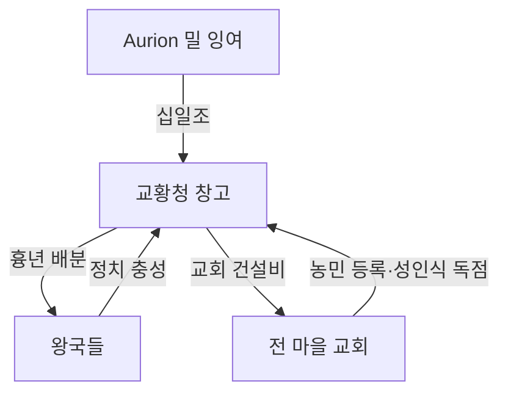

# Elucia 농업 경제

## 원전 인용 증명

### [필독 1] brainstorm_2026-04-21_worldview_expansion.md:176 (발언 5)
> "하늘색이 강인데, 보시다시피 좌측은 강이 많고 풍요로움, 우측은 강도별로없고 줄기도 짧아서 물이귀하고 사막이 많음"
— 발언 5, brainstorm_2026-04-21_worldview_expansion.md:176 (강 多 = 관개 농업 기반 확정)

### [필독 2] brainstorm_2026-04-21_worldview_expansion.md:2860 (발언 47)
> "서쪽은 농업, 어업이 주된식량자원 어자원이 매우풍부함, 서쪽은 농업 축산업이 발달함,"
— 발언 47, brainstorm_2026-04-21_worldview_expansion.md:2860 (농업 주 식량원 확정)

### [필독 3] brainstorm_2026-04-21_worldview_expansion.md:2869 (발언 48)
> "동쪽은 농업 어업, 서쪽은 농업 축산업"
— 발언 48, brainstorm_2026-04-21_worldview_expansion.md:2869 (Elucia = 농업 + 축산업 최종 확정)

### [필독 4] brainstorm_2026-04-21_worldview_expansion.md:2815 (발언 46 부기)
> "서쪽: 풍요 · 강 많음 (발언 5) → 밀·보리·과수 등"
— brainstorm_2026-04-21_worldview_expansion.md:2815 (농업 작물 추정 인용)

### [필독 5] political_divisions.md:106
> "Aurion / 오리온 / 중앙 평야 / 성좌국 직할 · Solaris"
— political_divisions.md:106 (곡창 핵심 권역 Aurion 확정)

### [필독 6] political_divisions.md:114–116
> "Soranth / 소란스 / 남중앙 평원 / 실렌 왕국"
— political_divisions.md:114–116 (Soranth 평원 = 남부 곡창 확정)

### [필독 7] FAILURES.md:62 (FAIL-002)
> "AI 의 빈 자리 채우기 경향 — 원전 범위 외 설정은 (추정) 표기"
— FAILURES.md:62 (과해석 방지 원칙 재확인)

---

## 요약

Elucia 농업은 3대 평원(Aurion·Soranth·Vaelin)을 기반으로 하며, 6대 대하천이 제공하는 관개 시스템이 풍요의 직접 원천이다. 발언 48 에 따라 농업은 축산업과 함께 서쪽의 양대 식량 산업을 이룬다. 성좌국 직할 Aurion 평원이 대륙 식량 공급의 40~50%를 담당하며, 이를 기반으로 성좌국의 정치 권력이 유지된다.

---

## 1. 3대 곡창 평원

| 평원 | 위치 | 면적 (추정) | 주요 왕국 | 대륙 공급 비중 (추정) |
|------|------|-----------|---------|------------------|
| **Aurion Plain** | 중앙 대륙 | ~300,000 km² | 성좌국 직할 | 40–50% |
| **Soranth Plain** | 남중앙 | ~160,000 km² | Sylren 왕국 | 25–30% |
| **Vaelin Plain** | 북부 | ~120,000 km² | Vaelin 왕국 | 15–20% |

---

## 2. 권역별 농업 상세

### 2-1. Aurion 평원 — 성좌국의 심장

Elucia 최대 곡창. Auravel·Eloryn 두 대하천이 제공하는 관개로 극도로 비옥하다. 성좌국이 이 평원을 직할 지배함으로써 11왕국에 대한 식량 영향력을 행사한다.

| 항목 | 내용 |
|------|------|
| 주요 작물 | 밀·보리·귀리·호밀 (추정) |
| 관개 수계 | Auravel River 중류 + Eloryn River 지류 |
| 농업 체계 | 2년 3모작 윤작 추정 (중세 유럽형) |
| 토양 | 심층 충적토 · 배수 양호 |
| 잉여 처리 | 성좌국 국고 비축 + 왕국 수출 |

**성좌국의 식량 패권 구조**:
```
Aurion 밀 잉여 생산
  → 성좌국 창고 비축
    → 흉년 시 왕국에 "교회 이름으로" 배분
      → 왕국의 성좌국 정치 의존도 상승
```

### 2-2. Soranth 평원 — 남부 다작 지대

Sylren 왕국 지배. Aurion 보다 기온이 높아 작물 다양성이 크다. Azim Pass 방향 군수·물자 보급 기지 역할도 겸한다.

| 항목 | 내용 |
|------|------|
| 주요 작물 | 밀·옥수수류·콩류·기름작물 (추정) |
| 관개 수계 | Soranth River + Auravel 하류 |
| 특성 | 남부 온난 기후 → 다작물 재배 가능 |
| 전략 | Azim Pass 방면 군량 집결 기지 |

### 2-3. Vaelin 평원 — 북부 전초 곡창

Vaelin 왕국. Norvend 산맥 남쪽에 위치해 북방 한기의 영향을 받는다.

| 항목 | 내용 |
|------|------|
| 주요 작물 | 귀리·보리·순무·아마 (추정, 서늘한 기후 적응) |
| 관개 수계 | Mornwell River 상류 + Eloryn River 상류 |
| 특성 | 겨울 3–4개월 혹한 → 저장식품 문화 발달 |
| 전략 | 북방 방어선 지원 물자 집결 |

---

## 3. 농업 생산 체계

### 3-1. 경작 방식 (추정 · 중세 유럽형)

| 방식 | 지역 | 내용 |
|------|------|------|
| 개방 경지제 | Aurion·Soranth | 영주 + 농민 공동 경작. 3圃제 추정 |
| 관개 수로망 | Aurion 전역 | 대하천 지류를 수문으로 관리 |
| 윤작제 | Soranth | 콩류 포함 다모작 |
| 소작제 | 전 왕국 | 농민은 수확의 1/3~1/2 납부 (추정) |

### 3-2. 생산력 등급 (추정)

| 등급 | 권역 | 연간 밀 수확 (추정) |
|------|------|-----------------|
| S — 최고 | Aurion (성좌국) | 평년 기준 대륙 최대 |
| A — 고 | Soranth (Sylren) | Aurion의 60~70% |
| B — 중 | Vaelin | Aurion의 40~50% |
| C — 중저 | Silvan·Havren 해안 | 목초·과수 위주, 곡물 부족 |
| D — 저 | Norvend·Maerith 고지 | 자급 수준 |

---

## 4. 농업과 교회 권력

성좌국 교황청은 농업 잉여를 통해 정치 권력을 유지한다. 이 구조가 "교회가 모든 마을에 있는" 발언 46과 직결된다.



---

## 5. 농업과 타종족 (발언 8·50 반영)

발언 50: *"타종족비율이 서쪽 25%동쪽75%임"*

Aurion·Soranth 평원은 인간이 완전 지배하는 구역이다. 타종족은 평원 **가장자리 초원·숲 경계** 에만 간헐적으로 존재한다. 일부 농업 지역에서 타종족 노동력이 투입되는 경우가 있으나 이는 slave_economy_western 파일에서 상세 다룬다.

---

## 대표님 미확정 사항 / 질문 큐

- 작물 종류의 판타지 고유화 여부 (현실 중세 작물 그대로 vs 판타지 이름)
- Aurion 평원 내 성좌국 국유지 vs 귀족 사유지 비율 상세
- 농민 계급 법적 지위 (농노제 vs 자유 농민제)
- 가뭄·흉년 대응 체계 (비상 창고 위치·교회 배분 의식)

---

## 다음 Wave 의존 포인트

- **Wave 3 Historian**: 성좌국 곡창 Aurion이 역사적으로 어떻게 "교황청 제국의 경제 기반"이 되었는지 역사 서사
- **Wave 3 Diplomat**: Soranth 평원 통제권을 둘러싼 Sylren 왕국 vs 성좌국 마찰 → 외교 갈등 핵심 소재
- **Wave 4 Kingdom-Detailer (성좌국·Sylren·Vaelin)**: 평원 내 도시·마을 배치, 관개 수로망 상세, 농업 도시 규모
- **Wave 4 Kingdom-Detailer (Thaloss)**: 고산 농업의 한계 → 광업으로 보완하는 경제 구조

<!-- auto-generated-related:start -->
## 🔗 관련 (auto-generated)

> `scripts/obsidian/build_backlinks.py` 로 자동 생성. 수정 금지 — 다음 실행 시 덮어쓰여집니다.

### ⬆️ 상위

- [[../../../../MOC]] — wiki 루트
- [[../MOC]] — Elucia 허브

### 📑 카테고리 개요

- [[00_overview]]

### 🔗 형제 노드

- [[crafts_guilds_2026-04-22]]
- [[currency_and_banking_2026-04-22]]
- [[economic_clusters_2026-04-22]]

<!-- auto-generated-related:end -->
