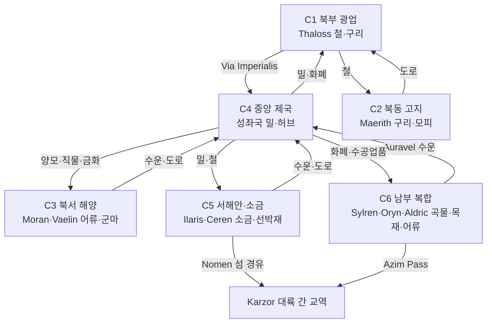

# Elucia 경제 클러스터 지도

## 원전 인용 증명

### [필독 1] brainstorm_2026-04-21_worldview_expansion.md:176 (발언 5)
> "좌측은 강이 많고 풍요로움 ... 보라색점은 좌측대륙에서 가장큰 제국"
— 발언 5, brainstorm_2026-04-21_worldview_expansion.md:176

### [필독 2] brainstorm_2026-04-21_worldview_expansion.md:2869 (발언 48)
> "동쪽은 농업 어업, 서쪽은 농업 축산업"
— 발언 48, brainstorm_2026-04-21_worldview_expansion.md:2869

### [필독 3] brainstorm_2026-04-21_worldview_expansion.md:3015 (발언 50)
> "타종족비율이 서쪽 25%동쪽75%임"
— 발언 50, brainstorm_2026-04-21_worldview_expansion.md:3015

### [필독 4] political_divisions.md:105–116 (10 권역 전체)
> "Norvend / 북부 산맥 ... Aurion / 중앙 평야 ... Silvan / 서해안 숲 ... Loravel / 서남 습지 ..."
— political_divisions.md:105–116

---

## 요약

Elucia 10개 권역을 경제 특화 기준으로 6개 클러스터로 분류한다. 각 클러스터는 주력 산업·교역 방향·타종족 분포·익명 학자 마법 침투율율을 통합 제시한다. 이 지도가 Wave 3 Diplomat 의 갈등 지점과 Wave 4 Kingdom-Detailer 의 왕국별 경제 설계 기준이 된다.

---

## 1. 경제 클러스터 전체 지도

| 클러스터 | 포함 권역 | 포함 왕국 | 주력 산업 | 대표 수출품 |
|---------|---------|---------|---------|---------|
| **C1 북부 광업 클러스터** | Norvend | Thaloss | 금속 광업 | 철·구리·희귀 광석 |
| **C2 북동 고지 클러스터** | Auryn | Maerith | 구리 소광업·고지 농업 | 구리·모피 |
| **C3 북서 해양 클러스터** | Havren | Moran·Vaelin | 해안 어업·곡물 | 청어·석재 |
| **C4 중앙 제국 곡창 클러스터** | Aurion | 성좌국 | 농업·축산업·교역 허브 | 밀·양모·금화 |
| **C5 서해안·소금 클러스터** | Silvan·Loravel | Ilaris·Ceren | 해상 어업·소금·목재 | 청어·소금·선박재 |
| **C6 남부 복합 클러스터** | Soranth·Duskmoor·Lonwyn·Orenwald | Sylren·Novas·Aldric·Oryn | 농업·담수 어업·임업 | 곡물·잉어·목재 |

---

## 2. 클러스터별 상세

### C1 — 북부 광업 클러스터 (Norvend·Thaloss)

| 항목 | 내용 |
|------|------|
| 주력 산업 | 금속 광업 (철·구리·희귀 광석) |
| 경제 강점 | 대륙 철공급 독점 → 전략적 레버리지 |
| 경제 약점 | 식량 전량 수입 의존 |
| 교역 파트너 | 성좌국 (밀), Vaelin (말), Maerith (구리 보완) |
| 타종족 | 드워프 Norvend 동굴 은신 가능성 (대표님 미확정) |
| 익명 학자 마법 침투율 | 중 (~40%) — 광부 응급 치유 수요 높음 |
| 무역 갈등 | 성좌국 강압 구매 가격 vs Thaloss 시장 가격 분쟁 |

### C2 — 북동 고지 클러스터 (Auryn·Maerith)

| 항목 | 내용 |
|------|------|
| 주력 산업 | 소규모 구리 광업 + 고지 축산 + 목재 |
| 경제 강점 | C1 보완·Orenwald 북부 임업 접근 |
| 경제 약점 | 산악 고립 → 교역 비용 높음 |
| 교역 파트너 | Thaloss (대형 철로 교환)·Oryn (목재) |
| 타종족 | 고지 숲 은신 가능성 (Maerith Highwood) |
| 익명 학자 마법 침투율 | 낮음 (~20%) — 고립 지역 |

### C3 — 북서 해양 클러스터 (Havren·Moran·Vaelin)

| 항목 | 내용 |
|------|------|
| 주력 산업 | 해안 어업·북부 곡물·군마 |
| 경제 강점 | 군마 공급 (Vaelin) + 해안 방어항 |
| 경제 약점 | 북방 한기 → 농업 생산성 제한 |
| 교역 파트너 | 성좌국 (밀 수입)·Thaloss (철 구매) |
| 타종족 | 낮음 (인간 접근 多) |
| 익명 학자 마법 침투율 | 중 (~30%) — 어촌 식품 보존 수요 |

### C4 — 중앙 제국 곡창 클러스터 (Aurion·성좌국)

| 항목 | 내용 |
|------|------|
| 주력 산업 | 농업·축산업·교역 허브·화폐 발행 |
| 경제 강점 | 대륙 최대 밀 생산 + 교역 허브 + 화폐 통제 |
| 경제 약점 | 광물 자원 없음 → Thaloss 의존 |
| 교역 파트너 | 11왕국 전체 (Solaris = 허브) |
| 타종족 | 은신 불가 — 인간 완전 지배 |
| 익명 학자 마법 침투율 | 낮음 (~15%) — 마법사 길드·교회 단속 |
| 무역 갈등 | Via Imperialis 통행세 분쟁 · 소금세 갈등 · 십일조 상납 거부 |

### C5 — 서해안·소금 클러스터 (Silvan·Loravel·Ilaris·Ceren)

| 항목 | 내용 |
|------|------|
| 주력 산업 | 해상 어업·소금·목재·조선 |
| 경제 강점 | 소금 독점 (Ceren) + 최대 항구 (Ilaris) |
| 경제 약점 | 농업 생산성 낮음 → 곡물 수입 |
| 교역 파트너 | 성좌국 (밀 수입)·Thaloss (철 수입)·Nomen (수출) |
| 타종족 | Silvan 深林 은신 높음 (엘프 추정) |
| 익명 학자 마법 침투율 | 높음 (~55%) — 어촌 보존 수요 · 습지 정화 수요 |
| 무역 갈등 | **소금 가격 vs 전역 왕국 압박** · Ilaris vs Oryn 목재권 갈등 |

### C6 — 남부 복합 클러스터 (Soranth·Duskmoor·Lonwyn·Orenwald·Sylren·Novas·Aldric·Oryn)

| 항목 | 내용 |
|------|------|
| 주력 산업 | 곡물·담수 어업·임업 |
| 경제 강점 | 다양한 산업 포트폴리오 · Azim Pass 접근 |
| 경제 약점 | 성좌국에 비해 교역 파워 낮음 |
| 교역 파트너 | 성좌국 (판매처)·Karzor (Azim Pass 경유) |
| 타종족 | Orenwald 深部 은신 높음 · Duskmoor 오크 인접 |
| 익명 학자 마법 침투율 | 높음 (Ceren·Sylren ~40~60%) · 낮음 (Orenwald 변경 ~20%) |
| 무역 갈등 | Lonwyn 어업권 · Azim Pass 통행세 · Orenwald 채취권 |

---

## 3. 클러스터 간 교역 흐름 전체도

---

## 4. Wave 3 Diplomat 참조 — 주요 무역 갈등 포인트

| 갈등 | 당사자 | 핵심 |
|------|--------|------|
| 소금 가격 분쟁 | Ceren vs 전역 | 소금세 인상 시 전역 왕국 압박 |
| 철 공급 가격 | Thaloss vs 성좌국 | 성좌국 강압 구매 vs 시장가 요구 |
| Via Imperialis 통행세 | 성좌국 vs 전 교역상 | 세율 인상 시 상인 길드 저항 |
| 목재 채취권 | Ilaris vs Oryn | Silvan·Orenwald 벌채 경계 분쟁 |
| Lonwyn 어업권 | Aldric vs Sylren | 호수 경계 어업 구역 분쟁 |
| Azim Pass 통행세 | Novas vs Karzor·Sabin | 노예·물자 이동 통행료 분쟁 |
| 마법 무허가 단속 | 마법사 길드 vs 농촌 전역 | 이름 없는 학자 마법 네트워크 문제 |

---

## 5. Wave 4 Kingdom-Detailer 참조 — 왕국별 경제 특화 포인트

| 왕국 | 클러스터 | 핵심 경제 설계 포인트 |
|------|---------|------------------|
| 성좌국 (Solaris) | C4 | 교역 허브 + 화폐 발행 + 창고 독점 + 십일조 수취 |
| Thaloss | C1 | 광산 도시 + 제련소 + Greygate 요새 + 식량 수입 의존 |
| Ilaris | C5 | 최대 항구 + 조선소 + 양모 수출 + Silvan 목재권 |
| Ceren | C5 | 소금 독점 + 습지 어업 + 소금 창고 도시 |
| Vaelin | C3 | 군마 목장 + 북부 방어 기지 + 기사 경제 |
| Moran | C3 | 어항 + 군항 + 석재 채굴 |
| Sylren | C6 | 남부 곡창 + Azim Pass 물자 집결 |
| Oryn | C6 | Orenwald 목재 + 약초 + 담수 어업 |
| Aldric | C6 | Lonwyn 호수 어업 + 내항 수운 + 담수 진주 (추정) |
| Novas | C6 | Azim Pass 요충지 + 남동 어업 + 통행세 수입 |
| Maerith | C2 | 고지 구리 소광업 + 모피 + 약초 |

---

## 대표님 미확정 사항 / 질문 큐

- 클러스터 경계 확정 — 대표님이 직관적으로 보시는 지역 구획과 일치하는지 확인 필요
- 성좌국의 소금·철 동시 의존 구조가 "Ceren + Thaloss 동맹" 시 교황청 위협이 되는 시나리오 활용 여부

---

## 다음 Wave 의존 포인트

- **Wave 3 Diplomat**: 6개 클러스터 간 교역 갈등 4번 항목을 외교 시나리오 설계 기준으로 활용
- **Wave 4 Kingdom-Detailer (전 왕국)**: 5번 항목 왕국별 경제 특화 포인트를 도시·마을 배치 설계 기준으로 활용
- **Wave 5 World-Integrator**: 경제 클러스터 지도를 전체 관계 그래프의 경제 레이어로 통합
