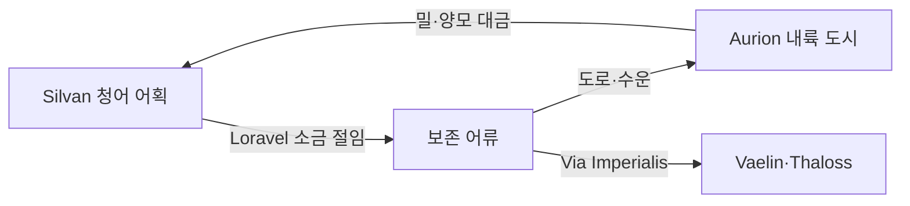

# Elucia 서해안 어업

## 원전 인용 증명

### [필독 1] brainstorm_2026-04-21_worldview_expansion.md:2860 (발언 47)
> "서쪽은 농업, 어업이 주된식량자원 어자원이 매우풍부함, 서쪽은 농업 축산업이 발달함,"
— 발언 47, brainstorm_2026-04-21_worldview_expansion.md:2860 (어자원 풍부 확정)

### [필독 2] brainstorm_2026-04-21_worldview_expansion.md:2869 (발언 48)
> "동쪽은 농업 어업, 서쪽은 농업 축산업"
— 발언 48, brainstorm_2026-04-21_worldview_expansion.md:2869 (서쪽 어업은 주력이 아닌 보조 산업 — 축산업이 주력)

### [필독 3] brainstorm_2026-04-21_worldview_expansion.md:176 (발언 5)
> "좌측은 강이 많고 풍요로움 ... 빨간색 점이 항구(북쪽얼음섬으로가는 유일한길"
— 발언 5, brainstorm_2026-04-21_worldview_expansion.md:176 (서해안 항구 존재 확정)

### [필독 4] political_divisions.md:110–111
> "Silvan / 실반 / 서해안 숲 / 일라리스 왕국 ... Loravel / 로라벨 / 서남 습지·호수 / 세렌 왕국"
— political_divisions.md:110–111 (서해안 어업 권역 확정)

### [필독 5] political_divisions.md:55–56
> "일라리스 / Ilaris / 서해안 ... 세렌 / Ceren / 서남 습지"
— political_divisions.md:55–56 (해안 왕국 확정)

### [필독 6] FAILURES.md:167 (FAIL-006 교훈)
> "빈 자리는 (추정) 표기. AI 가 합리적 추론으로 채우지 말 것"
— FAILURES.md:167 (어업 상세는 원전 범위 내만 확정)

---

## 요약

Elucia 서해안 어업은 발언 47 에서 "어자원이 매우 풍부" 하다고 확정되었으나, 발언 48 에서 서쪽 주력 산업은 **축산업** 이고 어업은 보조 위치임이 명확해진다. 서해안(Silvan·Ilaris), 서남 내만(Ceren·Loravel), 북서 해안(Moran)에서 어업이 발달하며, 소금 어획과 어류 건조 교역이 내륙과의 물물교환 채널을 형성한다.

---

## 1. 서해안 어업 권역 개요

| 권역 | 왕국 | 해안 유형 | 주요 어종 (추정) | 특성 |
|------|------|---------|--------------|------|
| **Silvan Coast** | Ilaris | 리아스식 복잡 해안 | 청어·대구·도미류 | 다수 자연 항구 · 주력 어항 |
| **Loravel Delta** | Ceren | 삼각주·조석 하구 | 뱀장어·숭어·서대 | 조수 이용 그물 어업 |
| **Mornhaven Coast** | Moran | 절벽·만 | 고등어·청어 | 어항 규모 소 · 군항 겸용 |
| **Novas 남해안** | Novas | 얕은 여울 | 넙치·조개류 | 연안 어업 · 소형 선박 |
| **Aldric 내만** | Aldric | 내만·사취 | 굴·홍합·멸치 | 호수 어업과 복합 |

---

## 2. 주요 어획물과 경제 흐름

### 2-1. 청어 — 서해안 대중 어류

청어는 무리 지어 이동하는 계절성 어류로, 대량 포획 후 소금 절임 가공(추정)을 통해 내륙 무역의 핵심 품목이 된다.

| 항목 | 내용 |
|------|------|
| 주어장 | Silvan Cape 인근 · Mirevane Bay |
| 계절 | 봄·가을 (군집 이동기) |
| 가공 | 소금 절임 통 · 훈제 건청어 |
| 내륙 교역 | Via Imperialis 를 따라 성좌국·Vaelin 방면 |

### 2-2. 소금 절임 어류 — 내륙 단백질 공급망

소금 절임 어류는 보존성이 높아 내륙 깊숙이 유통된다. 이 유통이 해안 왕국(Ilaris·Ceren·Moran)의 내륙 왕국에 대한 교역 레버리지를 만든다.

### 2-3. 조개류·굴 — 서민 단백질

해안 조개류는 수산물 중 가장 서민 접근성이 높다. 내륙 운반 없이 근거리 마을에서 소비된다.

---

## 3. 어업 인프라

### 3-1. 항구 도시 (추정 위치)

| 항구 | 왕국 | 규모 (추정) | 기능 |
|------|------|-----------|------|
| Silvan Cape 항 | Ilaris | 대형 | 무역항 + 어항 겸용 |
| Loravel Delta 하구 항 | Ceren | 중형 | 소금 절임 어류 집하 |
| Mornhaven 항 | Moran | 소형 | 어항 + 군항 |
| Novas 남안 항 | Novas | 소형 | 연안 어업 기지 |

### 3-2. 어선 규모 (추정 · 중세 유럽형)

- **원양 어선**: 20~40명 승선 · Silvan Cape 기지 · 서방 대해 원정
- **연안 어선**: 5~15명 승선 · 대부분 왕국 어항
- **소형 어선**: 1~3인 · 해안 마을 일상 자급

---

## 4. 어업과 교회

Elucia 교회는 "금식일" 제도를 통해 어류 소비를 구조적으로 촉진한다 (추정 · 중세 유럽형). 교회가 육류 소비를 금지하는 날 = 어류 소비 급증 → 어업 왕국(Ilaris·Ceren) 이 교회 달력에 경제적 의존.

- 금식일 어류 수요 → Ceren 항구 주변 시장 번성
- 교회의 어류 판매 독점 시도 vs 어부 길드 저항 (추정 · 대표님 미확정)

---

## 5. 집필 활용

> *"Ilaris 항구는 아침마다 배가 들어왔다. 그물에서 쏟아지는 은빛 청어 더미 위로 갈매기 울음이 섞였다. 부두 창고에는 소금통이 켜켜이 쌓여 있었다. 이 소금은 Loravel 습지에서 온 것이고, 저 청어는 내일 Aurion 까지 실려 갈 것이었다."*

---

## 대표님 미확정 사항 / 질문 큐

- 서해안 주 어종 판타지 고유화 여부
- 교회 금식일 제도 존재 여부 (이슬람 할랄과 유사한 교회 식생 규정)
- 원양 어업의 규모 — 서방 대해 원정 어선 존재 여부
- 어부 길드의 조직화 정도 (도시별 독립 vs 왕국 통합 조합)

---

## 다음 Wave 의존 포인트

- **Wave 3 Diplomat**: 소금 절임 어류 교역로 둘러싼 Ilaris vs Ceren 왕국 이해 충돌 · 소금 독점 분쟁
- **Wave 4 Kingdom-Detailer (Ilaris)**: 서해안 항구 도시 상세 · 어부 거리 · 조선소 구역
- **Wave 4 Kingdom-Detailer (Ceren)**: Loravel 소금과 어업의 복합 경제 상세
