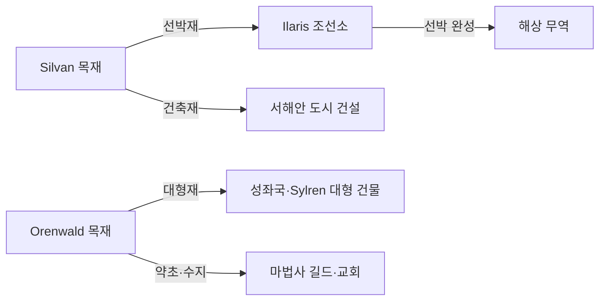

# Elucia 임업

## 원전 인용 증명

### [필독 1] political_divisions.md:110
> "Silvan / 실반 / 서해안 숲 / 일라리스 왕국"
— political_divisions.md:110 (Silvan 숲 = 서해안 임업 핵심 확정)

### [필독 2] political_divisions.md:113
> "Orenwald / 오렌왈드 / 동부 숲 / 오린 왕국"
— political_divisions.md:113 (Orenwald = 동부 임업 핵심 확정)

### [필독 3] brainstorm_2026-04-21_worldview_expansion.md:302 (발언 8)
> "타종족은 주변 작은 섬들이나 대륙의 가장자리의 밀림이나 숲, 사막한가운데서 숨어서 생활한다."
— 발언 8, brainstorm_2026-04-21_worldview_expansion.md:304 (숲 = 타종족 은신 지형 확정 → 임업과 타종족 긴장 구조)

### [필독 4] brainstorm_2026-04-21_worldview_expansion.md:176 (발언 5)
> "좌측은 강이 많고 풍요로움"
— 발언 5, brainstorm_2026-04-21_worldview_expansion.md:176 (풍요 = 풍부한 숲 포함)

### [필독 5] wiki/design/worldbuilding/elucia/geography/forests_2026-04-22.md (Wave 1 산출)
> "Silvan Forest ~85,000 km² ... 목재 채취·수렵·수지(樹脂) 채취·해안 선박 목재"
— forests_2026-04-22.md:76 (Silvan 임업 기능 확인)

---

## 요약

Elucia 임업의 핵심은 확정 지명 **Silvan** (Ilaris 왕국 서해안 숲)과 **Orenwald** (Oryn 왕국 동부 숲)이다. Silvan 은 선박 건조·해안 건축 목재를 주로 생산하고, Orenwald 는 대형 내륙 건축재와 약초·수지 채취의 보고다. 임업은 단순 목재 채취를 넘어 타종족 은신 공간 관리, 교회의 숲 진입 금지령, 왕국 간 채취권 분쟁이 교차하는 정치경제 갈등의 장이기도 하다.

---

## 1. 2대 숲 임업 개요

| 숲 | 왕국 | 면적 | 주 임산물 | 채취 한계선 |
|----|------|------|---------|-----------|
| **Silvan Forest** | Ilaris | ~85,000 km² | 선박재·건축재·수지 | 深林 (20km+) 미탐사 |
| **Orenwald** | Oryn | ~120,000 km² | 대형 건축재·약초·수지 | 심부 "어둠의 숲" 미탐사 |

---

## 2. Silvan 임업 — 서해안의 해양 목재

### 2-1. 주요 임산물

| 임산물 | 용도 | 수요처 |
|--------|------|--------|
| **선박용 목재** (참나무·ash) | 어선·상선·전함 건조 | Ilaris 조선소·Moran 항구 |
| **건축 목재** (느릅·서양주목) | 도시 주택·교회 내부재 | 서해안 도시 전역 |
| **수지·타르** | 선박 방수·접착 | 조선 길드 |
| **연료 목재** | 도시 난방·요업 가마 | Ilaris·Ceren |
| **약초·수액** | 의약 재료 | 교회 병원·약제사 |

### 2-2. 채취 구역 통제

Ilaris 왕국은 Silvan 숲을 **3 구역** 으로 나눠 채취를 허가한다(추정):

| 구역 | 깊이 | 접근 | 임업 활동 |
|------|------|------|---------|
| **外林 채취구** | 0–5 km | 허가 없이 가능 | 연료목·소형 건재 |
| **왕국 허가 채취구** | 5–20 km | 길드 허가 + 왕세 | 대형 선박재·수지 |
| **금지구** | 20 km+ | 사실상 미탐사 | 채취 금지 (타종족 은신 지역) |

---

## 3. Orenwald 임업 — 대륙 최대 목재 산지

### 3-1. 주요 임산물

| 임산물 | 용도 | 수요처 |
|--------|------|--------|
| **대형 건축재** (소나무·낙엽송) | 성·교회·도시 대형 건물 | 성좌국·Sylren |
| **수지·송진** | 접착·방수·약용 | 제조업 전반 |
| **약초류** | 의약·독극물·마법 재료 | 교회 병원·마법사 |
| **수렵 모피** | 귀족 의류·방한구 | 귀족 시장 |

### 3-2. Orenwald 채취의 특수성

Orenwald 는 규모가 크고 내부가 복잡하여, 채취 작업자들이 길을 잃는 사고가 빈번하다(추정):
- "오렌왈드 속에서는 나침반이 제멋대로 돈다" 는 구전이 있어, 숙련된 안내인(forest guide) 산업이 발달 (추정)
- 교회는 Orenwald 심부를 "어둠의 숲" 으로 명명하고 진입을 이단 의심 행위로 규정 (추정)

---

## 4. 임업 경제 구조

### 4-1. 목재 채취권 — 왕국 수입원

| 수입 항목 | 내용 |
|----------|------|
| 채취 허가세 | 길드별 연간 허가증 구매 |
| 목재 통행세 | Via Imperialis 통과 목재에 부과 |
| 조선소 사용료 | Ilaris 왕국 직영 또는 허가 조선소 |

### 4-2. 임업과 제조업 연동

---

## 5. 임업과 타종족 긴장

발언 8 원문: *"타종족은 주변 작은 섬들이나 대륙의 가장자리의 밀림이나 숲, 사막한가운데서 숨어서 생활한다."*

숲 채취와 타종족 은신 공간의 충돌이 구조적으로 발생한다:

- **목재 수요 증가 → 채취구 확장 시도** → 타종족 은신 영역 침범
- Ilaris 목부가 深林에서 타종족 흔적을 발견하는 사건 → 교회에 신고 의무 vs 목부의 묵인 선택
- 서쪽 25% 타종족 중 상당수가 Silvan·Orenwald 深林 거주 → 임업 확장이 곧 종족 박해 가속 기제

*이 긴장이 서쪽 "질서있는 박해" (발언 49 반영) 의 일상적 형태다.*

---

## 대표님 미확정 사항 / 질문 큐

- 숲 채취 금지구 경계의 법적 지위 — 왕국법으로 명문화되어 있는지, 관습법 수준인지
- 엘프 공동체와 Silvan·Orenwald 임업의 관계 — 엘프가 채취를 묵인하는지, 방해하는지 (발언 미확정)
- 판타지 고유 수종 여부 — 현실 수종 이름 그대로 사용 vs 고유 이름

---

## 다음 Wave 의존 포인트

- **Wave 3 Historian**: Silvan·Orenwald 가 왜 "채취는 하되 개간은 하지 않는" 상태인지 역사적 배경
- **Wave 3 Diplomat**: Ilaris(목재 독점) vs Oryn(Orenwald 독점) 목재 가격·채취권 조약
- **Wave 4 Kingdom-Detailer (Ilaris·Oryn)**: 숲 경계 도시·목재 집하장·목부 마을·조선소 지도

<!-- auto-generated-related:start -->
## 🔗 관련 (auto-generated)

> `scripts/obsidian/build_backlinks.py` 로 자동 생성. 수정 금지 — 다음 실행 시 덮어쓰여집니다.

### ⬆️ 상위

- [[../../../../MOC]] — wiki 루트
- [[../MOC]] — Elucia 허브

### 📑 카테고리 개요

- [[00_overview]]

### 🔗 형제 노드

- [[agriculture_2026-04-22]]
- [[crafts_guilds_2026-04-22]]
- [[currency_and_banking_2026-04-22]]

<!-- auto-generated-related:end -->
