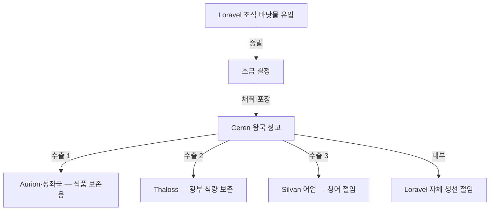

# Elucia 보석·소금

## 원전 인용 증명

### [필독 1] political_divisions.md:111
> "Loravel / 로라벨 / 서남 습지·호수 / 세렌 왕국"
— political_divisions.md:111 (Loravel = 소금 생산 권역의 확정 지명)

### [필독 2] brainstorm_2026-04-21_worldview_expansion.md:176 (발언 5)
> "좌측은 강이 많고 풍요로움"
— 발언 5, brainstorm_2026-04-21_worldview_expansion.md:176 (풍요 = 소금·보석 포함 광의 해석)

### [필독 3] wiki/design/worldbuilding/elucia/geography/wetlands_and_swamps_2026-04-22.md (Wave 1 산출)
> "소금 / Loravel 외곽 조석대 / 광역 방부·식품 교역"
— wetlands_and_swamps_2026-04-22.md:118 (Loravel 소금 생산 확인)

### [필독 4] wiki/design/worldbuilding/elucia/geography/mountain_ranges_2026-04-22.md (Wave 1 산출)
> "Morncliff Spine / 해안 석재·소금 / 항구 방어 절벽"
— mountain_ranges_2026-04-22.md:131 (Morncliff 소금 채취 확인)

### [필독 5] brainstorm_2026-04-21_worldview_expansion.md:2825 (AI 해석 노트)
> "교회 십일조 · 영주 세금 체계 (질문 큐)"
— brainstorm_2026-04-21_worldview_expansion.md:2825 (소금 세금 연동 필요 확인)

---

## 요약

소금은 Elucia 경제에서 화폐 기능을 준하는 전략 자원이다. 서남 Loravel 습지의 조석 소금전(鹽田)이 주 생산지이며, Ceren 왕국이 이를 독점 또는 준독점 관리한다. 보석은 Norvend 산맥 광맥과 Lonwyn 호수 심부에서 일부 채취되나 규모가 크지 않다(추정). 소금 교역은 어류 보존·육류 처리·가죽 가공에 필수적이어서, 소금 공급망을 장악한 Ceren 왕국이 과분한 외교적 레버리지를 보유한다.

---

## 1. 소금 — Elucia 의 전략 자원

### 1-1. 생산지

| 생산지 | 위치 | 방식 | 왕국 | 특성 |
|--------|------|------|------|------|
| **Loravel 조석염전** | Loravel 권역 서남 해안 | 조석 증발 | Ceren | 최대 규모 · 연간 생산 안정 |
| **Duskway 하구 조석** | Novas 남동 해안 | 조석 | Novas | 소규모 · 자급 |
| **Morncliff 해안 암염** | Moran 북서 절벽 | 암염 채굴 (추정) | Moran | 소규모 · 고품질 |
| **Lonwyn 호변 염전** | Aldric 남서 | 호수 증발 | Aldric | 내륙 담수염 · 순도 낮음 |

### 1-2. Loravel 염전 — 경제 권력의 근원

Loravel 습지 외곽의 조석대는 바닷물이 정기적으로 침수·증발하는 자연 염전이다. Ceren 왕국은 이를 왕실 직할로 관리하거나 대귀족에게 독점 허가한다(추정).

### 1-3. 소금의 다용도 경제

| 용도 | 수요처 | 중요도 |
|------|--------|------|
| 어류 절임 | 해안 어업 전역 | ★★★★★ |
| 육류 보존 | 전역 귀족·군대 | ★★★★ |
| 가죽 가공 | 무두장이 길드 | ★★★ |
| 광부 식량 보존 | Thaloss | ★★★ |
| 화폐 준기능 | 일부 농촌 내부 | ★★ |
| 의료·방부 | 교회 병원·군진 | ★★★ |

---

## 2. 소금 정치경제

### 2-1. Ceren 왕국의 소금 레버리지

Ceren 왕국은 규모나 군사력으로는 중간급 왕국이나, 소금 공급권 때문에 성좌국조차 함부로 다루지 못하는 특수 지위를 가진다(추정).

- **성좌국과의 관계**: 성좌국은 Aurion 밀로 Ceren 의 소금에 대응. 상호 필수 자원 교환 구조
- **Ilaris 와의 긴장**: 서해안 청어 절임을 위해 Ilaris 가 Ceren 소금을 반드시 구매해야 하는 구조 → 가격 협상 주기적 마찰
- **소금세(鹽稅)**: 성좌국 교황청이 소금 통행세 부과를 시도하나 Ceren 이 저항 (추정)

### 2-2. 소금 밀수

고가 소금에 대한 밀수는 Elucia 경제의 고질적 문제다:
- 해안 어부들이 Novas 소금을 Ceren 경유 없이 직거래 시도
- 뒷골목 상인들이 Karzor 를 통해 수입한 대안 소금 유통
- 교회는 밀수를 "탐욕의 죄" 로 규정하나 실제 단속은 왕국 관할

---

## 3. 보석 — 희소 고가 자원

### 3-1. 보석 산지 (추정 · 대표님 미확정)

| 산지 | 위치 | 추정 보석 | 특성 |
|------|------|---------|------|
| Norvend 광맥 | Thaloss 고산 | 자수정·수정류 | 철광 채굴 중 부산물 |
| Lonwyn 호저 | Aldric 호수 | 호박·담수 진주 (추정) | 특수 채취 |
| Loravel 습지 심부 | Ceren | 흑요석 조각 (추정) | 소량 · 의식용 |

*보석 산지 및 종류는 대표님 미확정 · 전량 (추정). Toponymist·Kingdom-Detailer 담당.*

### 3-2. 보석의 경제·사회적 기능

| 기능 | 내용 |
|------|------|
| 귀족 장신구 | 권력 과시 · 혼인 지참금 |
| 교회 성물 장식 | 성상·제단·십자가 장식 |
| 인장·봉인 | 귀족 가문 반지·도장 |
| 마법사 주력 재료 | 마법 시전 보조 재료 (추정) |
| 이름 모를 학자 마법 연동 | 없음 (서민 생활 마법은 보석 불필요 — Q-CORE 2 설계 원칙) |

---

## 4. 집필 활용

> *"Ceren 의 소금 상인이 수레에 흰 자루를 가득 싣고 Via Imperialis 를 지나고 있었다. 위병이 통행세 장부를 들이밀었다. 상인은 표정 하나 변하지 않았다. 그가 팔려는 소금이 없으면 이 나라 군대는 겨울을 나지 못한다는 것을 둘 다 알고 있었다."*

---

## 대표님 미확정 사항 / 질문 큐

- 소금세의 납부 방식 — 현물세(소금 일부 납부) vs 화폐세
- Ceren 왕국이 소금 독점권을 성좌국으로부터 공식 인정받은 역사적 조약 존재 여부
- 보석의 마법적 기능 여부 — 마법사 길드가 보석을 주술 재료로 사용하는지

---

## 다음 Wave 의존 포인트

- **Wave 3 Diplomat**: Ceren(소금) vs 성좌국(식량) vs Ilaris(어업) 3자 경제 동맹의 균형과 갈등
- **Wave 4 Kingdom-Detailer (Ceren)**: Loravel 염전 지도·소금 창고 도시·소금 상인 길드 거리
- **Wave 4 Kingdom-Detailer (Aldric)**: 호수 담수 진주 채취 · 전통 산업과 외래 수요

<!-- auto-generated-related:start -->
## 🔗 관련 (auto-generated)

> `scripts/obsidian/build_backlinks.py` 로 자동 생성. 수정 금지 — 다음 실행 시 덮어쓰여집니다.

### ⬆️ 상위

- [[../../../../MOC]] — wiki 루트
- [[../MOC]] — Elucia 허브

### 📑 카테고리 개요

- [[00_overview]]

### 🔗 형제 노드

- [[agriculture_2026-04-22]]
- [[crafts_guilds_2026-04-22]]
- [[currency_and_banking_2026-04-22]]

<!-- auto-generated-related:end -->
