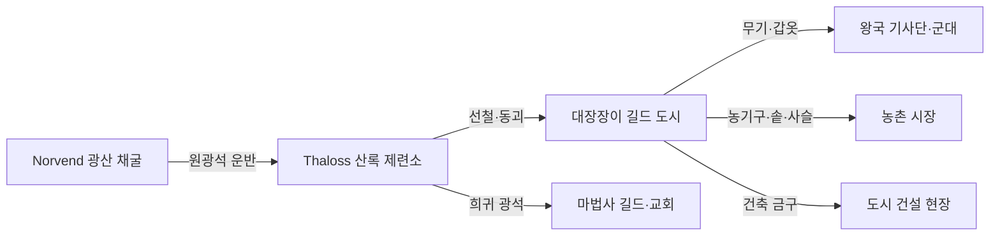

# Elucia 금속 광업

## 원전 인용 증명

### [필독 1] political_divisions.md:107
> "Norvend / 노르벤드 / 북부 산맥 너머 / 탈로스 왕국"
— political_divisions.md:107 (Norvend = 광업 핵심 권역 확정)

### [필독 2] political_divisions.md:108
> "Auryn / 오린 (지역) / 북동 고지 / 마에리스 왕국"
— political_divisions.md:108 (Auryn 고지 = 광업 보조 권역)

### [필독 3] wiki/design/worldbuilding/elucia/geography/mountain_ranges_2026-04-22.md (Wave 1 산출)
> "Norvend Range / 광물 자원: 철광·구리·희귀 광석(추정)"
— mountain_ranges_2026-04-22.md:128 (Norvend 광물 자원 확인)

### [필독 4] brainstorm_2026-04-21_worldview_expansion.md:2825 (AI 해석 노트)
> "길드 시스템 (대장장이·상인·마법사 길드 여부)"
— brainstorm_2026-04-21_worldview_expansion.md:2825 (광업-길드 연동 필요성 확인)

### [필독 5] brainstorm_2026-04-21_worldview_expansion.md:176 (발언 5)
> "좌측은 강이 많고 풍요로움"
— 발언 5, brainstorm_2026-04-21_worldview_expansion.md:176 (풍요에 광업 포함 추정)

### [필독 6] FAILURES.md:62 (FAIL-002)
> "빈 자리는 (추정) 표기. AI 가 합리적 추론으로 채우지 말 것"
— FAILURES.md:62 (광업 상세는 원전 미확정 → 추정 표기)

---

## 요약

Elucia 금속 광업은 북부 Norvend 산맥이 핵심 산지이며, Thaloss 왕국이 사실상 독점 지배한다. 철광·구리·희귀 광석이 주요 채굴 자원이며(추정), 생산된 금속이 대륙 전역 무구·농기구·건축 자재의 기반을 이룬다. 고산 환경에서의 광업은 성좌국과의 교역 의존을 필연적으로 만들며, Thaloss 왕국의 경제는 "광물 수출 ↔ 식량 수입" 구조다.

---

## 1. 광업 권역 개요

| 권역 | 왕국 | 주요 광물 | 규모 | 특성 |
|------|------|---------|------|------|
| **Norvend Range** | Thaloss | 철·구리·희귀 광석 | 대형 | 대륙 주 공급처 |
| **Morncliff Spine** | Moran | 석재·철 소량 | 소형 | 해안 석재 위주 |
| **Veilorn Ridge 서사면** | Oryn | 석재·점토 | 소형 | 건축재 위주 |
| **Duskfell Range** | Novas | 석탄·흑요석 (추정) | 소형 | 남동 구릉 채굴 |
| **Auryn 고원** | Maerith | 구리·은 (추정) | 소형 | 고지 소규모 채굴 |

---

## 2. Norvend — 대륙 금속 산지

### 2-1. 주요 광맥 (추정 · 대표님 미확정)

| 광맥명 (작업 가설) | 위치 | 주 광물 | 접근 고개 |
|-----------------|------|--------|---------|
| **Ironcleft 광맥** | Ironcleft Pass 동쪽 | 철광석 | Ironcleft Pass (2,100m) |
| **Greygate 구리맥** | Greygate 서사면 | 구리 | Greygate Pass (1,600m) |
| **Icehelm 희귀맥** | 정상부 주변 | 희귀 광석 | 접근 불가 구간 |
| **Stonecrown 철맥** | 동쪽 끝봉 | 철·코발트류 (추정) | Whitecrest Saddle |

### 2-2. 채굴 시스템 (추정 · 중세 유럽형)

- **갱도 채굴**: 고도 800~2,000m 구간에 수평 갱도 굴착
- **계절성**: 겨울 3~4개월 간 고산 채굴 중단 → 봄 재개
- **채굴 인력**: Thaloss 왕국 광부 + 일부 노예 노동력 투입 (추정 · slave_economy 파일 연동)
- **안전 위험**: 낙석·폭설·유독 가스 사고 상시 위험 → 광부 사망률 높음 (추정)

---

## 3. 금속 가공 → 무구·농기구 공급망

Norvend 에서 채굴된 광석은 산자락 도시에서 1차 제련 후, Via Imperialis 를 통해 전역으로 유통된다.

---

## 4. Thaloss 왕국의 "광물 패권"

Thaloss 는 농업 생산이 극히 제한적인 고산 왕국이다. 따라서 식량을 전량 교역으로 조달해야 하며, 이를 위해 광물 수출이 생존 필수 조건이다.

| 항목 | 내용 |
|------|------|
| 수출 | 철·구리·희귀 광석 |
| 수입 | 밀·보리·소금·직물 |
| 주요 교역 상대 | 성좌국 (Aurion 밀) · Vaelin (가축) |
| 교역 경로 | Greygate Pass → Via Imperialis |
| 전략적 위치 | 광물 독점 → 성좌국에 영향력 행사 가능 |

**Thaloss vs 성좌국의 암묵적 상호 의존**:
- 성좌국은 Thaloss 철 없이 군사력 유지 불가
- Thaloss 는 성좌국 밀 없이 인구 유지 불가
- → 양자 간 외교적 등가 교환 구조 (추정)

---

## 5. 희귀 광석 — 마법 연동 자원 (Q-CORE 간접 단서)

Norvend 최심부에 채굴되는 일부 광석은 특이한 성질을 가진다는 광부 구전이 있다:

- *"Icehelm 인근 광맥의 돌은 밤에 희미하게 빛난다. 교회는 이것을 '악마의 돌'이라 부르고 접근을 금지한다."* (Thaloss 광부 구전 — 대표님 미확정 · 모호 보존)
- 마법사 길드는 이 희귀 광석의 존재를 알고 있으며, 고가 구매를 시도한다 (추정)
- 이 광석이 Q-CORE 의 수정 관련 지형과 연결되는지는 대표님 미확정

*Q-CORE 구조 직접 서술 금지. 간접 단서만 기록.*

---

## 대표님 미확정 사항 / 질문 큐

- 희귀 광석의 구체적 종류·이름·마법 속성 여부
- 광업 노예 사용 여부 — Thaloss 왕국이 서쪽 노예 경제의 소비자인지
- Duskfell 의 석탄·흑요석의 경제적 규모
- 드워프와 Norvend 광산의 관계 (발언 8 "대륙 가장자리 숨어서 생활" — Norvend 동굴에 드워프 은신 가능성 대표님 미확정)

---

## 다음 Wave 의존 포인트

- **Wave 3 Historian**: Norvend 광업의 역사 — 처음에 누가 채굴했는지 (드워프? 인간 초기 정착?)
- **Wave 3 Diplomat**: Thaloss vs 성좌국 광물-식량 교역 조약 상세 · 조약 위반 시 갈등 시나리오
- **Wave 4 Kingdom-Detailer (Thaloss)**: 산록 제련 도시 배치 · 광부 마을 · Greygate Pass 요새 도시
