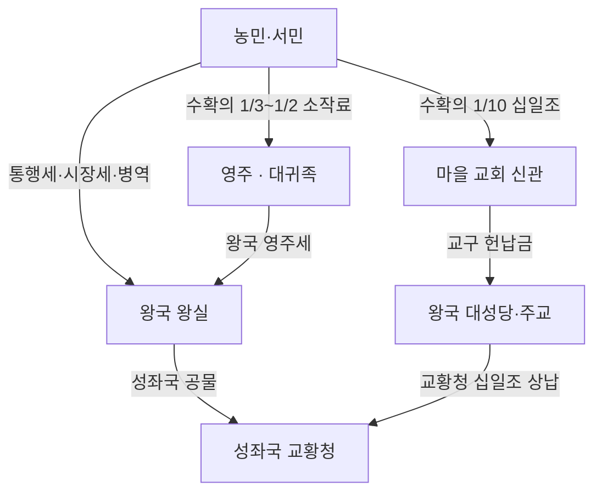

# Elucia 세금·십일조

## 원전 인용 증명

### [필독 1] brainstorm_2026-04-21_worldview_expansion.md:2825 (AI 해석 노트)
> "교회 십일조 · 영주 세금 체계 (질문 큐)"
— brainstorm_2026-04-21_worldview_expansion.md:2825 (세금·십일조 체계 필요 항목으로 명시)

### [필독 2] brainstorm_2026-04-21_worldview_expansion.md:2808 (발언 46 정합)
> "신관 / Ch.09 양심파 / 신관대학 출신 · 마을 교회 파견·각성"
— brainstorm_2026-04-21_worldview_expansion.md:2808 (신관 = 십일조 징수 일선 담당자)

### [필독 3] brainstorm_2026-04-21_worldview_expansion.md:2834 (숨겨진 노트)
> "'어느 마을이나 교회가 있다'의 서사적 무게: 나이트가 인간 사회에 들어갈 때 교회를 피할 수 없음"
— brainstorm_2026-04-21_worldview_expansion.md:2836 (교회 = 마을 세금 행정 일선)

### [필독 4] political_divisions.md:48
> "엘루시아 성좌국 / 교황청 보유 · 대륙 최대 권력"
— political_divisions.md:48 (성좌국 = 십일조 최상위 수취자)

### [필독 5] FAILURES.md:62 (FAIL-002)
> "빈 자리는 (추정) 표기"
— FAILURES.md:62 (세율·세목 상세는 전량 추정 표기)

---

## 요약

Elucia 의 세금 체계는 **왕국 세금**과 **교회 십일조**가 중첩되는 2층 구조다(추정). 농민은 수확의 1/3~1/2를 왕국 영주에게 납부하고, 추가로 교회에 십일조(수확의 1/10)를 납부한다. 성좌국 교황청은 11왕국에서 올라오는 십일조의 일부를 다시 수취하는 3층 구조를 갖는다. 이 과세 구조가 서민의 실제 소득을 극도로 압박하며, 할배의 무료 마법이 그 틈새를 파고드는 배경이 된다.

---

## 1. 세금 체계 전체 구조

---

## 2. 세금 항목별 상세

### 2-1. 소작료 (영주 납부)

| 항목 | 내용 |
|------|------|
| 납부 대상 | 귀족 토지의 소작 농민 전원 |
| 납부액 | 수확의 1/3~1/2 (왕국·지역별 상이 · 추정) |
| 납부 방식 | 현물(밀·보리) or 화폐 혼합 |
| 조정 가능성 | 흉년 시 영주 재량으로 감면 (없는 경우가 많음 · 추정) |

### 2-2. 십일조 (교회 납부)

| 항목 | 내용 |
|------|------|
| 납부 대상 | 교구 내 모든 성인 등록자 |
| 납부액 | 수확·소득의 1/10 |
| 납부 방식 | 현물 우선 · 화폐 병용 |
| 용도 | 교회 유지·신관 급여·병자 구호·교황청 상납 |
| 면제 | 고위 귀족·마법사 길드 (교회와 협약) |

### 2-3. 왕국 과세

| 세목 | 대상 | 내용 |
|------|------|------|
| 통행세 | Via Imperialis 교역상 | 관문 통과 시 물자 가치 2~5% |
| 시장세 | 도시 시장 상인 | 판매액의 1~3% |
| 수공업세 | 길드 가입 장인 | 연간 허가료 + 수입의 일부 |
| 병역 대납세 | 징병 기피 원하는 자 | 은화 일정량 (부유층 활용) |
| 항구세 | 입출항 선박 | 화물 가치의 2~6% |
| 소금세 | 소금 거래상 | 통행·판매 복합 (Ceren 분쟁 소지) |

---

## 3. 이중 과세의 실제 부담 (농민 기준 추정)

| 수확 100% 기준 | 지출 | 잔여 |
|-------------|------|------|
| 소작료 | -40% | 60% |
| 십일조 | -10% | 50% |
| 시장 거래세 | -2~3% | 47% |
| 생활비·씨앗 | -15~20% | 27~32% |
| **실질 가처분** | | **약 27~32%** |

→ 농민의 실질 가처분 소득은 총 수확의 약 1/4~1/3. 흉년 시 아사 위기.

---

## 4. 십일조의 정치 기능

십일조는 단순 종교세가 아니라 **성좌국의 정치 통제 도구**이기도 하다:

- 십일조 납부 거부 = 파문(破門) → 법적 보호 박탈 → 사실상 미등록자와 동일
- 왕국이 십일조 상납을 거부하면 성좌국이 십자군·성전(聖戰) 선포 가능 (추정)
- 타락한 교회는 십일조를 개인 착복에 사용 → 양심파 신관이 이에 저항 (Ch.09 배경)

---

## 5. 할배 무료 마법과 세금 경제 (Q-CORE 2 간접 반영)

서민의 가처분 소득이 극도로 제한된 환경에서:

- 불 피우기 주문 → 땔감 구입비 절감 → 동화 몇 닢 추가 확보
- 식품 보존 주문 → 소금 구입 절감 → 십일조 납부 여력 미미하게 상승
- 우물 정화 주문 → 역병 감소 → 의료비 지출 없음 → 생존율 상승

마을 신관 중 일부는 이 현상을 알아채고 당혹해 한다:
*"십일조 납부율이 올해 이상하게 올랐다. 창고 사정이 나아진 것도 아닌데. 마을 어른 말로는 어떤 노인이 가르쳐준 주문 덕이라고 하는데..."*
— (마을 신관 일지 파편 · 가공 문헌 · 모호 보존)

*Q-CORE 2 구조 직접 서술 금지.*

---

## 6. 집필 활용

> *"Ch.02 마을의 저녁 — 촌장은 올해 십일조 납부 걱정을 털어놓았다. 수확은 나쁘지 않았는데, 귀족 세리가 일찍 왔다. 소작료로 절반, 십일조로 또 열에 하나. 겨울을 버틸 밀이 충분한지 모르겠다고 했다."*

---

## 대표님 미확정 사항 / 질문 큐

- 소작료율 확정 — 1/3? 1/2? 왕국별 상이?
- 십일조 면제 계층 범위 — 귀족 전체? 일부 고위 귀족만?
- 타락한 교회 신관이 십일조를 착복하는 것이 서사에서 드러나는 방식
- 왕국 직접 화폐세 vs 현물세 비율 상세

---

## 다음 Wave 의존 포인트

- **Wave 3 Historian**: 십일조 제도의 역사적 기원 — 어느 시대 성좌국이 도입했는지
- **Wave 3 Diplomat**: 왕국들의 십일조 상납 거부 사례 · 성좌국의 대응 외교 압박
- **Wave 4 Kingdom-Detailer (전 왕국)**: 왕국별 세리 제도·세관·과세 갈등 사건
