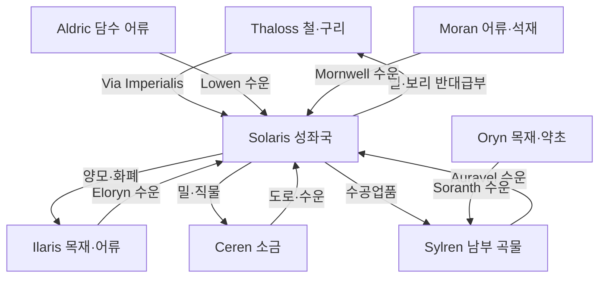

# Elucia 대륙 내 무역 네트워크

## 원전 인용 증명

### [필독 1] brainstorm_2026-04-21_worldview_expansion.md:176 (발언 5)
> "좌측은 강이 많고 풍요로움 ... 하단 주황식은 이어진길이다"
— 발언 5, brainstorm_2026-04-21_worldview_expansion.md:176 (대룩 내 도로 존재 확정)

### [필독 2] political_divisions.md:106–116 (10 권역 표)
> "Aurion / 중앙 평야 / 성좌국 직할 ... Norvend / 북부 산맥 너머 / 탈로스 왕국 ... Loravel / 서남 습지"
— political_divisions.md:106–116 (교역 거점 권역 확정)

### [필독 3] brainstorm_2026-04-21_worldview_expansion.md:2801 (발언 44·46 정합)
> "중세 유럽 봉건 의무병 · 대규모 보병 · 기사 엘리트 장교"
— brainstorm_2026-04-21_worldview_expansion.md:2801 (중세 유럽형 교역 구조 정합)

### [필독 4] brainstorm_2026-04-21_worldview_expansion.md:2869 (발언 48)
> "서쪽은 농업 축산업"
— 발언 48, brainstorm_2026-04-21_worldview_expansion.md:2869 (주요 교역 품목 = 곡물·축산물·광물·목재)

### [필독 5] wiki/design/worldbuilding/elucia/geography/rivers_major_2026-04-22.md (Wave 1 산출)
> "Lowen River ... 동→서 방향 ... 내륙 수운의 동서 축"
— rivers_major_2026-04-22.md:86 (수운 교역 경로 확인)

---

## 요약

Elucia 대륙 내 무역은 두 개의 대동맥 — **Via Imperialis** (성좌국이 관할하는 남북 육상 대로)와 **6대 대하천 수운** — 을 중심으로 조직된다. 광물(Thaloss)·목재(Ilaris·Oryn)·소금(Ceren)·곡물(성좌국·Sylren)·축산물(Aurion·Soranth)이 이 네트워크를 따라 순환하며, 성좌국 Solaris 가 대륙 교역의 허브 역할을 독점한다.

---

## 1. 대륙 내 무역 2대 동맥

### 1-1. Via Imperialis — 성좌국 대로

성좌국이 관리하는 Elucia 최대 육상 교역로(추정). Solaris 를 기점으로 북쪽 Thaloss, 남쪽 Azim Pass 방향, 서쪽 Ilaris 항구를 연결한다.

| 구간 | 거리 (추정) | 주요 물자 |
|------|-----------|---------|
| Solaris → Thaloss 산록 | ~400 km | 밀↑·철↓ |
| Solaris → Azim Pass | ~600 km | 군수물자↑·직물·소금↓ |
| Solaris → Ilaris 항 | ~350 km | 양모↑·선박재↓·어류↓ |
| Solaris → Sylren | ~300 km | 곡물·소 |

### 1-2. 6대 대하천 수운

| 하천 | 수운 구간 | 주요 운반 물자 |
|------|---------|-------------|
| Eloryn | 중류~하구 (500 km) | 성좌국 밀·양모 → Ilaris 항 |
| Auravel | 중류~하구 (400 km) | 남부 곡물·소금 절임 생선 |
| Lowen | 전 구간 (800 km) | Aldric 어류·호수 교역품 |
| Mornwell | 하류~Moran 항 | Moran 석재·어류 |
| Soranth | 하류~남해안 | Oryn 목재·Sylren 곡물 |

---

## 2. 왕국 간 교역 품목 흐름

---

## 3. 성좌국 Solaris 의 교역 허브 독점

Solaris 는 지리적으로 Aurion 평원 중심에 위치하여 모든 교역 동맥이 수렴한다. 성좌국은 이를 활용해:

- **통행세 징수**: Via Imperialis 통과 물자에 성좌국 세관세 부과
- **환전 독점**: 성좌국 주조 금화를 교역 표준 화폐로 강제
- **창고 독점**: 대규모 왕국 창고에서 시세 조절 (풍년 비축·흉년 방출)
- **길드 인증**: 성좌국 통과 교역상에 길드 허가증 요구

이 독점이 성좌국이 군사력이 아닌 **경제력** 으로 왕국들을 통제하는 핵심 기제다.

---

## 4. 교역 품목별 갈등 구조 (Wave 3 Diplomat 참조용)

| 품목 | 공급 왕국 | 수요 왕국 | 갈등 |
|------|---------|---------|------|
| 소금 | Ceren | 전역 | Ceren 소금세 인상 시 전역 분노 |
| 철광 | Thaloss | 전역 | Thaloss 가격 인상 vs 성좌국 강압 구매 |
| 목재 | Ilaris·Oryn | 전역 | 채취권 분쟁·수출 허가 조건 갈등 |
| 밀 | 성좌국 | Thaloss·기타 | 흉년 시 성좌국 독점 배분 → 정치 종속 |
| 양모 | Aurion | 직물 길드 | 성좌국 가격 통제 vs 귀족 목장주 이익 |

---

## 5. 교역과 타종족 (발언 49·50 반영)

발언 49: *"동쪽이 워낙 지형이 험하고 혹독하여 ... 노예시장도 발달함"*

서쪽 Elucia 내 무역 네트워크에서 타종족 관련 교역:
- 서쪽 노예 시장은 동쪽보다 규모 작으나 존재 (slave_economy 파일 상세)
- 타종족 수공예품이 뒷시장에 유통되는 경우 있음 (추정)
- 교회는 타종족과의 교역을 공식 금지하나 실제 단속 한계 (추정)

---

## 대표님 미확정 사항 / 질문 큐

- Via Imperialis 공식 명칭 — 대표님 확정 대기 (현재 작업 가설)
- 성좌국 세관 체계 상세 — 교황청 직할 세관 vs 왕국 위임 세관
- 교역 도중 "왕국 간 전쟁" 발생 시 상인 길드 교역 보호 여부

---

## 다음 Wave 의존 포인트

- **Wave 3 Diplomat**: 교역 조약·통행세 분쟁·전시 교역 보호 협약이 외교 갈등의 핵심 내용
- **Wave 4 Kingdom-Detailer (성좌국)**: Solaris 도시 내 교역 허브 구역 — 창고 지구·환전소·길드 홀 배치
- **Wave 4 Kingdom-Detailer (전 왕국)**: Via Imperialis 구간별 요새·역참(驛站) 도시 위치
