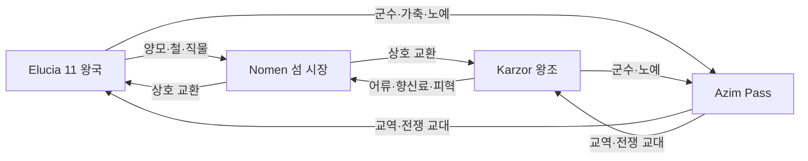

# Elucia 대륙 간 무역 네트워크

## 원전 인용 증명

### [필독 1] brainstorm_2026-04-21_worldview_expansion.md:176 (발언 5) ★
> "이 섬을 놓고 자주싸운다. 좌우대륙이. ... 섬하단의 항구에서 좌우 대륙의 교류 및 상업이 발달, 하지만 반 무법지대로, 자주싸움이 일어난다."
— 발언 5, brainstorm_2026-04-21_worldview_expansion.md:176 (Nomen 항구 = 대륙 간 교역 유일 거점 확정)

### [필독 2] brainstorm_2026-04-21_worldview_expansion.md:176 (발언 5)
> "하단 주황식은 이어진길이다. ... 빨간색 점이 항구(북쪽얼음섬으로가는 유일한길"
— 발언 5, brainstorm_2026-04-21_worldview_expansion.md:176 (Azim Pass = 육로 연결 확정)

### [필독 3] political_divisions.md:21–30
> "노멘 해협 / Strait of Nomen / 두 대륙 사이 좁은 수로 ... 아짐 관문 / Azim Pass / 두 대륙 연결 육로"
— political_divisions.md:21–30 (2대 대륙 간 접점 확정)

### [필독 4] political_divisions.md:28–30
> "노멘 / Nomen / 항구 · 여러 종족 공생 · 해적 무법지 · 북쪽 유일 접근"
— political_divisions.md:28–30 (Nomen 섬 성격 확정)

### [필독 5] brainstorm_2026-04-21_worldview_expansion.md:2869 (발언 48)
> "동쪽은 농업 어업, 서쪽은 농업 축산업"
— 발언 48, brainstorm_2026-04-21_worldview_expansion.md:2869 (대륙 간 교역 = 어류·육류 상호 보완 구조)

---

## 요약

Elucia ↔ Karzor 대륙 간 교역은 두 경로로 이루어진다. **Nomen 섬 하단 항구** (해로·해상 교역)와 **Azim Pass** (육로·지협 교역). Nomen 은 교역 이익을 두고 두 대륙이 쟁탈하는 전략 거점이며, 현재 반무법지대 상태다. Azim Pass 는 군사·물자 이동 육로로서 전쟁 시 격전지가 된다. 동서 교역의 핵심 품목은 **서쪽 양모·직물 vs 동쪽 어류·향신료** 구조로 추정된다(대표님 미확정).

---

## 1. 대륙 간 교역 2대 경로

| 경로 | 유형 | 현 상태 | 제어 주체 |
|------|------|--------|---------|
| **Nomen 항구** | 해상 교역 | 반무법지대 · 쟁탈 중 | 미확정 (Elucia·Karzor 교대 지배) |
| **Azim Pass** | 육상 교역 | 통제 가능하나 분쟁 | 남부 왕국 (Novas·Sabin) |

---

## 2. Nomen 섬 — 교역 전쟁의 무대

### 2-1. 지정학적 가치

발언 5 원문: *"이 섬을 놓고 자주싸운다. 좌우대륙이."*

| 이유 | 내용 |
|------|------|
| 교역 허브 | 동서 대륙 상인이 직접 만나는 유일한 중립 거점 |
| 북쪽 접근 | Veilglass 얼음섬으로 가는 **유일한 항로** 기점 |
| 종족 공생 | 여러 종족이 공생 — 교역 중개자로 활용 |
| 해적 기지 | 반무법지대이므로 양 대륙의 해적이 집결 |

### 2-2. Nomen 내부 경제 구조

| 구역 | 기능 | 지배 세력 |
|------|------|---------|
| 항구 하단 창고지구 | 교역품 하역·보관 | 상인 길드 연합 |
| 시장 구역 | 동서 상품 거래 | 무소속 중개상 |
| 해적 구역 | 약탈품 환전·선박 수리 | 해적 선단 |
| 타종족 구역 | 중간 종족 공동체 | 자치 |

### 2-3. 동서 교역 주요 품목 (추정 · 대표님 미확정)

| 방향 | Elucia → Karzor | Karzor → Elucia |
|------|----------------|----------------|
| 품목 | 양모·직물·철·목재·소금 절임 어류 | 건어물·향신료류·염색 원료·사막 피혁 |
| 가치 | 제조품·가공품 위주 | 원자재·식품 위주 |

*품목 상세는 대표님 미확정 · (추정)*

---

## 3. Azim Pass — 육상 교역·군사 통로

### 3-1. 지리

발언 5 원문: *"하단 주황식은 이어진길이다."*

- 두 대륙 하단을 잇는 지협
- 폭: 약 30~80 km (추정) — 좁을수록 방어 용이
- 양쪽 Azim Narrows 해협이 대형 선박 통행 제한 → 육로가 대량 물자 이동 필수

### 3-2. Azim Pass 교역 구조

| 항목 | 내용 |
|------|------|
| 주요 품목 | 군수물자·가축·곡물·인력(노예) |
| 통행세 | 양쪽 왕국 (Novas·Sabin 직할) 공동 징수 (추정) |
| 위험 | 강도·타종족 세력·군사 차단 |
| 속도 | 말 마차 기준 4~6일 (추정) |

### 3-3. Azim Pass 와 노예 교역

발언 49·50 과 연동:
- 동쪽 Karzor 의 노예가 Azim Pass 를 통해 서쪽 Elucia 로 유입되는 경로 존재 (추정)
- 서쪽에서는 "수입 노예" 를 Ceren·Novas 남부에서 주로 거래 (추정)
- 이 경로가 Wave 3 Diplomat 의 "Azim Pass 통행권 협상" 의 배경

---

## 4. 대륙 간 교역과 전쟁

발언 5 원문: *"좌우 대륙이 자주싸운다."*

전쟁과 교역의 병행은 Elucia 의 구조적 특징이다:
- **평화 시**: Nomen 경유 해상 교역 + Azim Pass 육상 교역 동시 활성
- **전쟁 시**: Nomen 봉쇄·쟁탈 → 해상 교역 차단, Azim Pass 군사 점령
- **결과**: 전쟁이 오히려 Nomen 주변 해적·중간 중개상에게 이익 → 전쟁 지속 유인 구조

---

## 대표님 미확정 사항 / 질문 큐

- Nomen 섬의 현재 실효 지배자 — Elucia 우세? Karzor 우세? 진정한 무주공산?
- Azim Pass 통행 인프라 — 검문소·요새·역참 존재 여부
- 동서 교역에 마법 품목 포함 여부 — 마법 재료·마법 물품 동서 교역 허용 여부

---

## 다음 Wave 의존 포인트

- **Wave 3 Diplomat**: Nomen 쟁탈전의 외교 구조 — 현재 어느 측이 우세한지, 조약 협상 현황
- **Wave 3 Diplomat**: Azim Pass 통행세 협상·노예 교역 조약·전시 중립 조약
- **Wave 4 Kingdom-Detailer (Novas)**: Azim Pass 북단 요새 도시·통관 검문소
