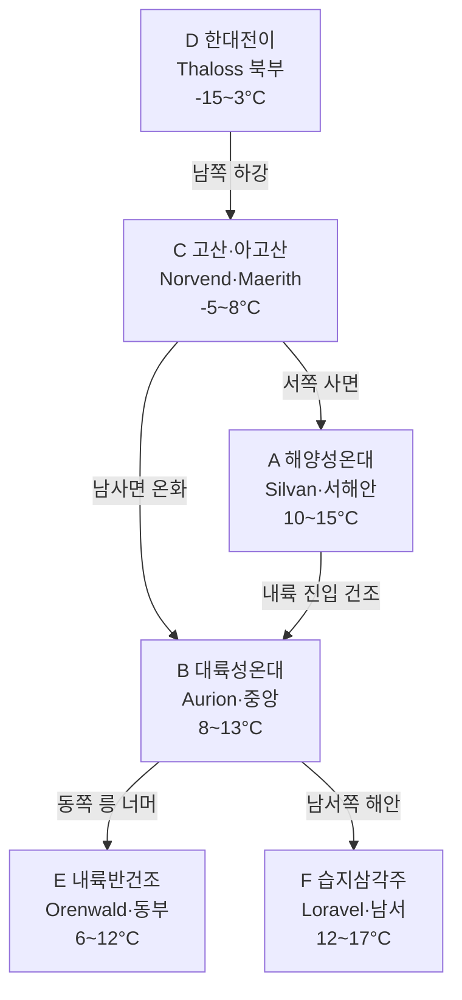

# Elucia 기후대

## 원전 인용 증명

### [필독 1] brainstorm_2026-04-21_worldview_expansion.md:176 (발언 5) ★
> "좌측은 강이 많고 풍요로움, 우측은 강도별로없고 줄기도 짧아서 물이귀하고 사막이 많음"
— 발언 5, brainstorm_2026-04-21_worldview_expansion.md:176

### [필독 2] political_divisions.md:33–36
> "Elucia / 지리: 강 많음 · 풍요 · 녹지 · 북부 산맥"
— political_divisions.md:33–36 (기후 특성 요약 확정)

### [필독 3] political_divisions.md:53–62
> "탈로스 / Thaloss / 북부 산맥 ... 세렌 / Ceren / 서남 습지"
— political_divisions.md:53–62 (극한 기후 양 끝점 왕국)

### [필독 4] brainstorm_2026-04-21_worldview_expansion.md:2932–2962 (발언 49)
> "동쪽이 워낙 지형이 험하고 혹독하여 성격이 조금더 거칠고, 잔인하며"
— 발언 49, brainstorm_2026-04-21_worldview_expansion.md:2932 (Karzor 기후 비교 기준)

### [필독 5] FAILURES.md:56–75
> "대표님 원안과 어긋난 10건 과해석 ... 빈 자리 채우기 경향"
— FAILURES.md:62 (FAIL-002: 기후 설정도 원문 범위 내만 추정)

---

## 요약

Elucia 는 발언 5 원문 "강이 많고 풍요로움" 에 따라 전반적으로 온화·습윤한 대륙이다. 북부는 Norvend 산맥의 영향으로 한랭하고, 서해안은 해양성 온기가 내륙을 데운다. 동부는 Veilorn Ridge 로 인해 대륙성 기후가 강해지며 건조해진다. 6개 기후대로 구분되며, 각 기후대가 왕국 산업·문화·타종족 분포에 직접적 영향을 미친다.

---

## 1. 6개 기후대 개요

| # | 기후대명 | 유형 | 위치 | 연평균기온 (추정) | 연강수량 (추정) | 주요 왕국 |
|---|---------|------|------|--------------|------------|---------|
| A | **해양성 온대** | Oceanic Temperate | 서해안·Silvan 권역 | 10–15°C | 800–1,200mm | Ilaris·Moran·Ceren |
| B | **대륙성 온대** | Continental Temperate | 중앙 Aurion·Soranth | 8–13°C | 500–800mm | 성좌국·Sylren·Vaelin |
| C | **고산·아고산** | Alpine/Subalpine | Norvend 산맥·Thaloss | -5–8°C | 600–1,000mm (주로 설) | Thaloss·Maerith 북부 |
| D | **한대 전이** | Subarctic Transition | Thaloss 북부·Veil Sea 접경 | -15–3°C | 300–500mm | Thaloss 북쪽 끝 |
| E | **내륙 반건조** | Semi-arid Continental | 동부 Orenwald 배후·Duskmoor | 6–12°C | 300–500mm | Oryn·Novas·Maerith 동부 |
| F | **습지·삼각주** | Wetland/Delta | 서남 Loravel·Lonwyn | 12–17°C | 900–1,400mm | Ceren·Aldric |

---

## 2. 각 기후대 상세

### 2-1. A — 해양성 온대 (서해안)

Elucia 가장 온화한 기후대. 서쪽 대해 해류에 의해 온기가 공급되어 겨울이 상대적으로 따뜻하다.

| 항목 | 내용 |
|------|------|
| 여름 | 서늘·안개 잦음. 폭우 가끔 |
| 겨울 | 온화·비. 적설 드묾 (해발 200m 이하) |
| 특이 현상 | 해안 안개 — Silvan 숲 특성. "실반의 안개" |
| 농업 | 목초·감자류·과수 유리. 밀 가능 |
| 영향 왕국 | **Ilaris** (전역), **Moran** (해안부), **Ceren** (서부) |

### 2-2. B — 대륙성 온대 (중앙 평원)

Elucia 인구 최대 집중 기후대. 사계절 뚜렷하며 농업에 최적화.

| 항목 | 내용 |
|------|------|
| 여름 | 따뜻~더움. 뇌우 발생 |
| 겨울 | 한랭. 평균 2–3개월 적설 |
| 강수 | 봄·여름 집중 |
| 농업 | **최적** — 밀·보리·목축 모두 유리 |
| 영향 왕국 | **성좌국** (전역), **Sylren**, **Vaelin** |

### 2-3. C — 고산·아고산 (Norvend 산맥)

Norvend 주맥 및 Maerith 고원 기후대. 인간 정착 한계선 존재.

| 항목 | 내용 |
|------|------|
| 여름 | 단기. 7–8월만 눈 없는 계절 |
| 겨울 | 혹한. 만년설 |
| 통행 | **고개 계절 폐쇄** — 겨울 4–6개월 Ironcleft·Whitecrest 폐쇄 |
| 농업 | **불가** (목초지 한정) |
| 광업 | 가능 (철·구리·희귀광석) |
| 영향 왕국 | **Thaloss** (핵심), **Maerith** (북부) |

### 2-4. D — 한대 전이 (Thaloss 최북부·Veil Sea 접경)

Veil Sea 에 인접한 Elucia 최북단. 인간 거주 한계.

| 항목 | 내용 |
|------|------|
| 여름 | 짧음 (2–3개월). 백야 현상 가능 |
| 겨울 | 극한. -30°C 이하 가능 |
| 통행 | Veil Sea 방향은 영구 불가 |
| 영향 | Thaloss 왕국 방어 최전선 — 인간 군사 거점만 |

### 2-5. E — 내륙 반건조 (동부 Orenwald 배후·Duskmoor)

Veilorn Ridge 동쪽 기류 차단 효과가 줄어드는 경계 지역. 강수량 감소.

| 항목 | 내용 |
|------|------|
| 여름 | 건조·더움 |
| 겨울 | 한랭·눈 |
| 강수 | 연 300–500mm — Elucia 최저 |
| 농업 | 목축 위주. 밀 소량 가능 |
| 타종족 | Orenwald 숲 가장자리 = 은신 가능 |
| 영향 왕국 | **Oryn** (동부), **Novas** (남동), **Maerith** (동부) |

### 2-6. F — 습지·삼각주 (서남부)

서해안과 대하천 하구 삼각주의 독특한 기후.

| 항목 | 내용 |
|------|------|
| 특성 | 안개·습도 높음·소금바람 |
| 여름 | 무더움·습함 |
| 겨울 | 온화 (해양 영향) |
| 농업 | 수경작·어업 |
| 영향 왕국 | **Ceren** (전역), **Aldric** (전역) |

---

## 3. 기후대 분포 다이어그램

---

## 4. 기후와 왕국별 산업

| 왕국 | 기후대 | 주요 산업 |
|------|-------|---------|
| Thaloss | C·D | 광업·목재·목축·군사 방어 |
| Vaelin | B | 곡물·기마·목축 |
| Moran | A | 어업·해안 무역·목재 |
| Ilaris | A | 해상 무역·목재·어업 |
| Ceren | A·F | 소금·어업·습지 이탄 |
| 성좌국 | B | 밀·와인(추정)·대규모 목축 |
| Oryn | B·E | 목재·수렵·약초 |
| Maerith | C·E | 목재·광업·목축 |
| Sylren | B | 밀·보리·목축 |
| Novas | E | 목축·수렵·소규모 곡물 |
| Aldric | F | 담수 어업·소금·수운 |

---

## 5. 기후 이벤트 (서사·게임 활용)

| 이벤트 | 기후대 | 시기 | 서사 영향 |
|--------|-------|------|---------|
| 북방 폭풍 | D·C | 겨울 | Greygate Pass 폐쇄 — Thaloss 고립 |
| 서해안 대안개 | A | 가을 | 항구 마비 — 해적 활동 급증 |
| 봄 홍수 | B·F | 봄 | Auravel·Eloryn 범람 — 농업 위기 |
| 여름 가뭄 | E | 여름 | Oryn·Novas 식수 위기 |
| Loravel 폭우 | F | 여름 | 습지 확장 — 마을 침수 |

---

## 대표님 미확정 사항

- 행성의 달·태양 크기·공전 주기 — 기후 계절에 영향하나 대표님 미확정
- 마력이 기후에 영향하는지 여부 — 세계관상 마력 = 자연력의 일부이나, 기후 조작 마법 수준 미확정
- 정확한 기온·강수량 수치 — 본 문서의 수치는 현실 지구 기후 유추 기반 작업 가설

---

## 다음 Wave 의존 포인트

- **Political-Cartographer (Wave 2)**: 기후대 A(풍요·무역) vs C(고산·고립)·D(한대)가 왕국 권력 격차 원인. 성좌국 B 기후 = 대륙 지배 기반
- **Economist (Wave 2)**: 기후 A·B 농업 잉여 → 제국 세수. 기후 C 광업 → Thaloss 특화 교역
- **Culturalist (Wave 2)**: 기후대별 축제·의복·건축·음식 variation 기준
- **Historian (Wave 3)**: 과거 기후 이벤트(대가뭄·대홍수)가 왕국 흥망에 미친 영향
- **Kingdom-Detailer (Wave 4)**: 각 왕국의 기후 대응 기술(방설 건축·관개·방조제 등) 상세
