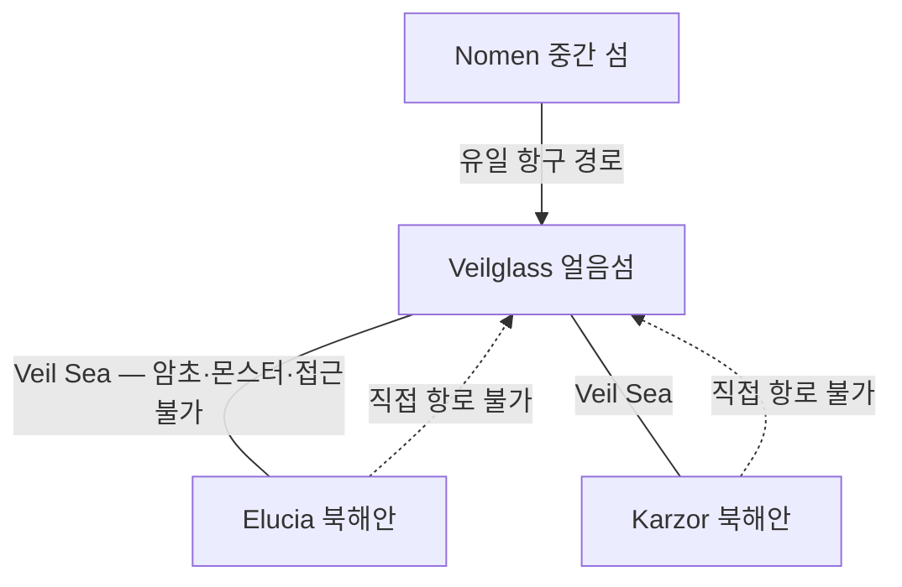

# Elucia 해안선

## 원전 인용 증명

### [필독 1] brainstorm_2026-04-21_worldview_expansion.md:176 (발언 5)
> "북쪽은 얼음섬, 중간에 작은섬이있고 빨간색 점이 항구(북쪽얼음섬으로가는 유일한길, 나머지는 갈수가없다. 대륙윗쪽에서는 좌우 모두 물길이 너무험하고 작은 암초가 많아서 불가능, 몬스터도 많음."
— 발언 5, brainstorm_2026-04-21_worldview_expansion.md:176

### [필독 2] political_divisions.md:21
> "베일해 / Veil Sea / 암초·몬스터·접근 불가"
— political_divisions.md:21 (행성·해역·지형 표)

### [필독 3] political_divisions.md:52–63
> "일라리스 / Ilaris / 서해안 ... 세렌 / Ceren / 서남 습지 ... 모란 / Moran / 북서 ... 알드릭 / Aldric / 남서 호수"
— political_divisions.md:52–63 (서·남 해안 왕국 위치)

### [필독 4] brainstorm_2026-04-21_worldview_expansion.md:235–237 (발언 6)
> "북쪽에는 초고대문명의 유산과 응축된 마석이 매우 많이 매장되어있어 동서대륙간 중앙 작은섬을 차지하려 전쟁중"
— 발언 6, brainstorm_2026-04-21_worldview_expansion.md:237

### [필독 5] brainstorm_2026-04-21_worldview_expansion.md:3015 (발언 50)
> "타종족비율이 서쪽 25%동쪽75%임"
— 발언 50, brainstorm_2026-04-21_worldview_expansion.md:3015

---

## 요약

Elucia 의 해안선은 세 방향으로 구분된다. **서쪽 해안** 은 리아스식 복잡 해안으로 항구와 어항이 집중된다. **북쪽 해안** 은 Veil Sea 에 면한 암초·절벽 지대로 접근이 극히 위험하다. **남쪽·남서 해안** 은 완만한 사구 해안과 삼각주가 발달하며 Azim Pass 방향으로 이어진다. 대륙 동쪽에는 Elucia 의 독립적 해안선이 없고 Veilorn Ridge 동쪽이 Karzor 방향 내해·해협에 접한다.

---

## 1. 해안선 전체 개요

| 구분 | 방향 | 길이 (추정) | 성격 | 접하는 해역 |
|------|------|-----------|------|-----------|
| 서해안 | 대륙 서쪽 | ~1,800 km | 리아스식·복잡 | 서방 대해 (이름 미확정) |
| 북서 해안 | 북서 | ~400 km | 절벽·암초 | Veil Sea 서쪽 접경 |
| 북 해안 | 북부 | ~500 km | 암초·위험 | **Veil Sea** (접근 불가) |
| 남해안 | 남부 | ~600 km | 사구·삼각주 | 남방 해협 |
| 남서 해안 | 남서 | ~300 km | 내만·습지 | Loravel 내만 |

---

## 2. 서쪽 해안 — Silvan Coast 구역

### 2-1. 특성

서해안은 Silvan Brow 구릉이 바다와 만나며 형성된 **리아스식 해안** 이다. 크고 작은 만·곶·반도가 교차하며 자연 항구가 풍부하다. Silvan 숲의 영향으로 해안선 내부까지 수목이 무성하다.

### 2-2. 주요 지형 features

| 지형명 | 유형 | 위치 (권역) | 특성 |
|--------|------|-----------|------|
| **Silvan Cape** | 반도 | Silvan 권역 중부 | Ilaris 왕국 주요 항구 반도 |
| **Mirevane Bay** | 만 | Silvan 권역 북부 | 수심 깊음 · 주력 무역항 후보 |
| **Loravel Delta** | 삼각주 | Loravel 권역 남부 | Ceren 왕국 남쪽 · 습지와 접경 |
| **Westfall Inlet** | 내만 | Silvan·Loravel 경계 | 조석 간만차 큼 |
| **Aldric Spit** | 모래톱 | Lonwyn 권역 남서 | Aldric 왕국 내만 형성 · 어업 기지 |
| **Mornhaven Cliff** | 절벽 해안 | Havren 권역 북서 | 높이 50–120m 절벽 · 방어에 유리 |

### 2-3. 항구 분포 (발언 5 "빨간색 점 항구" 반영)

발언 5 원문: *"빨간색 점이 항구"* (중간 섬 Nomen 항구 기준). 서해안에도 복수의 왕국 항구 존재:

| 항구 위치 (추정) | 소속 왕국 | 특성 |
|----------------|---------|------|
| Silvan Cape 안쪽 만 | Ilaris | 주요 무역항 |
| Loravel Delta 북단 | Ceren | 하천 하구 항 |
| Mornhaven 절벽 북쪽 만 | Moran | 어항·군항 |
| Lonwyn 내만 | Aldric | 호수·해안 복합 항 |

---

## 3. 북쪽 해안 — Veil Sea 접경 구역

### 3-1. 특성 (발언 5 원문 엄수)

발언 5: *"대륙윗쪽에서는 좌우 모두 물길이 너무험하고 작은 암초가 많아서 불가능, 몬스터도 많음."*

| 항목 | 내용 |
|------|------|
| 접하는 해역 | **Veil Sea** (베일해) |
| 통항 가능 여부 | **불가** — 암초·몬스터·험한 물길 3중 장벽 |
| 절벽 높이 | ~80–300m (Norvend Range 사면이 바다와 직접 충돌) |
| 상업적 기능 | **없음** |
| 군사적 위협 | 자연 방벽으로 외부 침입 불가 (역으로 방어 이점) |

### 3-2. Veil Sea 의 의미

Veil Sea 는 Elucia 북해안과 Veilglass 섬 사이를 가로막는 해역이다. 북쪽 얼음섬 Veilglass 로 가는 유일한 경로는 **중간 섬 Nomen 의 항구** 를 통해서만 가능하다. 이것이 Nomen 을 두 대륙이 쟁탈하는 핵심 이유다.

---

## 4. 남쪽 해안 — Azim Pass 방향

### 4-1. 특성

남쪽 해안은 Azim Pass 가 위치한 지협으로 이어진다. 대체로 완만한 사구 해안과 하천 삼각주가 발달하며, 내만에서 연안 교역이 활발하다.

| 지형명 | 유형 | 위치 | 특성 |
|--------|------|------|------|
| **Soranth Estuary** | 하구 | Soranth 권역 남단 | 남부 대하천 합류 하구 |
| **Dusk Cape** | 곶 | Duskmoor 권역 남동 | 연안 어업 기지 |
| **Azim Narrows** | 지협 해협 | 남부 통행로 양쪽 | 두 대륙 사이 좁은 수로 |
| **Novas Shallows** | 얕은 여울 | Novas 남쪽 | 연안 어업·소형 선박만 통행 |

### 4-2. Azim Pass 지협 해안

발언 5: *"하단 주황식은 이어진길이다"*

Azim Pass 는 두 대륙이 육로로 연결되는 **남부 지협** 이다. 이 지협 양쪽에 좁은 해협(Azim Narrows)이 있으며, 해협 폭은 최소 약 30–80 km (추정). 조류가 강하고 모래 여울이 많아 대형 선박의 통행은 어렵다.

---

## 5. 해안선과 왕국 분포 관계

| 왕국 | 해안 접면 | 해양 의존도 | 주요 해안 특성 |
|------|---------|-----------|--------------|
| Ilaris | 서해안 (Silvan 권역) | **높음** | 무역항·어업·숲 해안 |
| Ceren | 서남 해안·내만 | 높음 | 삼각주·습지·소금 |
| Moran | 북서 해안 | 중간 | 절벽 어항·방어항 |
| Aldric | 남서 내만 | 높음 | 호수·연안 복합 |
| Novas | 남동 해안 | 중간 | 연안 어업·방어 |
| Vaelin | 북서 구릉 해안 일부 | 낮음 | 내륙 지향 |
| Thaloss | 북해안 (Veil Sea 접경) | **없음** | 항행 불가 — 군사 방벽만 |

---

## 6. 전설 층위 (Q-CORE 간접 단서)

- Veil Sea 의 암초군 중 **"가장 깊은 곳에 무언가가 잠들어 있다"** 는 항해사 전설이 Nomen 의 술집에서 전해진다. (대표님 미확정 — 모호 보존)
- Silvan Cape 서쪽 바다에 **"달 없는 밤에만 보이는 불빛"** 이 있다는 Ilaris 어민 구전이 있다. 교회는 이를 이단적 미신으로 금지하고 있다. (타종족 은신 복선 — 해석 금지)

---

## 대표님 미확정 사항

- 서방 대해(서쪽 바다)의 공식 이름 — 현재 미명명. Toponymist 담당
- 주요 무역항의 구체적 이름·위치 — Wave 4 Kingdom-Detailer 담당
- Azim Narrows 해협 폭·조류 상세 — 대표님 미확정
- 대륙 동쪽 해안(Orenwald 동쪽)이 내해에 접하는지, 대양에 접하는지 미확정

---

## 다음 Wave 의존 포인트

- **Political-Cartographer (Wave 2)**: 서해안 항구 왕국(Ilaris·Ceren·Aldric)이 해양 동맹 축 후보. Veil Sea = Thaloss 의 자연 방어 자산
- **Road-Engineer (Wave 2)**: 서해안 무역항들을 연결하는 해안 도로 필요. Azim Pass 남부 도로 기점
- **Economist (Wave 2)**: 서해안 어업·무역항이 Elucia 풍요의 해양 기반. Silvan Cape 항구 = 제국 외항 후보
- **Culturalist (Wave 2)**: 서해안 해양 문화(Ilaris·Ceren)와 내륙 문화(Vaelin·Thaloss) 대비
- **Toponymist (Wave 2)**: 서방 대해 이름, 만·곶·반도 지명 체계 수립 필요
