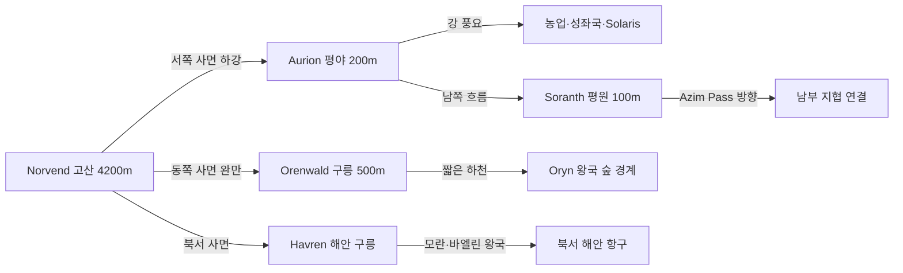

# Elucia 고도 프로필 및 지형 Features

## 원전 인용 증명

### [필독 1] brainstorm_2026-04-21_worldview_expansion.md:176
> "이게 내가 그린맵, 내가 보는방향에서 좌측이 서구중세문명, 우측이 이슬람과비슷한 문명 하늘색이 강인데, 보시다시피 좌측은 강이 많고 풍요로움, 우측은 강도별로없고 줄기도 짧아서 물이귀하고 사막이 많음, 하단 주황식은 이어진길이다."
— 발언 5, brainstorm_2026-04-21_worldview_expansion.md:176

### [필독 2] political_divisions.md:33–35
> "Elucia / 지리: 강 많음 · 풍요 · 녹지 · 북부 산맥 / 정치: 1 성좌국 (교황청 보유) + 10 왕국"
— political_divisions.md:33–35

### [필독 3] political_divisions.md:107–116
> "Norvend / 노르벤드 / 북부 산맥 너머 / 탈로스 왕국 ... Silvan / 실반 / 서해안 숲 / 일라리스 왕국 ... Orenwald / 오렌왈드 / 동부 숲 / 오린 왕국"
— political_divisions.md (10 권역 표):107–116

### [필독 4] game_setting_complete_2026-04-21.md:147–167
> "[시대 2] 마력 극한 응집 → 첫 번째 마족 = 마왕 탄생 ... 마력 응집 수정 제작 · 마족 증식 체계 구축"
— game_setting_complete_2026-04-21.md:147–167 (지각 지형 형성의 전설적 배경)

### [필독 5] brainstorm_2026-04-21_worldview_expansion.md:3013–3025
> "노예시장이 활발한 이유는 지형이 험하고 혹독한 지역이 많아 인적이 없는 지역이 많아서 타종족이 숨어살고있는경우가 많은 타종족비율이 서쪽 25%동쪽75%임"
— 발언 50, brainstorm_2026-04-21_worldview_expansion.md:3015

---

## 요약

Elucia 대륙은 총면적 약 2.8M km², 남북 약 2,200 km, 동서 약 1,400 km 의 타원형 대륙이다. 고도 골격은 북부 Norvend 주산맥과 동쪽 경계 산맥이 이루는 **U자형 산악 울타리**, 그리고 그 내부를 채우는 **중앙·서부 저지 평야** 구조다. 서쪽이 완만하고 강수가 풍부하며 동쪽으로 갈수록 고도가 높아진다. 이 고도 구조가 서쪽의 풍요(강 多)와 동쪽 내륙의 상대적 건조를 만들어낸다.

---

## 1. 대륙 스케일 개요

| 항목 | 수치 | 비고 |
|------|------|------|
| 총면적 | ~2.8M km² | 서유럽(~3.7M) 근사 |
| 남북 길이 | ~2,200 km | 이베리아 반도~스칸디나비아 북단 수준 |
| 동서 길이 | ~1,400 km | 서부 해안~동부 Orenwald 동쪽 경계 |
| 형태 | 타원형 (북남 장축) | 북부 Veilglass 방향, 남부 Azim Pass 방향 |
| 최고점 | Norvend 주봉 Icehelm (~4,200m) (추정) | 북부 Thaloss 왕국 접경 |
| 최저점 | Loravel 습지 해수면 ~15m | 서남 해안 접경 |
| 평균 고도 | ~350m | 중앙 평야 기준 |

---

## 2. 고도 구역 분류

```
고도(m)
4000+ ┤ ████ Norvend 주봉군 (Thaloss 왕국)
3000  ┤ ███  Norvend 부봉 · Maerith 고지
2000  ┤ ██   동부 Orenwald 배후 산릉
1500  ┤ ██   서부 Silvan 배후 구릉
1000  ┤ █    Auryn 고원 (북동, 마에리스)
 500  ┤ ░░   중앙 Aurion 평야 기반
 200  ┤ ░    Soranth · Lonwyn 저평야
  50  ┤ ~    Loravel 습지 · 서해안 저지
  0m  ┼──────────────────────────────── 해수면
```

---

## 3. 5개 고도 지대 상세

| 지대 | 고도 범위 | 위치 | 지형 특성 | 왕국/권역 |
|------|-----------|------|----------|----------|
| **Ⅰ 고산대** | 2,500m+ | 북부 Norvend 주맥 | 설원·빙하·암벽·만년설 | Thaloss (Norvend 권역) |
| **Ⅱ 산악대** | 800–2,500m | Norvend 사면·Maerith 고원·Orenwald 배후 릉 | 침엽수림·암반 계곡·폭포 | Thaloss·Maerith·Oryn |
| **Ⅲ 구릉대** | 200–800m | Havren 북서 구릉·Silvan 배후·Duskmoor 구릉 | 활엽수림·방목지·산지 마을 | Moran·Vaelin·Ilaris·Novas |
| **Ⅳ 평야대** | 50–200m | 중앙 Aurion·남부 Soranth | 밀·보리 경작지·대규모 목축 | 성좌국·Sylren |
| **Ⅴ 저지대** | 0–50m | 서해안·Loravel 습지·Lonwyn 호수 분지 | 습지·범람원·삼각주·항구 | Ilaris·Ceren·Aldric |

---

## 4. 주요 지형 Features

### 4-1. 분수령 (Drainage Divide)

대륙의 주요 분수령은 **Norvend 산맥 능선** 과 **동부 능선** 이 교차하는 지점에서 형성된다.

- **서사면 분수령**: Norvend 서쪽 사면 → 다수 강이 서쪽·남쪽으로 흘러 대서양 성격 해안 유입 → 서쪽 풍요의 지리적 근원
- **동사면 분수령**: Norvend·동부 릉 동쪽 → 짧은 하천이 동쪽으로 흘러 Orenwald 숲에서 소멸 → 물이 서쪽으로 집중됨

### 4-2. 내부 분지 (Basins)

| 분지명 | 위치 | 면적 (추정) | 특성 |
|--------|------|------------|------|
| **Aurion Basin** | 대륙 중앙 | ~180,000 km² | 제국 심장부·풍요 곡창 |
| **Lonwyn Basin** | 남서 | ~40,000 km² | 알드릭 호수군·담수 |
| **Loravel Lowland** | 서남 | ~25,000 km² | 습지·세렌 왕국 |
| **Duskmoor Plateau** | 남동 | ~30,000 km² | 노바스 왕국 구릉 분지 |

### 4-3. 반도 및 곶

- **Silvan Cape** (서해안 중부): 일라리스 왕국 주요 반도. 서해안 숲 Silvan 의 서쪽 끝
- **Havren Headland** (북서 해안): 모란 왕국 북쪽. 험한 절벽 해안. 어업 기지
- **Lonwyn Spit** (남서): 알드릭 왕국의 장형 모래톱. 내만 형성

### 4-4. 전략 고지 (은신·방어 지형 — 발언 8·50 반영)

발언 8: *"타종족은 주변 작은 섬들이나 대륙의 가장자리의 밀림이나 숲, 사막한가운데서 숨어서 생활한다."*

| 은신 지형 | 위치 | 고도 | 타종족 은신 가능성 |
|-----------|------|------|------------------|
| Norvend 고산 동굴대 | 북부 Thaloss | 1,500–3,000m | 높음 — 인간 도달 불가 |
| Silvan 深林 저지 | 서해안 Ilaris | 50–300m | 높음 — 울창한 해안 숲 |
| Orenwald 東林 | 동부 Oryn | 300–1,000m | 높음 — 광대한 침엽·활엽 혼합 |
| Loravel 습지 깊이 | 서남 Ceren | 0–50m | 중간 — 수심 지대 접근 불가 |
| Duskmoor 협곡 | 남동 Novas | 200–600m | 중간 — 복잡한 구릉 지형 |

---

## 5. 고도와 문명 분포의 관계



---

## 6. 전설 층위 (Q-CORE 간접 단서)

*다음은 이 행성의 실제 역사 구조를 직접 서술하지 않고, 인간 사회에 전해지는 구전·전설 형태의 간접 단서로만 기록한다.*

- Norvend 최고봉 Icehelm 정상에는 **"태초의 화염이 식어 굳은 바위"** 라는 전설이 있다. 현지 인간은 "신이 하늘에서 불꽃을 던져 산이 솟았다" 고 믿으나, 일부 엘프 구전은 이를 *"태초 응집의 마지막 잔재"* 라 부른다. (Q-CORE 간접 단서 — 구체적 해석 금지)
- Loravel 습지 최심부에 **"아무도 가 본 적 없는 돌 원형 구조물"** 이 있다는 어부 전설이 있다. (초고대문명 미확정 보존)

---

## 대표님 미확정 사항

- Norvend 최고봉의 구체적 이름·고도 수치 — 본 문서의 `Icehelm 4,200m` 는 작업 가설·(추정)이며 대표님 확정 대기
- 동부 Orenwald 배후 산릉의 공식 명칭 — 현재 "동부 능선 (Eastern Ridge)" 로 임시 표기
- 대륙 주변 소도(小島) 개수·위치 상세 — 발언 5 "각종 숨은 보스·던전" 대상, 개수 미확정
- Norvend 이외 추가 고산 지형 존재 여부

---

## 다음 Wave 의존 포인트

- **mountain_ranges (다음 파일)**: 이 고도 프로필이 Norvend 주맥·부맥 위치의 기준 지도 역할
- **Political-Cartographer (Wave 2)**: Norvend 산맥이 Thaloss–Vaelin 국경 자연 경계 후보, 동부 릉이 Oryn–Maerith 경계 후보
- **Road-Engineer (Wave 2)**: 고도 Ⅲ 구릉대가 주요 도로 우회 제약 구간, Azim Pass 방향 남부 저지가 대동맥 도로 후보
- **Economist (Wave 2)**: 고도 Ⅳ 평야대 Aurion Basin이 제국 경제 핵심, 고도 Ⅰ·Ⅱ 산악대는 광업 지대
- **Culturalist (Wave 2)**: 고도별 기후·문화 variation 기준 (산악 — 목축·채광·폐쇄, 평야 — 농업·개방, 습지 — 어업·신비)
