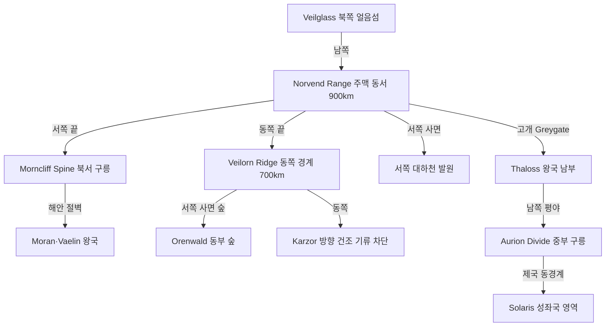

# Elucia 산맥 체계

## 원전 인용 증명

### [필독 1] brainstorm_2026-04-21_worldview_expansion.md:176 (발언 5)
> "이게 내가 그린맵, 내가 보는방향에서 좌측이 서구중세문명, 우측이 이슬람과비슷한 문명 하늘색이 강인데, 보시다시피 좌측은 강이 많고 풍요로움"
— 발언 5, brainstorm_2026-04-21_worldview_expansion.md:176

### [필독 2] political_divisions.md:107
> "Norvend / 노르벤드 / 북부 산맥 너머 / 탈로스 왕국"
— political_divisions.md:107 (10 권역 표, Norvend 확정 지명)

### [필독 3] political_divisions.md:53–62
> "탈로스 / Thaloss / 북부 산맥 ... 마에리스 / Maerith / 북동 고지 ... 오린 / Oryn / 동부 숲"
— political_divisions.md:53–62 (왕국 위치, 산맥과 직접 관련 3왕국)

### [필독 4] brainstorm_2026-04-21_worldview_expansion.md:302–313 (발언 8)
> "타종족은 주변 작은 섬들이나 대륙의 가장자리의 밀림이나 숲, 사막한가운데서 숨어서 생활한다."
— 발언 8, brainstorm_2026-04-21_worldview_expansion.md:304

### [필독 5] FAILURES.md:91
> "Bash 도구 안에서 `cd` 금지. 모든 경로는 절대경로로."
— FAILURES.md:91 (FAIL-003 교훈, 작업 원칙 재확인)

---

## 요약

Elucia 대륙의 산맥은 **북부 주산맥 Norvend Range** 를 골격으로, **동부 경계 릉 Veilorn Ridge**, **서북 해안 릉 Morncliff Spine**, **중부 분수 릉 Aurion Divide** 등 총 2 주맥 + 5 부맥으로 구성된다. Norvend 는 북부를 가로막는 거대한 장벽이며, Veilorn 은 동쪽 Orenwald 와 Karzor 방향을 분리하는 경계 릉이다. 이 두 주맥이 Elucia 의 강 분포와 기후를 결정하는 핵심이다.

---

## 1. 주산맥 체계

### 1-1. Norvend Range (노르벤드 산맥) — 주맥 1

| 항목 | 내용 |
|------|------|
| 방향 | 동서 주행, 대륙 북부 횡단 |
| 길이 | ~900 km |
| 폭 | 평균 80~150 km |
| 최고봉 | **Icehelm Peak** ~4,200m (추정) |
| 위치 | Thaloss 왕국(Norvend 권역) 북부 |
| 역할 | 북부 한기 차단, 서쪽 강 발원지, 북쪽 Veilglass 방향 접근 장벽 |

**주요 봉우리**:

| 봉우리 | 고도 (추정) | 특성 |
|--------|-----------|------|
| Icehelm Peak | ~4,200m | 최고봉 · 만년설 · Thaloss 성지 |
| Veldgar Horn | ~3,800m | 서쪽 능선 끝 · 암벽 등반 불가 |
| Embervane | ~3,400m | 중앙 봉 · 활화 잔재 전설 |
| Stonecrown | ~3,100m | 동쪽 끝봉 · Maerith 고원과 연결 |

**고개 (Pass)**:

| 고개명 | 고도 (추정) | 위치 | 용도 |
|--------|-----------|------|------|
| **Greygate Pass** | ~1,600m | Norvend 서쪽 1/3 | Thaloss ↔ Vaelin·Moran 주요 통로 |
| **Ironcleft Pass** | ~2,100m | Norvend 중앙 | 군사 요충 · 겨울 폐쇄 |
| **Whitecrest Saddle** | ~1,900m | Norvend 동쪽 | Thaloss ↔ Maerith |

---

### 1-2. Veilorn Ridge (그레이베일 릉) — 주맥 2

| 항목 | 내용 |
|------|------|
| 방향 | 남북 주행, 대륙 동쪽 경계 |
| 길이 | ~700 km |
| 폭 | 평균 40~80 km |
| 최고봉 | **Veilhorn** ~2,600m (추정) |
| 위치 | Oryn 왕국(Orenwald 권역) 동쪽 경계 |
| 역할 | Karzor 방향 건조 기류 차단, Orenwald 숲 수분 보존, 동부 경계 |

**이 릉이 서쪽 풍요의 2차 방벽**: Norvend 가 북방 한기를 막고, Veilorn 이 동쪽 건조 기류를 막아 Elucia 내부에 수분이 집중된다.

---

## 2. 부산맥·구릉 체계 (5개)

| 부맥명 | 위치 | 길이 | 최고점 (추정) | 관련 왕국 |
|--------|------|------|-------------|---------|
| **Morncliff Spine** (모른클리프 릉) | 북서 해안 구릉 | ~350 km | ~1,100m | Moran·Vaelin (Havren 권역) |
| **Aurion Divide** (오리온 분수 릉) | 중앙 평야 동편 구릉 | ~280 km | ~650m | 성좌국 동쪽 경계 |
| **Loravel Rim** (로라벨 림) | 서남 습지 배후 구릉 | ~200 km | ~500m | Ceren (Loravel 권역) |
| **Duskfell Range** (더스크펠 릉) | 남동 구릉 | ~300 km | ~800m | Novas (Duskmoor 권역) |
| **Silvan Brow** (실반 브로우) | 서해안 숲 배후 낮은 릉 | ~220 km | ~400m | Ilaris (Silvan 권역) |

---

## 3. 산맥 전체 배치도

---

## 4. 산맥별 자원·전략 가치

| 산맥 | 광물 자원 | 전략 가치 | 타종족 은신 가능성 |
|------|----------|---------|-----------------|
| Norvend Range | 철광·구리·희귀 광석(추정) | 북방 방벽·고개 통제 | **매우 높음** — 고산 동굴대 |
| Veilorn Ridge | 석재·점토 | 동부 국경 방어선 | **높음** — 숲 접경 협곡 |
| Morncliff Spine | 해안 석재·소금 | 항구 방어 절벽 | 낮음 — 접근 쉬움 |
| Aurion Divide | 점토·석회암 | 제국 동쪽 완충 구릉 | 낮음 — 인간 정착 多 |
| Loravel Rim | 이탄·이회암 | 세렌 왕국 내부 경계 | 중간 — 습지 접경 |
| Duskfell Range | 석탄(추정)·흑요석 | 남동 국경 구릉 요충 | 중간 — 복잡 협곡 |
| Silvan Brow | 목재·수지 | 서해안 숲 배후 보호 | **높음** — 울창 숲 접경 |

---

## 5. 전설 층위 (Q-CORE 간접 단서)

*구조적 진실 직접 서술 금지. 인-월드 전설 · 구전만 기록.*

- Norvend 최고봉 Icehelm 은 **"태초에 하늘과 땅이 충돌한 자리"** 라는 전설이 Thaloss 민간에 전해진다. 산기슭 드워프 구전(현재 은신 중)은 이를 *"태초의 응집이 남긴 마지막 기둥"* 이라 부른다고 전해지나, 공식 교회 기록은 없다. (Q-CORE 간접 단서)
- Veilorn Ridge 동쪽 협곡 중 하나에 **"어느 시대에도 인간이 정착하지 못한 골짜기"** 가 있다는 Oryn 왕국 어부 전승이 있다. (타종족 은신 지형 복선 — 대표님 확정 전까지 열린 상태)

---

## 대표님 미확정 사항

- Norvend Range 각 봉우리 공식 이름 — 본 문서의 이름들은 작업 가설·(추정). 대표님 확정 대기
- Veilorn Ridge 의 공식 인식 여부 — 인간 사회에서 이 릉을 "동쪽 경계"로 인지하는지, 이름이 있는지 미확정
- 고개의 계절별 개폐 상세 (겨울 완전 폐쇄 여부)
- Norvend 산맥 북쪽 사면이 Veilglass 방향 바다와 접하는지, 평야를 거쳐 접하는지 미확정

---

## 다음 Wave 의존 포인트

- **Political-Cartographer (Wave 2)**: Norvend Range → Thaloss·Vaelin·Moran 자연 국경선. Veilorn Ridge → Oryn·Maerith 동쪽 경계. Greygate Pass → 전략 거점 도시 위치 결정
- **Toponymist (Wave 2)**: 이 문서의 봉우리·고개 이름들(Icehelm, Greygate 등)은 작업 가설. Toponymist 가 세계관 네이밍 체계에 맞춰 최종 확정
- **Road-Engineer (Wave 2)**: Greygate Pass(1,600m)·Ironcleft Pass(2,100m)·Whitecrest Saddle(1,900m) 이 북부 도로망의 결절점
- **Economist (Wave 2)**: Norvend 철광·희귀 광석 → 광업 왕국 Thaloss 의 경제 기반
- **Culturalist (Wave 2)**: Norvend 고산 문화(Thaloss 폐쇄·강인·광산) vs 동부 릉 문화(Oryn 신비·숲·고립) 분화 기준
