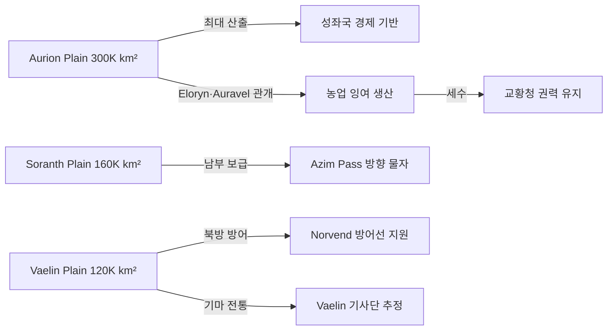

# Elucia 초원·평원

## 원전 인용 증명

### [필독 1] brainstorm_2026-04-21_worldview_expansion.md:176 (발언 5)
> "좌측은 강이 많고 풍요로움"
— 발언 5, brainstorm_2026-04-21_worldview_expansion.md:176 (풍요 = 광대한 평원·곡창 전제)

### [필독 2] political_divisions.md:106–116
> "Aurion / 오리온 / 중앙 평야 / 성좌국 직할 · Solaris ... Soranth / 소란스 / 남중앙 평원 / 실렌 왕국"
— political_divisions.md:106–116 (Aurion·Soranth 평원 권역 확정)

### [필독 3] political_divisions.md:53
> "바엘린 / Vaelin / 북부 평원"
— political_divisions.md:53 (Vaelin = 북부 평원 왕국 확정)

### [필독 4] brainstorm_2026-04-21_worldview_expansion.md:2900–2913 (발언 48)
> "서쪽 대평원 축산: Elucia 중앙·남부 (Aurion·Soranth·Lonwyn) 대규모 목축"
— brainstorm_2026-04-21_worldview_expansion.md:2902 (서쪽 축산업 확정)

### [필독 5] brainstorm_2026-04-21_worldview_expansion.md:3015 (발언 50)
> "타종족비율이 서쪽 25%동쪽75%임"
— 발언 50, brainstorm_2026-04-21_worldview_expansion.md:3015

---

## 요약

Elucia 평야는 대륙 중앙 **Aurion 대평원**, 남중앙 **Soranth 평원**, 북부 **Vaelin 평원** 의 세 핵심 평원으로 구성된다. 총 면적 약 600,000 km² 로 대륙 면적의 21%를 차지한다. 이 평원들이 발언 5 "강이 많고 풍요로움" 의 경제 기반이며, 농업(곡물)과 목축업이 동시에 발달한다. 평원 동쪽 가장자리는 초원·구릉으로 전이되며, 이 지대가 오크 등 타종족의 은신 경계 구역과 인접한다.

---

## 1. 3대 핵심 평원 개요

| 평원명 | 위치 | 면적 (추정) | 고도 | 주요 왕국 |
|--------|------|-----------|------|---------|
| **Aurion Plain** (오리온 대평원) | 중앙 대륙 | ~300,000 km² | 80–200m | 성좌국 직할 |
| **Soranth Plain** (소란스 평원) | 남중앙 | ~160,000 km² | 50–150m | Sylren 왕국 |
| **Vaelin Plain** (바엘린 평원) | 북부 | ~120,000 km² | 100–250m | Vaelin 왕국 |

---

## 2. 각 평원 상세

### 2-1. Aurion Plain (오리온 대평원) — 제국의 심장

Elucia 최대의 평원. 성좌국 수도 Solaris 가 이 평원 중앙부 Eloryn 강안에 위치한다(추정). Auravel·Eloryn 두 대하천이 이 평원을 관개하여 극도로 비옥하다.

| 항목 | 내용 |
|------|------|
| 주요 작물 | 밀·보리·귀리·호밀 (추정) |
| 축산 | 양·소 대규모 목축 (발언 48 "서쪽 대평원 축산" 반영) |
| 지표면 | 심층 검은 토양 (충적토) · 배수 양호 |
| 거주 밀도 | **최고** — 성좌국 직할 최대 인구 집중 |
| 군사 | 개방 지형 — 기병 전술 유리 · 방어선은 강에 의존 |

**생산력 추정**:

| 산업 | 규모 | 특성 |
|------|------|------|
| 밀 생산 | 대륙 전체의 40–50% | Eloryn 관개 기반 |
| 양 목축 | 대륙 최대 | 양모·양고기 수출 원천 |
| 포도 재배 | 강안 경사지 | 성좌국 와인 (추정) |

### 2-2. Soranth Plain (소란스 평원) — 남부 곡창

Sylren 왕국이 지배하는 남중앙 평원. Auravel 강 하류와 Soranth 강이 교차하여 관개된다. Aurion 평원보다 기온이 높아 다양한 작물 재배 가능.

| 항목 | 내용 |
|------|------|
| 주요 작물 | 밀·옥수수류·콩류·기름작물 (추정) |
| 축산 | 소·말 (남부 기마 문화 연관 — 추정) |
| 지표면 | 충적토·사질 토양 혼재 |
| 거주 밀도 | 높음 — Sylren 왕국 인구 기반 |
| 전략 | Azim Pass 방향 물자 보급 기지 |

### 2-3. Vaelin Plain (바엘린 평원) — 북부 전초 평원

Vaelin 왕국의 평원. Norvend 산맥 남쪽에 위치해 북방 한기의 영향을 일부 받는다. Mornwell 강과 Eloryn 강 상류가 이 평원의 수계 기반.

| 항목 | 내용 |
|------|------|
| 주요 작물 | 귀리·보리·순무·아마 (추정, 서늘한 기후 대응) |
| 축산 | 말·소 (Vaelin 기마 문화 기반 — 추정) |
| 특성 | 겨울 3–4개월 혹한. 북부 방어선 역할 |
| 전략 | Norvend 고개들(Greygate 등)을 통해 북방 감시 |

---

## 3. 초원 지대 (평원-구릉 전이 구역)

평원과 구릉의 전이 지역에 **초원 지대** 가 형성된다. 이 지대는 경작보다 목축에 적합하며, 특히 **오크 집단의 행동 영역** 과 가장 인접하는 구역이다.

| 초원 지대 | 위치 | 면적 (추정) | 특성 |
|---------|------|-----------|------|
| **Duskmoor Steppe** | Duskmoor 권역 Novas 왕국 | ~45,000 km² | 구릉성 초원 · 오크 인접 가능 |
| **Eastern Fringe** | Aurion 동쪽 경계 | ~30,000 km² | Aurion Divide 서쪽 사면 초원 |
| **Lonwyn Meadow** | Aldric 왕국 호수 주변 | ~15,000 km² | 호수 주변 습초원 |
| **Vaelin Steppe-North** | Vaelin 북쪽 경계 | ~20,000 km² | 산맥 전면 초원 · 방목지 |

---

## 4. 평원과 정치 구조

---

## 5. 타종족과 평원

발언 8 원문: *"타종족은... 대륙의 가장자리의 밀림이나 숲, 사막한가운데서 숨어서 생활한다."*

Elucia 25% 타종족 중 평원은 은신 지형으로 부적합하나, 평원 **가장자리 초원** 은 다르다:

- **Duskmoor Steppe**: 발언 8 에 없는 "초원" 지형 — outline Ch.17 "초원의 결투·오크 합류" 와 연결 가능. 오크 = 초원 인접 부족 가능성 (대표님 미확정 · 추정)
- **Eastern Fringe**: 성좌국 동쪽 경계 초원 — 교회 순찰 한계선. 이 너머가 타종족 은신 가능 구역 시작

---

## 대표님 미확정 사항

- 평원 내 곡물 종류 구체적 확정 — 중세 유럽형 작물 vs 판타지 고유 작물 대표님 미확정
- 오크의 주 활동 영역이 Duskmoor Steppe 인지, 다른 초원인지 — outline Ch.17 과의 연계 대표님 확정 대기
- 평원에서의 기사·기마병 문화 상세 — 군사 제도 未확정
- Vaelin Plain 과 성좌국 영역의 경계선 상세 — Political-Cartographer 담당

---

## 다음 Wave 의존 포인트

- **Political-Cartographer (Wave 2)**: Aurion Plain 이 성좌국 직할의 핵심. Soranth 이 Sylren 경제 기반. 평원 왕국들 국경선은 강·구릉이 아닌 **관행적 경계** 가능성 높음
- **Economist (Wave 2)**: Aurion 밀·양모 생산 → 대륙 식량 경제의 핵심 거점. 교역 중심지 후보
- **Culturalist (Wave 2)**: 평원 문화(개방·기마·귀족 사냥) vs 산악 문화(Thaloss) vs 해안 문화(Ilaris) 3분 대비
- **Kingdom-Detailer (Vaelin·Sylren·성좌국, Wave 4)**: 평원 내 도시·마을 배치, 관개 시스템 상세
- **Road-Engineer (Wave 2)**: 평원은 도로 건설 최적 지형 — 대동맥 도로(Via Imperialis 등)의 기간 구간
