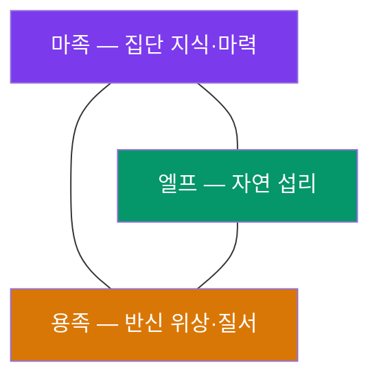

## 원전 인용 증명

### [필독 1] brainstorm_2026-04-21_worldview_expansion.md — 발언 19:862-873
> "인간의 기억은 외곡되었으나 엘프와 용족은 기억하고있다 마족이 지배하던 세상이 가장 살기좋고 대립도 적었으며, 종족간 화합도도 최고조였다(완벽은 아님)"

### [필독 1] 발언 18:784-819
> "마족은 마력의 수정으로 거의 모든 개체가 연결되어있으며 프라이버시는 어느정도 지켜지나, 원할때 수정에 접속하여 축척된 지식을 꺼내서 사용가능, 그러므로 만년이상 지식을 축척한 마족이야말로 신에 근접하며"

### [필독 2] game_setting_complete_2026-04-21.md — §5 마족의 존재 메커니즘
> "마족 사망 시 마력이 본거지 수정으로 자동 회수 → 새 마족 탄생 → 개체수 정체 (증감 없음)"

### [Q-CORE 1] project_qcore1_resolved
> "마족 시대 (용족·엘프와 황금기)" — 시간축 확정
> "마족 증식 → 마족 집단 형성 → 마족 시대 · 용족·엘프 공존 · 황금기"

### [Q-CORE 3] project_qcore3_resolved — 시간축 최종 정합
> "태초 — 마왕 단독 존재 → 수정 2 제작 → 마족 증식 → 마족 집단 형성 → 마족 시대 · 용족·엘프 공존 · 황금기"

---

## 요약

마족 집단이 형성된 이후부터 수호자 개입 직전까지의 시대.
**황금기**라 불리며, 마족·용족·엘프가 공존하고 종족 간 화합도가 역사상 최고조에 달했다.
그러나 이 황금기는 완벽하지 않았으며, 내부적 갈등과 불균형이 존재했다.
인간의 공식 역사서에서는 이 시대가 **왜곡·은폐**되어 있으며,
진실은 엘프와 용족의 구전·벽화에만 파편적으로 남아 있다.

---

## 마족 집단 형성

수정 2 를 기반으로 마족이 증식하기 시작했다.
처음에는 소수였으나 점차 집단을 이루었다.

마족은 일반적인 생물의 번식이 아니라
마력이 응축되어 자의식을 갖는 방식으로 개체가 생성된다.
이 원리를 마왕이 수정 2 를 통해 체계화한 것이다.

마족 집단이 형성되면서 **마력의 수정 연결망**이 자연스럽게 확장되었다.
거의 모든 마족 개체가 이 수정망에 연결되어,
원할 때 축적된 집단 지식에 접속할 수 있었다.

---

## 황금기 — 종족 공존의 시대

이 시기 세 종족의 관계는 다음과 같이 정리된다 (엘프·용족 구전 기반):

| 종족 | 황금기 역할 | 현재 기억 보존 |
|------|------------|--------------|
| 마족 | 지식·마력 중심 · 사실상 주도 세력 | 집단 수정망에 파편 기록 |
| 엘프 | 자연 섭리 수호 · 마족과 협력 | 구전 + 예언 형태로 보존 |
| 용족 | 반신 위상으로 종족 간 질서 유지 | 벽화 + 연장자 기억으로 보존 |

**황금기의 특징**:
- 종족 간 대립이 현재보다 현저히 낮았다
- 마족의 집단 지식망이 정보·기술의 공유 플랫폼 역할
- 자원 분쟁이 없었던 것은 아니나, 갈등이 전쟁으로 비화되는 경우가 드물었다
- 완벽하지 않았다 — 내부 위계·갈등·불평등 존재 (발언 19 "완벽은 아님")

---

## 황금기의 불완전함

이 시기를 황금기로 부르는 것은 **후대와의 비교** 에서 나온 표현이다.
당시에도 갈등은 있었다.

추정 가능한 불완전 요소들 (대부분 대표님 미확정 · 추정 표기):

1. **마족 내부 위계** (추정): 만년 이상 지식을 축적한 원로와 신생 개체 사이의 격차
2. **용족의 반신 자기 인식과 마족의 실질적 우위 사이의 긴장** (추정)
3. **엘프의 고립 성향** (추정): 자연 섭리를 따르는 엘프가 마족의 집단망에 완전히 통합되지 않았을 가능성
4. **마왕의 위치** (추정): 증식을 완성한 마왕 자신이 이 황금기에서 어떤 역할이었는지 미정

---

## 인간 기억 왜곡의 기원

이 시대의 진실이 후대 인간 역사에서 왜곡된 것은,
**첫 번째 신이 인간에게 심은 이데올로기** 와 관련이 있다 (설정집 층위 · Q-CORE 2 간접 반영).

공식 신학에서는 이 시대를 다음과 같이 서술한다:

> *"신이 오시기 전, 마족이라는 어둠의 존재가 세상을 지배하였다. 그들의 지배 아래 모든 생명은 억압받았다. 신은 이 어둠을 걷어내고 인간에게 빛을 주셨다."*
> — 성좌국 공식 교리서 (추정 기술 · 왜곡 서술)

이 서술이 **역사적 사실과 얼마나 다른지**는 엘프·용족의 기억이 드러날 때 밝혀진다.

---

## 황금기 말기 — 균열의 조짐

황금기가 어떻게 끝났는지는 기록에 명확히 남아 있지 않다.
용족 벽화에는 이 시기에 대한 단편이 있다:

> *"빛이 너무 밝아지면 그림자도 커진다. 우리가 가장 풍요롭다고 생각하던 때, 세계 밖에서 무언가가 우리를 보고 있었다."*
> — 마에리스 고지 용족 벽화 중단부 (추정 번역)

수호자 개입의 직접적 원인이 무엇이었는지는 이 파일의 범위를 벗어난다.
→ `event_collapse_and_guardian_intervention_2026-04-22.md` 참조

---

## 대표님 미확정 사항

- 황금기 M-3 의 지속 기간 (수백 년? 수천 년?)
- 마왕이 황금기에서 어떤 역할을 했는가 (지도자? 은거? 다른 형태?)
- 황금기의 구체적 "완벽하지 않은" 내부 갈등의 내용
- 황금기 말기 균열의 원인 (수호자 개입 이전에 이미 붕괴 시작이었는지)
- 수인족·드워프·오크가 이 시대에 존재했는가 (선행 종족 vs 후발 종족 분류)
- 엘프·용족이 진실을 알면서 침묵하는 이유 (박해 위험? 종족 성향? 할배 봉인?)

## 다음 Wave 의존

- Wave 5 Chronicler: 엘프 구전 「황금기의 증언」 · 용족 벽화 하단부 번역문 작성
- Wave 4 Kingdom-Detailer: 엘프·용족 왕국 고유 역사에서 황금기 기억 파편 반영
- Wave 3 Diplomat (병행): 황금기 종족 관계가 현재 외교 구조의 역사적 배경
