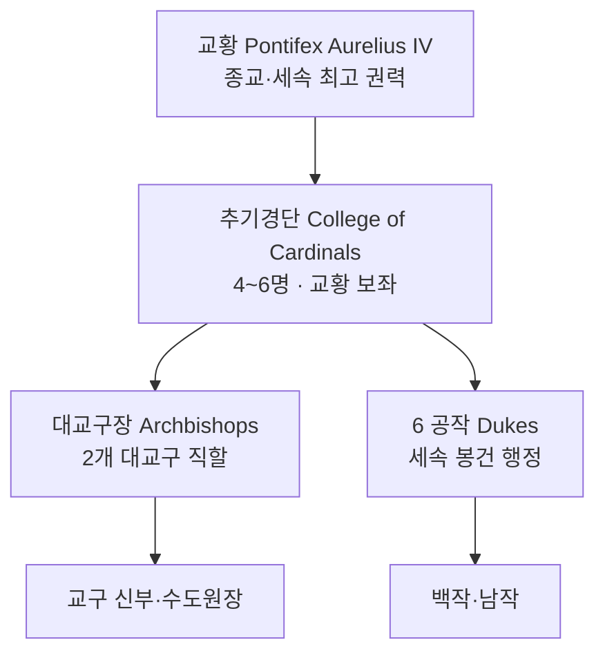

# Choir of Elucia — 엘루시아 성좌국 전체 개요

## 원전 인용 증명

### [필독 1] brainstorm_2026-04-21_worldview_expansion.md:176 (발언 5)
> "보라색점은 좌측대륙에서 가장큰 제국이고, 나머지는 작은 왕국으로 이루어짐"
— 발언 5 (성좌국 = 대륙 최대 제국 확정)

### [필독 2] political_divisions.md:47–48
> "엘루시아 성좌국 (수도 소라리스) / Choir of Elucia (Capital: Solaris) / 교황청 보유 · 대륙 최대 권력 · 보라 심볼"
— political_divisions.md:47–48

### [필독 3] political_divisions.md:111–112
> "Aurion / 오리온 / 중앙 평야 / 성좌국 직할 · Solaris"
— political_divisions.md:111–112

### [필독 4] brainstorm_2026-04-21_worldview_expansion.md:261 (발언 7)
> "좌우 대륙은 같은 신을 믿지만 서로 해석을 달리한다. 서로 적대적이긴하나 하나의 목표는 지성이있는 타 종족 몰살로 오로지 인류를 위한 행성을 목표로한다."
— 발언 7 (성좌국 종교 이념 = 타종족 몰살·인류 단일 행성)

### [필독 5] game_setting_complete_2026-04-21.md (§3 교회 이중성)
> "나태해진신은 교회를 타락시켜 절대적인 권력을 손에 쥐게해줌."
— 교회 타락 구조 확정

### [필독 6] _shared_briefing.md:85–89
> "불완전성 — 모든 것은 불완전하다 · 신조차"
— 세계관 철학 3조 (성좌국 패권도 불완전)

### [필독 7] FAILURES.md (FAIL-002)
> "대표님 원안이 짧거나 기술적 설정일 때 나베랄 감마·NotebookLM 둘 다 그 빈 자리를 '철학적 깊이·멋진 서사적 정당화·논리적 완결성'으로 채우려는 체계적 경향."
— FAIL-002: 과해석 금지·(추정) 표기 의무

---

## 요약

성좌국 Choir of Elucia 는 Elucia 대륙 면적 ~600K km² 를 점유하는 최대 정치 단위. 수도 **Solaris** 는 Aurion 중앙 평야 Eloryn 강 중류 좌안에 위치한다. 세속 황제 없이 **교황(Pontifex)** 이 종교·세속 권력을 겸임한다. 교리는 "첫 번째 신의 뜻 = 지성 있는 타종족 몰살·인류 단일 행성"이며, 내부는 **6 공작령 + 2 대교구** 체제로 운영된다. 보라+금이 공식 색이며 고딕 대성당 건축이 국가 정체성의 핵심이다.

---

## 기본 국가 정보

| 항목 | 내용 |
|------|------|
| 공식 명칭 | Choir of Elucia |
| 한글 명칭 | 엘루시아 성좌국 |
| 수도 | **Solaris** (소라리스) |
| 권역 | Aurion (중앙 평야 직할) |
| 총 면적 | ~600K km² (추정) |
| 군주 칭호 | **Pontifex** (교황 · 세속 군주 겸임) |
| 본편 시점 현 교황 | **Pontifex Aurelius IV** (→ `royals/pope_aurelius_iv_2026-04-22.md`) |
| 상징색 | 보라 (Pontifex 자주 + 황금) |
| 국기 문양 | 황금 십자가 + 보라 바탕 (→ `heraldry_2026-04-22.md`) |
| 국가 좌우명 | *"Lux in Perpetuum"* ("빛은 영원하리라") (추정) |
| 공용어 | Elucian 격식어 (Solarian Dialect) |
| 종교 | 성좌교 (첫 번째 신 신앙 · 교황청 해석 독점) |

---

## 국가 구조

---

## 공작령 6개 + 대교구 2개 인덱스

| # | 구역 | 유형 | 핵심 도시 | 담당 공작/대교구장 |
|---|------|------|---------|----------------|
| 1 | Duchy of Aurionmere | 공작령 | Solaris (수도) | Duke Aldric Veranthas → `nobles/duke_aurionmere_veranthas_2026-04-22.md` |
| 2 | Duchy of Veldenmere | 공작령 | Aurewatch | Duke Goran Uldenmass → `nobles/duke_veldenmere_uldenmass_2026-04-22.md` |
| 3 | Duchy of Solanthen | 공작령 | Auronheld | Duke Mael Soltharr → `nobles/duke_solanthen_soltharr_2026-04-22.md` |
| 4 | Duchy of Mirevane | 공작령 | Irondelta | Duke Eryn Mireval → `nobles/duke_mirevane_mireval_2026-04-22.md` |
| 5 | Duchy of Loranthas | 공작령 | Lumstow | Duke Caran Lorven → `nobles/duke_loranthas_lorven_2026-04-22.md` |
| 6 | Duchy of Orinthal | 공작령 | Veloris (학술) | Duke Iven Orindal → `nobles/duke_orinthal_orindal_2026-04-22.md` |
| A | Archdiocese of Solaris | 대교구 | Solaris 반경 직할 | Archbishop Caelus Morvaine → `royals/hierarchs_morvaine_2026-04-22.md` |
| B | Archdiocese of Aurioncross | 대교구 | Aurioncross 순례 도시 | Archbishop Sybilla Vorn → `royals/hierarchs_vorn_2026-04-22.md` |

---

## 왕족·고위 성직자 인덱스

| 직위 | 이름 | 파일 |
|------|------|------|
| 교황 (Pontifex) | Aurelius IV | `royals/pope_aurelius_iv_2026-04-22.md` |
| 선임 추기경 | Cardian Osbert Halvenmoor | `royals/cardinal_halvenmoor_2026-04-22.md` |
| 추기경 (재정) | Cardian Lyra Vesenne | `royals/cardinal_vesenne_2026-04-22.md` |
| 추기경 (이단심문) | Cardian Dravek Solundra | `royals/cardinal_solundra_2026-04-22.md` |
| 추기경 (외교) | Cardian Theron Callindra | `royals/cardinal_callindra_2026-04-22.md` |
| 전임 교황 | Pontifex Aurelius III (†) | `royals/previous_pope_aurelius_iii_2026-04-22.md` |
| 대교구장 (Solaris) | Archbishop Caelus Morvaine | `royals/hierarchs_morvaine_2026-04-22.md` |
| 대교구장 (Aurioncross) | Archbishop Sybilla Vorn | `royals/hierarchs_vorn_2026-04-22.md` |

---

## 가문 인덱스

| 가문 | 분류 | 파일 |
|------|------|------|
| House Veranthas | 공작 가문 (Aurionmere) | `houses/house_veranthas_2026-04-22.md` |
| House Uldenmass | 공작 가문 (Veldenmere) | `houses/house_uldenmass_2026-04-22.md` |
| House Soltharr | 공작 가문 (Solanthen) | `houses/house_soltharr_2026-04-22.md` |
| House Mireval | 공작 가문 (Mirevane) | `houses/house_mireval_2026-04-22.md` |

---

## 기사단 인덱스

| 기사단 | 역할 | 파일 |
|--------|------|------|
| Order of the Sacred Choir | 교황 근위 성기사단 | `orders/order_sacred_choir_2026-04-22.md` |
| Order of Aurelian Light | 이단 토벌 원정 기사단 | `orders/order_aurelian_light_2026-04-22.md` |
| Order of the Veil Warden | 수도원 수호 기사단 | `orders/order_veil_warden_2026-04-22.md` |

---

## 도시·마을 인덱스

### Toponymist 기존 도시 (6)

| 도시 | 파일 | 특성 |
|------|------|------|
| Solaris | `cities/city_solaris_2026-04-22.md` | 수도·교황청 |
| Aurewatch | `cities/city_aurewatch_2026-04-22.md` | 북부 감시 요새 |
| Auronheld | `cities/city_auronheld_2026-04-22.md` | 동부 군사 거점 |
| Lumstow | `cities/city_lumstow_2026-04-22.md` | 순례 교역 도시 |
| Irondelta | `cities/city_irondelta_2026-04-22.md` | 서부 하구 항구 |
| Veloris | `cities/city_veloris_2026-04-22.md` | 남부 학술 도시 |

### Toponymist 기존 마을 (3)

| 마을 | 파일 |
|------|------|
| Ashford | `villages/village_ashford_2026-04-22.md` |
| Elmwick | `villages/village_elmwick_2026-04-22.md` |
| Millcross | `villages/village_millcross_2026-04-22.md` |

### Wave 4 추가 마을 (12)

| 마을 | 파일 |
|------|------|
| Greyveil | `villages/village_greyveil_2026-04-22.md` |
| Thornhallow | `villages/village_thornhallow_2026-04-22.md` |
| Caldenmere | `villages/village_caldenmere_2026-04-22.md` |
| Westhaven | `villages/village_westhaven_2026-04-22.md` |
| Orenford | `villages/village_orenford_2026-04-22.md` |
| Saltwick | `villages/village_saltwick_2026-04-22.md` |
| Pelborne | `villages/village_pelborne_2026-04-22.md` |
| Aulmere | `villages/village_aulmere_2026-04-22.md` |
| Cinderfield | `villages/village_cinderfield_2026-04-22.md` |
| Duskbell | `villages/village_duskbell_2026-04-22.md` |
| Varemoor | `villages/village_varemoor_2026-04-22.md` |
| Hollowthorn | `villages/village_hollowthorn_2026-04-22.md` |

---

## 문화·체제 파일 인덱스

| 파일 | 내용 |
|------|------|
| `heraldry_2026-04-22.md` | 교황청 + 공작 가문 문장 체계 |
| `military_2026-04-22.md` | 군제 · 성기사단 · 교황군 |
| `clothing_2026-04-22.md` | 교황·추기경·신관·평민 의상 |
| `cuisine_2026-04-22.md` | 제단 빵·금식일 요리·성찬 음식 |
| `architecture_2026-04-22.md` | 고딕 대성당·수도원·교황궁 |
| `dialect_2026-04-22.md` | Solarian 격식어 방언 |
| `festivals/festival_saint_aurel_2026-04-22.md` | 수호 성인 Aurel 축일 |
| `festivals/festival_ascension_2026-04-22.md` | 승천절 |
| `festivals/festival_harvest_blessing_2026-04-22.md` | 수확 감사제 |
| `festivals/festival_light_vigil_2026-04-22.md` | 부활 광명 축제 |

---

## 무명 학자 유랑 금지령 (Q-CORE 간접 단서)

<!-- AGENT_MEMO: 원전 인용 증명 (에이전트 브리핑 전용 · 공개 렌더링 제외)
Q-CORE 2 적용 — 이름 없는 학자(내부 코드명 비공개)의 생활 마법 배포 간접 단서
구조적 진실 직접 서술 절대 금지 — 인-월드 문헌·공식 교리 층위만
-->

- **무명 학자 유랑 금지령**: 성좌국 내 "이름 없는 학자·방랑 현자" 유랑 금지령 존재 — 집행력 약함. 침투율 낮지만 0 아님. 일부 마을에 "어느 해 우물 정화 주문을 가르친 이름 없는 노인" 전설 산발적 존재.
- **Q-CORE 공식 교리**: "첫 번째 신이 타락한 악마들을 심판했다" (왜곡 버전). 양심파 은밀 기록에만 파편 단서.
- **구조적 진실 직접 서술 금지** — 인-월드 문헌·공식 교리 층위만.

---

## 대표님 미확정 사항

- 교황 선임 방식 상세 (추기경단 투표 vs 신탁 의례 여부)
- 공작령 6개 최종 경계선·지도
- 성기사단 병력 규모 수치
- Solaris 정확한 인구 수치

## 다음 Wave 의존

- **Wave 5 Chronicler**: 교황청 창건 공식 연대기 · 이단 재판 기록 인-월드 문헌
- **Wave 5 World-Integrator**: 성좌국 영향권 붕괴 시 대륙 지정학 재편 시뮬레이션
