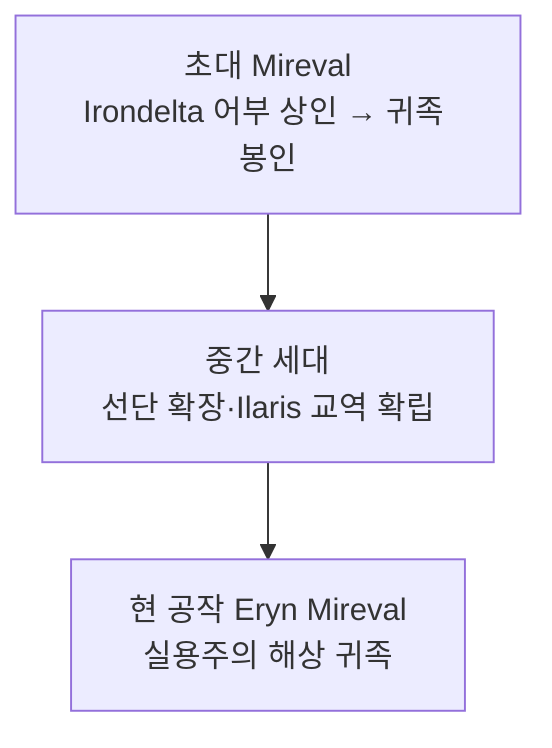

# House Mireval (미레발 가문)

## 원전 인용 증명

### [필독 1] empire_papal_territories_2026-04-22.md:80
> "Duchy of Mirevane / Eloryn 하류 · 서해안 접경 / 어업·항구 / 서해 무역 관문 (추정)"

### [필독 2] city_irondelta_2026-04-22.md
> "부두 냄새·상인·하역 노동자·교황청 세관원 혼재"

### [필독 3] FAILURES.md (FAIL-002)
> "(추정) 표기 의무"

---

## 요약

성좌국 서해안 교역을 세습한 해상 귀족 가문. 원래 어부 출신 거상이 교황청에 해상 물자를 제공하며 귀족화된 신흥 가문. 오래된 귀족 가문들이 내심 멸시하지만 경제력이 막강하다. 문장은 파란 바탕에 은빛 닻.

---

## 가문 정보

| 항목 | 내용 |
|------|------|
| 가문명 | Mireval |
| 공작령 | Duchy of Mirevane |
| 현 가주 | Duke Eryn Mireval |
| 특기 | 해상 무역·어업·환전 |
| 가문색 | 파란색·은색 |
| 가문 문장 | 파란 바탕 + 은빛 닻 |
| 가문 좌우명 | *"Maris Gratia Vivimus"* ("바다의 은혜로 우리는 산다") (추정) |

---

## 계보

---

## 경제 기반

- Irondelta 항구 수출입 관세
- 서해 어선단 (약 200척 · 추정)
- Ilaris 왕국 교역 파트너십

---

## 대표님 미확정 사항

- Ilaris 왕국 귀족과의 혼인 동맹 여부
- 해적과의 비공식 관계 (묵인 vs 적대)

## 다음 Wave 의존

- **Wave 5 Chronicler**: Irondelta 항구 물자 인-월드 기록
