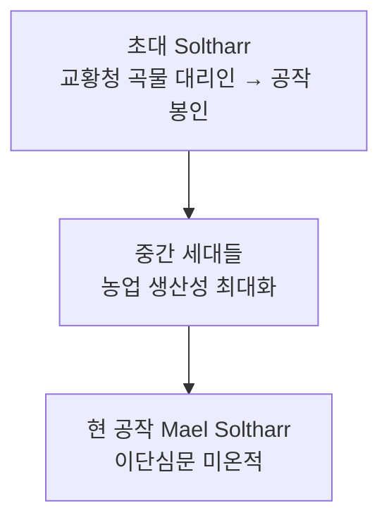

# House Soltharr (솔타르 가문)

## 원전 인용 증명

### [필독 1] empire_papal_territories_2026-04-22.md:79
> "Duchy of Solanthen / ~90K km² / 농업·목축 / 동부 곡창 공작령 (추정)"

### [필독 2] FAILURES.md (FAIL-002)
> "(추정) 표기 의무"

---

## 요약

성좌국 최대 곡창 지대를 세습한 농업 귀족 가문. 전쟁보다 생산·관리를 가문 덕목으로 삼는다. 교황청 식량 공급 독점 계약으로 막대한 부를 축적했으나 군사력은 6 공작 중 최약. 문장은 황금 밀 이삭 3줄기.

---

## 가문 정보

| 항목 | 내용 |
|------|------|
| 가문명 | Soltharr |
| 공작령 | Duchy of Solanthen |
| 현 가주 | Duke Mael Soltharr |
| 특기 | 농업 경영·식량 비축·세금 행정 |
| 가문색 | 황금·녹색 |
| 가문 문장 | 녹색 바탕 + 황금 밀 이삭 3줄기 |
| 가문 좌우명 | *"Terra Nutrit Omnes"* ("땅이 모두를 먹인다") (추정) |

---

## 계보

---

## 경제 기반

- 교황군 식량 공급 계약 (연간 최대 규모 · 추정)
- Auravel 강 유역 곡물 밀집 재배
- 목축 (양 대규모 목장 · 추정)

---

## 대표님 미확정 사항

- Soltharr 가문 세부 혼인 계보
- 이단심문 미온 대응의 가문 전통 여부

## 다음 Wave 의존

- **Wave 5 Chronicler**: 성좌국 식량 계약 문서 인-월드 기록
