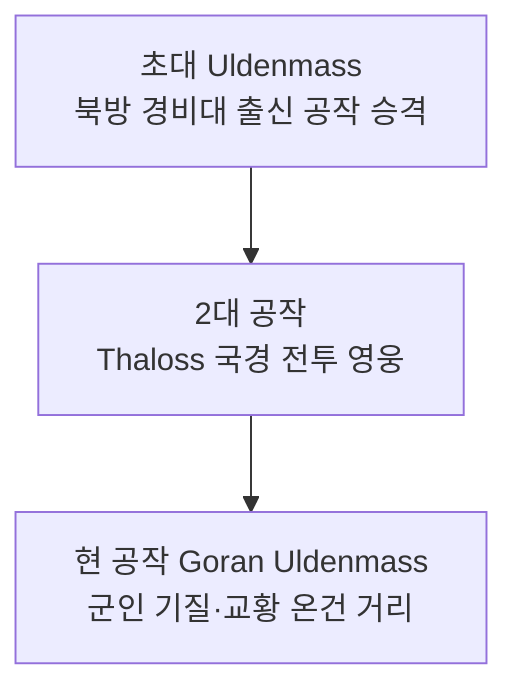

# House Uldenmass (울덴마스 가문)

## 원전 인용 증명

### [필독 1] empire_papal_territories_2026-04-22.md:78
> "Duchy of Veldenmere / 북부 방위 요충 · 군사 공작령 (추정)"

### [필독 2] city_aurewatch_2026-04-22.md
> "군기 넘치는 군사 도시. 상업보다 안보가 우선"

### [필독 3] FAILURES.md (FAIL-002)
> "(추정) 표기 의무"

---

## 요약

성좌국 북방 방어를 세대에 걸쳐 맡아온 군인 가문. Thaloss 와의 국경 전투로 단련되었으며, 가문원 대부분이 군인이나 고위 기사 출신이다. 문장은 강철색 바탕에 십자 방패.

---

## 가문 정보

| 항목 | 내용 |
|------|------|
| 가문명 | Uldenmass |
| 공작령 | Duchy of Veldenmere |
| 현 가주 | Duke Goran Uldenmass |
| 특기 | 북방 방위·광산 관리·Thaloss 국경 협상 |
| 가문색 | 강철 회색·보라 |
| 가문 문장 | 강철 바탕 + 보라 십자 방패 |
| 가문 좌우명 | *"Per Ferrum et Fidem"* ("철과 믿음으로") (추정) |

---

## 계보

---

## 경제 기반

- Norvend 기슭 광산 세입
- 북방 관세 수입
- 목재 수출 (Thaloss 산맥 인접 삼림)

---

## 대표님 미확정 사항

- 가문 내 현역 기사 수
- Thaloss 왕국 귀족과의 혼인 동맹 여부

## 다음 Wave 의존

- **Wave 5 Chronicler**: 북방 경비대 창설 기록 인-월드 문헌

<!-- auto-generated-related:start -->
## 🔗 관련 (auto-generated)

> `scripts/obsidian/build_backlinks.py` 로 자동 생성. 수정 금지 — 다음 실행 시 덮어쓰여집니다.

### ⬆️ 상위

- [[../../../../../../MOC]] — wiki 루트
- [[../../../MOC]] — Elucia 허브

<!-- auto-generated-related:end -->
