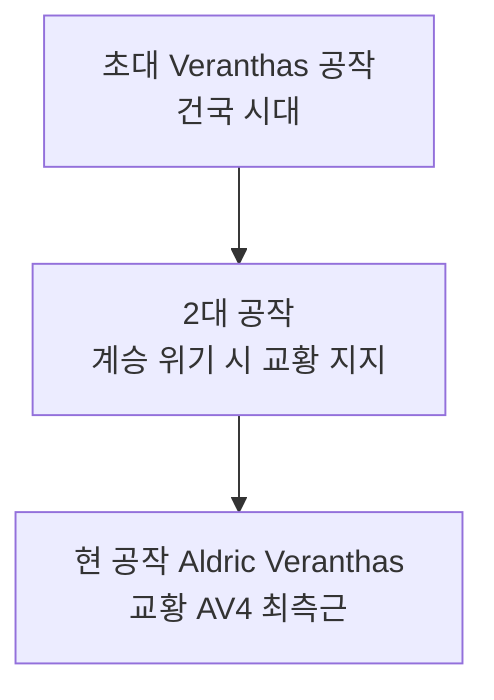

# House Veranthas (베란타스 가문)

## 원전 인용 증명

### [필독 1] empire_papal_territories_2026-04-22.md:77
> "Duchy of Aurionmere / 수도 인근 직할급 · 교황 친위 공작 (추정)"

### [필독 2] political_divisions.md:47–48
> "교황청 보유 · 대륙 최대 권력 · 보라 심볼"

### [필독 3] FAILURES.md (FAIL-002)
> "(추정) 표기 의무"

---

## 요약

성좌국 6 공작 가문 중 수도와 가장 가까운 가문. 3대에 걸쳐 교황 친위 공작 직위를 유지했으며, 교황청과의 혼인 동맹으로 권력을 공고히 했다. 문장은 보라 바탕에 황금 독수리.

---

## 가문 정보

| 항목 | 내용 |
|------|------|
| 가문명 | Veranthas |
| 공작령 | Duchy of Aurionmere |
| 현 가주 | Duke Aldric Veranthas (→ `nobles/duke_aurionmere_veranthas_2026-04-22.md`) |
| 설립 | 성좌국 건국 초기 (추정 · 3대 공작 가문) |
| 가문색 | 보라·황금 |
| 가문 문장 | 보라 바탕 + 황금 독수리 (날개 펼침) |
| 가문 좌우명 | *"Fidelis et Fortis"* ("충성과 힘") (추정) |

---

## 계보 (주요 인물)

---

## 경제 기반

- 수도 인근 최대 곡창 지대 관할
- 교황군 식량 계약 독점 (추정)
- Eloryn 강 도하 관세 수입

---

## 동맹·혼인

- 교황청 고위 성직자 가문과 세대 연혼 (추정)
- Aurionmere 내 백작 3~4가문 가신 관계

---

## 대표님 미확정 사항

- 정확한 가문 창설 시기
- 가문 내 자녀 이름·혼인 관계

## 다음 Wave 의존

- **Wave 5 Chronicler**: 베란타스 가문 봉신 문서 인-월드 기록
