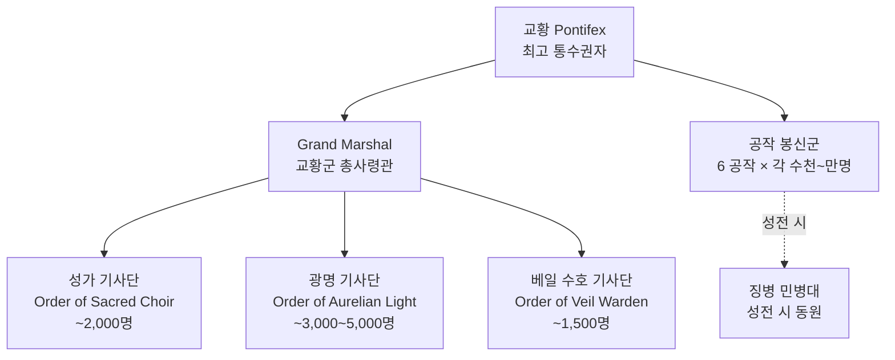

# Choir of Elucia — 군제

## 원전 인용 증명

### [필독 1] brainstorm_2026-04-21_worldview_expansion.md:2801 (발언 44·46)
> "Elucia (서쪽) / 징병제 / 중세 유럽 봉건 의무병"
— 징병제 확정

### [필독 2] relations/sphere_of_influence_solaris_2026-04-22.md:59
> "왕국 간 전쟁 인가 / 공식 선전(宣戰)은 교황청 통보 의무"
— 교황청이 전쟁 승인권 보유

### [필독 3] history/founding_2026-04-22.md
> "군사 조직: 교황청 기사단 (이름 미확정)"
— 기사단 중심 군사 구조

---

## 요약

성좌국 군사 체계는 **3층 구조**: (1) 교황 직속 성기사단 (엘리트 상비군) + (2) 공작 봉신군 (봉건 의무) + (3) 징병 민병대 (전시 동원). 평시에는 기사단 2,000명 + 공작 직할군으로 운영하며, 성전 선포 시 10왕국에 파병 요청권을 발동한다.

---

## 군사 체계 개요

---

## 층위별 상세

### 층위 1 — 교황 직속 기사단 (상비군)

| 기사단 | 역할 | 병력 | 본부 |
|--------|------|------|------|
| Order of the Sacred Choir | 교황 근위·수도 수비 | ~2,000 | Choir Citadel (Solaris) |
| Order of Aurelian Light | 이단 토벌·원정 | ~3,000~5,000 | Auronheld |
| Order of the Veil Warden | 수도원·성당 수호 | ~1,500 | Solaris 신학교구 |

### 층위 2 — 공작 봉신군 (봉건 의무군)

| 공작령 | 의무 병력 (추정) | 특성 |
|--------|---------------|------|
| Aurionmere | ~5,000 | 곡물 근거·중보병 |
| Veldenmere | ~8,000 | 북방 정예·중기병 |
| Solanthen | ~6,000 | 규모 크나 전투력 중간 |
| Mirevane | ~4,000 + 해군 | 해상 전력 보유 |
| Loranthas | ~3,000 | 순례 도로 경비 특화 |
| Orinthal | ~2,500 | 삼림 정찰 전문 |

### 층위 3 — 징병 민병대 (전시 동원)

- 16~45세 남성 징집 의무 (성전 선포 시)
- 농업 달력 기반 — 수확기 징집 회피 원칙 (이론상)
- 훈련 수준 낮음 · 장거리 원정 시 탈영 높음 (추정)

---

## 병종 구성

| 병종 | 구성 | 주요 역할 |
|------|------|---------|
| 성기사 (Knight) | 교황 직속·공작 직할 | 최정예 돌파 |
| 중보병 (Footman) | 공작 봉신·징병 | 전선 유지 |
| 석궁병 (Crossbowman) | 공작군·성벽 수비 | 원거리 지원 |
| 기병 (Cavalry) | Veldenmere 특화 | 기동·추격 |
| 해군 (Marine) | Mirevane 선단 | 해상 보급·상륙 |

---

## 성전 선포 시 병력 동원 순서

1. 교황 성전 칙령 발포 (추기경단 동의)
2. 10왕국에 파병 요청 공문 발송 (왕위 축성·교황청 인정 위협)
3. 거부 왕국 → 이단 선언 가능성 압박
4. 집결 거점: Auronheld (동부) / Aurewatch (북부) / Irondelta (해상)
5. 최대 동원 병력 추정: 80,000~120,000명 (10왕국 포함 · 추정)

---

## 대표님 미확정 사항

- 정확한 기사단 병력 수치
- 여성 기사 허용 여부
- 해군 독자 함대 규모

## 다음 Wave 의존

- **Wave 5 Chronicler**: 교황 성전 선포 칙령 인-월드 문헌
- **Wave 5 World-Integrator**: 성전 시 10왕국 반응 시뮬레이션
