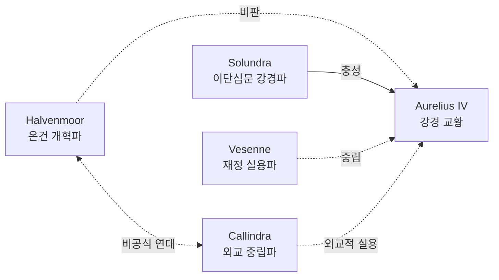

# Cardinal Osbert Halvenmoor (추기경 오스베르트 할벤무어)

## 원전 인용 증명

### [필독 1] history/papal_succession_crisis_2026-04-22.md:43–54
> "추기경단 파벌 분열 — 개혁파 vs 보수파 / 패배 후보 지지 추기경 지방 교구 좌천"
— 추기경단 파벌 구조·계승 위기 영향

### [필독 2] relations/sphere_of_influence_solaris_2026-04-22.md:56–63
> "왕위 축성 · 대주교 임명권 · 이단 선언권 · 교리 해석 독점"
— 추기경단이 행사하는 종교 권력 기제

### [필독 3] pope_aurelius_iv_2026-04-22.md
> "선임 추기경 Halvenmoor: 내면적 비판자·온건파. 직접 반란은 없으나 음모에 연루 가능"
— 대립 구도 확정

---

## 요약

Halvenmoor 는 추기경단 서열 1위. 현 교황 Aurelius IV 와 동시대 추기경으로 계승 위기 때 경쟁 후보 측을 지지했다가 중재 역할로 살아남은 인물. 표면상 교황에 충성하나 내부적으로 온건 개혁파 성향을 유지한다. 고위 성직자 중 유일하게 양심파 일부와 간접 접촉을 묵인하는 것으로 추정된다.

---

## 기본 정보

| 항목 | 내용 |
|------|------|
| 이름 | Osbert Halvenmoor |
| 나이 | 약 72세 (추정) |
| 출신 | Duchy of Loranthas 소도시 성직자 가문 (추정) |
| 직위 | 선임 추기경 (First Cardinal) |
| 담당 | 교황청 의전·성직자 임명 총괄 |
| 외형 | 자주색 추기경 법의·흰 수염·온화한 눈빛. 지팡이 짚음 |
| 성격 | 온화하고 신중. 직접 대립 회피. 장기적 포석 선호 |

---

## 역할 및 야망

- **단기 목표**: 교황 강경 노선의 완충재 역할 — "교황청은 극단적 이단 탄압보다 회유가 더 효과적"
- **장기 목표**: 차기 교황 선출 시 온건파 후보 추대 (대표님 미확정)
- **서사 기능**: Act 2 주인공 측에 간접적 정보를 흘리거나 탈출 경로를 묵인할 수 있는 내부 협력자 후보

---

## 파벌 관계

---

## Q-CORE 간접 단서

Halvenmoor 의 개인 서재에는 오래된 "마법 입문 기도서" 1권이 있다. 교황청 공인 교재가 아니며, 표지 제목 없음. 내용은 불 피우기·물 정화 등 기초 생활 마법 주문. 입수 경위 불명. 본인은 "오래된 수집품" 이라고만 말한다. (Q-CORE 2 할배 간접 단서 — 구조 직접 서술 금지)

---

## 대표님 미확정 사항

- 계승 위기 당시 지지 후보 정체
- 양심파와의 간접 접촉 방식·범위
- Act 2~3 서사에서 직접 조력 여부

## 다음 Wave 의존

- **Wave 5 Chronicler**: Halvenmoor 의 비공개 일지 인-월드 문헌 (양심파 파편 단서)
