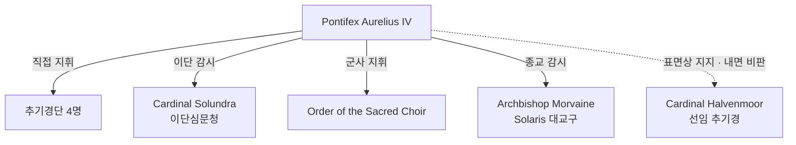

# Pontifex Aurelius IV (교황 아우렐리우스 4세)

## 원전 인용 증명

### [필독 1] history/founding_2026-04-22.md
> "현재 교황 / 본편 시점 / 권능 중독자 · 반신적 존재"
— 교황청 역대 계보 (현 교황 성격 확정)
> ⚠️ **Q-FIX-4 (세션 #5, 2026-04-22)**: 이 "반신적 존재" 표현은 폐기됨. 현재 공식 표현 = **황제와 동등한 최고 권위자** (두 권위 공동 통치 구조).

### [필독 2] brainstorm_2026-04-21_worldview_expansion.md:261 (발언 7)
> "좌우 대륙은 같은 신을 믿지만 서로 해석을 달리한다. 서로 적대적이긴하나 하나의 목표는 지성이있는 타 종족 몰살로 오로지 인류를 위한 행성을 목표로한다."
— 현 교황의 이념 기반

### [필독 3] history/papal_succession_crisis_2026-04-22.md:67–71
> "현재 교황은 계승 위기 이후 선출된 계보에 속한다. 이 위기의 기억이 현 교황의 권력 집중 성향에 영향을 주었을 것으로 추정."
— 교황 권력 집중 성향 근거

---

## 요약

Aurelius IV 는 본편 시점 성좌국의 최고 통치자. 교황 계승 위기 이후 추기경단의 결집으로 선출된 인물. 재위 22년 (추정). 종교 권력과 세속 권력을 동시에 장악한 채 황제와 동등한 최고 권위자로 군림하며, "첫 번째 신의 현신" 이라는 호칭을 묵인하는 단계에 이르렀다. 외형은 노령의 성직자이나 내면은 냉철한 권력자.

---

## 기본 정보

| 항목 | 내용 |
|------|------|
| 본명 | Cael Morvanus (출가 전 · 추정) |
| 교황명 | Aurelius IV |
| 나이 | 약 68세 (추정) |
| 출신 | Duchy of Aurionmere 상위 성직자 가문 (추정) |
| 재위 | ~22년 (추정) |
| 외형 | 흰 머리·주름진 얼굴·날카로운 눈. 흰색 교황 법의·금 십자가 패용. 키 크고 단호한 자세 |
| 성격 | 냉철·의지 강함·장기적 사고. 개인적 자비 없음. 권력에 매우 집착 |

---

## 권력 구조 내 위치

---

## 정치·이념

- **타종족 몰살론 강경파**: "첫 번째 신의 뜻 = 인류만을 위한 행성"을 교리 최상위로 격상
- **이단심문 강화**: 재위 기간 중 이단 처형 건수 전임 교황 대비 3배 이상 (추정)
- **왕국 복속 강화**: 10 왕국 왕위 축성 의례를 더욱 복잡하고 굴욕적으로 개편 (추정)
- **절대 권위 확립**: 일부 신도가 "살아있는 신의 대리자" 를 넘어 "신의 화신" 으로 칭하는 것을 공식 금지하지 않음

---

## 서사 역할 (Rev.3 접점)

| Act | 접점 |
|-----|------|
| Act 1 | 직접 등장 없음. 영향력만 배경에 존재 |
| Act 2 | 주인공의 타종족 편 활동이 알려지면서 이단 지명 수배 선포 |
| Act 2 후반 | 왕국들에 "성전 선포" 압박 → 이단 토벌 명목 |
| Act 3 A 선택 | 현 교황과의 대화·협상 또는 교황 지원 등 인류 이념 수용 경로 |
| Act 3 B 선택 | 교황 교리 붕괴·교황권 해체 결말 경로 |

---

## 약점 및 반대 세력

- **선임 추기경 Halvenmoor**: 내면적 비판자·온건파. 직접 반란은 없으나 음모에 연루 가능
- **Thaloss·Ceren·Novas** 세 왕국: 자원 레버리지로 성전 명령 불복
- **양심파 잠복 신관**: 교황청 내부 소수 이탈형 — 정체 불명

---

## Q-CORE 간접 단서

이단심문청 기록 중 교황의 내부 지시 메모 (비공개) 中:
> *"이름 없는 노인 건 — 동일 인물 여부 불명. 마법 교수 방식이 성직자 수련 교재와 일치하지 않음. 추적 포기. 단, 마을 단위 모임 형성 시 즉각 보고."*
(Q-CORE 2 할배 간접 단서 — 구조 직접 서술 금지)

---

## 대표님 미확정 사항

- 교황 본명·출신 가문 상세
- 재위 기간 정확한 연수
- 전임 교황 Aurelius III 와의 관계 (후계 지명 vs 추기경 선출)
- Act 3 에서 교황 사망 여부 (대표님 서사 결정 전 공란)

## 다음 Wave 의존

- **Wave 5 Chronicler**: 교황 즉위 연설 인-월드 문헌 · 이단 선포 칙령
- **Wave 5 World-Integrator**: 교황 사망/퇴위 시 대륙 권력 재편 시뮬레이션

<!-- auto-generated-related:start -->
## 🔗 관련 (auto-generated)

> `scripts/obsidian/build_backlinks.py` 로 자동 생성. 수정 금지 — 다음 실행 시 덮어쓰여집니다.

### ⬆️ 상위

- [[../../../../../../MOC]] — wiki 루트
- [[../../../MOC]] — Elucia 허브

<!-- auto-generated-related:end -->
