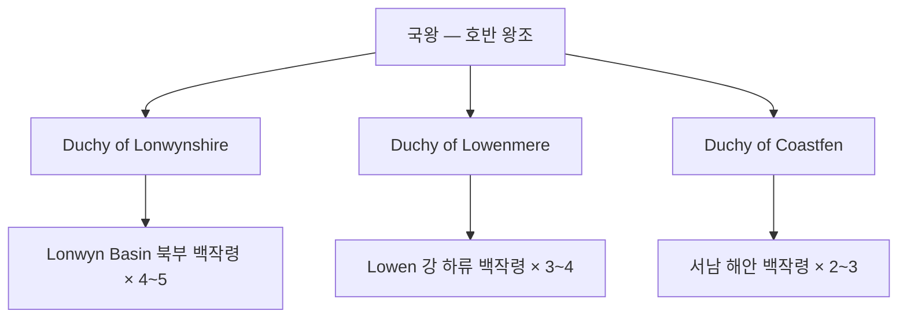

## 원전 인용 증명

### [필독 1] brainstorm_2026-04-21_worldview_expansion.md:176 (발언 5)
> "보시다시피 좌측은 강이 많고 풍요로움, 우측은 강도별로없고 줄기도 짧아서 물이귀하고 사막이 많음"

### [필독 2] political_divisions.md:62
> "알드릭 / Aldric / 남서 호수"
> "Lonwyn / 론윈 / 남서 호수 / 알드릭 왕국"

### [필독 3] kingdom_aldric_territories_2026-04-22.md (Wave 2 산출물)
> "Aldric 은 Elucia 남서 호수 지대에 위치하는 소왕국 (추정 50~70K km²). Lonwyn Basin 호수군이 국토의 핵심. Lowen 강이 성좌국에서 Aldric 으로 흘러들어 Lonwyn Basin 에 합류."

### [필독 4] history/founding_2026-04-22.md (Wave 3 산출물)
> "Lonwyn 호수 연안 어촌·교역 마을들이 수운 협력을 위해 연합을 형성한 것이 기원. 호수 수운으로 안정적 내륙 교역 유지."

### [필독 5] Q-CORE 2 memory (project_qcore2_resolved_hope_atonement.md)
<!-- AGENT_MEMO: 원전 인용 증명 (에이전트 브리핑 전용 · 공개 렌더링 제외)
Q-CORE 2 참조 확인 완료 · 이름 없는 학자 = '마법 잘 아는 착한 노인'으로만 인식 · 내용은 에이전트 내부 보관 · 위키 파일에 직접 기재 금지
-->

### [필독 6] _shared_briefing.md — 세계관 철학 3조
> "불완전성 — 모든 것은 불완전하다. 신조차. 한결같음 — 나이트는 한결같은 인격체. 영혼 평등 — 모든 종족의 영혼은 평등."

### [필독 7] FAILURES.md — FAIL-002
> "빈 자리는 '[대표님 결정 대기]' 마커 유지. AI가 '합리적 추론'으로 채우지 말 것."

---

## 요약

알드릭 왕국은 Elucia 남서 호수 지대(Lonwyn 권역)에 위치한 소왕국이다. Lonwyn 대호와 Lowen 강 수계가 국가의 핵심 자산이며, 어업·내항 수운·담수 진주 교역이 경제 기반이다. 켈트·호반 고지 문화권으로, 조용하고 공예적인 왕가와 백조를 상징으로 삼는 기사단이 특색이다. 소왕국으로서 생존을 위해 인접 실렌 왕국과 혼인 외교를 구사한다.

---

## 왕국 기본 정보

| 항목 | 내용 |
|------|------|
| **영문명** | Kingdom of Aldric |
| **슬러그** | kingdom_aldric |
| **위치** | 남서 호수 (Lonwyn 권역) |
| **규모** | 소왕국 · 추정 50~70K km² |
| **왕도** | Lonwyn (론윈) |
| **접경** | 북: 성좌국·Ceren / 동: Sylren·Novas / 남: 남해 / 서: 서해 |
| **경제 클러스터** | C6 남부 복합 |
| **문화권** | 켈트·호반 고지 문화 |
| **군제** | 모병제 |
| **문장색** | 청색·은색·진주 |
| **상징** | 백조·물결·호수 |

---

## 내부 행정 구조

| 공작령 | 위치 | 면적 (추정) | 핵심 자원 |
|--------|------|------------|---------|
| **Duchy of Lonwynshire** | Lonwyn Basin 북부·왕도 | ~22K km² | 호수 어업·담수 진주·수운 |
| **Duchy of Lowenmere** | Lowen 강 하류 유입부 | ~18K km² | 수운·내륙 교역 |
| **Duchy of Coastfen** | 서남 해안·Ceren 접경 | ~15K km² | 해안 어업·소금 |

---

## 파일 인덱스

### 개요
- `00_overview.md` (이 파일)
- `capital_map_2026-04-22.md`

### 왕족 `royals/`
- `king_aldric_iv_2026-04-22.md` — 현왕
- `queen_sylren_mora_2026-04-22.md` — 왕비 (Sylren 왕국 출신 혼인 외교)
- `crown_prince_edwyn_2026-04-22.md` — 왕세자
- `princess_calla_2026-04-22.md` — 장녀 공주
- `prince_loryn_2026-04-22.md` — 차남 왕자
- `previous_king_aldric_iii_2026-04-22.md` — 선왕

### 고위 귀족 `nobles/`
- `duke_lonwynshire_vaeron_2026-04-22.md` — Lonwyn 호수 공작
- `duke_lowenmere_brynn_2026-04-22.md` — 수운 항만 공작
- `duke_coastfen_selyne_2026-04-22.md` — 서해 해안 공작
- `count_lakewatch_2026-04-22.md` — 담수 진주 백작
- `count_rivermoor_2026-04-22.md` — 수운 항만 백작

### 가문 `houses/`
- `house_aldric_2026-04-22.md` — 호반 왕조 (왕가)
- `house_vaeron_2026-04-22.md` — Lonwynshire 공작가
- `house_brynn_2026-04-22.md` — Lowenmere 공작가
- `house_selyne_2026-04-22.md` — Coastfen 공작가

### 기사단 `orders/`
- `order_swan_2026-04-22.md` — 호반 파수·백조 기사단

### 문화·체제
- `heraldry_2026-04-22.md`
- `military_2026-04-22.md`
- `clothing_2026-04-22.md`
- `cuisine_2026-04-22.md`
- `architecture_2026-04-22.md`
- `dialect_2026-04-22.md`

### 축제 `festivals/`
- `festival_lake_offering_2026-04-22.md` — 호수 축제 (배 띄우기)
- `festival_swan_return_2026-04-22.md` — 백조 귀환제
- `festival_pearl_harvest_2026-04-22.md` — 진주 수확제
- `festival_founding_day_2026-04-22.md` — 초대 왕 기념일

### 도시 `cities/` (Wave 2 Toponymist 기본 + 심화)
- `city_lonwyn_2026-04-22.md` — 왕도 (심화)
- `city_westport_aldric_2026-04-22.md` — 서부 항구 (심화)
- `city_lakemere_2026-04-22.md` — 호수 동안 (심화)
- `city_greenvale_2026-04-22.md` — 남부 초원 (심화)
- `city_crestholm_2026-04-22.md` — 북부 구릉 (심화)

### 마을 `villages/` (Wave 2 기본 3 + Wave 4 신규 13)
- `village_brookwick_2026-04-22.md` (기존)
- `village_ferncroft_2026-04-22.md` (기존)
- `village_stillwater_2026-04-22.md` (기존)
- `village_reedholm_2026-04-22.md` (신규)
- `village_swanmere_2026-04-22.md` (신규)
- `village_pearlcove_2026-04-22.md` (신규)
- `village_mistfell_2026-04-22.md` (신규)
- `village_oarston_2026-04-22.md` (신규)
- `village_fenwick_2026-04-22.md` (신규)
- `village_saltmarsh_2026-04-22.md` (신규)
- `village_clearwater_2026-04-22.md` (신규)
- `village_heronbridge_2026-04-22.md` (신규)
- `village_driftmoor_2026-04-22.md` (신규)
- `village_lochvane_2026-04-22.md` (신규)
- `village_ashwick_2026-04-22.md` (신규)
- `village_tidehollow_2026-04-22.md` (신규)

### 도로 `roads/`
- `road_lonwyn_to_lonwynshire_2026-04-22.md`
- `road_lonwyn_to_lowenmere_2026-04-22.md`
- `road_lonwyn_to_coastfen_2026-04-22.md`
- `road_lonwyn_to_crestholm_2026-04-22.md`
- `road_lowenmere_to_solaris_border_2026-04-22.md`

---

## 대표님 미확정
- 왕가 초대 왕 이름·성격
- Lonwyn 호수 소도(小島) 타종족 은신 여부
- Lowen 강 수운 통행세 성좌국 협약 구조 상세
- 담수 진주 등급·가격 체계
- 백조 기사단 단원 수

## 다음 Wave 의존
- Wave 5 Chronicler: Lonwyn 호수 기원 전설·물의 수호자 신화
- Wave 5 World-Integrator: 알드릭 왕국 타 왕국 관계도 통합
