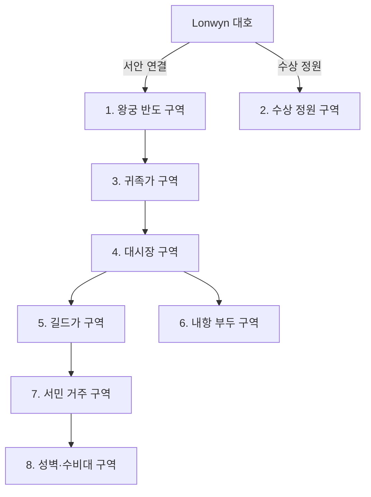

## 원전 인용 증명

### [필독 1] brainstorm_2026-04-21_worldview_expansion.md:176 (발언 5)
> "좌측은 강이 많고 풍요로움"

### [필독 2] city_lonwyn_2026-04-22.md (Wave 2 Toponymist)
> "Lonwyn 대호 서안 · 남서부 중심 / 인구 약 35,000~55,000 / 호수 위 수상 정원 구역이 Elucia 최고 관광지로 유명"

### [필독 3] kingdom_aldric_territories_2026-04-22.md
> "Duchy of Lonwynshire / Lonwyn Basin 북부 · 왕도 / 호수 어업·염전·수운 / 왕도·호수 행정 중심"

---

## 요약

왕도 Lonwyn은 Lonwyn 대호 서안에 위치한 인구 35,000~55,000의 호수 도시다. 호수와 내륙을 잇는 수로·부두 체계가 도시 구조의 중심이며, 왕궁은 수면 위 반도에 세워져 있다. 도시는 8개 구역으로 구분된다.

---

## 도시 구조 (8구역)

---

## 구역별 상세

### 1. 왕궁 반도 구역 (Palace Peninsula)
- **위치**: 대호 서안에서 호수 쪽으로 돌출된 자연 반도
- **구성**: 알드릭 왕궁·왕실 정원·근위대 막사·왕실 조선소
- **건축**: 청회색 석조 저택형 궁전. 배 모양 지붕. 물에 면한 포치
- **특징**: 백조 기사단 본영이 왕궁 서쪽 부속 건물에 위치
- **방어**: 반도 목 부분에 이중 철문·도개교

### 2. 수상 정원 구역 (Floating Garden District)
- **위치**: 왕궁 반도 남쪽 호수 수면 위
- **구성**: 수상 가옥·부유 화원·귀족 별장·백조 서식지
- **특징**: Elucia 최고 관광지. 봄 진주 수확제 행사 중심지
- **접근**: 전용 곤돌라 계류장. 허가 없이 진입 불가

### 3. 귀족가 구역 (Noble's Quarter)
- **위치**: 왕궁 반도와 대시장 사이 고지대
- **구성**: 공작·백작 저택·사설 부두·마굿간
- **건축**: 호반 저택. 물에 면한 포치. 은 장식 기둥
- **특징**: 각 가문 사설 소형 부두에서 직접 호수 접근 가능

### 4. 대시장 구역 (Grand Market)
- **위치**: 도시 중심부 · 내항 부두와 연결
- **구성**: 어시장·진주 거래소·공예품 시장·수운 화물 창고
- **특징**: 진주 거래소가 Elucia 최대 담수 진주 집산지
- **운영**: 매일 새벽 어시장 개장. 담수 진주는 월 2회 경매

### 5. 길드가 구역 (Guild Street)
- **위치**: 대시장 서쪽
- **구성**: 어부 길드·수운 길드·공예 장인 길드·의사 조합
- **특징**: 공예 장인 길드가 호수 도기·직물·진주 세공 품질 관리
- **Q-CORE 2 간접**: 어느 해 흑수병 유행 때 "이름 모를 방랑 학자"가 길드가 우물 정화 주문을 가르쳤다는 기록이 어부 길드 연감에 남아 있음 (대표님 발언 Q-CORE 2 반영)

### 6. 내항 부두 구역 (Inner Harbor)
- **위치**: 대호와 직접 연결 — 도시 동쪽 해변
- **구성**: 어선 부두·수운 화물 부두·수리 조선소·세관
- **특징**: Lonwyn 호수 어선 200~300척 상시 계류
- **방어**: 방파제 양 끝 포루(砲樓) — 호수 방면 경비

### 7. 서민 거주 구역 (Common District)
- **위치**: 성벽 안쪽 북·서 구역
- **구성**: 어부·장인·상인 주택·선술집·작은 성당
- **특징**: 은 장식 없는 린넨 벽. 호수색 창틀. 조용하고 소박
- **문화**: 저녁마다 호수 노래 부르는 풍습 (켈트계 선율)

### 8. 성벽·수비대 구역 (Wall District)
- **위치**: 도시 서·북 외곽 성벽 라인
- **구성**: 성벽·봉화대·수비대 막사·무기고
- **특징**: 성벽 일부가 직접 호수 수면에 접해 있어 수상 침입도 방어

---

## 주요 시설

| 시설 | 구역 | 역할 |
|------|------|------|
| 알드릭 왕궁 | 1 | 국정 중심·왕족 거처 |
| 담수 진주 거래소 | 4 | Elucia 최대 담수 진주 집산 |
| 어부 길드 본관 | 5 | 어업권·출어 허가 관리 |
| 수운 길드 본관 | 5 | Lowen 강 수운 통행 조율 |
| 호수 성당 | 7 | 백조 수호신·호수 감사 의례 |
| 백조 기사단 본영 | 1 | 왕궁 부속 기사단 주둔 |
| 수상 정원 별궁 | 2 | 왕실 휴양·외빈 접대 |

---

## 도시 교통

- **수로**: 내항에서 수상 정원까지 곤돌라 정기 운항
- **대로**: 성벽 성문에서 대시장·길드가까지 포석길 3개
- **내항 도로**: 내항 부두 → 대시장 직결 화물 운송로
- **왕궁도**: 귀족가 → 왕궁 반도 도개교 연결 전용로

---

## 대표님 미확정
- 왕궁 이름·별칭
- 성벽 성문 개수·이름
- 호수 성당 공식 신학 위치 (성좌국 교리 vs 호수 토착 신앙 혼합 비율)
- 수상 정원 구역 진입 허가 기준

## 다음 Wave 의존
- Wave 5 Chronicler: 호수 성당 내 인-월드 신화 문헌 작성
- Wave 5 World-Integrator: 관광지로서의 타 왕국 인식 통합
