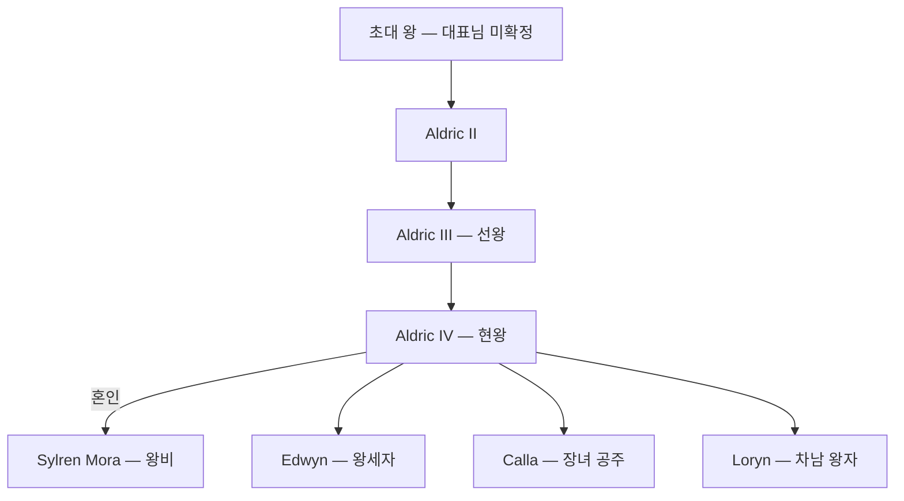

## 원전 인용 증명

### [필독 1] 에이전트 지시
> "왕족: 호반 왕조 · 조용하고 공예적 왕가 · 왕비 Sylren 혼인 (소왕국 생존 연대)"

### [필독 2] 에이전트 지시 — 문장
> "청색·은색·진주 · 백조·물결·호수"

### [필독 3] history/founding_2026-04-22.md
> "Lonwyn 호수 연안 어촌·교역 마을들이 수운 협력을 위해 연합을 형성한 것이 기원."

---

## 요약

알드릭 왕국의 왕가. 호수 연안 어촌 연합 시절부터 수운 협력을 주도한 가문이 왕조로 발전했다. "호반 왕조"라는 별칭은 호수를 삶의 중심으로 삼는 전통에서 비롯된다.

---

## 가문 기본 정보

| 항목 | 내용 |
|------|------|
| **가문명** | House Aldric |
| **별칭** | 호반 왕조 |
| **발원** | Lonwyn 대호 연안 어촌 연합 지도자 가문 |
| **문장** | 청색 바탕 · 은빛 백조 · 물결 3줄 |
| **가훈** | "물은 흘러도 뿌리는 남는다" (추정 · 대표님 미확정) |
| **경제 기반** | 왕실 어업세·진주 교역세·수운 통행세 상위 배분 |
| **혼인 전략** | 실렌 왕국과의 혼인 외교 (현재) |

---

## 계보도

---

## 가문 특성

- **공예 전통**: 역대 왕 중 직접 공예 활동을 한 인물이 다수. 왕궁 내 공방 유지
- **호수 신앙**: 호수를 수호 대상으로 여기는 토착 신앙과 성좌국 교리를 병용
- **과묵 전통**: 왕가 구성원은 감정 절제. "조용한 왕가"로 불림
- **소왕국 생존**: 외교·혼인 중심 생존 전략 — 군사 팽창 기피

---

## 대표님 미확정
- 초대 왕 이름·건국 설화
- 가훈 원문
- 호수 토착 신앙의 구체 내용

## 다음 Wave 의존
- Wave 5 Chronicler: 왕조 건국 설화·계보 문헌
