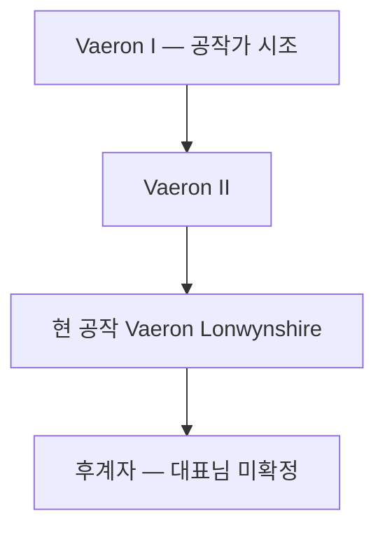

## 원전 인용 증명

### [필독 1] kingdom_aldric_territories_2026-04-22.md
> "Duchy of Lonwynshire / Lonwyn Basin 북부 · 왕도 / ~22K km² / 호수 어업·염전·수운"

### [필독 2] 에이전트 지시 — 문장
> "청색·은색·진주 · 백조·물결·호수"

### [필독 3] FAILURES.md — FAIL-002
> "빈 자리는 '[대표님 결정 대기]' 마커 유지."

---

## 요약

알드릭 왕국 최대 귀족 가문. Lonwyn 대호 어업·진주 교역의 핵심 지역을 대대로 관할하며, 왕실 다음의 경제 권력을 보유한다. 왕가와 협력·긴장 관계를 유지하는 알드릭 왕국의 "제1 귀족가"다.

---

## 가문 기본 정보

| 항목 | 내용 |
|------|------|
| **가문명** | House Vaeron |
| **영지** | Duchy of Lonwynshire |
| **문장** | 은빛 바탕 · 청색 물결 · 어망 문양 |
| **경제 기반** | 호수 어업세·진주 1차 거래·수운 통행세 |
| **혼인 관계** | 왕가와 1세대 전 혼인 연결 (대표님 미확정) |
| **동맹** | 어부 길드·담수 진주 거래소와 긴밀 |

---

## 가문 특성

- **어업 귀족**: 어부 길드와 "상업 협력" 관계. 어업 기술 개발 후원
- **진주 독점**: 담수 진주 1차 집하를 거의 독점. Lakewatch 백작령과 이익 분배
- **왕실 견제**: 표면상 충성하나 경제 이익 충돌 시 독자 행동 이력 (추정)

---

## 계보 (작업 가설)

---

## 대표님 미확정
- 가문 시조 이름·역사
- 왕가와의 과거 혼인 연결 여부
- 현 공작 자녀 구성

## 다음 Wave 의존
- Wave 5 World-Integrator: 귀족 관계도 통합

<!-- auto-generated-related:start -->
## 🔗 관련 (auto-generated)

> `scripts/obsidian/build_backlinks.py` 로 자동 생성. 수정 금지 — 다음 실행 시 덮어쓰여집니다.

### ⬆️ 상위

- [[../../../../../../MOC]] — wiki 루트
- [[../../../MOC]] — Elucia 허브

<!-- auto-generated-related:end -->
