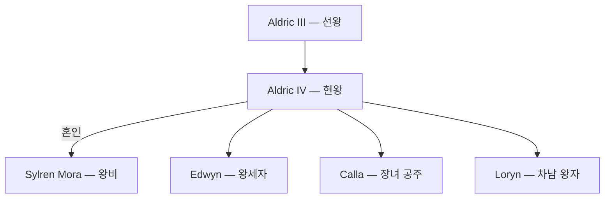

## 원전 인용 증명

### [필독 1] 에이전트 지시 — 왕족 특이점
> "왕족: 호반 왕조 · 조용하고 공예적 왕가 · 왕비 Sylren 혼인 (소왕국 생존 연대)"

### [필독 2] kingdom_aldric_territories_2026-04-22.md
> "왕가·군주 이름 [대표님 미확정]"

### [필독 3] story_full_narrative.md — 세계관 철학
> "불완전성 — 모든 존재는 완벽하지 않다. 신도, 수호자도, 인간도."

---

## 요약

알드릭 왕국 제4대 현왕. 호반 왕조 직계. 조용하고 내성적인 성품으로 왕국 전통의 공예·어업 문화를 깊이 이해한다. 실렌(Sylren) 왕국과의 혼인 외교를 주도하여 소왕국 알드릭의 생존 기반을 마련했다.

---

## 인물 정보

| 항목 | 내용 |
|------|------|
| **이름** | Aldric IV (알드릭 4세) |
| **호칭** | 호수의 왕 · "조용한 군주" (서민 별칭) |
| **나이** | 48세 (추정 · 대표님 미확정) |
| **외모** | 린넨 의복. 은 장식 왕관. 호수색 눈. 조용한 눈빛 |
| **성품** | 과묵하고 사려 깊음. 공예·어업에 조예. 격식 싫어함 |
| **야망** | 소왕국 알드릭의 독립 유지. 호수 경제 번영 |
| **약점** | 대외 협상 소극적. 성좌국 압박에 취약 |

---

## 정치적 역할

- **혼인 외교**: 실렌 왕국 귀족 가문 출신 Sylren Mora와 혼인 → 알드릭-실렌 불가침 협정 기반 마련
- **성좌국 관계**: 어획량·수운 통행세 이중 과세 부담. 교황청 요구를 최소한으로 수용하며 자율 유지
- **내정**: 담수 진주 교역 확장 장려. 수운 길드·어부 길드 자율 강화

---

## 서사 접점 (Rev.3)

- 인간 동료 기사의 출신 왕국이 알드릭일 경우 간접 언급 가능 (대표님 미확정)
- Act 2 교회 이단 심문 시 알드릭 왕이 "인도주의적 중립" 입장 표명 가능성 (추정)

---

## 계보

---

## 대표님 미확정
- 왕의 정식 이름 (Aldric 왕조명 외 개인명 유무)
- 즉위 연도·재위 기간
- 성좌국 교황청과의 개인적 관계

## 다음 Wave 의존
- Wave 5 Chronicler: 즉위식·혼인 외교 역사 문헌화
