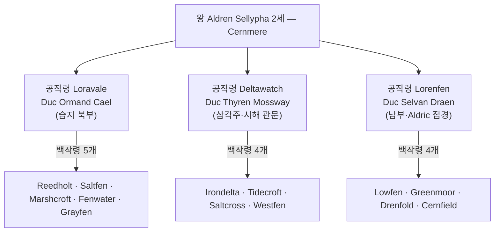

# Kingdom of Ceren — 세렌 왕국 전체 개요

## 원전 인용 증명

### [필독 1] political_divisions.md:56
> "세렌 / Ceren / 서남 습지"
— Ceren 왕국 위치·영문명 확정

### [필독 2] political_divisions.md:111
> "Loravel / 로라벨 / 서남 습지·호수 / 세렌 왕국"
— Loravel = Ceren 소속 권역 확정

### [필독 3] brainstorm_2026-04-21_worldview_expansion.md 발언 5
> "보시다시피 좌측은 강이 많고 풍요로움"
— 서쪽 대륙 강·풍요 = Ceren 습지 경제 기반

### [필독 4] brainstorm_2026-04-21_worldview_expansion.md 발언 8
> "타종족은 주변 작은 섬들이나 대륙의 가장자리의 밀림이나 숲, 사막한가운데서 숨어서 생활한다."
— Loravel 습지 깊은 곳 타종족 은신 가능성

### [필독 5] mining_gems_and_salt_2026-04-22.md
> "Ceren 왕국은 규모나 군사력으로는 중간급 왕국이나, 소금 공급권 때문에 성좌국조차 함부로 다루지 못하는 특수 지위를 가진다"
— 소금 레버리지 = Ceren 의 핵심 외교 자산

### [필독 6] FAILURES.md — FAIL-002
> "대표님 원문에 없는 서술은 (추정) 표기 의무"
— 작업 원칙 준수

### [필독 7] _shared_briefing.md — Q-CORE 2 반영
<!-- AGENT_MEMO: 원전 인용 증명 (에이전트 브리핑 전용 · 공개 렌더링 제외)
Q-CORE 2 참조 확인 완료 · 내용은 에이전트 내부 보관 · 위키 파일에 직접 기재 금지
-->
— Loravel 습지 전설 "이름 없는 학자" 단서 설계 근거

---

## 요약

세렌 왕국(Kingdom of Ceren)은 Elucia 서남부 Loravel 습지·호수 권역에 자리잡은 소왕국이다. 소금 독점이라는 단 하나의 전략 자원으로 성좌국·대왕국 3개를 견제하는 외교적 레버리지를 보유한다. 습지 부족 연합에서 중세 왕정으로 전환한 실리파 왕조가 통치하며, 실리적이고 침묵하는 문화가 왕국 전체에 배어 있다.

---

## 왕국 기본 정보

| 항목 | 내용 |
|------|------|
| 영문명 | Kingdom of Ceren |
| 한글명 | 세렌 왕국 |
| 슬러그 | kingdom_ceren |
| 권역 | Loravel (서남 습지·호수) |
| 규모 분류 | 소왕국 (~50~75K km²) |
| 왕도 | **Cernmere** (세른미어) |
| 왕가 | **실리파 왕조 (House Sellypha)** |
| 현 군주 | **Aldren Sellypha 2세** (알드렌 2세) |
| 국교 | 성좌국 공인 교회 (복종 형식 · 내부 전통 신앙 병존) |
| 경제 핵심 | 소금 독점 · 습지 어업 · 소금 창고 도시 |
| 군제 | 모병제 · 습지 척후병·화살수·보병 중심 |
| 기사단 | 안개 기사단 · 소금 수호단 |
| 접경 | 북 Ilaris · 성좌국 / 동 Sylren / 남 Aldric·남해 / 서 서해 |

---

## 내부 행정 구조

---

## 경제 클러스터 (C5 서해안·소금)

| 자원 | 비중 | 주요 거점 |
|------|------|---------|
| 소금 (조석염전) | ★★★★★ | Fenlyn 조석염전 · Saltfen 창고 |
| 습지 어업 (뱀장어·장어) | ★★★★ | Loravern · Mistlyn |
| 갈대·이탄 | ★★★ | Reedwick · Marshcroft |
| 수생 약재 | ★★ | Mistlyn · Reedholt |
| 서해안 무역 통관 | ★★★ | Ironstrand · Whitecross |

---

## Q-CORE 2 간접 단서 (Ceren 분포)

세렌 왕국은 Elucia 전체에서 "이름 없는 학자" 관련 구전 전설이 **가장 풍부한** 왕국이다.

| 전설 유형 | 분포 마을 | 내용 (간접 서술만) |
|---------|---------|---------------|
| 우물 정화 | Saltfen · Marshcroft | "이름 없는 학자가 우물 정화 주문을 가르쳤다" 구전 |
| 약초 치유 | Drenfold · Grayfen | "이름 모를 치유자가 약초 정화법을 알려줬다" 고문서 단편 |
| 식품 냉각 | Loravern 어시장 · Cernmere 뱃사공 조합 | "옛날 어부 어른이 물고기 보존 주문을 전해줬다" 전설 |
| 습지 항법 | Cernmere 뱃사공 조합 | "수로를 외웠다는 늙은 방랑자가 지도를 남겼다" 전설 |

*Q-CORE 2 구조 직접 서술 금지 — 간접 단서만.*

---

## 파일 인덱스

### 개요
- `00_overview.md` — 이 파일
- `capital_map_2026-04-22.md` — 왕도 Cernmere 상세 지도

### 왕족 `royals/`
- `king_aldren_sellypha_2026-04-22.md` — 현 왕
- `queen_mireth_sellypha_2026-04-22.md` — 왕비
- `crown_princess_selwen_sellypha_2026-04-22.md` — 왕세녀
- `prince_daran_sellypha_2026-04-22.md` — 왕자
- `princess_lyren_sellypha_2026-04-22.md` — 공주
- `previous_king_aldren_sellypha_first_2026-04-22.md` — 선왕

### 귀족 `nobles/`
- `duke_loravale_cael_2026-04-22.md` — Loravale 공작
- `duke_deltawatch_mossway_2026-04-22.md` — Deltawatch 공작
- `duke_lorenfen_draen_2026-04-22.md` — Lorenfen 공작
- `count_fenlyn_saltguild_2026-04-22.md` — Fenlyn 소금 백작
- `count_whitecross_vaern_2026-04-22.md` — Whitecross 변경 백작

### 가문 `houses/`
- `house_sellypha_2026-04-22.md` — 왕가
- `house_cael_2026-04-22.md` — Loravale 공작가
- `house_mossway_2026-04-22.md` — Deltawatch 공작가
- `house_draen_2026-04-22.md` — Lorenfen 공작가

### 기사단 `orders/`
- `order_mist_knights_2026-04-22.md` — 안개 기사단
- `order_salt_wardens_2026-04-22.md` — 소금 수호단

### 문화·체제
- `heraldry_2026-04-22.md` — 문장 체계
- `military_2026-04-22.md` — 군제
- `clothing_2026-04-22.md` — 의상
- `cuisine_2026-04-22.md` — 요리
- `architecture_2026-04-22.md` — 건축
- `dialect_2026-04-22.md` — 방언

### 축제 `festivals/`
- `festival_salt_harvest_2026-04-22.md` — 소금 수확제
- `festival_swamp_fire_night_2026-04-22.md` — 습지 불의 밤
- `festival_founding_queen_day_2026-04-22.md` — 초대 여왕 기념일

### 도시 `cities/` (Toponymist 산출 + 심화)
- `city_cernmere_2026-04-22.md` — 수도
- `city_fenlyn_2026-04-22.md` — 소금 도시
- `city_loravern_2026-04-22.md` — 수로 교역
- `city_irondelta_south_2026-04-22.md` — 하구 어항
- `city_whitecross_2026-04-22.md` — 북부 교역

### 마을 `villages/` (추가 생성)
- 기존 2개 + 신규 12개 (총 14개)

### 내부 도로 `roads/`
- 5개 주요 도로

---

## 대표님 미확정 사항

- 실리파 왕조 건국 연대·초대 왕 이름 (초대 "여왕"으로 설정 — 확정 요청)
- Ilaris 와의 혼인 완충 동맹 현재 당사자 (추정)
- 습지 깊은 곳 타종족 거주 여부·종류
- 소금 독점 왕실 공인 조약 성좌국과의 공식 체결 여부

## 다음 Wave 의존

- **Chronicler (Wave 5)**: 습지 전설 문헌·초대 여왕 서사 완성
- **World-Integrator (Wave 5)**: 소금 레버리지 외교망 통합 그래프
