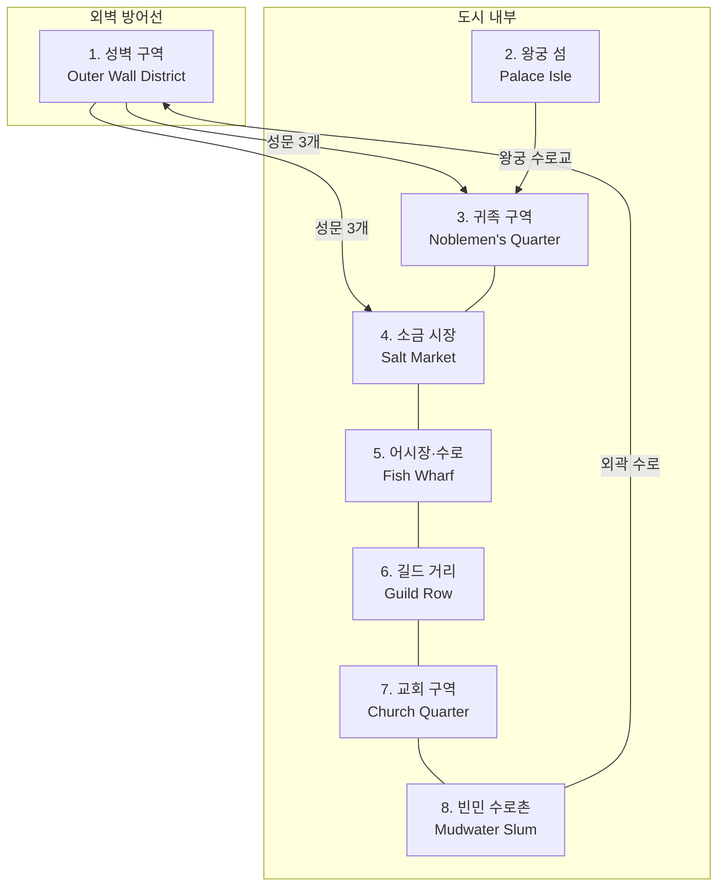

# Cernmere (세른미어) — 세렌 왕국 수도 상세 지도

## 원전 인용 증명

### [필독 1] political_divisions.md:111
> "Loravel / 로라벨 / 서남 습지·호수 / 세렌 왕국"
— Cernmere 소속 권역 Loravel 확정

### [필독 2] brainstorm_2026-04-21_worldview_expansion.md 발언 5
> "하늘색이 강인데, 보시다시피 좌측은 강이 많고 풍요로움"
— 수로 도시 구조의 지리 근거

### [필독 3] city_cernmere_2026-04-22.md (Toponymist 산출)
> "습지 위 고립 고지 · 수로 도시 구조 / 습지 내부 섬에 왕궁 위치 → 공격하려면 수로 통과 필수"
— 왕도 기본 지형·방어 구조 확정

---

## 요약

Cernmere 는 Loravel 습지 북단 자연 고지에 건설된 세렌 왕국의 수도이다. 인구 약 25,000~35,000. 도시 내부에 수로가 관통하며, 왕궁은 습지 중심 섬에 위치해 수로를 통과하지 않고는 접근 불가능하다. 안개·물안개·은백 소금 결정이 도시 미관의 상징이다.

---

## 도시 구획 (8개 지구)

---

## 각 지구 상세

### 1. 성벽 구역 (Outer Wall District)

| 항목 | 내용 |
|------|------|
| 재질 | 회청색 돌 + 방수 처리 목재 보강 |
| 성문 수 | 북문 (Whitecross 가도) · 동문 (Sylren 가도) · 남수문 (수로 출입) |
| 특이 구조 | 성벽 하부에 수문 설치 — 홍수 시 수위 조절 |
| 수비대 | 소금 수호단 1개 대대 상주 |
| 분위기 | 회색 돌 벽 위에 갈대 지붕 망루. 늘 안개가 낮게 깔림 |

---

### 2. 왕궁 섬 (Palace Isle)

| 항목 | 내용 |
|------|------|
| 위치 | 도시 중심 인공 수로 안 습지 섬 |
| 접근 | 왕궁 수로교 (개폐식 · 위기 시 차단) · 왕실 전용 소선(小船) |
| 주요 건물 | 실리파 궁전 · 왕실 소금 창고 · 왕실 예배당 · 왕가 묘역 |
| 건축 양식 | 기둥 위 목조 2층 구조 · 은백 소금 결정 장식 · 습지풀 문양 |
| 방어 | 왕궁 수로교 차단 시 독립 방어 섬 기능 |
| 분위기 | 이른 아침 안개 속 떠 있는 고요한 석조 궁전. 달빛에 소금 결정이 반짝임 |

---

### 3. 귀족 구역 (Noblemen's Quarter)

| 항목 | 내용 |
|------|------|
| 위치 | 왕궁 섬 북쪽 고지대 |
| 거주 | 왕도 주재 귀족 저택 · 공작·백작 가문 도시 별저 |
| 건물 수 | 주요 저택 12~18채 (추정) |
| 특징 | 습지 방수 가죽 장식 문 · 가문 문장 현판 · 사적 선착장 |
| 치안 | 안개 기사단 기마 순찰대 |

---

### 4. 소금 시장 (Salt Market)

| 항목 | 내용 |
|------|------|
| 위치 | 도시 서쪽 · 수로 출입구 인접 |
| 기능 | Elucia 최대 소금 도매 시장 · 연 3회 대형 소금 경매 |
| 주요 건물 | 왕실 소금 검인소 · 소금 길드 본부 · 대형 소금 창고 7동 |
| 분위기 | 흰 소금 자루 더미 · 상인들의 흥정 소리 · 바닷바람 냄새 |
| 관리 | 소금 수호단 소속 검인관 상주 |

---

### 5. 어시장·수로 (Fish Wharf)

| 항목 | 내용 |
|------|------|
| 위치 | 도시 남쪽 수로 집결지 |
| 기능 | 습지 어선 집결·어물 하역·건조·훈제 |
| 주요 어종 | 뱀장어·장어·붕어·수생 조개류 |
| 특징 | 평저선이 줄지어 계류된 좁은 수로. 연기 자욱한 훈제 골목 |
| 인물 집결 | 어부 조합 · 갈대 채취 조합 · 수로 안내인 조합 |

---

### 6. 길드 거리 (Guild Row)

| 항목 | 내용 |
|------|------|
| 위치 | 도시 동쪽 · 동문 가도 인접 |
| 주요 길드 | 소금 길드 (최강) · 어부 조합 · 갈대 직조 조합 · 이탄 채취 조합 · 방수 가죽 공방 길드 |
| 특징 | 길드마다 고유 현판·색깔 깃발. 소금 길드 건물이 제일 크고 화려 |
| 긴장 | 왕실 vs 소금 길드 권한 분쟁 만성화 (추정) |

---

### 7. 교회 구역 (Church Quarter)

| 항목 | 내용 |
|------|------|
| 위치 | 도시 북동 고지 |
| 주요 건물 | 성좌국 공인 대성당 (중간 규모) · 수도원 · 교회 병원 |
| 특징 | 표면상 성좌국 전례 준수. 내부에서는 습지 전통 달 숭배 신앙 보존 (비공식) |
| 신관 | 양심파 신관 소수 존재 (추정) — 습지 구전 전설 수집 |
| 규모 | 성좌국 감시 약함 — 습지 지형으로 교황청 직파 감찰관 접근 어려움 |

---

### 8. 빈민 수로촌 (Mudwater Slum)

| 항목 | 내용 |
|------|------|
| 위치 | 도시 외곽 성벽과 수로 사이 습지 저지대 |
| 거주 | 계절 어부·이탄 채취 노동자·유랑 상인·습지 가이드 |
| 건물 | 기둥 위 목조 소형 가옥. 판자 통로로 연결 |
| 치안 | 관리 거의 없음. 자체 수로 마피아 존재 (추정) |
| 특징 | 습지 깊숙이 드나드는 밀수꾼 및 정보 브로커 활동 거점 |

---

## 수로 체계

Cernmere 에는 **주요 수로 5개 + 보조 수로 12~18개** 가 도시를 관통한다.

| 수로명 | 구간 | 기능 |
|--------|------|------|
| 왕도 대수로 (King's Canal) | 남수문 → 왕궁 섬 | 왕실 전용 · 외부 선박 출입 통제 |
| 소금 수로 (Salt Run) | 서해 입구 → 소금 시장 | 소금 운반 전용 |
| 어부 수로 (Fish Run) | 습지 남쪽 → 어시장 | 어선 전용 |
| 길드 수로 (Guild Canal) | 동문 → 길드 거리 | 교역 물자 운반 |
| 빈민 수로 (Mudwater) | 도시 외곽 순환 | 비공식 · 밀수 경로 겸용 |

---

## 주요 랜드마크

| 랜드마크 | 구역 | 설명 |
|---------|------|------|
| 실리파 궁전 (Sellypha Palace) | 왕궁 섬 | 기둥 위 목조 2층 + 석조 기반. 은백 탑 3개 |
| 왕실 소금 창고 (Royal Salt Vault) | 왕궁 섬 | 왕국 소금 준비금 보관 · 두꺼운 돌벽 |
| 대성당 (Cathedral of the Salt Shore) | 교회 구역 | 중간 규모 석조 · 소금 결정 문양 창문 |
| 소금 길드 본부 | 소금 시장 | 도시 내 최대 민간 건물. 옥상 망루 겸 거래소 |
| 안개 탑 (Mist Tower) | 북성벽 | 안개 기사단 본부. 왕도 최고 감시 지점 |
| 수로 광장 | 어시장 인근 | 계절 어시장·소금 수확제 장소 |

---

## 도시 분위기 묘사 (집필 참조)

> *새벽 안개가 수로를 덮은 Cernmere 는, 멀리서 보면 물 위에 뜬 회색 섬 같다. 가까이 다가서면 기둥 위에 올라선 목조 가옥들이 안개 속에서 모습을 드러낸다. 다리 아래로 평저선이 소리 없이 미끄러지고, 어딘가에서 갈대 엮는 소리가 들린다. 소금 시장 쪽으로 가면 흰 자루 더미와 소금 냄새가 코끝을 찌른다. 왕궁 섬은 수로 너머에 고요히 잠긴 채, 은백 탑이 새벽빛을 받아 희미하게 빛난다.*

---

## 대표님 미확정 사항

- 왕도 인구 정확 수치 (25,000~35,000 추정)
- 수로 총 길이·정확 개수
- 수로 광장 공식 명칭

## 다음 Wave 의존

- **Chronicler (Wave 5)**: 왕궁 섬 전설·실리파 왕조 건국 설화 기록
- **World-Integrator (Wave 5)**: Cernmere 수로 지도와 Elucia 도로망 통합
