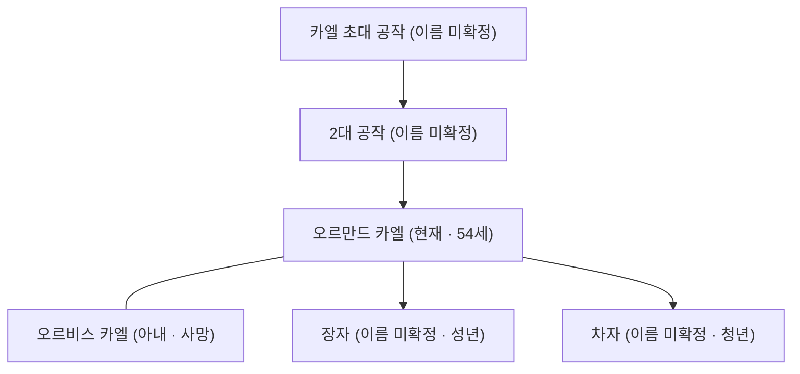

# House Cael (카엘 가문 — Loravale 공작가)

## 원전 인용 증명

### [필독 1] kingdom_ceren_territories_2026-04-22.md
> "Duchy of Loravale / 이탄·갈대·어업"
— 카엘 가문 경제 기반

### [필독 2] _shared_briefing.md — 불완전성 원칙
> "모든 것은 불완전하다"
— 가문 내부 갈등 설계

### [필독 3] founding_2026-04-22.md
> "습지 연합 형성: 수로 마을들의 점진적 통합"
— 카엘 가문의 연합 이전 위치

---

## 요약

세렌 왕국 3개 공작가 중 하나. 습지 북부 Loravale 권역 지배. 실리파 왕조와 3대에 걸친 충성 관계를 가지나 최근 소금 길드와 복잡한 이해관계로 왕실과 냉전 분위기. 이탄·갈대 산업의 실질 통제자.

---

## 가문 정보

| 항목 | 내용 |
|------|------|
| 가문명 | House Cael (카엘 가문) |
| 문장 색 | 이탄 갈색 + 녹색 |
| 문장 상징 | 갈대 묶음 + 수로 물결 |
| 격언 | "뿌리는 물 아래 있다 (Roots lie below the water)" |
| 현 수장 | Ormand Cael (오르만드 카엘 · 54세) |
| 충성 역사 | 실리파 왕조 3대 봉신 |

---

## 경제 기반

| 자원 | 비중 |
|------|------|
| 이탄 채취 조합 직영 | ★★★★ |
| 갈대 직조 공방 허가세 | ★★★ |
| 소금 길드 보조금 (비공식) | ★★ |
| 하천 어업 세금 | ★★★ |

---

## 동맹 혼인 현황

| 대상 가문 | 내용 |
|---------|------|
| 실리파 왕가 | 3대 봉신 예식 혼인 관례 (실제 혈연 혼인은 없음) |
| 솔트길드 백작가 | 비공식 이해관계 연결 (혼인 아님) |

---

## 가문 내부 계보

---

## 대표님 미확정 사항

- 카엘 초대·2대 공작 이름
- 오르만드 카엘 자녀 이름·성향

## 다음 Wave 의존

- **Chronicler (Wave 5)**: 카엘 가문 3대 봉신 역사
