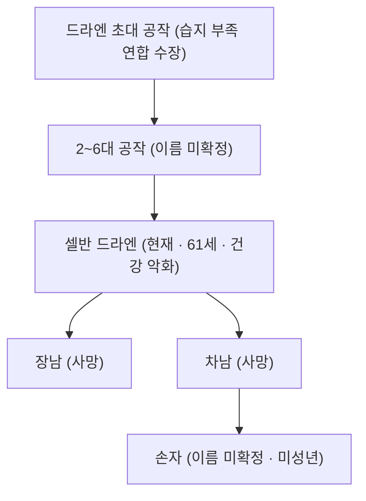

# House Draen (드라엔 가문 — Lorenfen 공작가)

## 원전 인용 증명

### [필독 1] kingdom_ceren_territories_2026-04-22.md
> "Duchy of Lorenfen / 습지 남부 · Aldric 접경 / 수초·가축·목초지"
— 드라엔 가문 경제 기반

### [필독 2] founding_2026-04-22.md
> "습지 연합 형성: 수로 마을들의 점진적 통합"
— 드라엔 가문의 연합 이전 남부 지배

### [필독 3] _shared_briefing.md — 불완전성 원칙
> "모든 것은 불완전하다"
— 가문 쇠락·계승 위기 설계

---

## 요약

세렌 왕국에서 가장 오래된 귀족 가문. 습지 부족 연합 시절부터 남부 지역 지배층이었으며, 실리파 왕조 건국 시 초기 지지 세력으로 공작 작위를 받았다. 현재는 후계자 문제로 가문 존속이 위협받는 상황. 가장 보수적이고 전통을 중시하는 가문.

---

## 가문 정보

| 항목 | 내용 |
|------|------|
| 가문명 | House Draen (드라엔 가문) |
| 역사 | 습지 부족 연합 이전부터 남부 지배 · 세렌 왕국 최고 혈통 |
| 문장 색 | 갈색 + 녹색 + 금색 |
| 문장 상징 | 황소 머리 + 목초지 + 습지풀 뿌리 |
| 격언 | "땅보다 오래 서라 (Outlast the land itself)" |
| 현 수장 | Selvan Draen (셀반 드라엔 · 61세 · 건강 악화) |

---

## 경제 기반

| 자원 | 비중 |
|------|------|
| 목초지·가축 | ★★★★ |
| 수초 채취 · 남부 농업 | ★★★ |
| Aldric 접경 교역 관세 | ★★ |

---

## 가문 내부 계보

---

## 가문 위기

- 아들 2명 사망으로 후계자가 미성년 손자만 남음
- 셀반 사망 시 섭정 체계 필요 → 왕실 개입 빌미
- 드라엔 영지를 카엘 가문이 흡수하려는 움직임 (추정)

---

## 대표님 미확정 사항

- 손자 이름·나이
- 아들 사망 원인 (전쟁? 질병? 사고?)

## 다음 Wave 의존

- **Chronicler (Wave 5)**: 드라엔 가문 습지 부족 연합 시절 역사
