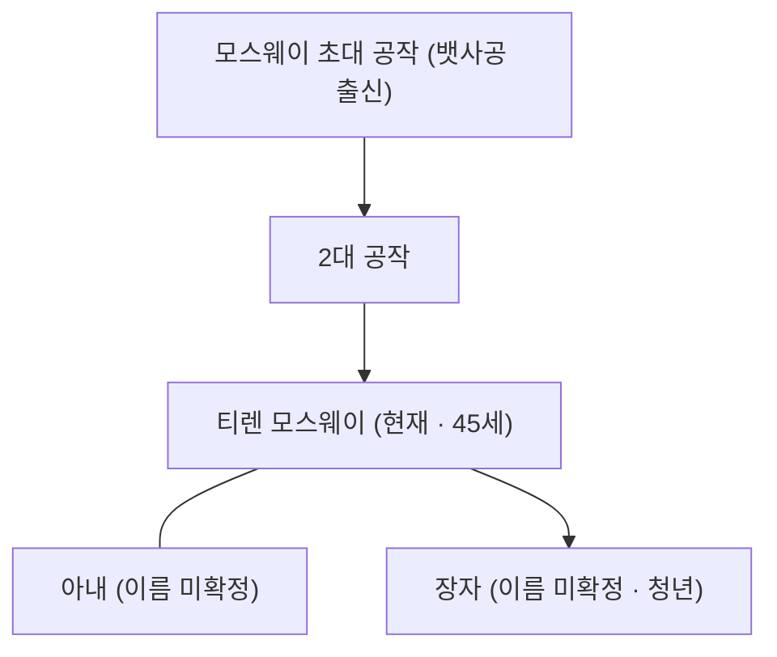

# House Mossway (모스웨이 가문 — Deltawatch 공작가)

## 원전 인용 증명

### [필독 1] kingdom_ceren_territories_2026-04-22.md
> "Duchy of Deltawatch / Auravel 강 하구 삼각주 / 어업·소금·하구 항구"
— 모스웨이 가문 경제 기반

### [필독 2] _shared_briefing.md — 불완전성 원칙
> "모든 것은 불완전하다"
— 신흥 가문 혈통 약점 설계

### [필독 3] founding_2026-04-22.md
> "창건 왕가는 수로 항법 기술을 독점하던 선단 세력"
— 삼각주 뱃사공 가문의 연원

---

## 요약

삼각주 뱃사공 출신 신진 가문. 2대 전(前) 선단 능력을 인정받아 공작 작위 수여. 모스웨이 가문은 혈통이 짧아 구 귀족들에게 얕보이나, 소금 수출 통관세 수입으로 세렌 왕국 최부유 공작가. "돈으로 혈통을 사겠다"는 실용주의의 화신.

---

## 가문 정보

| 항목 | 내용 |
|------|------|
| 가문명 | House Mossway (모스웨이 가문) |
| 원류 | 삼각주 뱃사공 선단 |
| 작위 획득 | 2대 전 (추정) · 실리파 왕조 수여 |
| 문장 색 | 청색 + 은백 + 금테 |
| 문장 상징 | 닻 + 소금 자루 + 물결 3줄 |
| 격언 | "항구를 지배하는 자가 바다를 지배한다" |
| 현 수장 | Thyren Mossway (티렌 모스웨이 · 45세) |

---

## 경제 기반

| 자원 | 비중 |
|------|------|
| 소금 수출 통관세 | ★★★★★ |
| 선박 정박료 | ★★★★ |
| 어업 세금 | ★★★ |
| 길드 통관 허가 수수료 | ★★★ |

---

## 가문 내부 계보

---

## 대표님 미확정 사항

- 모스웨이 초대·2대 공작 이름
- 티렌 아내·장자 이름

## 다음 Wave 의존

- **Chronicler (Wave 5)**: 삼각주 뱃사공 공작 승격 기록

<!-- auto-generated-related:start -->
## 🔗 관련 (auto-generated)

> `scripts/obsidian/build_backlinks.py` 로 자동 생성. 수정 금지 — 다음 실행 시 덮어쓰여집니다.

### ⬆️ 상위

- [[../../../../../../MOC]] — wiki 루트
- [[../../../MOC]] — Elucia 허브

<!-- auto-generated-related:end -->
