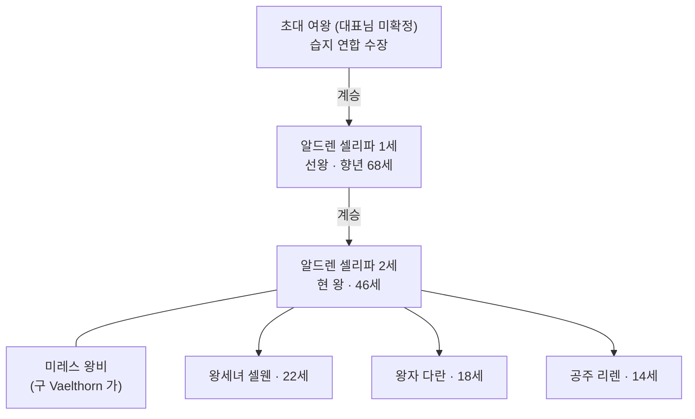

# House Sellypha (실리파 가문 — 세렌 왕가)

## 원전 인용 증명

### [필독 1] founding_2026-04-22.md
> "창건 왕가는 수로 항법 기술을 독점하던 선단 세력에서 유래한 것으로 추정"
— 실리파 가문 기원

### [필독 2] 에이전트 지시 — "왕족: 실리파 왕조 · 외교 통혼 적극"
— 가문 외교 기조

### [필독 3] _shared_briefing.md — 불완전성 원칙
> "모든 것은 불완전하다"
— 가문 내부 결함·갈등 설계

---

## 요약

세렌 왕국 왕가. 습지 수로 항법을 독점하던 선단 세력에서 출발해 소금 무역 통제권을 획득, 왕정으로 전환했다. "소금은 칼보다 강하다"를 가문 격언으로 삼으며, 군사보다 외교·경제 우위를 핵심 전략으로 삼는다. 외교 통혼을 적극 활용해 인접국 완충망을 구축하는 것이 대대로의 정책.

---

## 가문 정보

| 항목 | 내용 |
|------|------|
| 가문명 | House Sellypha (실리파 가문) |
| 발음 | "셀리파" |
| 원류 | 습지 수로 선단 세력 (추정) |
| 문장 색 | 회색 + 청색 + 은백 |
| 문장 상징 | 소금 결정 + 습지풀 + 물결 |
| 격언 | "소금은 칼보다 강하다 (Salt is mightier than steel)" |
| 현 수장 | Aldren Sellypha II (알드렌 셀리파 2세) |

---

## 가문 계보 (mermaid)

---

## 가문 특기·경제 기반

| 특기 | 내용 |
|------|------|
| 수로 항법 | 가문 전통. 왕족이 수로 조종 직접 배움 |
| 소금 외교 | 소금 가격을 외교 수단으로 활용하는 전통 |
| 외교 통혼 | 인접국과 혼인 완충 동맹. 현재 Ilaris 혼인 동맹 유지 |
| 소금 창고 직할 | 왕실 소금 창고 3동 직접 관리 |

---

## 동맹 혼인 현황

| 대상국 | 혼인 유형 | 현황 |
|--------|---------|------|
| Ilaris | 왕비 미레스 (구 Vaelthorn 가) | 유지 중 |
| Ilaris (예정) | 공주 리렌 → Ilaris 왕자 (추정) | 협상 중 |

---

## 대표님 미확정 사항

- 초대 여왕 이름 (여왕 계승 전통 확인 요청)
- 실리파 가문 창업 연대

## 다음 Wave 의존

- **Chronicler (Wave 5)**: 실리파 가문 창업 설화 기록

<!-- auto-generated-related:start -->
## 🔗 관련 (auto-generated)

> `scripts/obsidian/build_backlinks.py` 로 자동 생성. 수정 금지 — 다음 실행 시 덮어쓰여집니다.

### ⬆️ 상위

- [[../../../../../../MOC]] — wiki 루트
- [[../../../MOC]] — Elucia 허브

<!-- auto-generated-related:end -->
