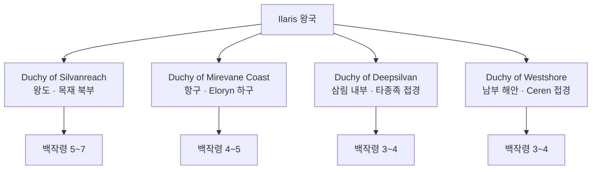

# Ilaris 왕국 (Kingdom of Ilaris) — 전체 개요

## 원전 인용 증명

### [political_divisions.md:55]
> "일라리스 / Ilaris / 서해안"

### [political_divisions.md:110]
> "Silvan / 실반 / 서해안 숲 / 일라리스 왕국"
— Silvan 권역 단독 보유 확정

### [brainstorm_2026-04-21_worldview_expansion.md 발언 5]
> "좌측은 강이 많고 풍요로움"
— 서해안 항구·무역 인프라 기반

---

## 요약

**Ilaris (일라리스)** 는 Elucia 서해안 Silvan 권역에 위치한 **중왕국**. 대륙 최대 항구 도시 Ilarien 을 수도로 삼으며, Silvan 숲의 목재권과 서해 해상 패권을 양 축으로 하는 **해상 교역 왕국**이다. 상인 왕조가 통치하며, 왕비는 관례적으로 Ceren 왕녀를 맞이해 소금·항구 동맹을 유지한다. 켈트·이탈리아 해양 상인 문화가 혼합된 독특한 문명 성격을 지닌다.

---

## 기본 정보

| 항목 | 내용 |
|------|------|
| **영문명** | Kingdom of Ilaris |
| **한글명** | 일라리스 왕국 |
| **권역** | Silvan (서해안) |
| **수도** | Ilarien (일라리엔) |
| **정체** | 세습 군주제 · 상인 왕조 |
| **규모** | 중왕국 · 공작령 4 · 백작령 15~20 |
| **접경** | 북 Moran / 동 성좌국 / 남 Ceren / 서 서해 |
| **경제** | C5 서해안·소금 클러스터 · Ceren 연계 |
| **군제** | 모병제 · 항구 수비대 · 상선 호위 |
| **문화** | 켈트·이탈리아 해양 상인 혼합 |
| **문장 색** | 청·백·금 |
| **문장 형상** | 닻·범선·돛 |

---

## 왕국 철학

> "바다가 열리면 금이 흐른다. 숲이 버티면 배가 뜬다."
— Ilarien 항만 대광장 각인 (추정)

일라리스는 군사적 정복보다 **교역·협상**으로 영역을 유지한다. 왕족 스스로 무역 협상에 참여하며, 환전·계약 체결이 왕실의 핵심 기술이다.

---

## 내부 구조

---

## 수도 Ilarien 주요 지구

→ [[capital_map_2026-04-22]] 참조

| 지구 | 역할 |
|------|------|
| 항만 대광장 지구 | 무역선 집결·환전 중심 |
| 조선소 지구 | Elucia 최대 선박 제조 |
| 환전거리 | 국제 환전·상인 계약 |
| 왕궁 언덕 | 왕실·행정 중심부 |
| 숲 경계 시장 | Silvan 숲 산물 거래 |
| 노멘 거리 | 외국 상인·타종족 구역 |

---

## 파일 인덱스

### 개요
- [[00_overview]] (이 파일)
- [[capital_map_2026-04-22]]

### 왕족 `royals/`
- [[king_aldric_maeran_2026-04-22]] (현 왕)
- [[queen_lirien_ceren_2026-04-22]] (왕비 · Ceren 출신)
- [[crown_prince_caeron_2026-04-22]] (왕세자)
- [[princess_sylvara_2026-04-22]] (왕녀)
- [[prince_davan_2026-04-22]] (왕자)
- [[previous_king_thaeron_maeran_2026-04-22]] (선왕)
- [[queen_dowager_elowen_2026-04-22]] (태왕비)

### 귀족 `nobles/`
- [[duke_silvanreach_vaern_2026-04-22]] (왕도 공작)
- [[duke_mirevane_lorcas_2026-04-22]] (항구 공작)
- [[duke_deepsilvan_bruiden_2026-04-22]] (삼림 공작)
- [[count_westshore_cailean_2026-04-22]] (남해안 백작)
- [[count_deepsilvan_frontier_fenrik_2026-04-22]] (숲 경계 백작)

### 가문 `houses/`
- [[house_maeran_2026-04-22]] (왕가)
- [[house_vaern_2026-04-22]] (항구 공작가)
- [[house_bruiden_2026-04-22]] (삼림 공작가)
- [[house_lorcas_2026-04-22]] (조선소 공작가)

### 기사단 `orders/`
- [[order_silver_sail_2026-04-22]] (은빛 돛단 기사단)
- [[order_seawind_2026-04-22]] (해풍 기사단)

### 문화·체제
- [[heraldry_2026-04-22]]
- [[military_2026-04-22]]
- [[clothing_2026-04-22]]
- [[cuisine_2026-04-22]]
- [[architecture_2026-04-22]]
- [[dialect_2026-04-22]]

### 축제 `festivals/`
- [[festival_opening_harbor_2026-04-22]] (개항제)
- [[festival_trade_fair_2026-04-22]] (무역제)
- [[festival_shipwright_day_2026-04-22]] (조선장인 축일)
- [[festival_citizen_march_2026-04-22]] (시민 행진)

### 도시·마을
→ `cities/` (Wave 2 Toponymist 기본 · Wave 4 심화 적용)
→ `villages/` (Wave 2 기본 + Wave 4 신규 15개 추가)

### 도로 `roads/`
- [[road_ilarien_to_silvanreach_2026-04-22]]
- [[road_ilarien_to_mirevane_2026-04-22]]
- [[road_ilarien_to_deepsilvan_2026-04-22]]
- [[road_ilarien_to_westshore_2026-04-22]]
- [[road_westshore_to_ceren_border_2026-04-22]]

---

## Q-CORE 간접 단서 (일라리스 관련)

**Q-CORE 2** (이름 없는 학자·생활 마법 배포):
> "이름 없는 방랑 학자가 식품 보존 주문을 어부들에게 가르쳤다" (Ilarien 항구 전설)

- Ilarien 항구 어민 구전에 "늙은 영감" 목격담 존재 (직접 서술 금지 · 간접 전설 형태)
- Silvan 숲 외곽 마을에 "이름 모를 학자" 방문 전설 산재

---

## 대표님 미확정 사항

- 건국 연대·초대 왕 이름
- Westshore 공작령 → 공작인지 백작인지 (Wave 4 임시 백작으로 처리)
- 노예 시장 공식 위치·규모
- Ch.05 주인공 왕국 기사단 입단 → 이 왕국인지 확인 대기

## 다음 Wave 의존 포인트

- **Chronicler (Wave 5)**: 왕국 공식 역사서 vs 엘프 구전 비교
- **World-Integrator (Wave 5)**: 서부 해안 경제 네트워크 통합 지도
