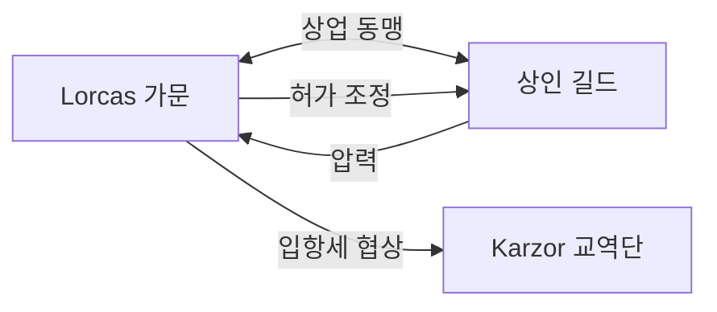

# House Lorcas (로르카스 가문) — Mirevane Coast 항구 공작가

## 원전 인용 증명

### [duke_mirevane_lorcas — 영지 특성]
> "항구 사용료·어업세·무역선 입항세 / Elucia 최대 조선소 운영권"

---

## 요약

항구와 조선소를 경제 기반으로 삼는 해양 귀족 가문. 상인 길드와 왕실 사이 중간자 역할. 실용주의·직설 기질이 가문 전통이며, 왕족보다 바다와 더 친한 귀족이라는 평판.

---

## 가문 기본 정보

| 항목 | 내용 |
|------|------|
| **가문명** | Lorcas (로르카스) |
| **어근** | *Lorc* (켈트 — "맹렬함·파도") + *-as* |
| **색** | 금·적 |
| **문장** | 망치와 닻의 교차 (조선소 상징) |
| **가훈** | "항구를 장악하는 자가 왕국을 장악한다." |
| **기반** | 조선소·항구 운영·어업세·국제 무역 |

---

## 상인 길드와의 관계

---

## Vaern 가문과의 갈등

- 조선소 운영권 = Vaern·Lorcas 공동 보유 논란
- Vaern 은 "목재 공급자이므로 운영권 우선" 주장
- Lorcas 는 "항구 위치가 우선" 주장
- Aldric 왕이 현재 판정 보류 중

---

## 대표님 미확정 사항

- 문장 확정 여부
- 조선소 운영권 분쟁 해결 방향

## 다음 Wave 의존

- **World-Integrator**: 항구 경제 네트워크 통합
