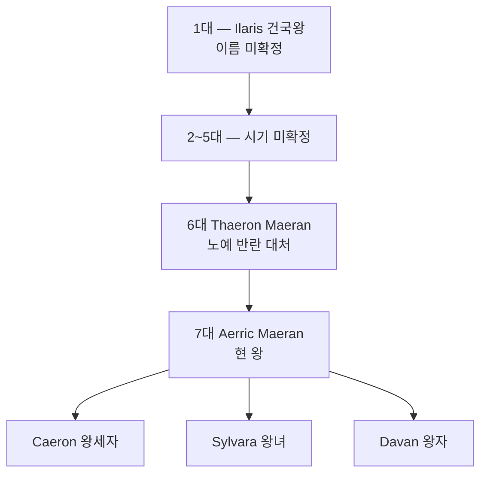

# House Maeran (마에란 왕가) — Ilaris 왕실 가문

## 원전 인용 증명

### [에이전트 지시 — 특이점]
> "상인 왕조·환전·무역 협상 핵심 기술"

### [marriage_ilaris_ceren:49]
> "최근 혼인: Ceren 왕녀 → Ilaris 왕자비"

---

## 요약

Ilaris 왕국의 지배 왕가. 어촌·삼림 개척민 연합에서 기원한 상인 왕조. 검보다 계약을, 전쟁보다 협상을 선호하는 가문 정체성. 현재 7대 왕 Aerric Maeran 이 통치 중.

---

## 가문 기본 정보

| 항목 | 내용 |
|------|------|
| **가문명** | Maeran (마에란) |
| **어근** | *Maer* (켈트계 — "큰 바다·항구") + *-an* (가문화) |
| **색** | 청·백·금 (왕국 문장과 동일) |
| **문장** | 파도를 건너는 범선·닻 |
| **가훈** | "바다가 열리면 금이 흐른다. 숲이 버티면 배가 뜬다." |
| **기반** | 상인·환전·해상 무역 |

---

## 계보

---

## 가문 특기

| 특기 | 설명 |
|------|------|
| **환전·계산** | 왕족 모두 기초 환전 교육 필수 |
| **3개 언어** | 공용어·켈트계 방언·Karzor 기초 |
| **협상 기술** | 무역 계약·왕조 혼인 양측 협상 모두 담당 |
| **정보 수집** | 환전거리 상인 네트워크 활용 |

---

## 혼인 동맹 역사 (추정)

| 대수 | 혼인 상대 | 목적 |
|------|----------|------|
| 3~4대 (추정) | Vaern 가문 | 왕도 귀족 통합 |
| 6대 (추정) | Ceren 왕녀 | 소금 동맹 초기 |
| 7대 현재 | Ceren 왕녀 Lirien | 소금 완충 동맹 유지 |

---

## 대표님 미확정 사항

- 건국왕 이름·건국 경위
- 2~5대 역사 기록

## 다음 Wave 의존

- **Chronicler**: 마에란 왕가 공식 계보서

<!-- auto-generated-related:start -->
## 🔗 관련 (auto-generated)

> `scripts/obsidian/build_backlinks.py` 로 자동 생성. 수정 금지 — 다음 실행 시 덮어쓰여집니다.

### ⬆️ 상위

- [[../../../../../../MOC]] — wiki 루트
- [[../../../MOC]] — Elucia 허브

<!-- auto-generated-related:end -->
