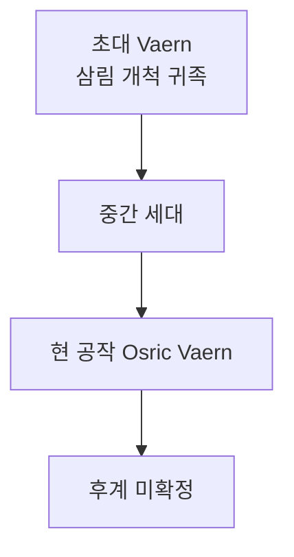

# House Vaern (바에른 가문) — Silvanreach 공작가

## 원전 인용 증명

### [duke_silvanreach_vaern — 영지 특성]
> "Silvan 목재 채취권 → 왕국 최대 단일 세수원"

---

## 요약

Ilaris 왕국 최고 귀족 명문가. 왕도 Ilarien 과 Silvan 숲 북부 목재권을 동시 보유. 왕가 Maeran 과 대대적 혼인 관계를 유지하며 왕국 제2 실력자 위치를 차지한다.

---

## 가문 기본 정보

| 항목 | 내용 |
|------|------|
| **가문명** | Vaern (바에른) |
| **어근** | *Vaer* (켈트·게르만 혼합 — "보호·관리") + *-n* |
| **색** | 청·은 |
| **문장** | 참나무 위의 방패 |
| **가훈** | "나무를 지키는 자가 왕국을 지킨다." |
| **기반** | 삼림 관리·목재 채취·왕도 행정 |

---

## 계보 (추정)

---

## 혼인 동맹

| 상대 | 내용 |
|------|------|
| Maeran 왕가 | 대대적 혼인 — 왕국 충성 구조화 |
| 지역 목재 백작가 | Silvanreach 백작령 통합 |

---

## 가문 경제 기반

- Silvan 숲 목재 채취 허가증 최종 승인권
- 왕도 Ilarien 대형 석조 창고 복수 소유
- 왕실 의전 행사 비용 일부 지원 → 왕가 신뢰 유지

---

## 대표님 미확정 사항

- Vaern 가문 문장 확정 여부
- Osric Vaern 의 후계자 이름

## 다음 Wave 의존

- **Chronicler**: Vaern 가문 역사 기록
