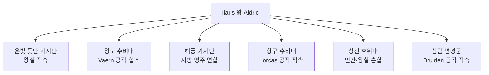

# Ilaris 왕국 군제

## 원전 인용 증명

### [에이전트 지시 — 군제]
> "모병제 · 항구 수비대·상선 호위"

### [kingdom_ilaris_territories:81]
> "기사단과 교황청 이단 심문관의 합동 진압"

---

## 요약

Ilaris 왕국은 **모병제**를 기반으로 한다. 상인 왕조의 특성상 대규모 정규군보다 효율적 소규모 전문 병력 + 기사단 구조를 선호한다. 항구·해안 방어가 육상 방어보다 우선 순위.

---

## 군사 구조 개요

---

## 병종별 상세

### 1. 항구 수비대 (Harbor Guard)
| 항목 | 내용 |
|------|------|
| **규모** | 약 800명 (추정) |
| **임무** | Ilarien 항만 경비·세관 무력 지원 |
| **무장** | 창·단검·목재 방패 |
| **지휘** | Lorcas 공작 직속 |

### 2. 상선 호위대 (Merchant Escort)
| 항목 | 내용 |
|------|------|
| **규모** | 200~400명 (시기별) |
| **임무** | 주요 무역선 호위·해적 대응 |
| **무장** | 석궁·단검·갑판 전투 장비 |
| **특이점** | 민간 용병과 왕실 병력 혼합 편제 |

### 3. 삼림 변경군 (Forest Frontier Guard)
| 항목 | 내용 |
|------|------|
| **규모** | 약 600명 (추정) |
| **임무** | Silvan 숲 감시·엘프 포획 작전·변경 경비 |
| **무장** | 활·창·삼림 전투 전용 가죽 갑옷 |
| **지휘** | Bruiden 공작 직속 · Fenrik 백작 현장 지휘 |
| **특이점** | 노예 반란 이후 3 거점 체계로 재편 |

### 4. 왕도 수비대 (Capital Guard)
| 항목 | 내용 |
|------|------|
| **규모** | 약 500명 |
| **임무** | 왕궁·귀족 지구·성벽 경비 |
| **무장** | 청금 문양 갑주·장검 |
| **특이점** | 의례 경비 겸임 |

---

## 모병 체계

- **지원 조건**: 17세 이상·건강 · 왕국 시민권 보유
- **급여**: 월 2~4 실버 (병종별 차이)
- **계약**: 3년 단위 갱신
- **특전**: 항구 자유 통행권·숙소·식비 지급

---

## 전쟁 역사 (주요 사건)

| 사건 | 관련 병력 |
|------|---------|
| 일라리스 노예 반란 진압 | 기사단 + 교황청 이단 심문관 합동 |
| Moran 접경 소규모 충돌 (추정) | 왕도 수비대 파견 |
| Nomen 섬 해적 토벌 (반복) | 은빛 돛단 기사단·상선 호위대 |

---

## 교황청 이단 심문관 문제

- 노예 반란 이후 교황청 심문관이 변경군과 합동 작전 요구
- 왕국 측: 심문관 역할을 "지원"으로 한정하려 함
- 교황청 측: "이단 타종족" 관련 작전 지휘권 주장
- 현재: 미해결 긴장 상태

---

## 대표님 미확정 사항

- 총 병력 규모 확정
- 삼림 변경군 3 거점 위치 정확한 지명
- 노예 반란 당시 병력 손실 규모

## 다음 Wave 의존

- **Chronicler**: 전쟁사 기록
- **World-Integrator**: 군사 지도 통합

<!-- auto-generated-related:start -->
## 🔗 관련 (auto-generated)

> `scripts/obsidian/build_backlinks.py` 로 자동 생성. 수정 금지 — 다음 실행 시 덮어쓰여집니다.

### ⬆️ 상위

- [[../../../../../MOC]] — wiki 루트
- [[../../MOC]] — Elucia 허브

<!-- auto-generated-related:end -->
