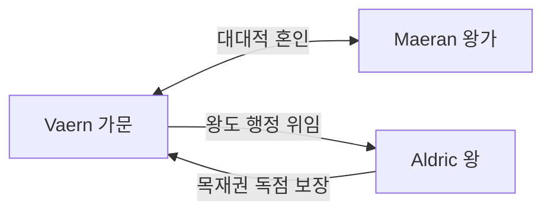

# Osric Vaern (오스릭 바에른) — Silvanreach 공작

## 원전 인용 증명

### [kingdom_ilaris_territories:75]
> "Duchy of Silvanreach / Silvan 숲 북부·왕도 인근 / 목재·수지·교역 / 왕도 공작령 (추정)"

### [에이전트 지시 — 귀족]
> "항구 공작·조선소 백작·목재 백작 (Silvan 경계)"

---

## 요약

Silvanreach 공작령 — Ilaris 왕국에서 왕도 Ilarien 을 직접 관할하는 최고 귀족. Vaern 가문은 왕가 Maeran 과 대대로 혼인 관계를 유지해온 명문가. 목재 채취권과 왕도 행정권을 동시에 보유해 사실상 왕국 제2의 실력자.

---

## 인물 정보

| 항목 | 내용 |
|------|------|
| **이름** | Osric Vaern (오스릭 바에른) |
| **칭호** | Silvanreach 공작 |
| **나이** | 약 58세 (추정) |
| **외모** | 장신·백발 단정·공작답게 항상 청·금 문장 착용 |
| **성격** | 보수적·전통 중시·왕가에 충성하되 독자성 유지 |
| **능력** | 왕도 행정·삼림 관리·왕실 의전 |

---

## 영지 특성

| 항목 | 내용 |
|------|------|
| **영역** | Silvan 숲 북부 + 왕도 Ilarien 인접 |
| **경제** | Silvan 목재 채취권 → 왕국 최대 단일 세수원 |
| **군사** | 왕도 수비 귀족 병력 · 은빛 돛단 기사단 지원 요청권 |
| **특이점** | 삼림 허가증 발급 최종 승인권 보유 |

---

## 왕가와의 관계

---

## 현재 고민

- Deepsilvan 삼림 공작 Bruiden 가문의 독립성 경계 (영역 다툼 잠재)
- 노예 반란 이후 교황청 이단 심문관의 왕도 상주 — 내심 거부감

---

## 대표님 미확정 사항

- 자녀 수·이름
- Vaern 가문 문장 (왕가와 별도)

## 다음 Wave 의존

- **Chronicler**: Vaern 가문 역사 기록
- **house_vaern**: 가문 상세
