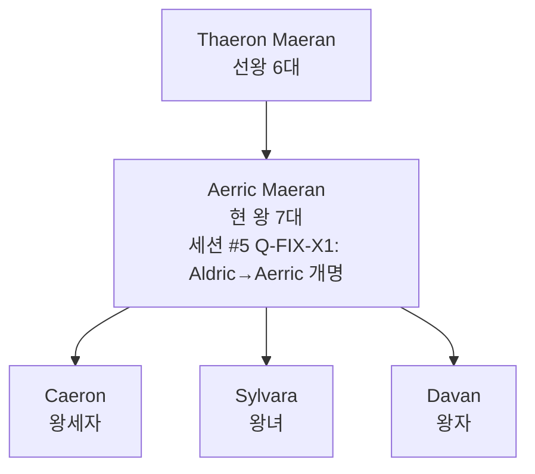

# Aerric Maeran (에릭 마에란) — Ilaris 제7대 왕

## 원전 인용 증명

### [kingdom_ilaris_territories:133–135]
> "왕가·군주 이름 / 노예 시장 규모·위치 — 대표님 미확정"
— Wave 4 Kingdom-Detailer 담당 확정 대상

### [marriage_ilaris_ceren:49]
> "최근 혼인: Ceren 왕녀 → Ilaris 왕자비 (약 1세대 전, 추정)"

### [history/founding:67–68]
> "교황청과의 관계: 복종하되 이단 심문관 파견은 내심 불만 / 3중 경제 구조"

---

## 요약

Maeran 상인 왕조 7대 왕. 세련된 협상가이자 냉정한 계산가. 상인의 피를 이어받아 "왕좌의 가장 좋은 거래는 전쟁이 아닌 계약"을 가훈으로 삼는다. 소금 분쟁 3차 국면에서 Ceren 과의 균형 유지에 골몰하는 중이다.

---

## 인물 정보

| 항목 | 내용 |
|------|------|
| **이름** | Aerric Maeran |
| **칭호** | Ilaris 왕 · "서해의 저울" |
| **나이** | 약 52세 (추정) |
| **외모** | 단단한 체격 · 은빛이 섞인 짙은 갈색 머리 · 상인 특유의 관찰하는 눈빛 |
| **성격** | 냉정·계산적·외교적 · 분노는 드러내지 않음 |
| **능력** | 환전·무역 협상 · 3개 언어 (Elucia 공용어·켈트계 방언·Karzor 기초) |
| **배우자** | Lirien (Ceren 왕녀 출신) |
| **자녀** | Caeron (왕세자) · Sylvara (왕녀) · Davan (왕자) |

---

## 통치 철학

```
"검으로 얻은 땅은 피가 마르면 잃는다.
 계약으로 묶은 항구는 세대를 넘겨도 남는다."
```

- **교역 우선주의**: 군사 충돌은 최후 수단
- **정보 장악**: 환전거리 상인 네트워크를 통한 정보 수집
- **교황청 완충**: 성좌세를 꼬박 납부하되 내정 개입은 방어

---

## 현재 고민 (Rev.3 본편 시점)

| 과제 | 내용 |
|------|------|
| 소금 분쟁 3차 | Ceren 30% 인상 요구 — 혼인 동맹 채널 한계 |
| 성좌국 이단 심문관 | 노예 반란 이후 파견 지속 — 내심 불만 축적 |
| 조선소 목재 수급 | Deepsilvan 숲 타종족 봉기 가능성 — 감시 강화 |
| 왕세자 Caeron | 협상가 기질 없음 — 후계 불안 |

---

## 왕국 내 평판

- **귀족**: "왕이 상인처럼 생각한다" — 일부 불만 (특히 군사 귀족)
- **상인 계층**: "우리 편" — 두터운 지지
- **서민**: "항구가 돌아가는 한 굶지 않는다" — 무관심

---

## Rev.3 서사 접점

- Ch.05 왕국 기사단 입단 시기 관련 가능성 (추정)
- 소금 분쟁 협상 장면 배경 왕 역할 가능

---

## 왕위 계보



---

## 대표님 미확정 사항

- 왕의 정확한 나이·즉위 연도
- 소금 분쟁 최종 처리 방향
- Ch.05 기사단 입단과의 직접 연관 여부

## 다음 Wave 의존

- **Chronicler**: 역사서의 Aldric 즉위 기록
- **World-Integrator**: Ilaris-Ceren 소금 분쟁 현황 통합
