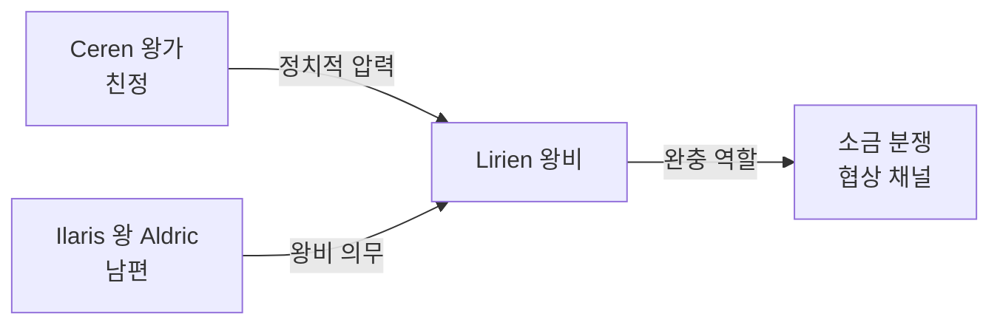

# Lirien (리리엔) — Ilaris 왕비 · Ceren 왕녀 출신

## 원전 인용 증명

### [marriage_ilaris_ceren:49]
> "최근 혼인: Ceren 왕녀 → Ilaris 왕자비 (약 1세대 전, 추정)"
— 왕비가 Ceren 왕녀 출신임을 직접 지지

### [에이전트 지시 — 특이점]
> "왕비 주로 Ceren 혼인 (소금 완충 동맹)"

### [marriage_ilaris_ceren:70]
> "3차 소금 분쟁에서 혼인 동맹의 정치적 무게 감소 = 양국 관계 경색 신호"

---

## 요약

Ceren 왕가에서 Ilaris 왕 Aldric 과 정략 혼인한 왕비. 소금 완충 동맹의 인적 체화. 표면적으로는 우아한 왕실 의례의 중심이지만, 내부적으로는 Ceren 친정과 Ilaris 남편 사이에서 양쪽 이익을 저울질하는 긴장 속에 살아간다. 3차 소금 분쟁 국면에서 가장 복잡한 처지.

---

## 인물 정보

| 항목 | 내용 |
|------|------|
| **이름** | Lirien (리리엔) |
| **칭호** | Ilaris 왕비 · "두 해안의 다리" (비공식) |
| **나이** | 약 44세 (추정) |
| **출신** | Ceren 왕가 |
| **외모** | Ceren 특유의 옅은 피부·회녹색 눈 · 단정한 귀족 자태 |
| **성격** | 외교적·세심·내면 강인 · 감정 잘 드러내지 않음 |
| **능력** | 의전·사교·Ceren 습지 약초 지식 |
| **자녀** | Caeron (왕세자) · Sylvara (왕녀) · Davan (왕자) |

---

## 이중 위치의 구조

---

## 현재 고민 (Rev.3 본편 시점)

| 과제 | 내용 |
|------|------|
| 소금 분쟁 3차 | 친정 Ceren 이 30% 인상 요구 — 남편 Aldric 을 도울 수 없음 |
| 왕비로서의 정체성 | Ilaris 왕비인가, Ceren 딸인가 |
| 자녀 교육 | Caeron 에게 Ceren 인맥 심어두기 — 장기 전략 |

---

## 왕실 의례·역할

- **개항제 주관**: 왕비가 항구를 향해 첫 항해 기원문 낭독
- **귀족 여성 네트워크**: Ilarien 귀족 여성 사교 모임 주관
- **약초 의료 지원**: Ceren 약초 지식으로 왕실 의료관 보조

---

## Rev.3 서사 접점

- Ilaris-Ceren 소금 분쟁 씬에서 인간적 무게를 더하는 인물
- "친족이어도 이익 앞에 갈등" 세계관 철학 실증

---

## 대표님 미확정 사항

- 왕비의 정확한 나이·혼인 연도
- Ceren 친정 현 왕과의 관계 (부모? 형제?)
- 소금 분쟁에서 왕비가 직접 개입할 기회 여부

## 다음 Wave 의존

- **Chronicler**: 혼인 당시 역사 기록
- **World-Integrator**: Ilaris-Ceren 관계 통합 문서
