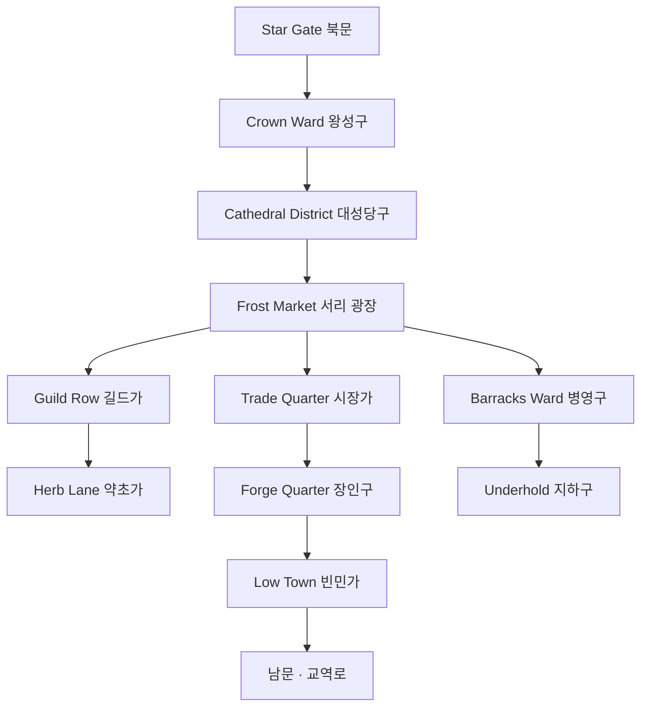

# Maerholt (매어홀트) — 왕도 상세 지도

## 원전 인용 증명

### [필독 1] city_maerholt_2026-04-22.md:15–21
> "위치: Auryn 고원 중심부 · 고지대 방어 거점 / 규모: 인구 약 25,000~40,000 / 분위기: 차갑고 바람 센 고원. 두꺼운 돌 성벽. 안개가 잦음"
— 왕도 기본 정보 확정

### [필독 2] political_divisions.md:108
> "Auryn / 오린 (지역) / 북동 고지 / 마에리스 왕국"
— 왕도 위치 권역 확정

### [필독 3] 에이전트 지침 특이점
> "건축: 돌성·두꺼운 벽·작은 창·지하 저장고 / 의상: 두꺼운 모피+가죽·짙은 색·내구성"
— 왕도 건축 양식 근거

---

## 요약

Maerholt 는 Auryn 고원 중심부의 고지대 왕도이다. 해발 고도 ~1,400m. 안개가 잦고 바람이 강하다. 두꺼운 돌 성벽과 작은 창문, 지하 저장고가 도시 전체에 공통으로 나타난다. 12개 지구로 구분된다.

---

## 도시 전체 구조 (조감)

```
         ┌──────────────── [북성벽 · 이중 흉벽] ────────────────┐
         │  [왕성구]                                              │
         │   Maern 왕궁 · 왕실 정원 · 왕실 마구간               │
         ├──────────────────────────────────────────────────────┤
         │  [대성당구]        │  [귀족구 서]  │  [귀족구 동]    │
         │   Auryn 대성당     │  Vorn·Halveth │  Drak 저택      │
         ├──────────────────────────────────────────────────────┤
         │  [중앙 광장]                                          │
         │   Frost Market · 분수(얼음 조각 상설)                │
         ├────────────┬─────────────────────┬───────────────────┤
         │  [길드가]  │  [시장가]           │  [병영구]         │
         │  광물·모피 │  상설 교역 구역     │  고지 수호단 본부 │
         ├────────────┼─────────────────────┼───────────────────┤
         │  [약초가]  │  [장인구]           │  [빈민가]         │
         │  약초·치유 │  대장장이·석공      │  외지 이주민      │
         └──────────────────────────────────────────────────────┘
                  [남문 · 교역로 · Highvane 방향]
```

---

## 12지구 상세

| # | 지구명 | 한글 | 인구 비중 | 주요 건물·기능 | 분위기 |
|---|--------|------|----------|--------------|--------|
| 1 | **The Crown Ward** | 왕성구 | ~3% | Maern 왕궁·왕실 마구간·왕실 감옥 | 중무장 경비·고요함 |
| 2 | **Auryn Cathedral District** | 대성당구 | ~5% | Auryn 대성당·수도원·성직자 숙소 | 찬송 소리·향 연기 |
| 3 | **Noble West** | 귀족구 서 | ~8% | Vorn·Halveth 저택·개인 마구간 | 차가운 예의 |
| 4 | **Noble East** | 귀족구 동 | ~7% | Drak 저택·소귀족 관저 | 광업 매연 냄새 |
| 5 | **Frost Market** | 서리 광장 | ~10% | 중앙 광장·상설 시장·분수 | 가장 북적이는 구역 |
| 6 | **Guild Row** | 길드가 | ~9% | 광물 길드·모피 상인 조합·어음소 | 흥정 소리 |
| 7 | **Trade Quarter** | 시장가 | ~12% | 상인 숙소·창고·외래 상단 구역 | 이방인 허용 최대 구역 |
| 8 | **Barracks Ward** | 병영구 | ~8% | 고지 수호단 본부·훈련장·무기고 | 규율·군화 소리 |
| 9 | **Herb Lane** | 약초가 | ~7% | 약초 상점·치유소·마법사 조합(소규모) | 약초 냄새·조용함 |
| 10 | **Forge Quarter** | 장인구 | ~11% | 대장장이·석공·제혁소 | 불꽃·망치 소리 |
| 11 | **Low Town** | 빈민가 | ~15% | 외지 이주민·일용직·싸구려 선술집 | 혼잡·낯선 언어 |
| 12 | **Underhold** | 지하구 | ~5% | 지하 저장고·비상 식량창·비밀 통로 | 어둡고 서늘함 |

---

## 주요 랜드마크

| 건물명 | 지구 | 설명 |
|--------|------|------|
| **Maern Royal Keep** | 왕성구 | 3중 성벽 · 탑 7기 · 지하 피신로 연결 |
| **Auryn Cathedral** | 대성당구 | 대륙 북동 최대 성당 · 첨탑이 안개 위로 솟음 · 지하 납골당 있음 |
| **Frostpeak Tower** | 왕성구 북탑 | 왕국 전체 최고 전망대 · Icehelm Peak 조망 가능 |
| **The Frozen Crest Inn** | 시장가 | 왕도 최대 여관 · 외래 상인 집결지 |
| **Ironweld Hall** | 길드가 | 광물 길드 본부 · Northmere 공작령과 계약 창구 |
| **Pelt Exchange** | 길드가 | 모피 상인 조합 경매장 · 계절별 대경매 |
| **Star Gate** | 북문 | 왕도 북쪽 관문 · 별 관측 행사 시 개방 |
| **Underhold Cisterns** | 지하구 | 왕도 비상 식수·식량 6개월치 비축 시설 |

---

## 성벽 구조

| 층위 | 설명 |
|------|------|
| **외성벽** | 두께 ~4m · 높이 ~12m · 흉벽 이중 · 화강암 |
| **내성벽** | 왕궁 주변 · 두께 ~6m · 높이 ~15m |
| **관문** | 남문(주 출입)·북문(Star Gate)·동문·서문 4개 |
| **망루** | 외성 12기 · 내성 7기 · 항시 경비 2인 1조 |

---

## 도시 내부 도로망



---

## Q-CORE 2 간접 단서 (설원 사냥꾼 구전)

Low Town 의 오래된 여관 구석에 전해지는 말:
*"어느 겨울 역병이 돌 때, 이름 모를 노인 학자가 우물 정화 주문을 가르쳐 주고 사라졌다."*
→ Q-CORE 2 간접 흔적 · 직접 서술 금지

---

## 대표님 미확정

- 왕도 정확한 해발 고도 (1,200~1,600m 범위 추정)
- Underhold 지하 통로가 외부로 연결되는지 여부
- 성당 지하 납골당의 서사적 활용 여부

## 다음 Wave 의존

- **Chronicler (Wave 5)**: 왕도 역사·대성당 건립 연대 기록
- **World-Integrator**: 왕도 지도를 대륙 지도와 통합
