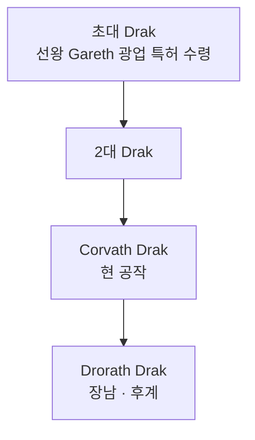

# House Drak — Northmere 공작 가문

## 원전 인용 증명

### [필독 1] kingdom_maerith_territories_2026-04-22.md:78
> "Duchy of Northmere / 고원 북부 · Norvend 접경 / 광물·철광 / 산악 광업 (추정)"

### [필독 2] mining_metals_2026-04-22.md:56–57
> "Auryn 고지 광업: 소규모 구리·철 채굴"

---

## 요약

Northmere 광업 공작 가문. 선왕 Gareth 로부터 광업 특허를 받은 이래 3대째 구리·철 광산을 관리한다. 가문 내에서 광부 전통을 자랑스럽게 여기며, 귀족이지만 손발이 두꺼운 실무 계층이라는 정체성을 유지한다.

---

## 문장

| 요소 | 내용 |
|------|------|
| **바탕색** | 짙은 갈색 (광산 흙) |
| **주 문양** | 교차한 곡괭이 두 자루 (은색) |
| **부 문양** | 구리색 원 (광석 모티프) |
| **모토** | *"Strike Deep, Hold True"* (깊이 파고, 굳게 지켜라) |

---

## 경제 기반·특기

| 항목 | 내용 |
|------|------|
| **주 수입** | 구리·철 광산 채굴권 세금 + 제련소 사용료 |
| **부 수입** | 희귀 광석 판매 (소규모) |
| **특기** | 지질 판독 · 제련 감독 · 광부 관리 |
| **약점** | 북방 몬스터 습격 시 광산 폐쇄 위험 |

---

## 가문 계보 (간략)

---

## 대표님 미확정

- 광업 특허 세대 수 정확한 확정
- Thaloss 와의 구리 가격 경쟁 현황

## 다음 Wave 의존

- **Chronicler**: 광업 특허 문서 원본 기록
