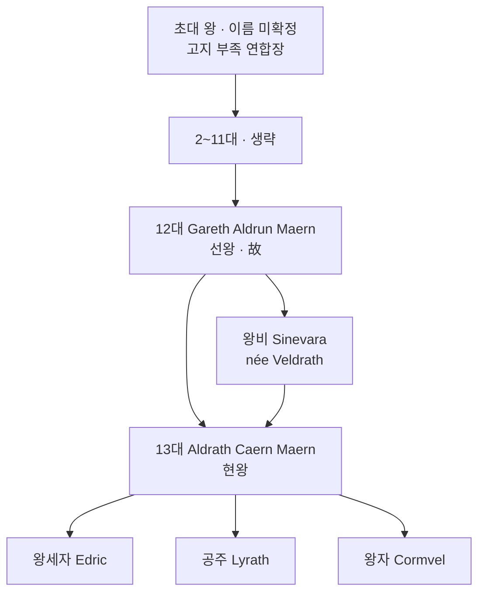

# House Maern — 왕가

## 원전 인용 증명

### [필독 1] founding_2026-04-22.md:35–37
> "Auryn 고지 목축 부족들이 공동 방목지 관리와 몬스터 방어를 위해 연합을 형성한 것이 기원."

### [필독 2] 에이전트 지침
> "왕족: 고지 왕조 · 폐쇄적 전통 · 왕비 Thaloss 또는 Vaelin 방계 혼인"

### [필독 3] _shared_briefing.md:85
> "불완전성 — 모든 것은 불완전하다 · 신조차"

---

## 요약

Maerith 왕국 왕가. 고지 부족 연합 지도자에서 시작하여 세습 왕조로 발전했다. 켈트·알프스 고지 전통을 가장 엄격하게 계승하는 가문이며, 외래 혈통 유입은 오직 방계 혼인으로만 허용한다.

---

## 문장

| 요소 | 내용 |
|------|------|
| **바탕색** | 회색 (Auryn 고원의 돌) |
| **주 문양** | 고산 염소 (흰색) — 인내·독자성 상징 |
| **부 문양** | 세 개의 별 (자주색) — 고지 별 축제 기원 |
| **테두리** | 자주색 이중 테두리 |
| **모토** | *"Endure the Peak"* (고봉을 견뎌라) |

---

## 왕조 계보 (주요)

---

## 가문 특기·경제 기반

| 항목 | 내용 |
|------|------|
| **특기** | 고지 전술 · 별자리 관측 · 약초 치유 전통 |
| **경제 기반** | Aurynseat 공작령 직할 + 왕실세 수취 |
| **혼인 원칙** | 왕비는 반드시 Thaloss 또는 Vaelin 방계 귀족 |
| **종교** | 성좌국 공식 신앙 준수 · 고지 토착 별 신앙 병행 (묵인) |

---

## 가문 고유 전통

1. **성인식**: 왕족 남성은 17세에 설원 단독 사냥 수행
2. **별 서약**: 왕 즉위 시 Frostpeak Tower 에서 별을 향해 서약
3. **왕실 일지**: 매 치세마다 고지 언어로 기록하는 비밀 일지 전통
4. **동절기 금식**: 고지 별 축제 전 3일 금식 (왕실 참여 의무)

---

## 대표님 미확정

- 초대 왕 이름·건국 연대
- 왕실 비밀 일지 실물 존재 여부 (서사 활용 가능)

## 다음 Wave 의존

- **Chronicler**: 13대 왕조 연대기 전문
