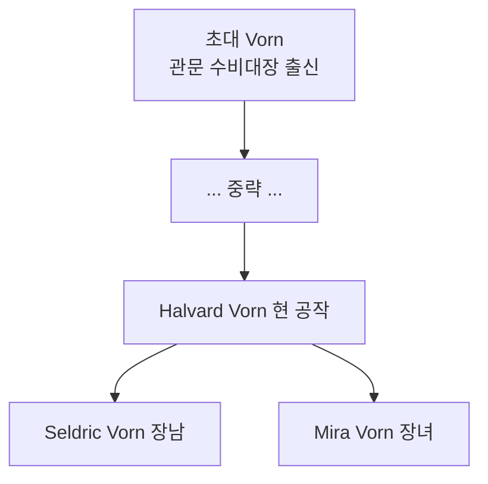

# House Vorn — Crestwatch 공작 가문

## 원전 인용 증명

### [필독 1] kingdom_maerith_territories_2026-04-22.md:77
> "Duchy of Crestwatch / Whitecrest Saddle 남측 / 통행세·군사"

---

## 요약

Whitecrest Saddle 을 대대로 관리해 온 고지 관문 가문. 통행세가 주 수입원이며, 역사적으로 Maerith-Thaloss 교역의 중개를 독점해 왔다. 현 당주 Halvard Vorn 은 왕국 내 가장 정치적으로 활발한 귀족이다.

---

## 문장

| 요소 | 내용 |
|------|------|
| **바탕색** | 짙은 회색 |
| **주 문양** | 두 산봉우리 사이 관문 (흰색) |
| **부 문양** | 열쇠 하나 (자주색) |
| **모토** | *"None Pass Without Leave"* (허가 없이 지나지 말라) |

---

## 가문 계보 (간략)

---

## 경제 기반·특기

| 항목 | 내용 |
|------|------|
| **주 수입** | Whitecrest Saddle 통행세 |
| **부 수입** | 왕실 군사 보조금 (Crestwatch 수비대 유지 명목) |
| **특기** | 고산 방어 공사 · 통행 허가증 발급 행정 |
| **혼인** | Thaloss 접경 소귀족과 통혼 (정보 수집 목적 추정) |

---

## 대표님 미확정

- Vorn 가문 초대 기원 (고지 부족장 계보 vs 왕실 하사 귀족)

## 다음 Wave 의존

- **Chronicler**: 관문 통행세 협약 역사

<!-- auto-generated-related:start -->
## 🔗 관련 (auto-generated)

> `scripts/obsidian/build_backlinks.py` 로 자동 생성. 수정 금지 — 다음 실행 시 덮어쓰여집니다.

### ⬆️ 상위

- [[../../../../../../MOC]] — wiki 루트
- [[../../../MOC]] — Elucia 허브

<!-- auto-generated-related:end -->
