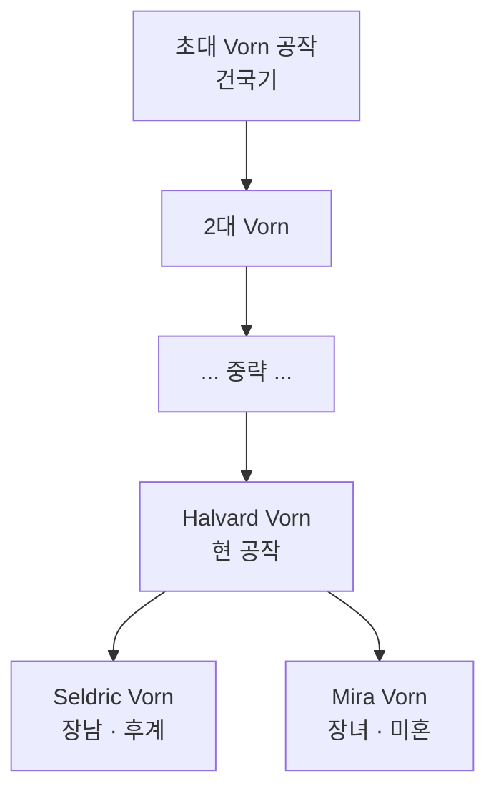

# Duke Halvard Vorn — Crestwatch 공작

## 원전 인용 증명

### [필독 1] kingdom_maerith_territories_2026-04-22.md:77
> "Duchy of Crestwatch / Whitecrest Saddle 남측 / ~30K km² / 통행세·군사 / Thaloss 접경 관문 수비 (추정)"

### [필독 2] economic_clusters_2026-04-22.md:83–84
> "교역 파트너: Thaloss (대형 철로 교환) / 산악 고립 → 교역 비용 높음"

---

## 요약

Crestwatch 공작령 당주. Whitecrest Saddle 관문을 관할하며 Thaloss 접경 통행세가 주 수입원이다. 강경하고 계산적인 성격으로 왕국 내 귀족 중 가장 정치적 영향력이 크다. Sinevara 왕비의 Thaloss 연줄을 경계하며, 자신이 Thaloss 교역의 독점 중개자가 되기를 원한다.

---

## 인물 기본 정보

| 항목 | 내용 |
|------|------|
| **풀네임** | Halvard Crest Vorn |
| **나이** | 58세 (추정) |
| **영지** | Duchy of Crestwatch · 중심 도시 Stormcrag |
| **외모** | 백발 · 두꺼운 눈썹 · 굵은 목소리 · 항시 통행증 문서를 휴대 |
| **무기** | 장검 (의식용) · 실전은 병사에게 위임 |
| **수입원** | Whitecrest Saddle 통행세 + 군사 주둔 비용 왕실 보조금 |

---

## 성격·야망

- **통행세 수호자**: 자신의 관문 수입을 위협하는 모든 변화에 저항
- **Thaloss 중개 독점**: 왕비의 Thaloss 방계 서신을 자신을 거치지 않는 월권으로 간주
- **왕위 계승 관심**: Aldrath 이후 왕세자 Edric 의 성향이 마음에 들지 않음
- **성좌국 타협파**: 십일조 갈등보다 교역 안정을 선호하는 실용주의

---

## 가문 Vorn 계보

---

## 대표님 미확정

- Vorn 가문 건국 이전 기원 (고지 부족장 계보 vs 외래 귀족)
- 왕비와의 구체적 갈등 사건

## 다음 Wave 의존

- **Chronicler**: Whitecrest Saddle 통행세 협약 역사
