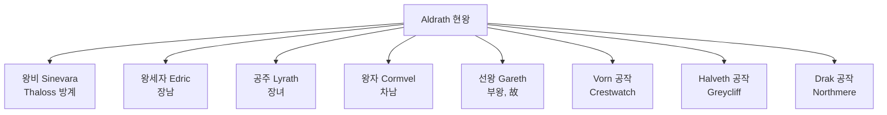

# Aldrath Maern — 현왕

## 원전 인용 증명

### [필독 1] political_divisions.md:59
> "마에리스 / Maerith / 북동 고지"

### [필독 2] founding_2026-04-22.md:65–67
> "중립 외교 성향으로 주변 강국들의 완충지대 역할 / 북방 몬스터 위협이 국방 예산의 상당 부분 소모"

### [필독 3] _shared_briefing.md:44
<!-- QCORE: Q-CORE 2 원문 참조 확인 · 내용은 에이전트 내부 보관 · 위키 파일에 직접 기재 금지 -->

---

## 요약

Maerith 왕국 제 13대 왕. 고지 왕조 Maern 가문의 현 당주. 선왕 Gareth 의 장남으로 즉위 17년차. 과묵하고 신중한 성격으로 고지 전통을 엄격히 계승한다. 군사보다 외교·중재를 선호하지만, 북방 몬스터 위협과 성좌국 압박 사이에서 균형을 유지하는 데 심혈을 기울이고 있다.

---

## 인물 기본 정보

| 항목 | 내용 |
|------|------|
| **풀네임** | Aldrath Caern Maern |
| **칭호** | King of Maerith, Lord of the Auryn Heights |
| **나이** | 약 52세 (추정) |
| **통치** | 17년차 |
| **외모** | 회색이 섞인 짙은 갈색 머리 · 굳은 턱선 · 깊은 눈 주름 · 키 크고 다부진 체형 |
| **의상** | 짙은 회색 모피 외투 + 자주색 안감 · 은제 왕관 (단순한 형태) |
| **무기** | Highland Blade (왕가 대대 전검 · 돌 손잡이) |
| **거처** | Maern Royal Keep · Crown Ward |

---

## 성격·야망

- **과묵하고 무뚝뚝**: 말을 아끼는 것을 미덕으로 여김. 긴 침묵 후 짧고 정확한 판단을 내림
- **전통 수호**: 고지 왕조 4백 년 전통을 침범하는 모든 외압에 완강히 저항
- **실용적 중립**: 대왕국 간 전쟁에 끼어들기를 극도로 꺼림. 중재를 통한 이익 확보 전략
- **내부 단속 우선**: 귀족 4공작의 이해 충돌을 조율하는 데 통치 에너지 대부분 소모
- **북방 집착**: 어린 시절 몬스터 습격을 목격한 트라우마로 국방 예산 삭감을 절대 허용 안 함

---

## 주요 관계

---

## 통치 방식

| 영역 | 정책 |
|------|------|
| **외교** | 중립·중재 · Thaloss·Vaelin 간 완충 유지 · 성좌국 복종하되 거리 |
| **군사** | 고지 수호단 상비 유지 · 북방 방어 최우선 · 성전 파병 회피 |
| **경제** | Northmere 광업 세수 안정화 · 모피 교역 길드 보호 · 소금 가격 대응 비축 |
| **내정** | 4공작 권한 균형 · 백작령 독립성 인정 · 중앙 집권 소극적 |
| **종교** | 성좌국 십일조 정기 납부 · 성당 권위 존중하되 교황 사절 접견 최소화 |

---

## Rev.3 서사 접점

- 주인공 일행이 Maerith 를 통과할 시 왕 접견 여부 (추정)
- Thaloss 접경 분쟁 중재 역할 가능성
- "착한 할배" 목격담 미발언 (고지 마을 침투율 낮음 — Q-CORE 2 간접)

---

## 대표님 미확정

- 정확한 나이·즉위 연도
- 선왕 Gareth 사망 원인 (병사 vs 전사 vs 암살)
- 개인적 종교관 (성좌국 의례 형식만 따르는지 vs 진심 신앙)

## 다음 Wave 의존

- **Chronicler (Wave 5)**: 17년 치세 주요 사건 연대기
